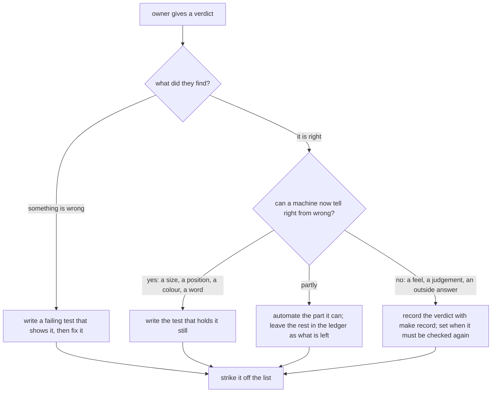

# Manual testing

The owner does not want by-hand reviews pushed at them mid-work. They are **saved for later**, in
one list, and picked up when the owner chooses to. So:

- **Never end a turn by asking the owner to go and test something.** Add it to the list instead,
  in one line, and say it was parked.
- **When the owner asks what is parked**, read `checklist.md` (next to this file) and show the
  short version: the items in order, one line each. Nothing else.

The list lives in `checklist.md` so it can change without this skill changing. The detailed steps
for the phone-and-device checks already live in the validation ledger — the checklist points at
them by name and never copies them (see the `validate` skill, "Tier 7").

## Adding an item

One entry in `checklist.md`, under **Parked**, in priority order (what a Study Quran reader would
notice first goes first). Each entry says, in plain words:

- **What to look at** and where — a link that opens the app on the right page with the right thing
  open (`?open=`, `?tool=`, `?view=one|two`; see `docs/design/app-links.md`).
- **What right looks like**, so the owner can tell pass from fail without knowing the code.
- **Why a machine cannot check it yet** — this is the line that decides whether it can later be
  automated.
- **Ledger id**, if the check is in `docs/validation/ledger.json`.

## When a verdict comes back — make it a test

A by-hand check is a test we have not written yet. Every verdict the owner gives ends in one of
these, in the same change:

Which kind of test, by what was checked:

| The owner checked | Hold it still with |
|---|---|
| where something sits, its size, that it stays on the page | a Playwright test that measures it (`apps/web/e2e/`), in Chromium and Firefox |
| how it looks | a golden picture (ask before re-baselining) |
| a wording or a number format | a unit test on the text |
| a flow: tap, open, land somewhere | a Playwright test of the flow |
| the machine half of a device check | an `evidence` block on the ledger check (`make validate-auto`) |
| something only a person can judge | stays in the ledger, `make record CHECK=<id> RESULT='…'` |

The owner's verdict is what the test encodes: a test written *before* anyone looked would only hold
what we guessed. That is why the list waits for them rather than being guessed away — and why,
once they have looked, the check never comes back to them.

When an item is done, move it to **Done** in `checklist.md` with the date and where its test is
(or the ledger record), so the list shows what has been turned into a test.
