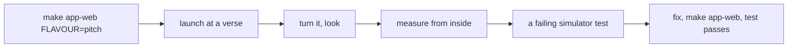

# The native shell, from the command line

`native/` is a thin SwiftUI app that hosts the web build in a web view. One source folder
(`native/Hifth/`), two app targets — `Hifth-iOS` (iPad first) and `Hifth-macOS` — generated
by XcodeGen from `native/project.yml`. Xcode 26.6. Every job below is a `make app-*` target
from `native/Makefile.native`; `make help` lists them. Never edit `native/Hifth.xcodeproj`
by hand: `make app-generate` rewrites it.

## Short version

| job | command |
|---|---|
| put the web build in the app (do this first) | `make app-web` (pitch, private) · `make app-web FLAVOUR=public` |
| run on the Mac | `make app-run-mac ROUTE=/hafs-kfqc/2:255` |
| run in the iPad simulator | `make app-run-ipad ROUTE=/hafs-kfqc/p45` |
| turn a running app to a route | `make app-open ROUTE=/hafs-kfqc/2:255 TARGET=ipad` (or `TARGET=mac`) |
| screenshot the page | `make app-shot ROUTE='/hafs-kfqc/p45?field=dark' TARGET=ipad` → `native/shots/` |
| what the page can see inside the shell | `make app-probe` (Mac) · `make app-probe TARGET=ipad ROUTE=… EVAL='js'` |
| walk the app held sideways, by eye | see "Walking the app in the simulator" below |
| tests, fast | `make app-unit-test` (route, bundle paths, bridge; Mac, seconds) |
| tests, full | `make app-test` (unit tests + the iPad simulator smoke) |
| one simulator test | `make app-test ONLY=SmokeTests/testLandscapeOpensTheBookFullSize` |
| Mac smoke | `make app-test-mac-ui` (needs Accessibility permission, see below) |
| console output | `make app-logs` · `make app-run-mac-stdout` |
| start over | `make app-clean` |

Without `make app-web` the app boots to a page that says "No web build in this app". The
pitch flavour carries the private Study Quran commentary and must never reach the public
site; `FLAVOUR=public` copies the build without `assets/private` and refuses if any got in.

## Routes: the one deep-link language

The web app's hash **is** the route: `#/<edition>/<target>?k=v`, e.g. `/hafs-kfqc/2:255`,
`/hafs-kfqc/p45?field=dark`, `/hafs-kfqc/2:47-48`. `hifth://` links carry it verbatim, in
any shape people paste (`hifth:///hafs-kfqc/2:255`, `hifth://hafs-kfqc/p45`,
`hifth://open/#/hafs-kfqc/2:255`). The shell only checks the shape
(`native/Hifth/Route/Route.swift`); the web router decides what it means.

Three doors, all ending in the same hash:

- `hifth://…` URL — while running (`.onOpenURL`) or to launch.
- `HIFTH_ROUTE=/hafs-kfqc/p45` env var — what the Makefile uses.
- `--route=/hafs-kfqc/p45` launch argument — what XCUITest uses.

**Another app can ask and hear back** through x-callback-url:
`hifth://x-callback-url/open?verse=2:255&words=3-7&mode=note&x-success=…&x-error=…` turns
the page and opens the caller's address with `route` and the public `url` once it is
showing; `…/current?x-success=…` answers with what is on screen. `page=`, `verse=`,
`surah=` (its context), `words=`, `edition=`, `mode=` (the tool in hand), `open=`
(`commentary`, `context`, or any app panel), `view=`, or a whole `route=`. Errors come back
as `errorCode` + `errorMessage`. Only a shipped mus'haf opens (`Route.editions`, `hafs-kfqc`
today); an unknown or unshipped `edition=` is refused with the shipped ids named. The contract
is `docs/design/app-url-scheme.openapi.json` (rendered by `make app-links-doc`, which builds core
first and inlines `packages/core/dist/link-builder.js` as the page's live link builder;
`make app-links-ui` opens the same JSON in Swagger UI on :4175); the parser is
`native/Hifth/Route/XCallback.swift`, the answering is in `ShellModel`.

Cold start puts the route into the first URL's fragment, so there is no race. A route that
arrives while running is queued until the page says `ready`, then applied. Quote any route
with `?` or `&` on the make line.

**The shell asks the page for one thing: a page turn.** The Mac's Page menu (Next Page ⌘←,
Previous Page ⌘→) calls `ShellModel.stepPage`, which runs the page's own turn lent under
`window.__HIFTH_PAGE__` (`exposeToShell` in `apps/web/src/native-bridge.ts`, in-shell only).
It cannot send a key: the web app drops any key held with ⌘, ctrl or alt on purpose. A press
before `ready` is dropped. Everything the shell runs in the page goes through `model.runScript`,
which the unit tests replace with a collector (`ShellMenuTests.swift`). After changing the web
side, `make app-web` before `make app-run-mac`, or the shell runs a bundle without the hook.

**Automation uses the env var, not `simctl openurl`.** `openurl` shows a "open in Hifth?"
alert once per install; the env var (`SIMCTL_CHILD_HIFTH_ROUTE`) does not. `make app-open`
is for a human turning a running app, not for scripts. `simctl launch` on an already-running
app ignores the env, so the Makefile terminates first — do the same if you script it by hand.

Dark: `APPEARANCE=dark` only colours native chrome. The desk colour is the web app's
`?field=dark` route parameter; there is no system-appearance switch in the web app.

## iPad simulator

- Default device: `iPad Pro 13-inch (M5)` on iOS 26.5. Override with `IPAD='iPad Air 13-inch (M4)'`.
  `native/scripts/simulator-udid.sh "<name>"` prints the UDID (empty means no such device);
  `xcrun simctl list devices available | grep iPad` shows what exists.
- What `make app-run-ipad` does, in order: `xcrun simctl bootstatus <udid> -b` (waits for
  boot; a fixed sleep races), `open -a Simulator`, `xcrun simctl install <udid> <app>`,
  `xcrun simctl terminate <udid> com.bytesofpurpose.hifth`, then `simctl launch` with the
  `SIMCTL_CHILD_*` env. Simulator builds pass `CODE_SIGNING_ALLOWED=NO`.
- The built app is `native/build/Build/Products/Debug-iphonesimulator/Hifth.app`. If in doubt
  ask Xcode: `xcodebuild -project native/Hifth.xcodeproj -derivedDataPath native/build -scheme Hifth-iOS -sdk iphonesimulator -showBuildSettings | grep -E 'TARGET_BUILD_DIR|FULL_PRODUCT_NAME'`.
- `make app-shot` photographs the page itself (headless, no Screen Recording permission);
  for the whole simulator screen including chrome use `xcrun simctl io <udid> screenshot out.png`.

## Mac

- Ad-hoc signed (`CODE_SIGN_IDENTITY "-"` in `project.yml`); the window opens at 1280×860 so
  the web app's 1024×740 desktop layout is met; the web view is inspectable from Safari's
  Develop menu.
- `make app-run-mac` registers the build with Launch Services (`lsregister -f`) before
  opening, so `open "hifth:///hafs-kfqc/2:255"` lands on this copy, not an older one.
- For deterministic scripting run the binary directly with the env var:
  `HIFTH_ROUTE=/hafs-kfqc/p45 native/build/Build/Products/Debug/Hifth.app/Contents/MacOS/Hifth`
  (that is what `make app-run-mac-stdout`, `app-shot TARGET=mac` and `app-probe` do).
- Trackpad pinch reaches the web app as gesture events; that only works because
  `allowsMagnification` stays off (see the `web-shell-bridge` skill).

## Screenshots and the probe

`make app-shot` sets `HIFTH_SNAPSHOT_PATH`: after `ready`, the app waits
`HIFTH_SNAPSHOT_DELAY_MS` (default 1500), writes a PNG of the page, and exits. File name is
derived from the route: `/hafs-kfqc/p45?field=dark` on iPad → `native/shots/ipad-hafs-kfqc_p45_field-dark.png`
(plus `-dark` when `APPEARANCE=dark`). Read the PNG before reasoning from source.

`make app-probe` sets `HIFTH_PROBE=1`: after `ready` the app prints one JSON line of what the
page can see (origin, secure context, `caches`, service worker, `navigator.share`, clipboard,
storage, the native marker, viewport, touch points, user agent) and exits. Run it first when
something works in Safari and not in the shell.

## Walking the app in the simulator

The browsers Playwright drives are not the iPad's own WebKit. A layout can be right in every
Playwright project and wrong in the app: held sideways, the app once drew the two pages
28 points wide in the middle of an empty desk, while Playwright's WebKit at the same size drew
them full height (2026-10-08). So a walk of the pitch on an iPad is done **in the app**, in
this order:



1. **Rebuild the bundle** after any web change: `make app-web FLAVOUR=pitch`. The app runs the
   copy in `native/WebBundle/`, not the dev server.
2. **Launch at a verse.** `make app-run-ipad ROUTE=/hafs-kfqc/35:44`, or by hand:
   `xcrun simctl terminate <udid> com.bytesofpurpose.hifth`, then
   `SIMCTL_CHILD_HIFTH_ROUTE=/hafs-kfqc/35:44 xcrun simctl launch <udid> com.bytesofpurpose.hifth`.
3. **Turn it and look.** In a test, `XCUIDevice.shared.orientation = .landscapeLeft` turns the
   simulator without touching anything else. By hand, Cmd+→ in the Simulator window:
   `osascript -e 'tell application "Simulator" to activate' -e 'delay 0.5' -e 'tell application "System Events" to key code 124 using command down'`
   — this pulls the Simulator to the front, so check `osascript -e 'tell application "System Events" to get name of first process whose frontmost is true'`
   says `Simulator` before you trust it; if the owner is working in another window the key
   lands there. Then `xcrun simctl io <udid> screenshot out.png`: the file is always in the
   device's upright frame, so a sideways screen comes out turned; `sips -r 270 out.png` (or
   `-r 90`, depending on which way it was turned) stands it up. Shrink before reading:
   `sips -Z 1200 out.png`.
4. **Measure from inside the page.** `make app-probe TARGET=ipad ROUTE=/hafs-kfqc/p45 EVAL='JSON.stringify(document.querySelector("[data-testid=page-book]")?.getBoundingClientRect())' DELAY_MS=3000`
   launches the app, waits, runs the expression in the page and prints it with the usual probe
   fields (viewport, screen, orientation). Keep longer expressions in a file and pass
   `EVAL="$(cat probe.js)"`. This is what found the 14-point leaves: a number, where a picture
   only said "small".
5. **Pin it with a simulator test** in `native/HifthUITests/SmokeTests.swift`, watched failing
   first: `make app-test ONLY=SmokeTests/<name>`. For anything drawn sideways, measure the web
   view's own picture (`app.webViews.firstMatch.screenshot()`), redrawn upright with
   `UIGraphicsImageRenderer`: the whole-screen capture of a turned simulator comes back as a
   portrait frame with the picture shifted and a black band, and a pixel check on it passes or
   fails for the wrong reason. Attach that upright picture, not `app.screenshot()`, so the
   result bundle shows what was measured.
6. Add the fault to the walk-app checklist (`.claude/skills/walk-app/checklist.md`) under
   "The Mac and iPad apps", with its issue id and the test.

## A plugged-in iPad

```
xcrun devicectl list devices                      # the device name
make app-device-install DEVICE='<name>' ROUTE=/hafs-kfqc/p45
```

The target builds for a real device (which needs a signing team), installs with `devicectl`
and launches at the route. `TEAM` is read from the one "Apple Development" identity in the
keychain; pass `TEAM=<id>` if there is more than one. A free team signs for 7 days and cannot
send to TestFlight. Do not guess a team id; ask the owner.

`devicectl` passes env vars through a `DEVICECTL_CHILD_` prefix, the way `simctl` uses
`SIMCTL_CHILD_`, which is how the route reaches the app.

## The shell goldens

```
make app-golden            # screenshot each route on the iPad simulator (and one on an iPhone), diff against native/shots/baseline/
make app-golden-update     # after the owner has seen the diff: accept the current shots
```

Routes come from `GOLDEN_ROUTES` (iPad) and `GOLDEN_IPHONE_ROUTES` (iPhone, `IPHONE=` names
the simulator) in `native/Makefile.native`. A failing route leaves a diff
image in `native/shots/diff/`; look at it before updating. Same recipe as the web goldens:
show the diff, ask, then update. Never run this at the same time as `make app-test` — both
drive the one simulator.

## An x-callback request through the real operating system

```
make app-callback-check    # Mac: open hifth://x-callback-url/open?page=45&x-success=http://127.0.0.1:PORT/answer…
```

`native/scripts/callback-receiver.py` binds a free port and waits for one request;
`native/scripts/callback-check.sh` opens the built app, hands macOS the request, and reads the
answer the default browser fetched from the receiver. Two legs: a page answered on
`x-success` with `route=` and `url=`, and `page=0` answered on `x-error` with `bad-route`. It
opens one browser tab per leg, so it is not in pre-push; run it after touching the answering
code in `ShellModel` or the parser. Not for the simulator: `simctl openurl` stops at the
"Open in Hifth?" alert.

## The XCUITest smoke

`native/HifthUITests/SmokeTests.swift` launches the real app with `--route=…`, waits for the
shell's own mirror of the route — a 1×1 native label with accessibility id `hifth.route`
whose label is the hash — and attaches a screenshot (`.keepAlways`) named `verse-2-255`,
`page-45-dark`, `page-45-landscape` (iPad only). In-page behaviour is Playwright's job
(`apps/web/e2e/ipad.spec.ts`); these only prove the shell boots, takes a route, and shows it.

Results land in `native/shots/ipad-smoke.xcresult` / `mac-smoke.xcresult` (the Makefile
deletes the old bundle first; an existing `-resultBundlePath` is an error in Xcode 26). To
look at what the test saw:

```
xcrun xcresulttool get test-results summary --path native/shots/ipad-smoke.xcresult
xcrun xcresulttool export attachments --path native/shots/ipad-smoke.xcresult --output-path native/shots/ipad-smoke-attachments
```

## Adding a route shape: round-trip it

A new shape (say a range with a query) is pinned in three places, same change: a case in
`native/HifthTests/RouteTests.swift` (`hash(from:)` for the bare path, `parse` for each
`hifth://` spelling, and a line in `refuses` for the near-miss), the web e2e deep-link test
(`apps/web/e2e/deeplink.spec.ts`), and a smoke launch if the shell has to do anything new.
The round trip to assert: `Route.parse(URL("hifth://" + route))` equals `Route.hash(from: route)`.

A new x-callback parameter or action is pinned the same way: a case in
`native/HifthTests/XCallbackTests.swift`, a parameter (with its `enum` if it has one) and an
`x-examples` entry in `docs/design/app-url-scheme.openapi.json`, then `make app-links-doc`.
The Swift test runs every example through the parser and holds the enum lists to the shell's;
`packages/core/src/link-spec.test.ts` holds them to the web router; a name added in one place
only fails the other. A new key also goes in `packages/core/src/link-builder.ts`, the
JavaScript copy of the parser the contract page's builder runs: `link-builder.test.ts` runs the
same examples through it, so a rule changed in Swift and not there fails on the example. A new
edition goes in `Route.editions` and the contract's `Edition` schema (`x-editions`), with
`shipped` true only once its pages are in the build.

## Troubleshooting

| you see | cause | do |
|---|---|---|
| "No web build in this app" page | `native/WebBundle/` empty (gitignored) | `make app-web`, then build again |
| Gatekeeper: app "is damaged and can't be opened" | an unsigned bundle the system had to launch (usually the UI test runner) | ad-hoc signing is already set for every Mac target in `project.yml`; `make app-clean` and rebuild; check with `codesign -dv native/build/Build/Products/Debug/Hifth.app` |
| "Timed out while enabling automation mode" | Mac XCUITest needs your terminal allowed under System Settings → Privacy & Security → Accessibility (and Automation) | grant it, rerun `make app-test-mac-ui`; `make app-test` skips the Mac UI test on purpose |
| old page after a rebuild on the simulator | stale install | `xcrun simctl uninstall <udid> com.bytesofpurpose.hifth`, then `make app-run-ipad` |
| "no simulator named …" | name not in `simctl list devices available` | pass `IPAD='<exact name>'`; boot with `xcrun simctl bootstatus <udid> -b` |
| new route ignored on `simctl launch` | app already running; launch ignores env | `xcrun simctl terminate <udid> com.bytesofpurpose.hifth` first |
| "open in Hifth?" alert in the simulator | `simctl openurl` | expected once per install; use the env var in scripts |
| clang module errors from Homebrew paths | stale `CPATH` | the Makefile does `unexport CPATH`; if you call `xcodebuild` yourself, `unset CPATH` — or use `make app-test ONLY=…` instead of `xcodebuild -only-testing` |
| `-only-testing:HifthUITests/…` runs nothing | the iPad UI test target is `HifthUITests-iOS` | `make app-test ONLY=SmokeTests/<name>` adds the right prefix |
| right in Playwright, wrong in the app | the iPad's own WebKit is not Playwright's | walk it in the simulator (above); `HIFTH_PITCH_BROWSER=webkit` runs the pitch e2e in Playwright's WebKit, which is closer but still not the app |
| build works, app dark but desk still light | `APPEARANCE` only colours chrome | use `ROUTE='…?field=dark'` |

NOTICE: Reworked from rshankras/claude-code-apple-skills — `ios/run-simulator`,
`generators/deep-linking`, `testing/flow-walkthrough` (MIT, Ravi Shankar, 2025).
