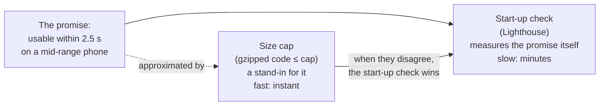
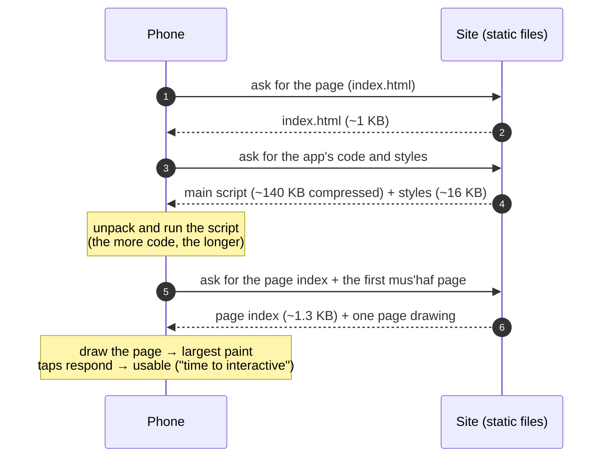
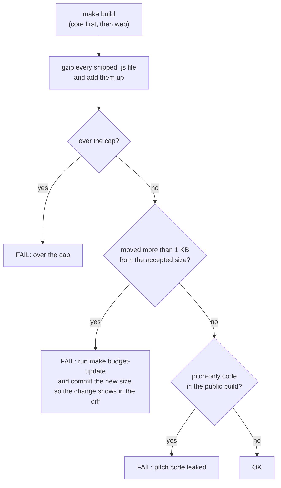
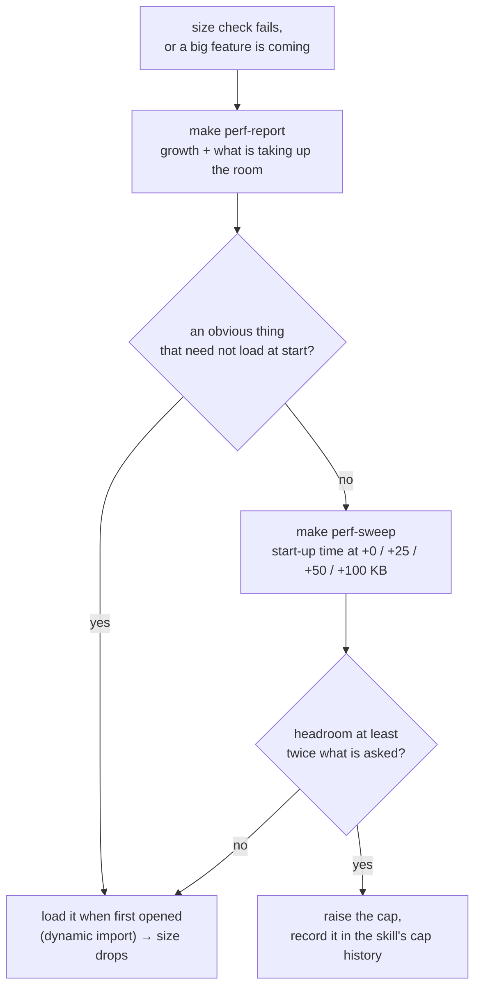

# How we measure how fast Hifth opens

Back to [the skill](SKILL.md).

## What are we actually promising?

That a hafiz who opens the app on an ordinary, mid-range Android phone over a weak mobile signal
can use it within **2.5 seconds**. "Use it" means the page has appeared and taps respond.

Two numbers stand for that promise, measured two different ways:

## What is Lighthouse?

**Lighthouse** is Google's page checker. It is the same tool as the "Lighthouse" tab in Chrome's
developer tools. It opens a page as if on a given phone and connection, and reports how long each
stage of loading took, plus accessibility and best-practice scores.

**Lighthouse CI** (`lhci`) is Google's command-line wrapper around it. It runs Lighthouse several
times on the built app, takes the median, and fails if the numbers break the limits written in
`.lighthouserc.json`. It is not a GitHub product. It runs on a laptop the same way it once ran in a
GitHub Actions job.

- **Added:** 2026-07-25 (commit `3b256d4`, the offline-caching work; the GitHub job came the same
  day in `f7f002b`).
- **Runs by hand since 2026-09-27.** #119 moved every check into local git hooks and took
  Lighthouse off GitHub. Minutes per run was too slow for a hook, so it was left out. Run
  `make lighthouse` before a demo or a release; `make loop-verify` includes it.
- **Never installed.** Each run downloads it fresh with `pnpm dlx @lhci/cli@0.14.x`. That is on
  purpose: it brings Lighthouse and a Chrome launcher, tens of MB nothing else in the repo needs,
  and keeping it out of the dependency list keeps the shared lockfile quiet.
- **Output:** reports go to `.lighthouseci/` (an HTML and a JSON per run). The folder is not
  checked in.
- On a Mac it cannot find Chrome by itself. The make targets pass `CHROME_PATH`.

## Which phone does it pretend to be?

Not a real phone. The settings in `.lighthouserc.json` are copied from Lighthouse 12's mobile
preset, a **Moto G Power (2022) on "slow 4G"**, and pinned there so that a Lighthouse upgrade
cannot quietly change which phone the promise is about:

| setting | value | in plain words |
| --- | --- | --- |
| screen | 412 × 823, 1.75× | a mid-size Android screen |
| round trip | 150 ms | every request waits this long before bytes start |
| download | ~1.47 Mbit/s | about 180 KB per second |
| processor | 4× slower than the machine running the test | a mid-range phone's chip |
| method | `simulate` | load fast, then *calculate* how long it would have taken on that phone |

The "simulate" method (Google calls its model *Lantern*) is why the numbers are steady across
machines. 15 runs on two very different laptops landed within 2266–2437 ms. The flip side is that
it is a model, and a real-phone check (backlog ②) is still open.

## What happens between tapping the icon and being able to use the app?

Step 4 is where the size cap bites. At ~180 KB per second, **every extra 10 KB of compressed code
is roughly 55 ms more download**, before the phone has run a line of it. Running it costs more on
top. The sweep (below) measures the real figure instead of trusting this arithmetic.

## Which numbers does Lighthouse report, and which do we check?

| number | what it means | checked? |
| --- | --- | --- |
| **time to interactive** | the page is drawn and taps respond | **yes: median ≤ 2500 ms** |
| largest paint (LCP) | the biggest thing on screen has appeared | reported; today it equals time to interactive |
| total blocking time | how long the phone was too busy running code to respond | reported; ~85 ms today, from expanding the page index |
| performance score | Lighthouse's own 0–100 blend | yes, ≥ 90, but it **ignores** time to interactive (zero weight since Lighthouse 12), so it cannot keep the promise alone |
| accessibility, best practices, SEO | other 0–100 scores | yes, each ≥ 90 |

Five runs, median kept. A cold machine (seen on GitHub's, when Lighthouse ran there) reliably
produces one slow run in five (about 2.8 s), and the median absorbs it.

## How is the size cap measured?

`scripts/gate-budget.mjs` runs after a build:

- **Gzipped**, because that is what travels over the wire; the uncompressed script is ~3× larger.
- **The 1 KB rule** fails on growth *and* shrinkage, so every size change lands in
  `scripts/budget-baseline.json`, where a reviewer reads it. Its git history is the growth chart.

## How do we find out whether the cap can move?

**The sweep:** copy the built app, pad its main script with N KB of code that cannot be compressed,
run Lighthouse on the copy with the pinned phone, and repeat for each N. The chart of start-up time
against N gives milliseconds per kilobyte and where the line crosses 2.5 s. The padding is a string,
so it only has to download and be read, not run. That makes the result a **floor**: a real feature
costs at least this much.

## Where can I read more?

- Lighthouse overview: <https://developer.chrome.com/docs/lighthouse/overview>
- Lighthouse CI, and its configuration file: <https://github.com/GoogleChrome/lighthouse-ci>,
  <https://github.com/GoogleChrome/lighthouse-ci/blob/main/docs/configuration.md>
- How Lighthouse slows the page down (simulated throttling):
  <https://github.com/GoogleChrome/lighthouse/blob/main/docs/throttling.md>
- Time to interactive: <https://developer.chrome.com/docs/lighthouse/performance/interactive>
- Largest paint (LCP): <https://web.dev/articles/lcp>
- Total blocking time: <https://web.dev/articles/tbt>
- Loading code only when needed (dynamic `import()` in Vite):
  <https://vite.dev/guide/features#dynamic-import>
- In this repo: `.lighthouserc.json` (the pinned phone and why, at length),
  `scripts/gate-budget.mjs` (the size cap and why), `docs/PLAN.md` (the original 2.5 s and 150 KB
  targets, in the testing table).
