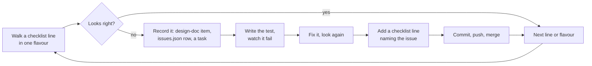

# Walking the app

**The question a walk answers:** what would a reader trip over today, in each way they could hold
the app? **You need:** a running server (`make pitch` for the demo with the notes, `make dev` for
the public site). **How long:** a full walk is an hour or two; a walk of one area is minutes.

1. Pick the flavours to walk (table below); for the pitch, the desktop, the iPad on its side and
   the phone come first.
2. Go down [checklist.md](checklist.md), one `make drive` per line per flavour. **Look at every
   picture yourself.** Measure with `eval=` rather than judging by eye where a number settles it.
3. Off the checklist too: use the app as a scholar would for ten minutes per flavour. The list only
   knows the faults already found.
4. Each fault: write it down, then fix it worst first (the loop below).
5. End by moving finished tasks to `docs/tasks/done.md` and saying what is still open.

## Which flavours are there?

| flavour | how to open it |
| --- | --- |
| private pitch build (the Study Quran notes) | `make pitch`, then `BASE=http://localhost:5173` |
| public site build | `make dev` (5173), or the live site `https://blog.bytesofpurpose.com/hifth` |
| two pages at a desk | `DEVICE=desktop` (1440×900, mouse) |
| a laptop | `DEVICE=laptop` (1280×800, mouse); one page with `?view=one` in the hash |
| an iPad upright / on its side / a big one on its side | `DEVICE=ipad`, `ipad-side`, `ipad-big-side` (finger) |
| a phone upright / on its side | `DEVICE=phone`, `phone-side` (finger) |
| Arabic interface | `LOCALE=ar` (English is `LOCALE=en-US`, the pitch default) |
| Firefox (the owner's browser) | `BROWSER=firefox` |
| Safari's engine | the Playwright `iphone` and `ipad` projects (`make drive` drives Chrome and Firefox only) |
| the Mac and iPad apps | `make app-run-mac` / `make app-run-ipad`, pictures with `make app-shot` (the native-shell skill) |
| the iPad app held sideways | the iPad simulator, turned; the native-shell skill's "Walking the app in the simulator" — the iPad's own WebKit is not Playwright's, so the pitch gets walked here too |
| first visit vs returning reader | leave the hint owed, or `SEEN_COACH=1` |

A useful hash: `#/hafs-kfqc/2:255` (a verse), `#/hafs-kfqc/p42` (a page), `?view=one` / `?view=two`.

## Scripts — when to use each

| script | what it does | reach for it when | command |
| --- | --- | --- | --- |
| `make drive` (apps/web/e2e/tools/drive.mjs) | opens the running app at a link in a named device, does steps (tap, hold, drag, press, eval), saves a picture | every checklist line | `make drive HASH='#/hafs-kfqc/2:255' DEVICE=phone SEEN_COACH=1 ACT='tap=[data-verse-key="quran/hafs-kfqc/2:255"]; settle=600' OUT=test-results/walk/phone-255.png` |
| `make pitch-e2e` | runs the pitch suite, where most walk faults' tests live; the push check runs it too whenever the private notes are on the machine | after a pitch fix, before pushing | `make pitch-e2e` |
| `make app-shot` | a picture of the real Mac or iPad app at a route | the native-shell flavours | `make app-shot ROUTE=/hafs-kfqc/p45 TARGET=ipad` |
| `make app-walk` | opens each of several routes in the iPad app, upright or sideways, and keeps one picture of each in `native/shots/walk/upright/` or `walk/side/`, named after the route | walking many links in the app in one go | `make app-walk ROUTES='/hafs-kfqc/2:48?open=lookalikes /hafs-kfqc/p45' SIDEWAYS=1` |
| `make app-probe` | runs a line of JavaScript inside the real iPad app's page and prints the answer, with the screen size and orientation | the app looks wrong and you need a number, not a picture | `make app-probe TARGET=ipad ROUTE=/hafs-kfqc/p45 EVAL='innerWidth' DELAY_MS=3000` |
| `make app-test ONLY=` | one simulator test, which can turn the iPad and measure the web view's own picture | pinning an app-only fault, watched failing first | `make app-test ONLY=SmokeTests/testLandscapeOpensTheBookFullSize` |

The step words `ACT=` takes are listed at the top of drive.mjs. `EXPECT='<css>'` makes a step that
silently missed fail instead of handing back a picture of the wrong screen. Inside `make`, a `$`
in a selector must be written `$$`; a full verse key avoids it.

## When a walk finds a fault

Each fault gets, in the same change as its fix:

- **an item** in the design doc it belongs to (pitch faults: `docs/design/knowledge-graph-commentary.md`,
  numbered, its heading a question a stranger could answer, marked **open** or **fixed**);
- **a row** in `docs/issues.json` with its `closedBy` test, then `make -s tasks-doc issues-doc` and
  `pnpm gate:issues`;
- **a task** while it is open, moved to `docs/tasks/done.md` when merged;
- **a test written first and watched failing** — a Playwright test when a reader would see it;
- **a line in [checklist.md](checklist.md)** under its surface, naming the flavours and the issue.
  If the fault is a new *kind* (a new surface, a new flavour), add the heading or the flavour too.

A fault you cannot act on (the owner's call, a fix blocked on someone) still gets its row and its
checklist line, marked **open**, and is said out loud at the end of the walk. A check only a person
can make (a real phone, a week of use) goes to the manual-testing skill's list, not here.

Never put text from The Study Quran in a checklist line, an issue row, a test or a commit: describe
where the fault is, not what the note says.
