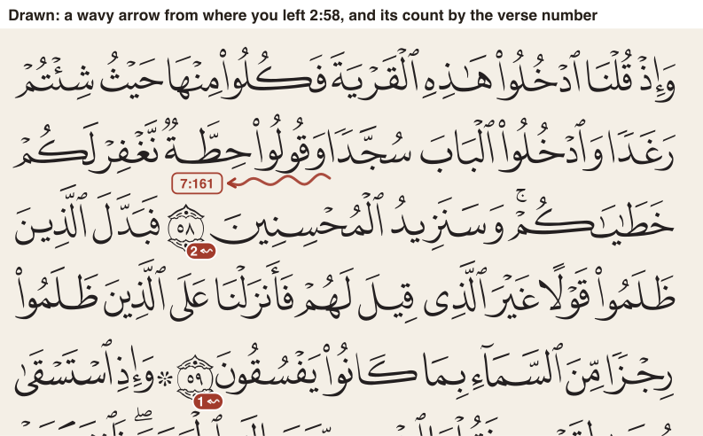
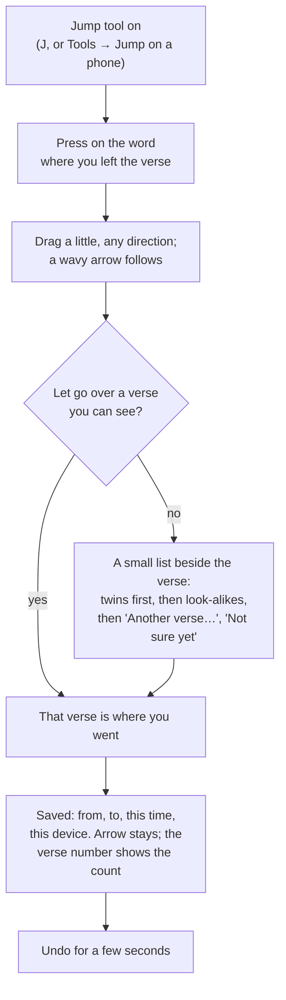
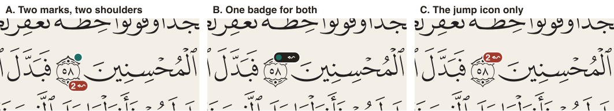
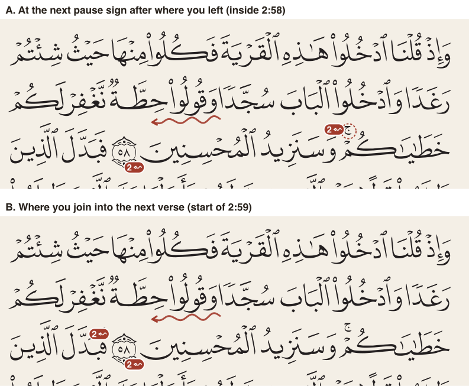
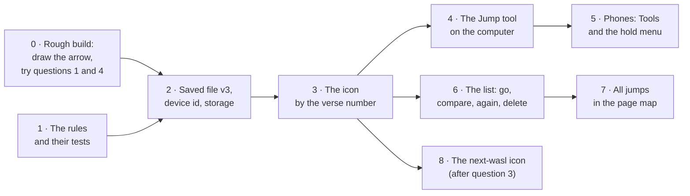

# A wavy arrow for the places your memory jumps: how should a hafiz mark them, and how does the page show them afterwards?

> Asked by the owner on 2026-10-03: *"design a new tool that is a squicky arrow that we can use to mark our confusion jumps ... and that adds same icon to end of ayah with counts to different ayas we jump to from this ayah. This icon can also appear on the next wasl too"*

**Status:** design only, nothing built. It is plan item 31. Five questions need the owner, listed in [What needs the owner's call?](#what-needs-the-owners-call). Two of them are about how something feels in the hand, so the next step is a rough throwaway build to try them, not a choice made from these pictures.

## The short version

- **A new tool on the toolbar, Jump (key J).** Press on the word where your memory left the verse, drag a little, let go: a wavy red arrow is drawn from that word, and a small list asks where you went, the look-alike verses first.
- **Each jump is saved as from, to, and every time it happened**: the day and hour, and which of your devices. Marking the same jump again adds a time; it never draws a second arrow.
- **The verse's number gets a small red icon with a count**: how many *different* verses you have jumped to from this one. A tap on it lists them, how often each, and lets you go there, compare the two verses side by side, add one more time, or delete.
- **The same icon can also sit at "the next wasl"**. We read that as the next pause sign after the spot where you left, inside the same verse, because that is where a reader stops, starts again, and goes wrong; the pictures show why the other readings add little.
- **It builds on the confusion-points design** (the parent idea: a private record of where you slip), and it is the first concrete way to capture and show one.

> **For a hafiz:** mid-revision, you recite 2:58 and find yourself in 7:161, the verse that shares most of its words. One press-and-drag on the word where it happened and one tap on "7:161" in the list, and you are back reciting. Next time you open the page, the verse number of 2:58 carries a small red mark saying "2": you have gone astray from here to two different places. You see your weak spots *before* you reach them, without the page shouting at you, and the day you stop jumping you can delete the mark.



*Page 9 at phone size, from the app's own print. The arrow and the icons are drawn by [a sketch script](../../scripts/draw-confusion-jumps.mjs) using the page's real word positions; the place the arrow starts is illustrative.*

## A few words, defined once

- **Mutashabihat**: verses that look alike, often word for word for a stretch, and then differ. They are the main reason a hafiz's memory jumps.
- **Waqf**: stopping in recitation, at a verse end or at a pause sign.
- **Wasl**: joining, reading on without stopping, across a pause sign or into the next verse. Where you stop and then join again is where the tongue most often carries on into the wrong verse.
- **Pause sign**: the small marks printed above the line (such as the little *jim* or *sad-lam-ya*) that say whether stopping there is allowed, better, or forbidden.
- **Ayah end marker**: the round ornament with the verse number in it, printed where each verse ends.
- **Seam word**: the word where your recitation left the verse you were on and carried on in another one.
- **Jump**: in this page, one recorded instance of that: from a verse (and word), to a verse.

## What is being decided?

What the new tool does, what it saves, how the page shows the saved jumps, and how a reader finds, follows and deletes them. The owner's call is needed on five points (where the icon goes beside the note dot, what its number counts, what "next wasl" means, whether the arrow stays on the page, and how a device is named). Everything else here is a proposal that can be changed after the rough build.

## Why now, and what happens if nobody decides?

The confusion-points design has been agreed in outline but has no capture tool and no mark on the page; this request supplies both, in the owner's own shape. If nobody decides, the parts that need no answer (the saved record, the file, the rules) can still be built with the recommended answers, and the page marks wait.

## What does the app do today, and where does it stop?

- **You can mark a mistake on a word** (the Mistake tool, M). It says *something* went wrong at that word; it does not say *where your memory went*.
- **You can write a note and pin it**, and a verse in a note shows a small green dot on the upper shoulder of its number, with a count when it is in more than one note ([scoped notes](scoped-notes.md)).
- **The app already knows which verses look alike**: about a quarter of verses carry curated look-alike links, and word-for-word twins are worked out from our own data ([similar-ayah enrichment](../decisions/similar-ayah-enrichment.md)). It shows them as chips you can hop to and compare.
- **What is missing**: nothing records *your* jumps. The look-alike links are everybody's; the jumps that catch *you*, and how often, exist only in your head and your teacher's.

## What do other people do?

We did not look for apps with a tool like this for this page. The parent design's [outside survey](confusion-points.md#what-people-outside-this-project-do-about-it--and-a-caveat) is the nearest; on paper, teachers and students mark these places by hand in the margin, often with an arrow to the other verse, which is the habit this tool copies.

## What have we already decided that shapes this?

- **[Confusion points](confusion-points.md)**: a jump is recorded *from where, to where, how often*; marking it again deepens one record instead of making a copy; the reader, not the app, says when a jump is beaten; and nothing is ever added up into a score.
- **[Saving the record to a file](../decisions/confusion-map-export.md)** (decided B): the reader's own records leave the device only in a saved file they choose to make, with a cloud copy once there is sign-in.
- **[The phone toolbar](../decisions/phone-toolbar.md)** (decided C): tools live behind one Tools button, so a new tool appears there with no new layout.
- **The hold menu on a verse** ([verse tap and hold](verse-tap-and-hold.md)): a hold on a verse opens a small menu beside it, never over it. A "Jump…" item fits there.
- **The rough highlighter** ([highlight texture](../decisions/highlight-texture.md)): marks look hand-drawn but are drawn the same way every visit, never randomly, so the arrow does the same.

## What is the tool, step by step?



- **Press where it happened.** The word you press is the seam word. Pressing on the verse but not on a word starts the arrow from the verse's first word.
- **Drag and let go.** The arrow is a short wavy line ending in an arrowhead and a small label naming where you went. Its shape is worked out from where it starts, so it looks hand-drawn but is the same every time you open the page.
- **Say where you went.** If you let go over a verse on the page or the facing page, that is the answer. Otherwise a small list opens beside the verse (never over it): the verse's word-for-word twins first, then the other look-alikes, then *Another verse…* (the go-to-verse picker the app already has) and *Not sure yet* (saved with no destination; you can fill it in from the list later).
- **Mark the same jump again** and it adds a time to the one you have. The arrow is not drawn twice; its label shows "×3" once it has happened more than once.
- **Escape, or dragging back onto the start word, cancels.** Nothing is saved until a destination (or *Not sure yet*) is picked.

<details>
<summary>How it sits with the other tools and gestures</summary>

- **Keys.** J is free (the toolbar uses R, V, H, B, N, K, W, M and C; F is taken elsewhere). A tap picks the tool for one use; a double-click or a long press keeps it on, as every other tool does.
- **Dragging on the page.** With the Jump tool on, a drag draws the arrow instead of turning the page, the same way the highlighter's drag paints instead of turning. With the tool off, nothing changes.
- **The Mistake tool.** A jump and a marked mistake are different records. A jump says where you went; a mistake says a word was wrong. A jump does not also mark a mistake, so you can keep the two apart; whether one should offer the other is left for after the rough build.
- **Look-alike chips.** The list of destinations reuses the look-alike links the app already loads for the page, so it works offline and costs nothing new.

</details>

## How does a phone user do it?

- **Tools → Jump**, then the same press, drag and let go with a finger. The list opens beside the verse, sized for a thumb.
- **Or hold the verse** (the hold menu) and pick *Jump…*. No drawing: the list opens straight away, and the arrow is drawn from the word you held. This is the fastest way when your hand is already on the verse.
- On a phone you only see one page, so "let go over a verse you can see" mostly means the same page; the list does the rest.

## What is saved for each jump?

One record per pair of *from* and *to*, holding every time it happened:

| field | what it holds | example |
| --- | --- | --- |
| from | the verse, and the word if the arrow started on one | 2:58, word 15 |
| to | the verse you went to, and the word if you let go on one; empty for *Not sure yet* | 7:161 |
| times | every time it happened: the day and hour, and which device | 3 Oct 09:12, "Omar's iPhone" |
| state | the confusion-points state, set by you: sometimes, every pass, beaten, or dismissed | sometimes |
| made, changed | when the record was first made and last changed, for merging | |

- **"How many times" is the length of the list of times**, so it can never disagree with the times themselves.
- **No free text and no score.** If you want words about a jump, a note does that already.
- **The arrow's shape is not saved.** It is redrawn from the seam word each time, so it always fits the page, on every screen size.

<details>
<summary>The record in code terms, and why it is shaped this way</summary>

```ts
interface Jump {
  id: string;
  from: { key: string; word?: number };       // "2:58", the seam word index if known
  to: { key: string; word?: number } | null;  // null = not sure yet
  times: { at: string; device: string }[];    // ISO time, device id
  state: "sometimes" | "every-pass" | "beaten" | "dismissed";
  createdAt: string;
  updatedAt: string;
}
interface Device { id: string; name: string } // one per install
```

- The pair (from verse, to verse) is the key, as in the confusion-points design: two jumps from 2:58 to 7:161, one starting on word 15 and one on word 9, are one record whose seam word is the latest one. Keeping a record per seam word would split one weakness in two; if the owner wants it the other way, the key widens to include the word.
- The rules live beside the notes rules in the shared core, pure and clockless: the time comes in as an argument, as it does for notes.
- The records are stored on the device next to the notes (the same local database), and the revision-privacy check that keeps the revision record off the network is extended to cover them.

</details>

## Which device?

The app has no idea of "which device" today; this is new. The proposal: the first time the app opens, it makes a random id for this install and a name the reader can change, defaulting to something plain like "iPhone" or "Mac, Firefox". Each time a jump is marked, the id goes with it. The list then says "3 times, twice on your iPhone". That is question 5.

## How does the page show a verse's jumps?

**The icon.** A small red pill by the verse number with the squiggle and a count. Red is the colour the Mistake tool already uses, so it reads as "watch out here", and it is clearly not the green note dot.

**Where it goes beside the note dot.** The note dot already sits on the upper shoulder of the number. Three ways, drawn at the size they would be used:



- **A, two marks on two shoulders** (recommended): the note dot stays where it is, the jump icon takes the lower shoulder. Each answers one question and opens its own list. At this size both are clear and neither covers a letter.
- **B, one badge for both**: tidier, but you need a second tap to know whether it is a note, a jump or both, and the count has nowhere to go.
- **C, the jump icon only**: the note dot gives way when a verse has jumps; one list shows both. Simplest page, but a note hides behind a jump.

**What the number counts.** The owner asked for "counts to different ayas we jump to from this ayah", so the recommendation is the number of *different* verses (2 means two destinations). How many times in all is shown in the list, not on the page. That is question 2.

**The arrow itself.** The recommendation is that the arrow stays on the page, faint, from the seam word, because the arrow is what tells you *where* in the verse it happens; the icon only says *that* it does. Whether many arrows on one page become clutter is something only the rough build will show (question 4).

## Where is "the next wasl"?

The owner asked that the icon "can also appear on the next wasl too". We read *wasl* as the place you join again after stopping. Four readings:



- **A, the next pause sign after where you left, inside the same verse** (recommended). After you stop at a pause sign and start again, your tongue is most likely to carry on in the wrong verse; a mark there warns you at the moment you are about to join. When there is no pause sign between the seam and the end of the verse, it is the same place as the verse number and only one icon is shown. In the picture, it lands on the small pause sign on the third line of 2:58.
- **B, where you join into the next verse.** The start of the next verse. The picture shows the problem: the next verse usually starts on the same line, right after the number, so the second icon sits beside the first and tells you nothing new. It only says something when the next verse starts a new page.
- **C, the verse you jumped to.** Put the icon (pointing the other way) on 7:161 too, so when you are revising surah 7 you are warned that 2:58 pulls you there. This is useful, but it is a different thing from "the next wasl"; it can be added whichever reading wins.
- **D, something else the owner meant.** If the owner had a different place in mind, the record already holds the seam word and both verses, so most readings can be drawn without changing what is saved.

<details>
<summary>What reading A needs that the app does not have yet</summary>

- The app's word positions flag every pause sign but do not say which sign it is. The prostration sign and the hizb star are flagged the same way, and neither is a place you stop and rejoin.
- So reading A needs the sign's kind, worked out once when the app's data is built, from our own copy of the print. It ships no outside text; it is one small number per sign.
- A could narrow further to only the signs where stopping is allowed or better (the "continuing is better" kind and its cousins); that is a refinement the rough build can test.

</details>

## How do you list, follow and delete jumps?

- **Tap the icon** on a verse: a small list opens beside it (never over the verse), one row per destination: "7:161 · 3 times · last on Tuesday". Each row has **Go** (turn to that verse), **Compare** (the side-by-side view of the two verses the app already has for look-alikes), **Again** (one more time, without drawing), and **Delete** (with Undo).
- **Tap the arrow's label** on the page: the same list, opened at that row.
- **All your jumps**: a list in the page map beside the bookmarks and notes, the jumps you hit most often first, each row going to its *from* verse. This is the "before I start, what do I keep getting wrong?" glance.
- **Beaten or dismissed** (from the confusion-points design): a row can be marked beaten; the arrow and icon then turn grey, or go away entirely if you choose dismissed. Nothing is deleted unless you press Delete.

## How do jumps go into the saved file?

- The saved file gains a **list of jumps**, and its version goes from 2 to 3, the way scoped notes moved it from 1 to 2. The app loads versions 1, 2 and 3.
- **Loading never deletes.** Two records for the same pair are merged by joining their lists of times (the same time on the same device counts once), so a phone and a laptop that both caught the jump end up with all of it. The state kept is the one changed last, as with notes.
- An older copy of the app cannot load a version 3 file and says so; it does not quietly drop the jumps. This is the same trade the version 2 change made.

## What needs the owner's call?

| # | Question | Recommended |
| --- | --- | --- |
| 1 | When a verse has both a note and a jump, how does its number show both? | A: two marks, one on each shoulder |
| 2 | What number does the icon show? | How many different verses you went to |
| 3 | Where is "the next wasl"? | The next pause sign after where you left |
| 4 | Does the arrow stay on the page, or only show when you ask? | It stays, faint; try both in the rough build |
| 5 | How does the app know which device a jump was marked on? | A random id per install, with a name you can change |

### 1 · When a verse has both a note and a jump, how does its number show both?

> **For a hafiz:** decides whether you can tell at a glance "I wrote about this verse" from "my memory leaves this verse".

| Option | Pros | Cons | Implications |
| --- | --- | --- | --- |
| **A. Two marks, two shoulders** | Each mark answers one question; nothing about the note dot changes; both readable at phone size (picture above) | Two small things on one ornament | Every later mark (a slip, say) needs its own spot; the ornament has room for about two |
| B. One badge for both | One thing on the page; scales to more kinds | A second tap to learn what it is; no room for the count | The note dot, built and tested, would be redrawn |
| C. Jump icon only | Simplest page | A note hides behind a jump until you tap | One combined list has to be built for both |

> [!tip] Recommended
> A, because it changes nothing already built and each mark stays one tap from its own list.

### 2 · What number does the icon show?

> **For a hafiz:** "2" can mean "two different places pull you" or "you went wrong twice". The first tells you how tangled the verse is; the second how often.

| Option | Pros | Cons | Implications |
| --- | --- | --- | --- |
| **A. Different verses gone to** | What the owner asked for; stays small and steady | Hides that one jump happens every pass | The times live in the list |
| B. Times in all | Shows how often it bites | Grows every revision, starts to feel like a score | Pushes against the "no score" rule of the parent design |
| C. Both ("2 · 5") | Everything at once | Too long to fit beside the number at this size | The pill doubles in width and covers letters |

> [!tip] Recommended
> A, as asked; how often goes in the list beside each destination.

### 3 · Where is "the next wasl"?

> **For a hafiz:** decides whether you are warned only at the end of the verse, or at the exact place you are about to rejoin and go wrong.

| Option | Pros | Cons | Implications |
| --- | --- | --- | --- |
| **A. The next pause sign after where you left** | Warns at the moment of rejoining; often the real seam; shows only one icon when there is no sign before the end | Needs each sign's kind worked out when the data is built | One small addition to the app's data; refinable to only some signs |
| B. Where you join the next verse | No new data | Usually sits right beside the first icon (picture above) and says nothing new | Only useful across a page turn |
| C. The verse you went to | Warns from the other side, when revising the other surah | Not what "next wasl" says | Can be added on top of A or B |
| D. Something else | | | The record holds enough to draw most readings |

> [!tip] Recommended
> A, because the picture shows B crowding the number, and A puts the warning where the tongue actually rejoins; C is worth adding later as its own choice.

### 4 · Does the arrow stay on the page, or only show when you ask?

> **For a hafiz:** a page of arrows tells you exactly where you slip, but a busy page is also a distraction during a clean revision.

| Option | Pros | Cons | Implications |
| --- | --- | --- | --- |
| **A. Stays, faint** | Shows *where* in the verse, not just that; what the owner described | A page with many jumps gets busy | A "hide my marks" switch may be wanted later |
| B. Only while the Jump tool is on, or when the icon is tapped | Clean page; the icon still warns | You lose the "where" until you ask | The icon carries all the warning |
| C. Stays until beaten, then gone | Clean as you improve | Hides history you might want | Ties the arrow to the state the reader sets |

> [!tip] Recommended
> A, but this is felt, not seen: build A and B in the rough build and decide with a finger on a real page.

### 5 · How does the app know which device a jump was marked on?

> **For a hafiz:** tells you whether a jump happens on the phone you revise with on the go or the laptop at your desk, which can say something about how you revise.

| Option | Pros | Cons | Implications |
| --- | --- | --- | --- |
| **A. Random id per install, with a name you can change** | Private; names you recognise; survives merging files | One new setting; a reinstall becomes a new device | The id travels in the saved file |
| B. Record no device | Nothing new | Loses what the owner asked for | Can be added later, but past jumps stay without one |
| C. The browser's own description | No setting | Unreadable strings; changes with every browser update; can help identify a person | Not recommended for privacy |

> [!tip] Recommended
> A, a random id and a plain name, nothing that identifies the person.

## What else was considered, and why is it not here?

- **A free-hand arrow**, saved as the stroke you drew. It would look most like a pen, but it would not fit the page at another screen size, and the parent design's rule is that the app draws the mark the same way every time. Ruled out.
- **Folding jumps into the Mistake tool.** One tool fewer, but a mistake has no "where to", and the owner asked for a separate tool.
- **Drawing an arrow across pages to the other verse.** Only works on a two-page spread, and most jumps go far away; the label at the arrow's end says where instead.

## What would change the answer?

- If the rough build shows the arrow covering letters badly at phone size, the arrow moves into the gap between lines or becomes only the label (question 4 to B).
- If a teacher looking at this wants per-word records (two seams in one verse to the same place counted apart), the record's key widens to include the seam word.
- If most jumps turn out to have no pause sign between the seam and the verse end, reading A of question 3 is mostly the same as the verse number, and the second icon matters less.

## What is this not settling?

- **Slips** (being pulled toward a look-alike without fully going there) stay in the [confusion-points](confusion-points.md) design; the record leaves room for them.
- **Sending your jumps to a teacher**, and learning where most readers jump: parent design, questions 6 and 7.
- **The personal map** of where your jumps cluster: parent design, later.
- **The cloud copy** of the saved file: [adopted for the day there is sign-in](../decisions/confusion-map-export.md).

## How will we know it works?

**Rule tests** (shared core, written first):

- Marking a jump makes one record; marking the same pair again adds a time, not a record.
- The count by a verse is the number of different destinations, and ignores *Not sure yet* until it is filled in.
- Deleting a record removes its icon; deleting the last time of a record removes the record.
- Merging two files joins the times, keeps the same time on the same device once, never loses a record, and keeps the state changed last.
- The saved file round-trips at version 3, and versions 1 and 2 still load.
- The next-wasl spot is the first pause sign after the seam word inside the verse, skipping the prostration sign and the hizb star, and is nothing when the verse ends first.
- The arrow's shape is the same for the same seam on every call.

**Browser tests** (computer and both phones):

- With the Jump tool, press on a word of 2:58 on page 9, drag, pick 7:161: the arrow shows, and 2:58's number shows a red icon with 1.
- Mark it again: still 1 on the icon, "2 times" in its list.
- A verse with a note and a jump shows both marks and they do not overlap.
- Tap the icon, press Go: the app turns to page 171 at 7:161. Delete, then Undo: the icon comes back.
- On a phone: Tools → Jump works; holding a verse and picking *Jump…* opens the list without drawing.
- Save the file, clear the app, load the file: the jumps come back.

## In what order do we build it?



0. **A rough, throwaway build** on page 9: draw the arrow with a finger and a mouse, both shoulder layouts, arrow always on versus on request. Recorded, shown to the owner, then deleted. Proved by the owner's answer to questions 1 and 4.
1. **The rules, pure, with their tests.** The record, marking, again, delete, counts, merging, the next-wasl spot, the arrow's shape. Nothing on screen changes. Proved by the rule tests above.
2. **The saved file's version 3, the device id, and storage on the device.** Proved by the round-trip and merge tests, and a browser test that saves, clears and loads.
3. **The icon by the verse number**, beside the note dot as question 1 decides. Proved by the browser test that a stored jump shows its count and does not overlap a note dot.
4. **The Jump tool on the computer**: J, press, drag, let go, the list, Undo. Proved by the page 9 browser test.
5. **Phones**: Tools → Jump and *Jump…* in the hold menu. Proved by the same test on both phone projects.
6. **The list behind the icon**: go, compare, again, delete with Undo, beaten and dismissed. Proved by the go-and-delete browser test.
7. **All jumps in the page map**, most often first. Proved by a browser test that the list orders by count and goes to the right page.
8. **The next-wasl icon**, once question 3 is answered; needs the pause signs' kinds added to the app's data first. Proved by the rule test for the spot and a browser test on page 9.

Steps 1 and 2 can start before any question is answered.
