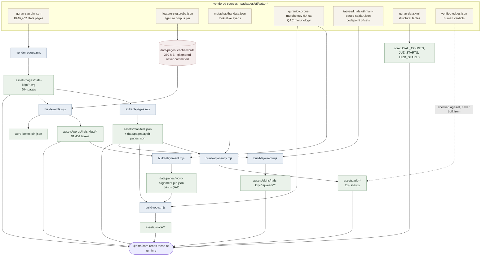
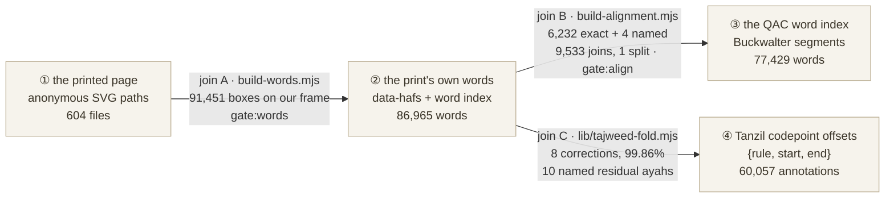
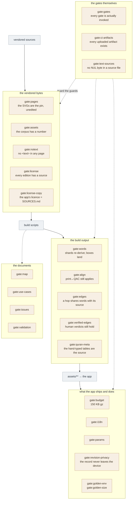
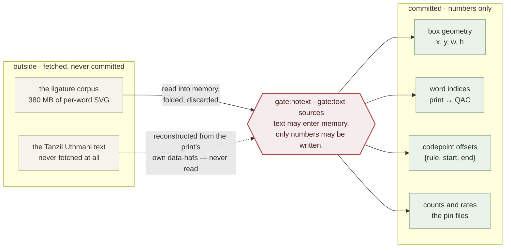
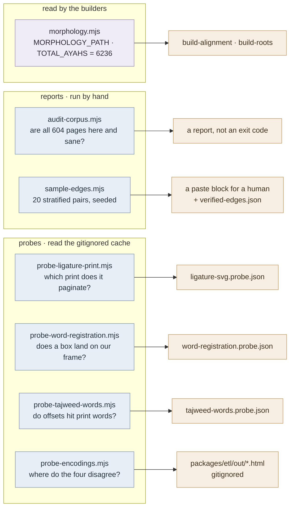

# The ETL: what turns what into what, and what checks it

> The shape of the pipeline, in five diagrams. Every piece of this is already written down
> somewhere — this is the only place the *shape* is. Read it before adding a build script,
> a gate, or a corpus.

**Status:** design of record for the ETL as a whole — the 14 scripts in
[`packages/etl/scripts/`](../../packages/etl/scripts), the seven vendored sources they read,
the shards they write into `apps/web/public/assets/**`, and the 23 gates that fence them.

## How to read this, and what it is not

**This restates nothing.** Every corpus's provenance is in its own `PROVENANCE.md`, every
licence in [`SOURCES.md`](../../SOURCES.md), every code pointer in
[`docs/map.json`](../map.json), and the two hardest joins have design docs of their own —
[`word-indexing.md`](word-indexing.md) for print↔QAC and
[`encoding-inspector.md`](encoding-inspector.md) for the four encodings. If a number appears
here it is quoted from a pin file, and the pin file is named.

What is missing without this document is the question a newcomer actually asks first, which
none of those five answers: *what runs, in what order, and what would catch it if it were
wrong?* You currently have to read all five and hold them in your head. That is the gap.

**One idea underlies all five diagrams.** A mus'haf page in this app is 604 SVG files of
anonymous outlined `<path>` elements. There is no letter in them, no word, no ayah — nothing
a program can point at. Every script below exists to give those paths names, and every gate
exists because a name that is quietly wrong is worse than no name at all.

---

## ① The spine: source → shard → app

Seven vendored inputs, seven writers, six shard trees. Nothing else in the repo writes
`apps/web/public/assets/**`.



Three things this picture is for.

**`manifest.json` is the hub.** Three of the five build scripts read it, because it is where
an ayah key first becomes a page and a polygon. Change its shape and you have changed
adjacency, roots and tajweed at once.

**The ligature cache is a source that never becomes a shard.** 380 MB of per-word SVG,
gitignored, and the only things that leave it are numbers — box geometry in `assets/words/`
and the print↔QAC map. It is also why `build-words.mjs` and both word-facing probes have
nothing to read on a clean checkout, and why none of them is a gate. See ④.

**`verified-edges.json` points the wrong way on purpose.** It is the one input that is never
built from — it is a fixture of human verdicts that `gate:verified-edges` replays against
whatever the ETL just produced. Every other gate is structural and proves the pipeline is
deterministic; this one is the only one that knows whether the output is *true*.

---

## ② The four encodings, and the three joins between them

The same word is described four times in this repo, in four incompatible units. Everything
hard in the ETL is one of the three joins between them.



| | join A | join B | join C |
|---|---|---|---|
| **relates** | page geometry ↔ print words | print words ↔ QAC words | print words ↔ Tanzil codepoints |
| **written by** | `build-words.mjs` | `build-alignment.mjs` | `lib/tajweed-fold.mjs` |
| **pinned in** | `word-boxes.pin.json` | `word-alignment.pin.json` | `tajweed-words.probe.json` |
| **fenced by** | `gate:words` | `gate:align` | *nothing — it is a probe* |
| **residual** | 0 | 4 named exceptions | 10 named ayahs |

**Join C is the one without a gate, and that is deliberate.** It is measured by
`probe-tajweed-words.mjs` rather than enforced, because it reads the gitignored cache and
would fail on any clean checkout for reasons that have nothing to do with correctness. The
compensating discipline is that its residual is *named* rather than rated: `residual.named`
lists every one of the ten ayahs, and the probe prints `⚠` for any residual ayah the list
does not cover, so a moved pin announces itself instead of quietly widening.

**Why the counts differ at all.** 86,965 print words become 77,429 QAC words through 9,533
joins and 1 split — the print splits words the corpus keeps whole (and flags most of those
splits itself, `data-waw-alatf="true"`) and numbers pause marks as words where the corpus
has none. None of it is disagreement about the text. It is four groups of people making
different tokenisation choices for four different purposes, and the ETL's job is to measure
where they diverge rather than to smooth it over. [`word-indexing.md`](word-indexing.md) and
[`encoding-inspector.md`](encoding-inspector.md) carry the details this table compresses.

---

## ③ Where the gates sit

23 gates. Overlaying them on ① answers the question that matters when you are about to
change something: *if I break this, what tells me?*



**Three of them exist because something shipped broken and nothing noticed**, and those are
the ones worth understanding before adding a gate of your own:

- **`gate:edges`** — the hop corpus was off by one for four loops. 47.8% of edges pointed at
  the wrong ayah, and every structural gate passed the whole time, because the shards were
  perfectly deterministic renderings of a wrong answer. Determinism is not correctness.
- **`gate:gates`** — `gate:pages` shipped and then did nothing, because it was written but
  never wired into all three invocation lists. A gate nobody runs is a comment.
- **`gate:ci-artifacts`** — CI uploaded artifacts the repo had stopped producing, in plain
  sight, for several loops.

The pattern is the same each time: the failure was not in the check, it was in the space
*between* checks. That is the argument for this document existing at all.

---

## ④ The one-way boundary

The repo's load-bearing rule, stated once in `morphology.mjs` and enforced twice:

> There is no Quran text in this repo and there will not be.

It survives contact with an ETL whose whole job is comparing texts, and the way it survives
is the most interesting structural fact in the pipeline.



**The dotted arrow is the part worth pausing on.** The tajweed annotations are codepoint
offsets into a Tanzil text this repo does not hold and will not fetch. The obvious way to
check whether an offset lands on the right letter is to read that text. Instead the fold
*reconstructs* it — folding the print's own per-word `data-hafs` into one string per ayah, in
memory, under eight named corrections — and writes only the arithmetic. So a question that
looks like it requires vendoring the text is answered without the text existing anywhere on
disk.

That is the shape of the constraint generally: it does not forbid the comparison, it forbids
the *residue*. Every script here reads more than it writes, and the difference is the rule.

---

## ⑤ The seven scripts that build nothing

Diagram ① is the whole of what writes `assets/**`. The other seven scripts in
`packages/etl/scripts/` never do — they measure, report, or are read *by* the seven that
build. Their outputs are pins, reports and a human's afternoon.



**The two reports are the pipeline's memory of when it was smaller.**
`audit-corpus.mjs` was written when 3 of 604 pages were vendored and had to keep working
through the gap, so it *reports* missing pages rather than failing on them; `gate:pages` is
what fails now, and the audit kept its original job of describing the corpus rather than
policing it. `sample-edges.mjs` draws the twenty pairs a human checks against a real mus'haf
— seeded so the draw is re-runnable, stratified so a rare edge class is not invisible, and
deduped to unordered pairs because the scarcest input this project has is a human minute
with a mus'haf open.

**Probes are not gates, and the prefix is load-bearing.**

| | `gate-*` | `probe-*` |
|---|---|---|
| runs in | `make ci`, every push | by hand, when asked |
| answers | *did this change break?* | *what is actually true?* | 
| output | pass or fail | a pin file, or an HTML report |
| may read the 380 MB cache | **no** | yes |
| may fail on a clean checkout | never | routinely |

The four probes — `probe-encodings`, `probe-tajweed-words`, `probe-word-registration`,
`probe-ligature-print` — measure things a gate structurally cannot, because they need bytes
that are not in the repo and never will be. Making one a gate would either vendor the corpus
or make CI depend on the network, and both are worse than the thing they would buy.

What replaces enforcement is the pin: each probe writes its findings to a committed
`*.probe.json`, so the last measured answer is in version control even though the
measurement is not reproducible offline. A pin that moves shows up in a diff.
[`encoding-inspector.md`](encoding-inspector.md) §③ argues the same point at length for the
inspector specifically, including why its report is gitignored.

---

## ⑥ Running it

```sh
pnpm --filter @hifth/etl etl     # extract-pages → adjacency → roots → tajweed
pnpm --filter @hifth/etl vendor:pages   # re-fetch the 604 pages from the pin
pnpm gates                       # all 23, the same list make ci runs
pnpm probe:encodings             # the inspector → packages/etl/out/ (gitignored)
pnpm --filter @hifth/etl audit:corpus   # the 604-page report
node packages/etl/scripts/sample-edges.mjs --seed 7   # twenty pairs for a human
```

`build-words.mjs` and `build-alignment.mjs` are deliberately *not* in the `etl` chain: both
read the gitignored cache, so putting them there would make the ordinary path fail on a
clean checkout. Their outputs are committed and their gates re-derive them from committed
bytes — which is the whole trick that lets a cache-dependent build be checked offline.

Repo conventions that apply here and are not restated: run from the repo root through
`./scripts/with-lock.sh`, never hand-edit vendored bytes (`gate:pages` will catch it), and
never rewrite a JSON register programmatically — `map.json`, `issues.json` and `use-cases.json`
are hand-edited, and the `*.probe.json` files carry hand-written prose fields that survive
regeneration.

---

## ⑦ Open questions, and what would answer each

### ① Whether this document should be generated rather than written · **open**

`docs/map.json` already knows every script, and `package.json` already knows every gate.
Diagrams ① and ③ are therefore derivable, and a hand-drawn copy of derivable facts is
exactly the drift this repo gates against everywhere else — `gate:map` exists because
orientation documents rot.

Deliberately not done yet, and the reason is that the *prose* is the point and the prose is
not derivable. A generator would produce four correct diagrams and none of the three
paragraphs under ③, which are the only part that would have prevented the defects they
describe. What would answer it: `gate:map` already validates pointers in prose files, so the
cheap version is to cite the scripts by path here and let that gate catch a rename. If a
script is ever added and this document does not mention it, that is the evidence the balance
was wrong.
