# How should the app mark the verse you are on?

*A decision record, settled 2026-09-30 (see "What was decided?" below). Its options page — every stroke and every behaviour drawn on the same
real page of the print, at the width a phone gives it, three of them mounted live — is
`highlight-options.html` beside this file, and on the site at
<https://blog.bytesofpurpose.com/hifth/docs/design/highlight-options.html>. This record is the
reasoning; the page is the evidence. Look at the page first, on a phone if you can.*

When you press a verse, the app lights it so you can see where you are. Today that light is a
bold amber marker stroke along each line of the verse. An earlier decision settled that a reader
may *choose* between that stroke, a fill and an outline, and tune how strong it is. This record
is the wider menu that decision never drew: ten other strokes the mark could be, and seven ways it
could behave — one stroke per line or one shape, blended or laid over, wiped in or static, a
verse across two pages, next to the app's other marks, fading or staying, and the half-second
test a hafiz actually runs.

---

## What was decided?

The owner settled this on 2026-09-30, on a later page that took this one's recommendation further
(the [highlighter's texture](../decisions/highlight-texture.md)), and then chose its colours:

- **The verse you are on: a hand-drawn swipe in amber (I).** Each line gets a band with rough,
  nearly upright ends and faint streaks along it, blended into the print so the letters stay
  black. The wobble is fixed per verse, so the same verse looks the same on every visit, which
  answers this page's worry that a fresh wobble would move under the reader.
- **A swept passage looks different: its own colour.** It is a pastel pen the reader picks in
  the tools bar while the highlighter is on (green, blue, yellow or pink, green by default), and
  a run of words is pastel blue over its amber verse. Every pen keeps the letters at 4.5 to 1 or
  better where it crosses the amber. That retires this page's worry about a passage inside a
  passage going brown.

The options below are kept as they were drawn; they are the evidence the choice was made on.

## The short version

- **What is being decided:** the house mark for the verse you are on — its stroke, its colour,
  and how it behaves — and whether a swept passage should look different from it.
- **What the earlier record settled, and this one does not re-ask:** a reader may pick the swipe,
  a fill or an outline; strength comes in a few named steps; every mark is drawn per line. That
  menu was never built. Whatever is chosen here is the *default* it would offer first.
- **Recommended:** keep today's amber stroke, per line, blended, wiped in, staying (A, with P1–P3
  and P6 as they are). Nothing else on the page passes the half-second test *and* leaves the
  letters black *and* survives the tajweed skin. Give a passage a second hue drawn *around* the
  selected verse, not under it (P5, second picture). Everything quiet — a rule, a margin bar, the
  number only — is a companion mark at best, not the mark.
- **Why now:** the pitch is a few verses done beautifully and the mark is the first thing a
  scholar sees when a verse is pressed; and looking at what the app draws today turned up things
  nobody had chosen by looking.
- **If nobody decides:** the app keeps today's stroke, which reads well, and today's two-strength
  amber for a passage, which goes brown where they stack.

Everything below is the long version.

<b>A few words, once</b>

- **Verse (ayah)** — one numbered sentence of the Qur'an. It is what you press.
- **Passage** — several verses in a row that you have swept across with a drag, or opened from a
  link like "2:254 to 2:256".
- **Hafiz** — someone who has memorised the Qur'an and revises it from the printed page.
- **Mus'haf** — the printed Qur'an. The app shows real printed pages, not typed text; the mark is
  drawn *over* the print.
- **Vowel marks (harakat)** — the small signs above and below the letters that say how a word is
  read. A mark laid over a line covers them too.
- **Tajweed** — the rules of recitation (where to lengthen, where to hum through the nose, and so
  on). The app has an optional look that tints each verse in the colour of its most distinctive
  rule; the page calls it the tajweed skin.
- **Blended** — laid into the print the way ink soaks into paper: the paper lightens the colour
  and the black letters stay black. The other way is *laid over*: a translucent sheet on top,
  which greys everything under it.
- **The crumb** — the dashed ring the app leaves around the verse you hopped *from*, so you can
  find your way back.
- **Contrast** — how far apart two colours are, written as a ratio. The web accessibility
  guideline wants at least **4.5:1** between text and what it sits on, and at least **3:1** for a
  visual sign of "this is selected" against its surroundings. The page prints both for every
  option.

## What was settled before, and what does this add?

On 2 September the owner settled two questions ([the record](../decisions/highlight-style.md),
drawn on page 7): a reader chooses the mark's **shape** among the swipe, a fill and an outline,
and tunes its **strength** through a few named steps. Per line — one band per printed line, never
one box around the run — was settled there too, and by the comparison panel before it. That
stands. It is also true that the menu it describes has not been built; the app today draws one
stroke at one strength.

That record drew three shapes in one colour on one skin, static. It did not draw a rule under
the line, a dashed rule, a margin bar, the verse number alone, a pill per word or a hand-drawn
stroke; it did not try another colour or the tajweed skin underneath; and it did not ask how the
mark *behaves* — one stroke per line or one shape, blended or laid over, wiped in or simply
there, a verse across a page turn, next to the crumb and a passage and a word mark, fading after
a moment or staying. This page draws all of that, on a harder verse — the Throne Verse (2:255),
six lines, starting and ending mid-line — and at phone width, where the mark has to work.

## What does it change for a hafiz?

A hafiz revising from the page uses the mark for one thing: **to find where they are in half a
second, then read on, past it, without the mark getting in the way.** So every option is judged
on two moments — finding the verse at arm's length, and reading through it up close — and the
page ends with a live half-second test (P7) so a reader can run the first moment themselves.

| Option | Finding it | Reading through it |
| --- | --- | --- |
| **A** marker swipe (today) | Instant | Letters stay black; the vowel marks are tinted |
| **B** one wash over the verse's shape | Easy to miss at arm's length; one pale slab | Fine; the line rhythm is lost |
| **C** rule under each line | Have to look; six rules to count | Nothing on the letters; runs through the tails |
| **D** dashed rule | Quieter still; reads as a note | Nothing on the letters |
| **E** outline round the verse | Faint; a stepped frame that cuts the neighbours' lines | Nothing on the letters |
| **F** bar in the margin | Have to look; points at whole lines, not the verse | Nothing on the text at all |
| **G** verse number only | Finds the *end*; the start is a page away | Nothing on the text |
| **H** a pill per word | Same as B at this size — the pills fuse | Notches land on the vowel marks between words |
| **I** hand-drawn swipe | Instant, same as A | Same as A; reads as "someone marked this" |
| **J** verdigris or grey swipe | Quieter than amber; looks like a link or a crumb | Both had to be thinned to stay readable |
| **K** on the tajweed skin | The swipe still instant; the wash becomes a third colour | The swipe's letters still 6.6:1 |
| **P1** per line vs one shape | Same | Per line keeps the gaps between lines paper |
| **P2** blended vs laid over | Same | Laid over greys the letters to 3.2:1 |
| **P3** wipe vs static | The wipe pulls the eye first | Half a second of motion before the whole verse is readable |
| **P4** across two pages | Never happens to a verse in this print | A passage continues on the next leaf |
| **P5** next to other marks | Amber-in-amber goes brown; a second hue separates them | The word ring survives on every wash |
| **P6** fades vs stays | Same | Fade leaves a clean page; stay keeps a place to look back to |

## Why is this being asked now?

Because the pitch is a handful of verses done beautifully, and the mark is the first thing a
scholar sees when they press one. And because drawing what the app does today, next to what it
could do, turned up things nobody had chosen by looking:

- **The settings describe a mark the app no longer draws.** The app's colour settings describe
  a pale wash at about a quarter strength with a thin ring — option B — but the mark today is a
  full-strength marker stroke blended into the print. The wash is only what the app falls back
  to on a page whose lines it cannot read (today, two decorated pages).
- **A passage inside a passage goes brown.** A passage is the same amber held lighter, and the
  verse you are on is painted at full strength on top; where they stack the verse goes a deep
  brown — the darkest thing on the page — and its letters drop from 7.1:1 to 5.5:1 (P5, first
  picture). A second hue only fixes this if the passage stops where the verse starts: drawn
  stacked, amber over verdigris went olive.
- **Opening a passage from a link paints no passage.** A link like "2:254 to 2:256" opens the
  passage's sheet but marks only the first verse; the passage mark is only drawn when you sweep
  with a drag. That is a bug, not a design choice, noted here so it is not lost. It belongs in
  the backlog.
- **No verse in this print is split across two pages.** Counted over every page: 6,236 verses,
  6,236 printed whole. The "verse across a page turn" case does not exist; only a passage can
  cross the gutter (P4).
- **A dark hue cannot be a marker.** At full strength, verdigris blended into the print leaves
  the letters at 2.6:1; it had to be thinned to 45% to be readable, at which point it is a wash,
  not a stroke (J). Amber works *because* it is light.
- **On the tajweed skin only a stroke survives.** The translucent wash mixes with the skin's own
  tint into a salmon nobody named; only its ring says where the verse ends (K).

## What happens if nobody decides?

The app keeps today's stroke for a single verse, which reads well, and today's two-strength
amber for a passage, which does not. The settings keep describing a wash the app no longer
draws. Nothing breaks; the pitch shows a mark that was never chosen on evidence.

## What does the app draw today, and what does it cost?

One round-capped band per line of the verse, amber, at full strength, blended into the print
the way a felt-tip is, wiped in right to left one line after the next, and staying until you
press elsewhere. It is drawn by the app's own pen from the print's own verse boxes; the page
imports that pen rather than imitating it, so picture A *is* the app.

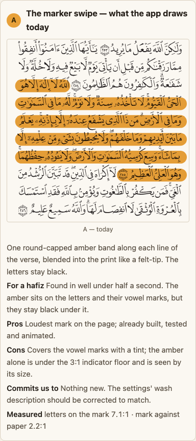

Measured on page 42 (the print's ink on the leaf's paper reads at 15.4:1):

| | Letters on the mark | Mark against the paper |
| --- | --- | --- |
| A · today's stroke | **7.1:1** — clears the 4.5:1 reading floor with room | **2.2:1** — under the 3:1 floor for a "selected" sign |
| Passage today (lighter amber) | 10.5:1 | 1.5:1 |
| Verse inside a passage today (stacked) | 5.5:1 | — |

So the cost today is two-fold. The amber itself is under the contrast floor a selection
indicator is supposed to clear — it is seen by its **size** (a band nearly three-quarters of the
line's height, six lines long) rather than by its colour, so a reader who sees amber poorly
relies on size alone. And the passage is a shade, not a colour: at a glance "the passage" and
"the verse I am on" differ only in how dark the amber is.

The e2e contrast test measures the app's chrome — labels, buttons, sheets — against the 4.5:1
floor. It does not measure the letters under the mark; the figures above come from the page's
build script, and are not yet held by a test.

## What do others do?

Looked at, with what was actually seen. Nobody among them uses a full-strength stroke; nobody
wipes it in; nobody dims the rest of the page.

- **Quran.com** — the word being recited is recoloured teal, and the current verse gets a faint
  neutral grey wash behind it. *(Seen in the source and a product-updates post:
  [quran.com-frontend-next](https://github.com/quran/quran.com-frontend-next),
  [product update](https://quran.com/en/product-updates/simplifying-word-by-word-and-audio-settings).)*
- **Quran for Android** — a translucent fill over the page image at about a quarter strength: a
  blue-teal for the selected verse and a green for the verse being played. Our option B with a
  cool hue. *(Seen in the colour definitions:
  [quran_android](https://github.com/quran/quran_android).)*
- **Tarteel** — recolours the *words* themselves (red, green, yellow, brown) and dots a line
  under a mistake; it draws typed text, not a printed page. *(Seen in their help articles:
  [word colours](https://support.tarteel.ai/en/articles/12160141),
  [mistake marks](https://support.tarteel.ai/en/articles/12414495),
  [adaptive mode](https://tarteel.ai/blog/tarteel-ai-adaptive-mode/).)*
- **Ayat (King Saud University)** — a box per verse over the scanned page; the selected verse a
  blue at one-tenth strength, and the two ends of a range green and red — a passage's ends in
  *different* colours from its middle. *(Seen in the source:
  [Ayat on GitHub](https://github.com/QuranIslam/Ayat); the reader is at
  [quran.ksu.edu.sa](https://quran.ksu.edu.sa).)*
- **The Study Quran** — there is no app to look at; it exists as a printed book and an e-book.
  *(Not found; [the e-book listing](https://books.apple.com/us/book/id522063581).)*
- **QUL's page reader** — could not be seen; the page preview is behind a login.
  *([the proofreading view](https://qul.tarteel.ai/mushaf_layouts/19?page_number=273&view_type=proofreading),
  not looked at.)*
- **Underlines, margin bars, badges, hand-drawn strokes, fading marks** — not seen in any
  Qur'an app looked at. Margin bars and underlines are the vocabulary of e-book readers and code
  editors, not of mus'haf apps; we did not survey those.
- **The contrast floors** — the web accessibility guideline's
  [text contrast (1.4.3)](https://www.w3.org/WAI/WCAG21/Understanding/contrast-minimum.html) and
  [non-text contrast (1.4.11)](https://www.w3.org/WAI/WCAG21/Understanding/non-text-contrast.html).

The pattern: three of four ship a pale translucent fill (our B), one recolours words. Ours is
the boldest mark in the set, by a distance, and the only one drawn as a pen stroke.

## What has already been decided that constrains this?

- **The reader may choose the mark's shape and strength; per line is settled.** Decided
  2026-09-02 (highlight-shape, highlight-strength). Not reopened here; see above. The shapes
  drawn here that fall inside that menu are B (a fill) and E (an outline).
- **Per line, never one box.** How the comparison panel was settled, and every mark here that
  follows lines honours it; P1 is on the page only so a reader sees why. (Decided: comparison-crop.)
- **Colour is already spoken for elsewhere on the page.** Seven recitation-rule hues; green,
  ochre and indigo in the comparison panel; verdigris for navigation and the crumb. A second hue
  for a passage must not collide with those. The verdigris and indigo on the page are stand-ins
  borrowed for the picture; the real hue is not settled here. (Decided: tajweed-colours,
  diff-mark-tint.)
- **Marks can be finer than a verse.** Word-level marks exist for the comparison panel and word
  selection; option H's pills reuse those word boxes. (Decided: mark-granularity.)
- **The public build carries no Qur'an text.** Every picture here is the print's outlined paths
  with shapes over them; the build refuses to write a page with an Arabic codepoint in it.

## The strokes, side by side

Each is drawn on `highlight-options.html`; the pictures below are cut from that page. Every crop
is at the width a phone gives the page (358 px), so what you see is what a hafiz would see. The
measured pair under each is letters-on-the-mark / mark-against-paper.

| | Pros | Cons | Commits us to |
| --- | --- | --- | --- |
| **A · Marker swipe (today)** 7.1 / 2.2 | Found instantly; letters stay black; already built, tested and animated | Amber under the 3:1 indicator floor; tints the vowel marks; the boldest mark of any app looked at | Nothing new; the settings' wash description should be corrected to match |
| **B · One wash over the verse's shape** 13.0 / 1.2 | What most other apps do; one shape; already exists as the fallback | Barely visible against the paper; the slab hides the line rhythm; becomes a third colour on the tajweed skin | Promoting the fallback to the default and making the swipe the fallback |
| **C · Rule under each line** 15.4 / 2.2 | Nothing on the letters or vowel marks | Hard to find; runs through the tails and lower vowel marks; six rules to count | A new drawing branch; a re-thought wipe; it would need to be bolder to be found, which undoes its quietness |
| **D · Dashed rule** 15.4 / 2.2 | Lightest touch that still shows the extent; dashes are already the crumb's vocabulary | Easier still to miss; dashes under a dotted script are noise | Only sensible as a *secondary* mark (a passage, a crumb) |
| **E · Outline round the verse** 15.4 / 1.8 | Exact extent; nothing on the text | A stepped frame around a mid-line verse looks odd and cuts the neighbours' lines; faint | Already in the earlier menu; nothing new |
| **F · Bar in the margin** 15.4 / 2.2 | Nothing on the text; never collides with tajweed or word marks | Cannot show a mid-line start or end; easy to miss; the margin holds the page number and juz marks | A companion to another mark, never alone |
| **G · Verse number only** 15.4 / 2.2 | Nothing on the text; tiny; fits any skin | Marks the end, not the verse; on a six-line verse the start is a page away | A companion only, pairs with F; alone it does not answer "where am I" |
| **H · A pill per word** 13.0 / 1.2 | Exact to the word; the comparison panel's drawing | At this size the pills fuse into B with a ragged edge; fifty-odd shapes; depends on word boxes the sweep still flags | Ties the verse mark to the word boxes and their gate; a per-word wipe |
| **I · Hand-drawn swipe** 7.1 / 2.2 | Warmer; "a printed page, a real pen" is the pitch's feel | A fixed wobble looks fake, a fresh one moves under the reader; harder to wipe | A generated path per line; a choice of fixed or fresh wobble |
| **J · Verdigris / grey** 7.7 / 2.0 · 9.3 / 1.7 | Grey never fights the tajweed hues; verdigris is the app's own | Both had to be thinned to 45% to keep the letters readable, so both are washes; verdigris already means "where you hopped from" | Amber stays the selection colour; other hues are secondary marks |
| **K · On the tajweed skin** swipe 6.6 · wash 1.2 | The swipe survives the skin because it blends rather than covers | Any translucent fill mixes with the skin's tint into a colour nobody chose | If the skin stays, the mark is a stroke, not a fill — rules B and H out as defaults |

<b>The stroke pictures</b>

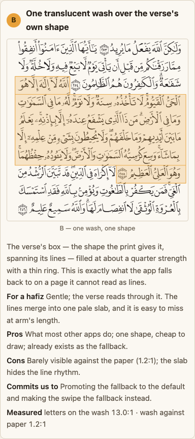
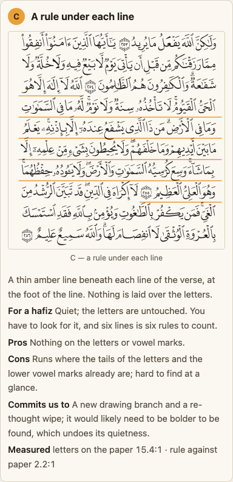
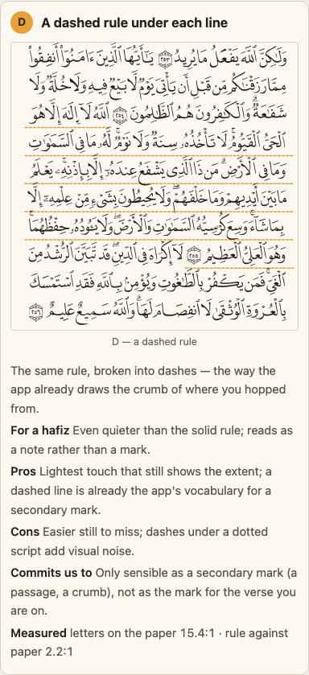
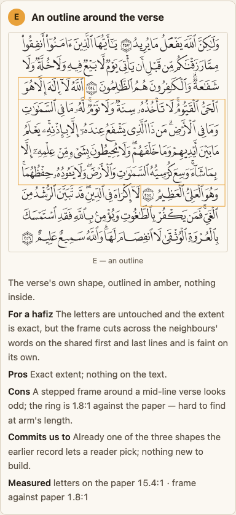
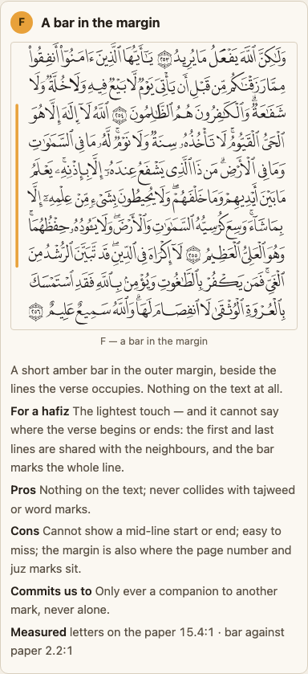
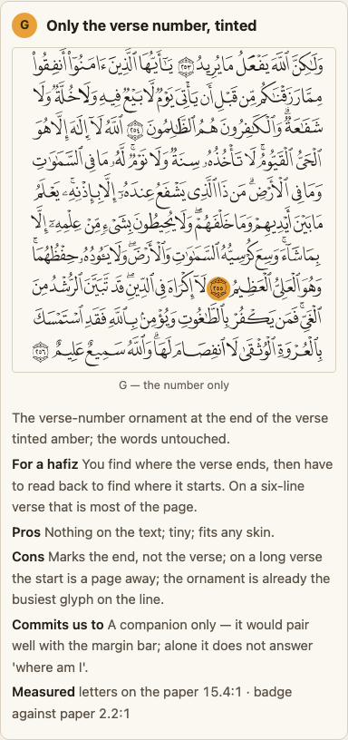
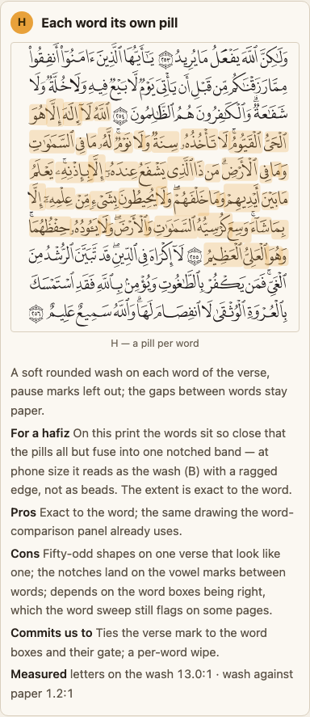
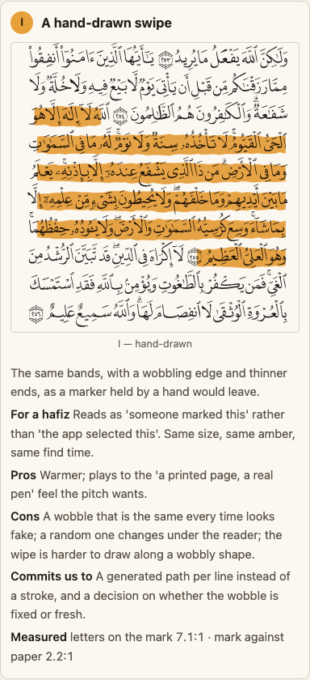
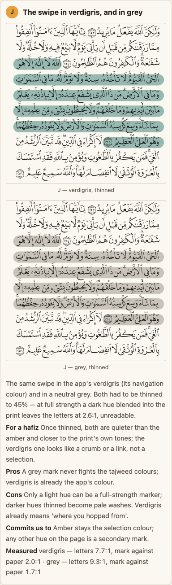
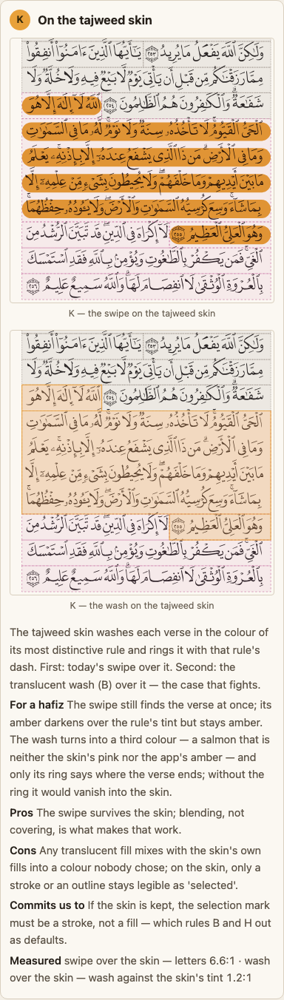

The same card on a 390 px phone, to show the crops really are phone-size:

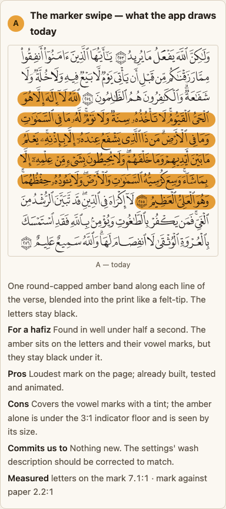

## The approaches, side by side

How the mark is made and how it behaves. Three of these (P3, P6, P7) are mounted live on the
page — a still picture cannot carry a wipe, a fade, or a half-second glance — so press them
there; the pictures below are only the resting state.

| | Pros | Cons | Commits us to |
| --- | --- | --- | --- |
| **P1 · One stroke per line, or one shape** | Per line keeps the print's line rhythm; exact extent on shared lines | Needs the pen to read the box as lines; two decorated pages fall back to one shape | Settled already; here so a reader sees why |
| **P2 · Blended, or laid over** 7.1 vs 3.2 | Blended: full-strength colour, letters untouched | Laid over greys the letters and fades the vowel marks first; at full strength they vanish | Every mark that touches letters is blended, as the app already does |
| **P3 · Wipe in, or static** (live) | The wipe pulls the eye to the verse before the mark has finished; already built | Half a second of motion; a shape that cannot wipe (a wobble, a fill) loses it | Keeping the wipe keeps the mark a stroke; reduced-motion already turns it off |
| **P4 · A verse across two pages** | Does not happen to a verse: 6,236 of 6,236 are printed whole | A passage can cross the gutter; its mark must be drawn on both leaves and survive a turn; on a phone the rest is off screen | The passage mark is per page; the range-from-a-link bug has to be fixed for it to be seen |
| **P5 · Next to the app's other marks** 5.5 stacked · 7.7 second hue | A second hue separates passage from verse; the word ring reads on every wash | The palette is nearly full; two hues stacked go to mud, so the passage must stop where the verse starts | One more colour token; a hue-per-meaning rule; passages drawn around the verse, not under it |
| **P6 · Fades, or stays** (live) | Fade: the reading page ends clean without a tap. Stay: a place to look back to; the verse's tools have something to point at | Fade: gone when the tools open, and a reader who looks up loses their place. Stay: a tint over the letters as long as you read | Fade needs a rule for when the mark returns and a way to keep it; stay is what the app does |
| **P7 · The half-second test** (live) | The one test a hafiz actually runs; separates the quiet strokes from the loud ones | Harsher on a phone in daylight than on a desk | Whatever passes sets the floor for how loud the mark must be |

<b>The approach pictures</b>

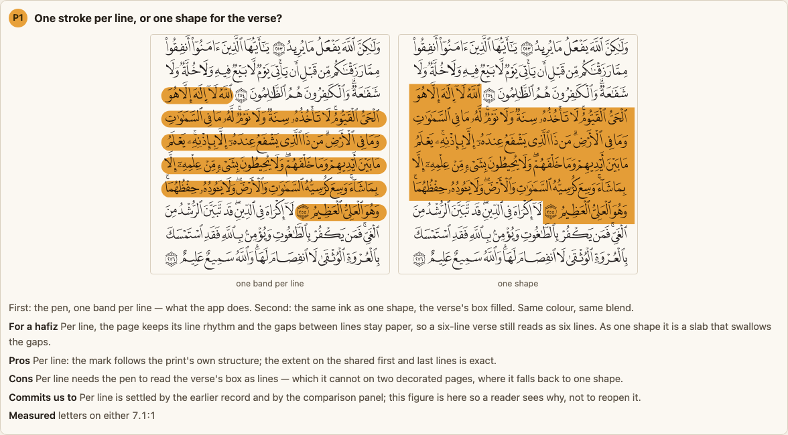
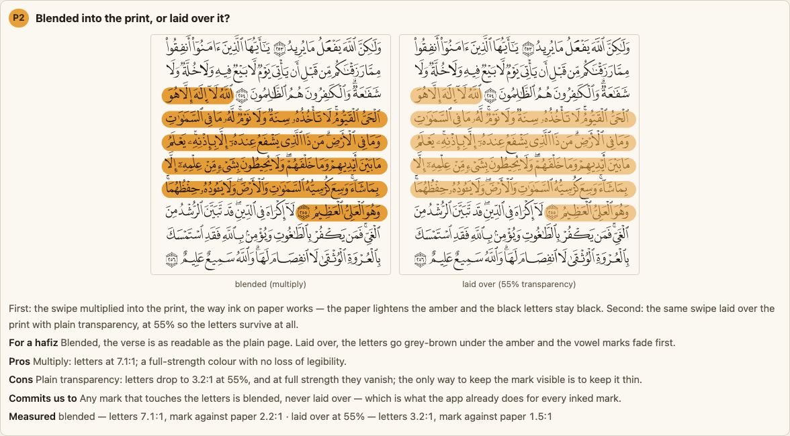
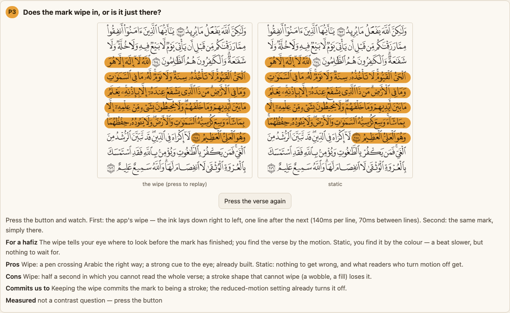
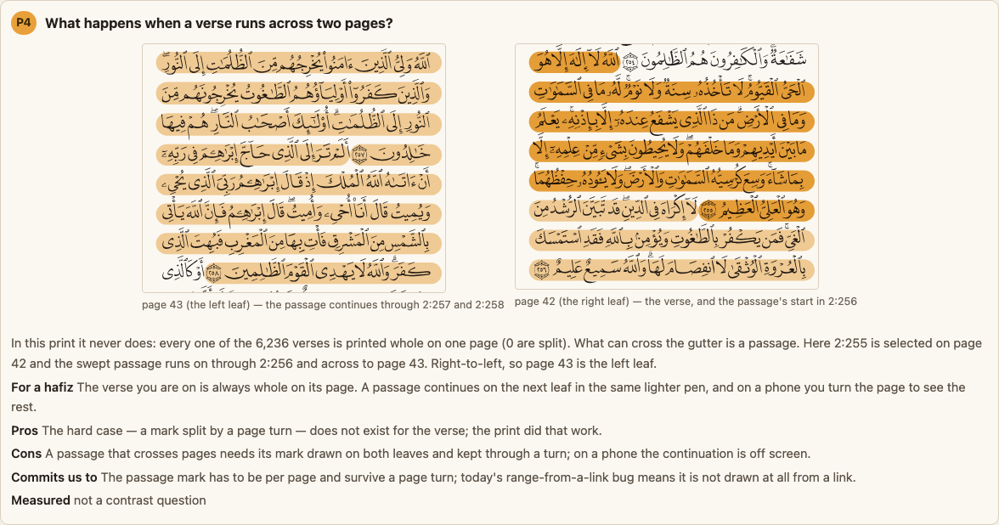
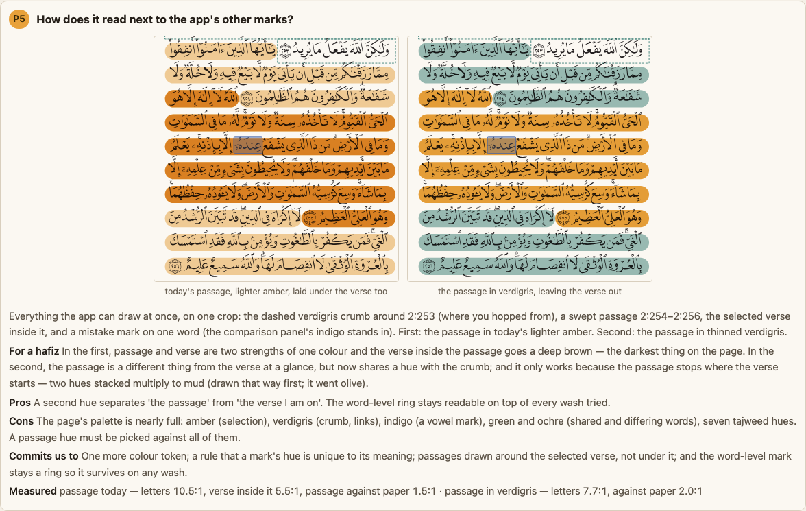
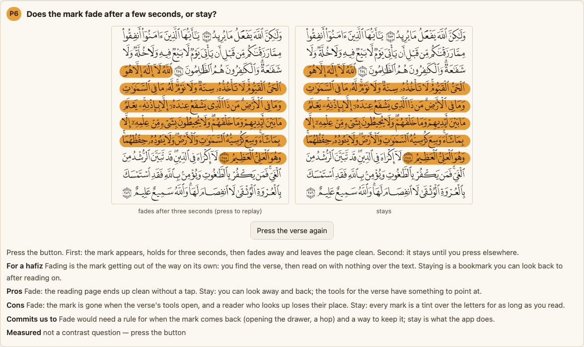
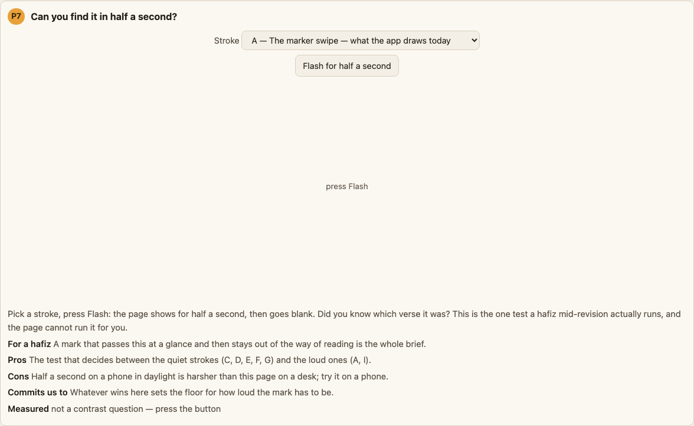

## What else could be considered, and why is it not here?

- **Recolouring the letters themselves** (Tarteel's way). Our page is printed artwork, not typed
  text; recolouring its outlines changes the print, which this app has held as something it
  does not do.
- **A pulsing mark.** The stroke already wipes in; a mark that keeps moving is a distraction on
  a page meant for long reading.
- **Fading everything that is not the verse.** The comparison panel already does this to cut a
  verse out; on the reading page it takes the next verse away from a hafiz who reads on. Left
  to the comparison panel.
- **The stroke at a lighter strength.** That is the strength menu, already decided.
- **A dark mode.** The page is paper and stays paper; if that changes, every figure here is
  stale and the blend behaves differently on a dark ground.

## What would change the answer?

- **A scholar in the room saying the amber is too loud.** That is the audience the pitch is for;
  it would move the default to a thinner stroke or to C with a bolder colour.
- **The half-second test failing for the swipe on a phone in daylight.** Then nothing quieter
  can pass either, and the answer is a darker amber, not a different stroke.
- **A reader who reports not seeing the amber.** A darker or cooler hue would clear the 3:1
  indicator floor without changing the shape — but J shows a dark hue cannot be a full-strength
  marker, so it would have to be a thinner, darker amber.
- **The tajweed skin being dropped.** Then B and H come back as candidates.

## What is this not settling?

- Which hue a passage gets — the verdigris on the page is a stand-in.
- Whether the reader-facing shape and strength menu (decided 2026-09-02) gets built, or when.
- How the mark looks for a word rather than a verse — that is word selection.
- The range-from-a-link bug; recorded above so it is not lost, and belonging in the backlog.

---

*The options page is built by `scripts/build-highlight-options.mjs`, which reads pages 42 and
43's committed verse boxes, page 42's word boxes and outlined print, the tajweed rules for surah
2, and the app's own colours, pen and rule order; the pictures are cut from it by
`scripts/shoot-highlight-options.mjs`. Nothing in either carries Qur'an text.*
