# What should the highlighter look like where two marks cross?

*Researcher A's options page, 2026-09-30. The page itself, with every shape, texture and overlap
drawn on the same real printed page at the width a phone gives it, and two of them mounted live,
is `highlight-texture-options-a.html` beside this file. On the site it is at
<https://blog.bytesofpurpose.com/hifth/docs/design/highlight-texture-options-a.html>. The sources
behind it are in [the research notes](highlight-texture-research-a.md). A second researcher is
answering the same question separately, and a third will compare the two. This page is one of two
inputs, not the decision.*

The owner asked to see shape and texture options: rough, hand-drawn marks and patches of
see-through ink that build up where two highlights cross, like a real highlighter. This page
draws them, measures them, and recommends one.

---

## The short version

- **What is being decided:** what the amber mark looks like at its edge and in its body, and what
  happens where two marks cross:
  - a verse inside a swept passage;
  - a run of words inside a verse;
  - two marks of the same colour;
  - two marks of different colours.
- **What it changes for a hafiz:**
  - **Today** a verse inside a passage turns brown, and a third mark on top turns darker again.
    Nothing says how deep you are, and the letters get harder to read with every mark.
  - **With the recommendation** the shade tells you how deep you are: one pass for a passage, two
    for a verse, three for a word run, and never more. The letters stay at 5:1 or better at every
    depth. A mark in another colour never mixes into mud; it keeps its own colour.
- **Recommended: a rough band, counted passes, and a cut-out for another colour** (the last card
  on the page, R).
  - **Shape:** today's band with a slightly hand-drawn edge (S2). The wobble is seeded from the
    verse and line, so it is the same every visit and never shimmers.
  - **Same colour:** counted passes (C7). The verse's two passes are laid a hair apart, and that
    offset is the only texture. No browser filter is needed.
  - **Another colour:** the inner mark cuts its own shape, plus a hairline of paper, out of the
    outer one (C6).
  - **Why:** it is the only mix that feels like a real highlighter (the rough edge and the doubled
    stroke) while keeping every depth above 4.5:1 for the letters, costing nothing extra to download
    and nothing extra to draw on a phone.
- **If nobody decides:** today's clean band stays, and overlaps keep going brown with no limit.

<details>
<summary><b>A few words, once</b></summary>

- **Verse (ayah)** is one numbered sentence of the Qur'an. It is what you press.
- **Passage** is several verses in a row, swept with a drag or opened from a link.
- **Word run** is a few words inside a verse, marked on their own.
- **Hafiz** is someone who has memorised the Qur'an and revises it from the printed page.
- **Vowel marks and dots** are the small signs above and below the letters that tell letters apart
  and say how a word is read. Anything drawn over a line lies over them too.
- **Pass** is one stroke of the pen. A real highlighter goes darker with every pass, because each
  layer of ink takes away more light.
- **Blended** means the mark is mixed into the print the way ink soaks into paper: the paper tints,
  and the black letters stay black. The app already does this and it is not re-asked here.
- **Contrast** is how far apart two colours are, written as a ratio. The web's accessibility
  guideline wants at least **4.5:1** between text and what it sits on, and **3:1** for a sign of
  "this is selected". The page prints both under every picture: *letters* is the black print on
  the mark, and *against paper* is the mark against the bare page.

</details>

## What was settled before, and what does this add?

Settled before, and not re-asked here:

- the mark is drawn line by line, not as one shape;
- nothing solid ever goes over the letters;
- the reader will be able to pick swipe, fill or outline, and a strength in a few named steps;
- the mark is blended into the print.

This page adds the three things the earlier page did not draw: the **edge** (clean or hand-drawn),
the **body** (flat ink or a texture), and the **overlap** (what a mark inside a mark looks like).

## What does it change for a hafiz?

A hafiz revising from the page presses a verse, often inside a passage they have swept, and
sometimes marks a few words inside that verse, such as a place they keep stumbling. Three things
matter to them, in this order:

1. **The letters stay easy to read at every depth.** Every mark on top of a mark takes light away.
   Today's pens reach 3.6:1 at the third mark, which is below the 4.5:1 floor. Counted passes stop
   at three and never go under 5.0:1.
2. **The shade says where you are.** With counted passes the passage is light, the verse is
   medium, and the word run is darkest, however the marks came to be laid down. Pressing a verse
   twice does not darken it again.
3. **Nothing on the mark looks like part of the script.** A fine speckle (T2) is the same size as
   the dots and vowel marks, and a hafiz reads those dots to tell letters apart. That texture is
   ruled out for this reason alone.

## Why is this being asked now?

- The pitch is a few verses done beautifully, and the mark is the first thing a scholar sees when a
  verse is pressed. A mark that feels like a real pen on real paper is part of the impression.
- The owner asked for it by name: rough shapes and see-through patches that build up like a real
  highlighter.
- The app already stacks marks (a verse inside a passage), and today that stack just goes brown.
  Nobody chose that by looking at it.

## What happens if nobody decides?

The clean round-ended band stays. A verse inside a passage keeps going brown-orange (5.5:1 for the
letters), and a word run inside that goes to 3.6:1, which is below the floor for text. Nothing
breaks, but it reads as a screen effect, not as a pen.

## What do others do?

The full list, with every link and whether I opened the page or only saw a search snippet, is in
[the research notes](highlight-texture-research-a.md). The load-bearing points:

- **Real highlighter ink filters light** rather than covering the paper, so passes add up and black
  stays black. The screen's multiply blend is the standard model of it. *(Fetched: MDN and the
  compositing standard.)*
- **Apps split on whether overlaps should darken.**
  - Zotero and FigJam darken on purpose: the darker overlap shows you marked twice. *(Fetched.)*
  - GoodNotes users have asked since 2018 for overlaps *not* to darken. *(The feedback thread was
    fetched; GoodNotes' own help pages were seen only as snippets.)*
  - Hypothesis, a web annotator, gives nested highlights one fixed darker shade and stops there.
    I read this in its source code. *(Fetched.)* This is the closest thing to counted passes.
  - Procreate's "glaze" brushes treat one stroke as one shade however often it crosses itself, and
    only a new stroke darkens. *(Fetched.)*
  - Kindle merging overlapping highlights, and Notability's option to go back to the old look, are
    *snippets only*. I did not open Apple Books or Freeform, and say so.
- **Hand-drawn libraries cost bundle space we do not have.** The app has about 16 KB left under its
  size budget.
  - Rough.js is 8.9 KB compressed, and trimming it to the parts we would use does not shrink it.
  - perfect-freehand is 2.0 KB.
  - rough-notation is 3.8 KB, plus Rough.js.

  I measured the first two myself. A seeded wobble written by hand costs a few hundred bytes.
- **Browser filters (the rough-edge and grain tricks) cost real time on phones**, especially on
  Safari, and they redraw whenever the page moves. *(Two performance write-ups fetched. The claim
  that Safari handles CSS filters differently from SVG filters is a snippet.)*

## The shapes, side by side

All six keep the same colour and strength, so the letters measure the same, 7.1:1, on every one;
only the outline changes. The pros and cons below were written after drawing and looking.

| | What it is | For | Against | What it commits us to |
| --- | --- | --- | --- | --- |
| **S1** | Today's clean round-ended band | Known, crisp, costs nothing | Reads as a screen effect, not a pen | Nothing new |
| **S2** | The same band with a wobbly edge, seeded from the verse | Looks hand-drawn at reading size; same every visit; a few hundred bytes | The first try (a wobble of about 1 unit) could not be seen on a phone; it needs about 1.5 | A small outline routine in the shared drawing code, and a test that the same verse always gets the same edge |
| **S3** | A ragged edge made by a browser filter | The most "torn paper" or crayon look | Jagged steps on the edge; frays reach into the gap between lines; a filter redraws on every move and is slow on phones | A filter on every mark, and a performance check on Safari |
| **S4** | A taller, blotchier patch per line | Looks most like a quick swipe | The patches nearly touch, so the lines merge into one block and the line rhythm a hafiz reads by is lost | A patch shape that has to be kept short of the next line |
| **S5** | A pressure stroke, thin at the ends | Looks like a brush | It thins the mark over the first and last words of each line, which is exactly where a verse starts and ends mid-line. A one-word line becomes a lozenge | Handling for short lines, or a floor on the taper |
| **S6** | A chisel tip: square band, slanted ends | Crisp, clearly a marker, costs nothing | Less hand-drawn than S2; the slant has to face the reading direction | A fixed slant, right-to-left |

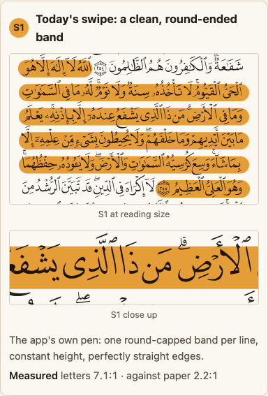
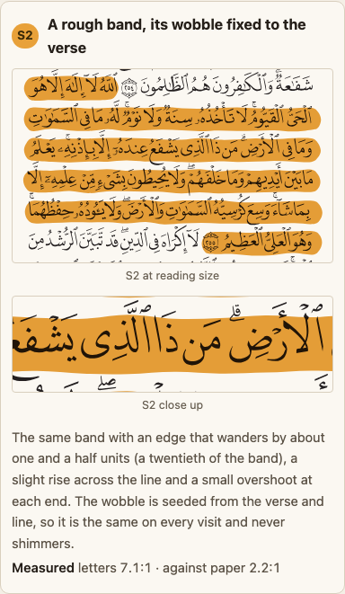
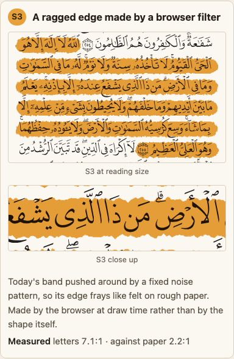
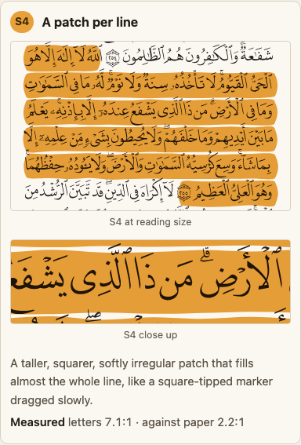
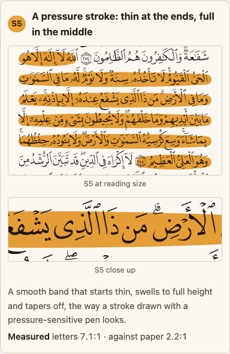
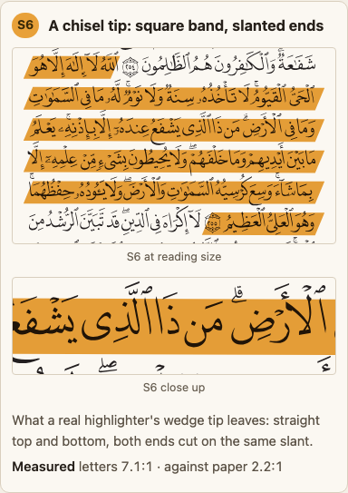

**What I saw.**

- **S1** is the familiar clean band; it covers the vowel marks above and below the line, as every
  shape does.
- **S2** now shows its wobble at reading size: the top and bottom edges rise and fall a little along
  each line, and the ends overshoot. At the first strength I tried, it looked identical to S1 until
  I zoomed in.
- **S3** frays visibly, like torn paper, but the edge is jagged in steps and the frays poke into
  the white between lines.
- **S4** turns the verse into a single slab.
- **S5** thins over the verse's first and last words.
- **S6** reads well, crisp and marker-like.

## The textures, side by side

| | What it is | Letters (thinnest / fullest) | For | Against | What it commits us to |
| --- | --- | --- | --- | --- | --- |
| **T1** | Flat ink | 7.1:1 | Cleanest, costs nothing | No texture at all | Nothing |
| **T2** | Fine grain: the ink thins in a fixed speckle | 9.8 / 7.1 | Clearly "ink on paper" | The speckle is the same size as the dots and vowel marks, so it competes with the script. Against paper it drops to 1.6:1 where it is thinnest | A filter on every mark; a risk for a hafiz |
| **T3** | Two passes, streaked | 8.7 / 5.6 on the stripe | A real double stroke | A darker stripe runs along the letters' bodies; looks a little like a ribbon | The mark becomes two strokes |
| **T4** | Pooled and dry: heavy where the pen lands, thinner as it runs | 7.1 / 9.6 at the dry end | The pen's direction shows | The rim reads like an app's rounded button, not ink | A gradient per line, which must run right to left |
| **T5** | Fibre: the ink thins in long streaks along the line | 9.0 / 7.1 | The most convincing felt-tip look; the streaks run along the line, so they do not look like dots | Still a filter, so still the phone cost | A filter on every mark, and a Safari check |

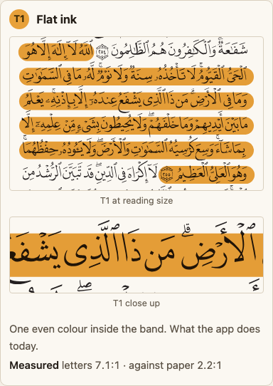
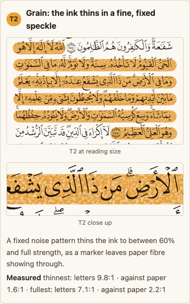
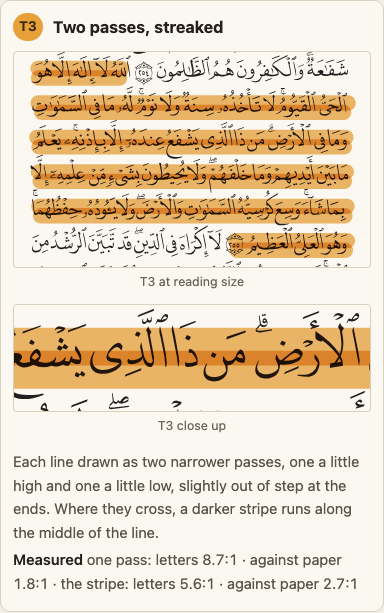
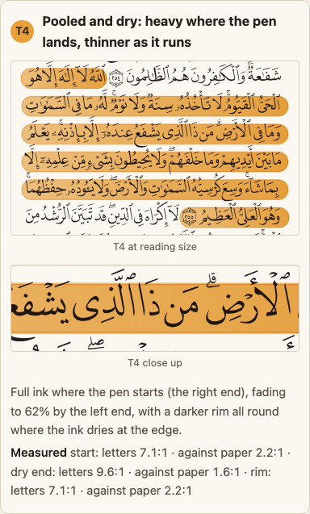
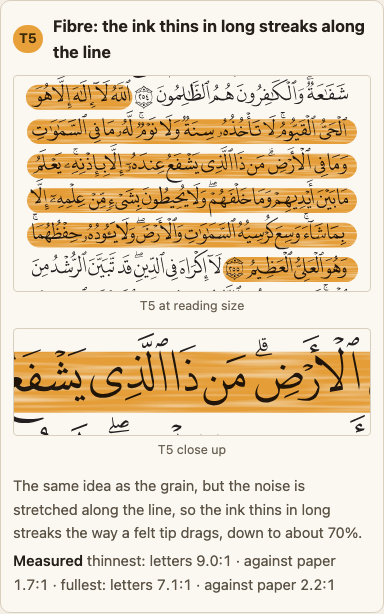

**What I saw.**

- **T2's speckle** is visible at reading size, and it is the size of a dot. That was the finding.
- **T5**, added after seeing T2, stretches the same noise along the line. Close up it looks like
  wood grain or a felt tip dragging, and at reading size it reads as streaky marker, not as dots.
  It is the best-looking texture on the page. It is not in the recommendation only because every
  filter costs time on a phone.
- **T3's** darker centre stripe sits right on the letters' bodies.
- **T4's** dry end shows, but its rim looks like part of the app, not like ink.

## The overlaps, side by side

Each option is drawn twice: a verse inside a swept passage, and a run of six words inside the
verse.

| | What it is | Verse in passage (letters) | Word run (letters) | For | Against | What it commits us to |
| --- | --- | --- | --- | --- | --- | --- |
| **C1** | Plain see-through stacking, with no blend | 2.2:1 | 1.7:1 | Simplest | Greys the letters, and fails even for a verse alone (3.2:1) | Ruled out; listed as the baseline |
| **C2** | Today's two pens, multiplied | 5.5:1 | 3.6:1 | What ships today | Goes brown, and the word run fails the text floor | Nothing new, and no ceiling |
| **C3** | One pen at 60%; every mark is one more pass | 6.7:1 | 5.0:1 | The physical highlighter taken literally; the two rough edges do not line up, which looks real | A verse alone is one faint pass (1.6:1 against paper) and hard to see | The verse's look depends on what else is marked |
| **C4** | Strength levels: the strongest mark wins, nothing stacks | 9.0:1 | 7.1:1 | Letters always clear; clean steps | No build-up at all, which is the thing the owner asked for | A fixed strength per kind of mark |
| **C5** | Two different colours, multiplied | 3.6:1 | 3.6:1 | Each mark keeps a colour | Mixes into muddy olive, and both overlaps fail the text floor | Ruled out |
| **C6** | The inner mark cuts a hole in the outer, with a hairline of paper | 7.1:1 | 7.6:1 | Every colour stays its own; nothing ever stacks | No build-up: fine across colours, wrong within one colour | A cut-out step for any mark of another colour |
| **C7** | Counted passes: passage one, verse two, word run three, never four | 6.7:1 | 5.0:1 | Builds up like a real highlighter, but the shade says how deep you are, not how often you pressed; every depth stays above 4.5:1 | A verse on its own is drawn as two passes even though nothing is under it | A pass count for each kind of mark, and a hard stop at three |

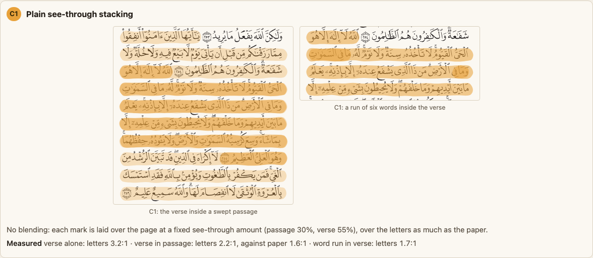
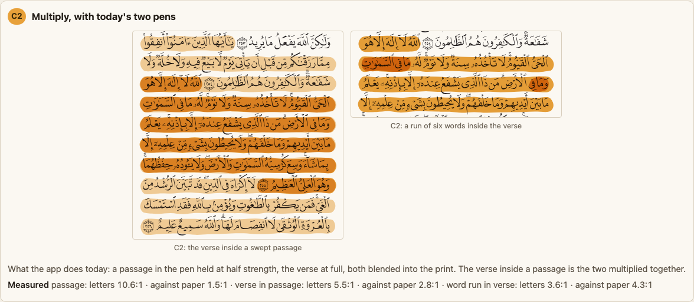
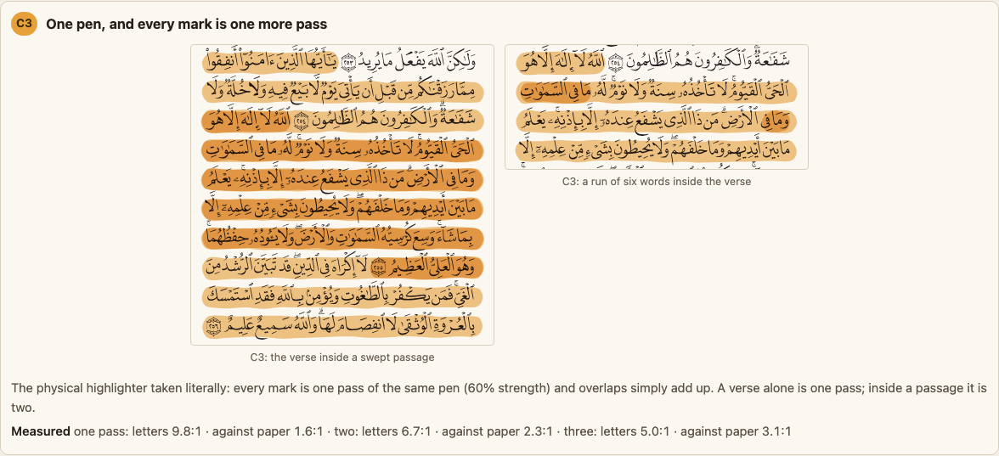
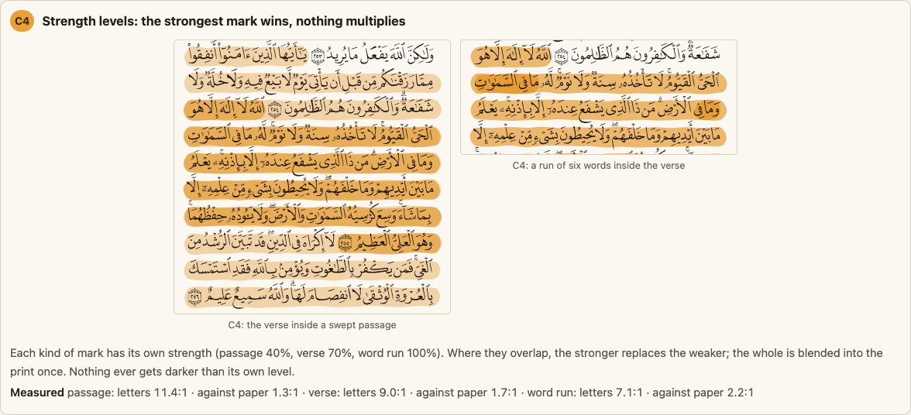
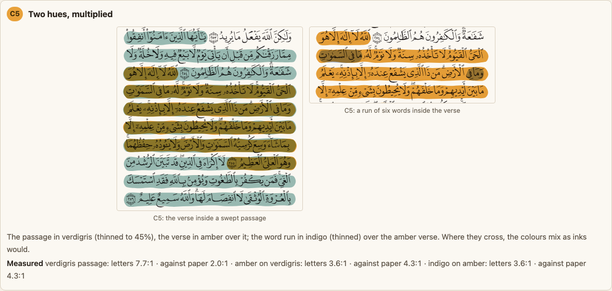
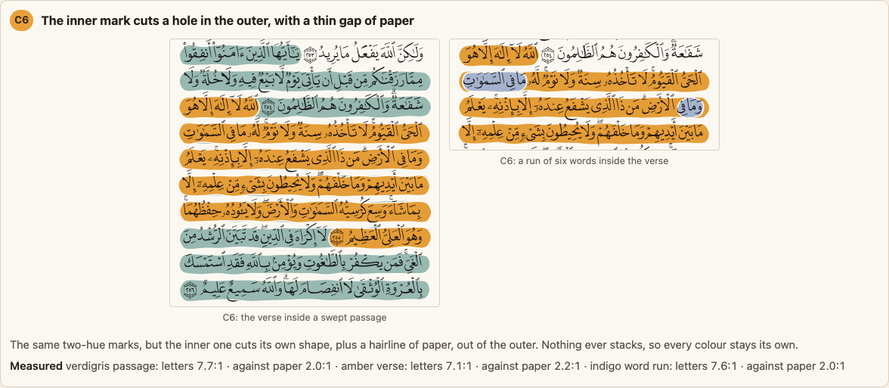
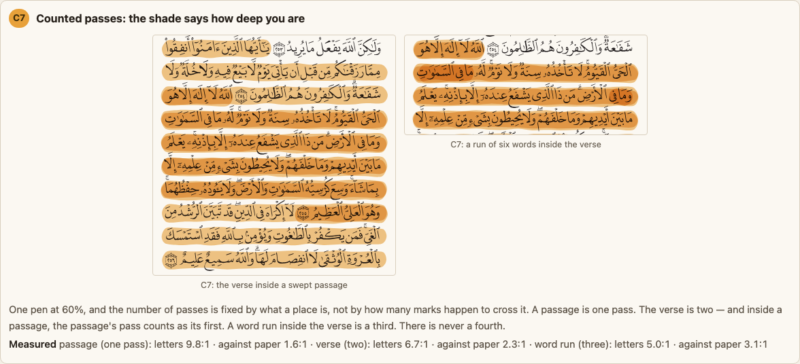

**What I saw.**

- **C1** greys every letter it touches.
- **C2** goes brown-orange.
- **C3** looks the most like a real page, but its verse alone (the right picture) is so faint that
  a hafiz would miss it.
- **C4** is tidy and lifeless.
- **C5** goes olive.
- **C6** keeps three clean colours with a thin white seam between them.
- **C7** shows three clear steps of depth, and the verse's two offset passes give the edge a
  doubled, hand-laid look.

## What only reads when it moves?

- **L1, the wipe.** Press the button to lay the mark down again. Today's swipe and the rough band
  wipe in at the same speed, right to left, line by line. Both look natural, and the rough band
  loses nothing by being revealed rather than drawn. Motion is off for readers who ask their phone
  for less of it.
- **L2, another pass.** Each press lays one more pass over the verse.
  - The left picture is counted: it stops at the verse's depth.
  - The right picture is uncounted: every press darkens it.

  At three passes the letters are 5.0:1; at four, 3.9:1, which is below the floor. Pressing it
  yourself is the quickest way to feel why the count needs a ceiling.

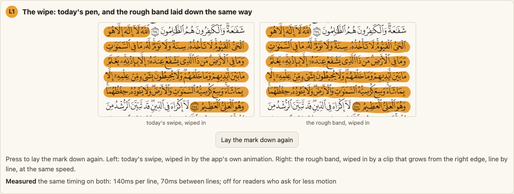
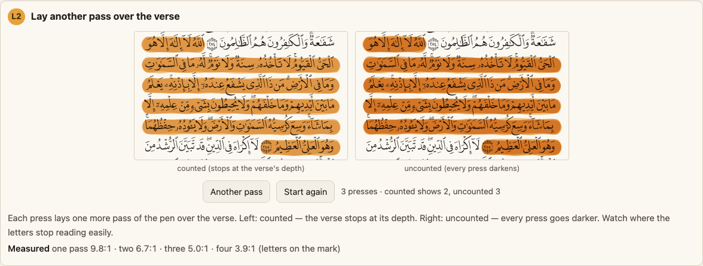

## What if the reader asks the phone for more contrast?

**A1.** None of the washes reaches 3:1 against the paper on its own; a highlighter is meant to be
light. When the phone's accessibility setting asks for more contrast, a firm burnt-amber line
under each line of the mark clears 6.1:1 against the paper, and the wash itself is unchanged.
This works under any of the options above.

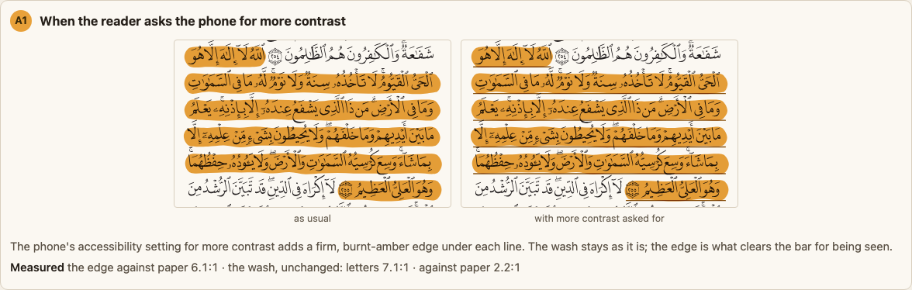

## The recommendation, drawn

**R** is the rough band (S2), counted passes (C7), and a cut-out for another colour (C6), drawn
four ways:

- a verse alone;
- a verse inside a passage;
- a word run of the same colour;
- a word run in another colour.

The last picture is the same card shot at phone width.

| Depth | Letters | Against paper |
| --- | --- | --- |
| Passage (one pass) | 9.8:1 | 1.6:1 |
| Verse (two) | 6.7:1 | 2.3:1 |
| Word run (three) | 5.0:1 | 3.1:1 |
| Word run in another colour | 7.6:1 | 2.0:1 |

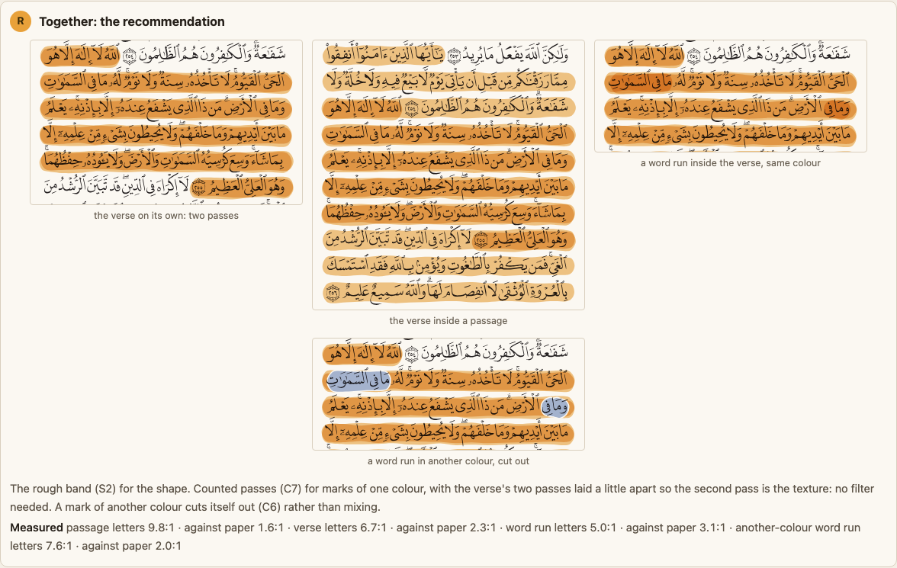
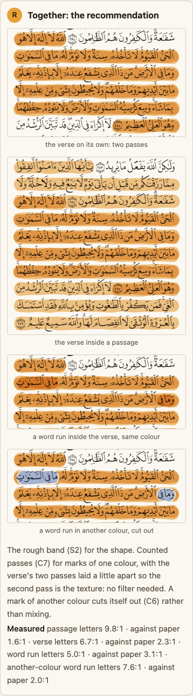

**What I saw.**

- At phone width all four pictures read.
- The verse alone looks hand-laid rather than drawn by a computer.
- Inside a passage the verse steps up cleanly from the pale passage around it.
- The indigo word run sits in its own clean hole.
- **The same-colour word run is the weakest step.** Going from two passes to three is visible but
  modest at reading size. If a word run has to stand out at a glance, it may need the other
  colour, or a firm edge.

## What did only the build turn up?

None of these were in the research, and each changed the design.

1. **Cutting or trimming a mark cut it off from the print.** When a group of marks carries a
   cut-out, a clipping edge or a filter, the browser draws that group on its own first, so the
   blend that lets the letters show through had nothing to blend with. The mark painted solid
   amber over the letters.
   - It happened on both the cut-out overlap and the rough band's wipe.
   - The fix is to put the blend on the same element as the cut-out or clip.
   - Any real build of this needs a test that looks at the pixels of a letter under a masked mark.
2. **A wobble small enough to be tasteful cannot be seen on a phone.** About 1 unit of wobble
   looked identical to the clean band at reading size. It took about 1.5 units, a twentieth of the
   band's height, to read as hand-drawn.
3. **A fine grain is the same size as the script's dots and vowel marks.** For most text that is
   harmless. For a hafiz, who reads those dots to tell one letter from another, it is noise in
   exactly the wrong place. Stretching the grain into streaks along the line (T5) avoids it.

The build also showed that:

- multiplying two different hues fails the text floor (C5);
- a taper thins exactly the start and end of a verse that begins or ends mid-line (S5);
- patches merge the lines (S4);
- a passage has to be one stroke per line, or the round ends bump where two of its verses share a
  line;
- a rough band has no stroke to "draw", so its wipe has to be a growing reveal instead.

## What else could be considered, and why is it not here?

- **Rough.js, rough-notation or perfect-freehand.**
  - Rough.js would use over half of the space left under the size budget, to do what a few hundred
    bytes of our own code does.
  - rough-notation needs Rough.js as well.
  - perfect-freehand is small, but it draws pressure strokes (S5), and S5 thins the verse's ends.
- **A scanned highlighter texture image.** It would have to stretch or tile across lines of every
  length, and it costs download size for every page. It was not tried.
- **Colour-per-depth instead of passes.** This is C4 with different hues. It has C5's problem
  wherever two hues meet, or C6's cut-outs everywhere.
- **Letting the reader turn texture on.** This belongs to the reader-facing menu that is already
  decided but not yet built, not to this choice.

## What would change the answer?

- **Safari on a mid-range phone drawing T5 with no stutter while the page turns.** Then the fibre
  texture could join the recommendation, and it is the best-looking texture.
- **A scholar finding the rough edge unserious** next to a printed Qur'an. Then the recommendation
  becomes the chisel (S6) with the same counted passes.
- **Word runs needing to stand out at a glance.** Then a word run gets the other colour by default
  (C6), not a third pass.
- **The comparison with the second researcher** turning up an app or a source that contradicts
  the snippet-only claims (Kindle, Notability, GoodNotes' help, Safari's filter handling).

## What is this not settling?

- Which second colour a passage or word run uses. The verdigris and indigo on the page are stand-ins.
- Whether or when the reader-facing menu of shape and strength gets built.
- The mark for the tajweed look, which tints verses by rule.
- How any of this is coded in the app. The page is a drawing, not the app.

## What did I assume?

- The pass strength is 60%, chosen so that three passes stay above 4.5:1. A different strength
  moves every number in the counted-pass table.
- "Rough" means a slightly hand-drawn edge, not a sketchy multi-line scribble. A scribble would lay
  extra lines over the letters, and the earlier decision rules that out.
- Word runs are marked by the reader, not by the app.
- A phone at 358 units wide stands in for every phone.
- The page is drawn on page 42 of the print, with Ayat al-Kursi and the verses either side of it,
  because the earlier page used the same one.
- I judged Safari's filter cost from the write-ups, not by measuring it on a device.

## Where is the code?

- `scripts/build-highlight-texture-options-a.mjs` builds `docs/design/highlight-texture-options-a.html`.
  - It reads page 42's committed verse boxes and outlined print, and the pen's line geometry from
    `packages/core` (`swipesFromPath`, `rectsFromPath`, `pageLineHeight`).
  - It measures every contrast figure itself, with the same arithmetic as the earlier options page.
  - It refuses to write if any Arabic text or `<text>` element would end up in the page.
- `scripts/shoot-highlight-texture-options-a.mjs` cuts one PNG per option into
  `docs/design/highlight-texture-options-a/`, plus `phone.png` for the recommendation at 390 wide.
- Rebuild both with:

  ```
  node scripts/build-highlight-texture-options-a.mjs
  node scripts/shoot-highlight-texture-options-a.mjs
  ```

- The blending fix is in `layer()` in the build script: the blend sits on the same element as any
  mask, clip or filter.
