# Could the mark look like a real highlighter: rough at the edges, and darker where two marks stack?

*A decision record, open, from researcher B. The drawn page, with every shape, texture and
stacking rule on the same real page of the print at phone width and three of them live, is on
the site at <https://blog.bytesofpurpose.com/hifth/docs/design/highlight-texture-options-b.html>
and checked in beside this file. The sources, and which ones I actually read, are in
[the research notes](highlight-texture-research-b.md). Look at the page first, on a phone if you
can.*

The owner asked to see more shapes and textures for the mark: a rough, hand-drawn look, and
see-through patches that build up into a darker double highlight where two marks overlap, the way
a real highlighter does on paper. This record draws five shapes, four textures and six rules for
what happens where one mark sits inside another, measures each, and says which I would take.

---

## The short version

- **What is being decided:** three things. What **shape** the mark's edge has (clean, rough,
  ragged, a patch, a chisel stroke). What the **ink** looks like (flat, grainy, streaked, drying
  out). And what happens **where one mark lands inside another**: a verse inside a passage, or a
  few words inside a verse.
- **What it changes for a hafiz:**
  > When you revise a passage and press one verse in it, you should see *both* at once: the
  > passage you are working through, and the verse you are on, darker inside it, with every letter
  > still black. And if you mark a few words inside that verse (a slip you keep making), they go
  > one step darker again. Three levels of the same pen, never a muddy colour, never greyed letters.
  > The rough edge is character; it must never blur where a verse ends.
- **Recommended:**
  1. **Stacking: each mark is one more pass of the same half-strength pen** (option C3). A passage
     is one pass, a verse inside it two, a word run inside that three. Within one mark its own
     pieces never double. This is how real highlighter ink and the careful drawing apps behave,
     and letters stay at 8.4:1 where the verse sits inside the passage.
  2. **Shape: the rough band, seeded per verse** (S2), offered as the "hand-drawn" choice beside
     today's clean swipe. It costs under 1 KB of our own code rather than 9 KB for a library, and
     the same verse is drawn by the same hand every time, so the mark stays learnable.
  3. **Texture: none on the phone for now.** Keep the ink flat. Grain is the only texture worth a
     second look, and only once it has been tried on a real iPhone.
  4. **Fix the pinch whatever else is chosen:** join the pieces of each line into one band per
     mark (see "What does the app do today?").
- **Why now:** the owner asked, and the pitch shows a verse inside a passage within the first
  minute. That is exactly where today's mark stacks.
- **If nobody decides:** the app keeps today's clean swipe and today's stacking, which reads well.
  The verse inside a passage goes a warm dark orange-brown, and there is a small notch of paper at
  every verse boundary inside a passage.

Everything below is the long version.

<b>A few words, once</b>

- **Verse (ayah)**: one numbered sentence of the Qur'an. It is what you press.
- **Passage**: several verses in a row that you swept across, or opened from a link like
  "2:254 to 2:256".
- **Word run**: a few words inside one verse, marked on their own.
- **Hafiz**: someone who has memorised the Qur'an and revises it from the printed page.
- **Mus'haf**: the printed Qur'an. The app shows real printed pages, and the mark is drawn over
  the print.
- **The swipe**: today's mark: a round-ended amber band along each line of the verse.
- **Blended (multiply)**: the mark is mixed into the print the way ink soaks into paper. Paper
  takes the colour; black letters stay black; two layers of the same ink go darker in the same
  colour. The other way, **laid over**, puts a see-through sheet on top, which greys the letters.
- **A pass**: one stroke of the pen over a spot. Two passes over the same spot is a double
  highlight.
- **Contrast**: how far apart two colours are, as a ratio. The web's accessibility guideline asks
  for at least **4.5:1** for text and **3:1** for a sign that something is selected.

## What is being decided?

Three questions. They can be answered separately, but the third matters most for a hafiz.

1. **What shape does the mark's edge have?** Today's clean band, or one that looks drawn by hand.
2. **What does the ink look like?** Flat, as today, or with some texture to it.
3. **Where one mark sits inside another, what does the overlap look like?** This is the "double
   highlighted sections" part of the request.

## What does this change for a hafiz?

**A hafiz revises by portions: a quarter, a page, a few verses. Inside that portion there is the
verse they are on, and inside that the words they keep getting wrong.** Today the app can show a
passage and a verse, but it has no deliberate rule for how they combine; the look falls out of how
the pieces happen to be drawn. A clear rule lets the page answer three questions in one glance:
*what am I revising, where am I, and where do I slip?* That is the whole value. The rough edge and
the texture are about feel: the mark looking like a pen someone held, not a box a computer drew.
Feel matters for the pitch, but it must never cost legibility or blur a verse's end.

## Why is this being asked now?

The owner asked for it directly after seeing the first options page, and the demo for The Study
Quran team opens a passage and presses a verse inside it early on. That is the moment the stacking
rule shows.

## What happens if nobody decides?

Nothing breaks. The app keeps the clean swipe and today's stacking, which is readable (letters at
6.3:1 where the verse sits inside the passage). The costs are the pinch described below, and a
double highlight that no one chose by looking.

## What does the app do today, and what is it costing?

Today's mark is a round-ended amber band per line, blended into the print. A passage uses the same
amber at half strength. The app draws **each verse of a passage as its own separate piece**, and
the selected verse as another piece on top.

Two things the drawn page showed that nobody had chosen:

- **The pinch.** Where two verses of a passage share a line, their two round ends meet and leave a
  small notch of paper between them, right at the verse number. It is visible in the close-up below,
  on the line where one verse ends and the next begins.
- **The stack is set by accident.** The verse inside a passage is full-strength amber over
  half-strength amber: a warm dark orange-brown. It reads, but it is a result, not a rule; add a
  third level and there is nothing that says what it should look like.

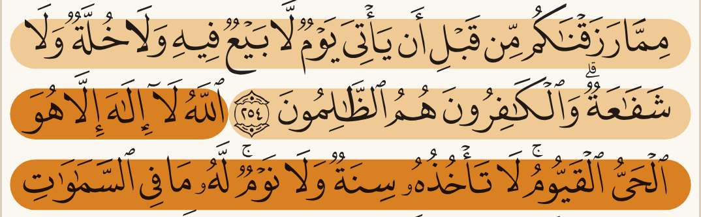

## What do other people do about this?

In short (full list, with which pages I read and which I only saw summarised, in
[the research notes](highlight-texture-research-b.md)):

- **Physics:** highlighter ink is a transparent dye. Layers multiply the light they let through,
  so a second pass goes darker in the same colour. The screen's multiply blend is exactly that
  sum. *(Read: Wikipedia on subtractive colour and on the Beer-Lambert law; the W3C blending
  spec.)*
- **Apps that darken on overlap:** GoodNotes, FigJam, Zotero. Users are split: a GoodNotes request
  to turn it *off* has about 261 votes, and a Zotero user says it makes text harder to read.
  *(Read.)*
- **Apps that darken only across separate strokes, never within one:** Procreate's glazed
  brushes, Apple's PencilKit ("as if the inks were still wet"), tldraw's two-pass highlight, the
  SaneNotes design. This is option C3. *(Read.)*
- **Apps that merge overlapping marks into one:** Apple Books (read, but second-hand, through
  another project describing it) and Kindle (**snippet only**).
- **Hand-drawn look:** Excalidraw learned that a rough shape redrawn at random looks different
  every time you open the file, and fixed it by giving each shape a fixed seed. *(Read.)*
- **Qur'an apps:** none I found stacks marks; they tint a verse or its number, one at a time.
  *(One read; the rest snippet only.)*

## What have we already decided that constrains this?

- **A mark is drawn per line, never one box round the whole verse.** Every option here is per line.
- **The reader chooses the mark's shape among the swipe, a fill and an outline, and its strength
  in a few named steps** (decided 2026-09-02, not yet built). A rough band would be a fourth shape
  on that menu, or the swipe's hand-drawn variant; it does not reopen the choice.
- **Nothing solid goes over the letters.** Every option here keeps them readable.
- **No Qur'an text in the public build.** The drawn page carries the print as shapes only, no
  typed Arabic.

## The options, drawn

Every picture is the same verse inside the same passage on the same page, at phone width. The
figures are measured the same way on every card: the **letters under the mark** against the
paper under the same mark, and the **mark against bare paper**.

*A note on the numbers: today's swipe measures 7.9:1 here. The earlier options record printed
7.1:1 for the same swipe because it put black letters on the mark's colour without the mark over
the letters too. Blended ink darkens both, so 7.9:1 is the truer figure.*

### What shape could the mark be?

| | What it is | Pros | Cons | What it commits us to |
| --- | --- | --- | --- | --- |
| 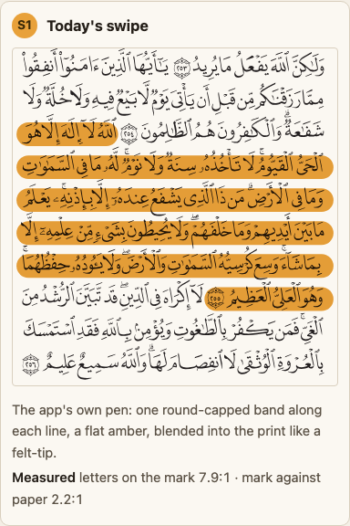 **S1 Today's swipe** | Round-ended band per line. 7.9:1 letters, 2.2:1 against paper. | Clean, tested, already in the app. | Looks computer-drawn. Not what was asked for. | Nothing. |
| 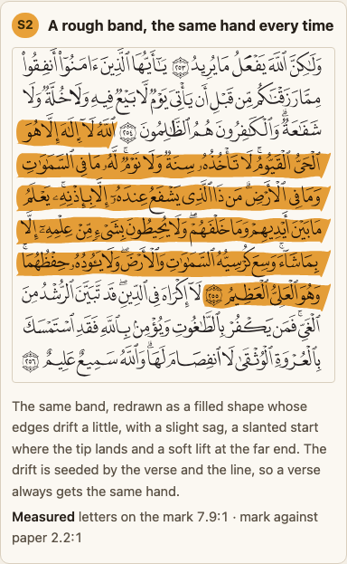 **S2 A rough band** | The same band, with edges that drift, a slight sag and tilt, a slanted start where the pen lands and a soft lift at the far end. Same hand every time for the same verse. | Genuinely reads as hand-drawn. Under 1 KB of our own code. Keeps the swipe's size, colour and contrast. Stable per verse, so it can be learned. | The far-end lift sits beside the verse number; its shape needs care. A second outline to keep honest on every page. | A fourth shape on the reader's menu (or a variant of the swipe), and the seeded-randomness code. |
| 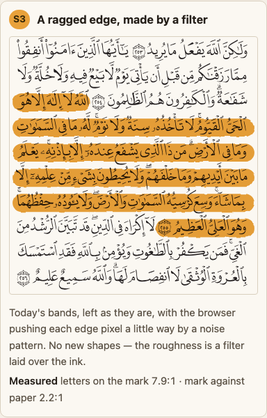 **S3 A ragged edge, by filter** | The swipe run through a noise filter that tears its edges. | Looks like felt tip on rough paper. The letters are untouched. | Filters are slow on phones, and one iPhone report shows a filter plus blending drawn as a solid block. A filter on a level line vanishes in two browsers unless set up carefully. | Filter code on the mark, and testing on real iPhones before shipping. |
| 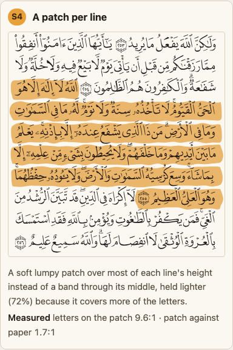 **S4 A patch per line** | A soft, lumpy shape covering most of each line, held lighter (72%). 9.6:1 letters, 1.7:1 against paper. | Very readable letters. Soft. | Reads more like a sticker than a pen. Lines nearly touch, so a multi-line verse becomes one blob. Too faint against paper. | A weaker selected sign than the 3:1 guideline. |
| 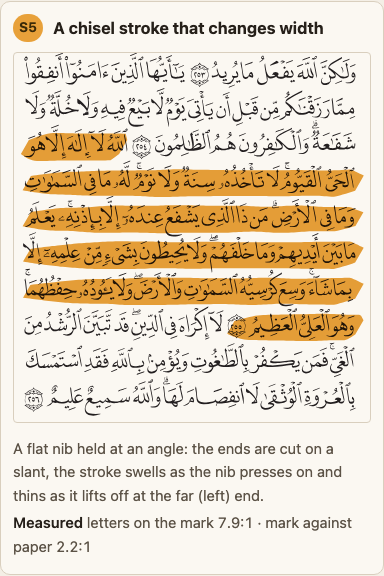 **S5 A chisel stroke** | A flat nib held at an angle: slanted ends, swelling as it lands, thinning as it lifts. | Most like a real chisel-tip highlighter. No filter. | Thins at the far end, which is where the verse ends. Harder to keep even on short lines. | A variable-width outline per line. |

### What could the ink itself look like?

| | What it is | Pros | Cons | What it commits us to |
| --- | --- | --- | --- | --- |
| 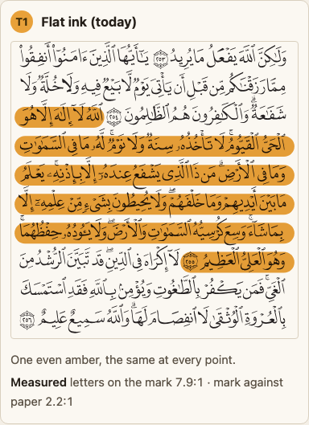 **T1 Flat ink** | Today. | Clean, fast, predictable. | No texture. | Nothing. |
| 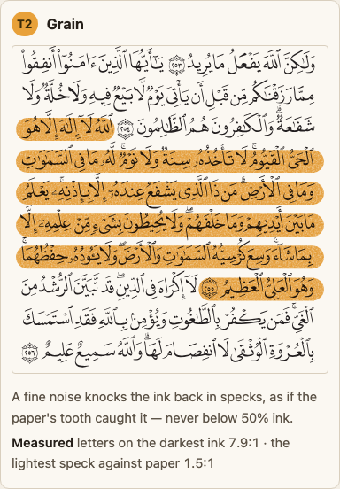 **T2 Grain** | Fine speckle in the ink; the lightest speck never drops below half strength (1.5:1 against paper). | At phone density it reads as a pleasant paper tooth. Subtle. | Almost invisible on a desk screen at normal size. A filter, with the same phone costs as S3. | Filter code and real-iPhone testing. |
| 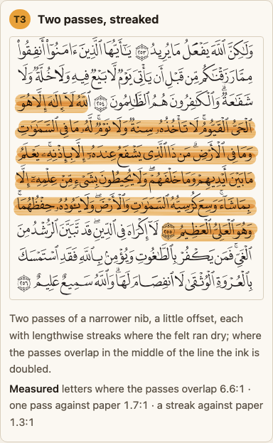 **T3 Two streaked passes** | Two passes, each streaked. 6.6:1 letters where both overlap; one pass alone 1.7:1, a streak 1.3:1. | Looks like a pen gone over twice. | Reads as a shiny tube or ribbon. The light seams cut across the tails of letters. Busy. | Not recommended. |
| 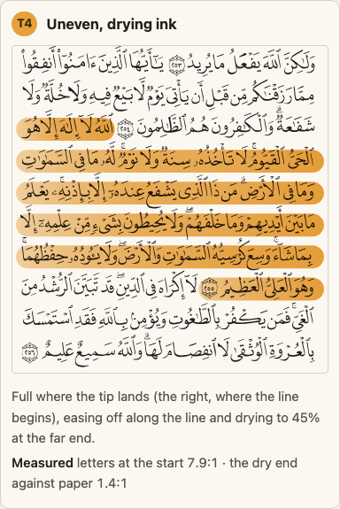 **T4 Uneven, drying ink** | Each line fades as the pen runs dry, to 45% at its far end (1.4:1 against paper). | Very physical. | **Every line is palest at its end, so the verse is palest exactly at its own number**, the place a hafiz checks. Six bars heavy on one side. | Not recommended. |

Close-ups at three times the size, where texture shows:
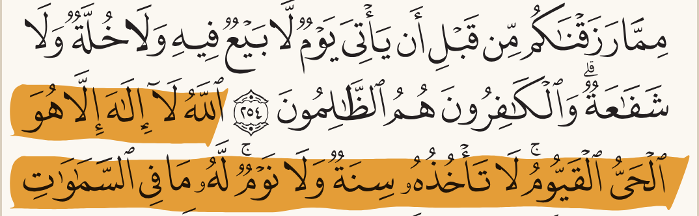
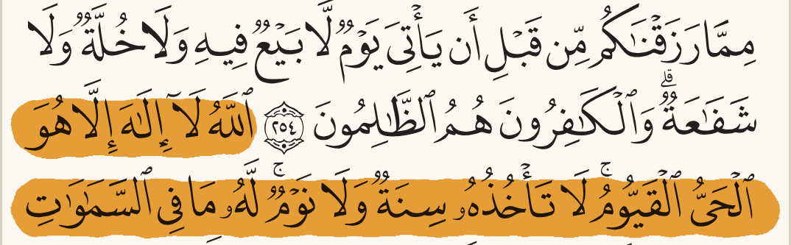
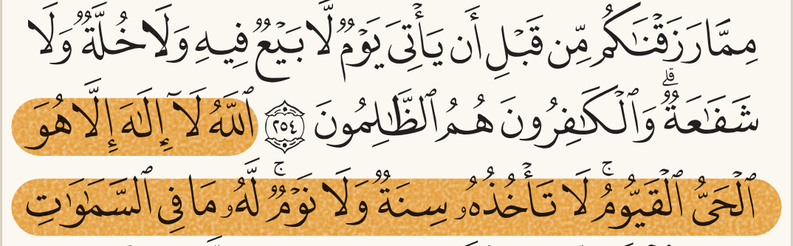
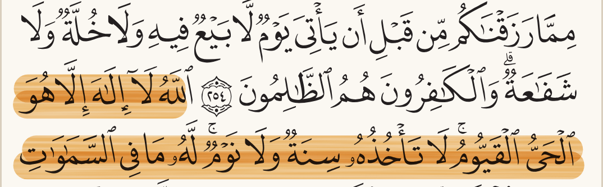

### What happens where one mark lands inside another?

Each rule is drawn twice: a verse inside a passage (left in each picture), and a few words inside
the verse (right). The numbers are passage scene first, then words scene.

| | What it is | Pros | Cons | What it commits us to |
| --- | --- | --- | --- | --- |
| 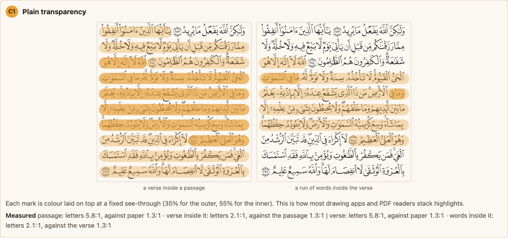 **C1 Plain transparency** | Marks laid over as see-through sheets. Verse letters **2.1:1**. | Simple. | Letters go grey and faint. Fails the text guideline badly. | Rejected. |
| 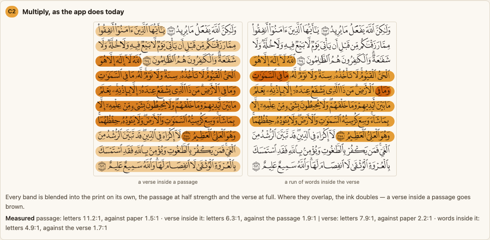 **C2 Today (multiply, piece by piece)** | Passage at half, verse at full, blended. Verse letters 6.3:1, verse against passage 1.9:1. Words inside the verse 4.9:1. | Already built. The verse stands out clearly. | The pinch at verse boundaries. A dark orange-brown that nobody chose. The word run inside the verse gets close to the text floor. No rule for a third level. | Keeping the look as an accident of drawing order. |
| 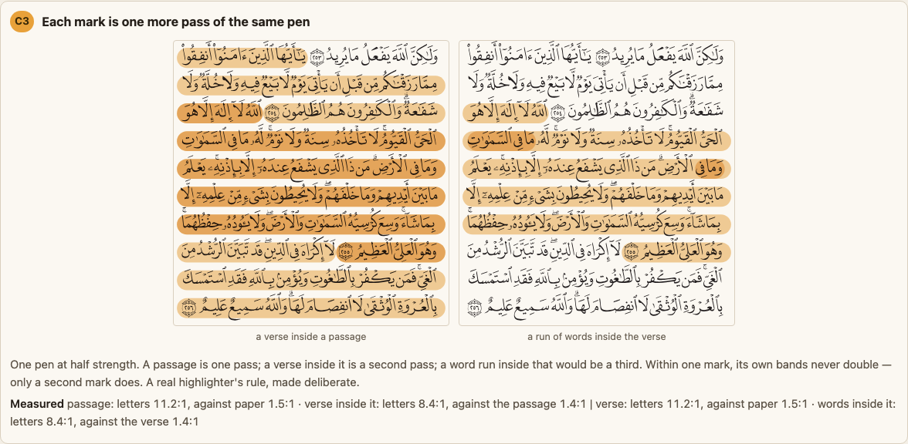 **C3 Each mark is one more pass of the same pen** | One half-strength pen. A passage is one pass, a verse inside it a second, words inside that a third. A mark's own pieces never double. Verse 8.4:1, against passage 1.4:1; words 8.4:1, against verse 1.4:1. | Physically honest: what the owner described. Letters stay well above the floor at every level. Works for any number of levels. Matches Procreate, PencilKit, tldraw. | The step between levels is gentle (1.4:1): a verse on its own looks like today's passage, lighter than today's verse. | Drawing each mark as one layer, and a verse on its own becoming lighter than today, unless it is given two passes when it stands alone. |
| 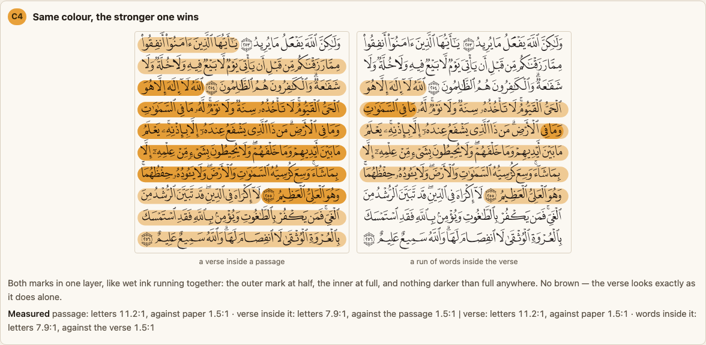 **C4 Same colour, the stronger one wins** | The inner mark simply replaces the outer where they overlap; no build-up. Verse 7.9:1, against passage 1.5:1. | A verse looks the same inside a passage or alone. Matches the browser's own highlight rules. | **Nearly identical to C3 at two levels.** It is not the "double highlight" asked for. A third level needs a third strength chosen by hand. | A fixed ladder of strengths. |
| 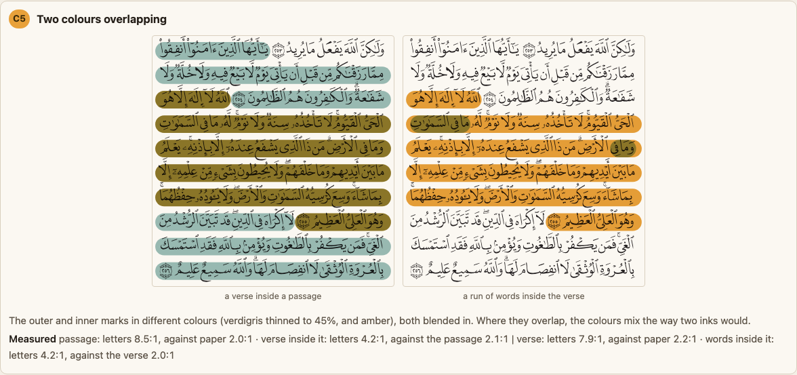 **C5 Two colours** | Passage in green-blue, verse in amber, both blended. Verse letters **4.2:1**, against passage 2.1:1. | The strongest difference between levels. | The overlap goes a muddy olive, and letters fall below the text floor. Clashes with the tajweed colours. | Rejected. |
| 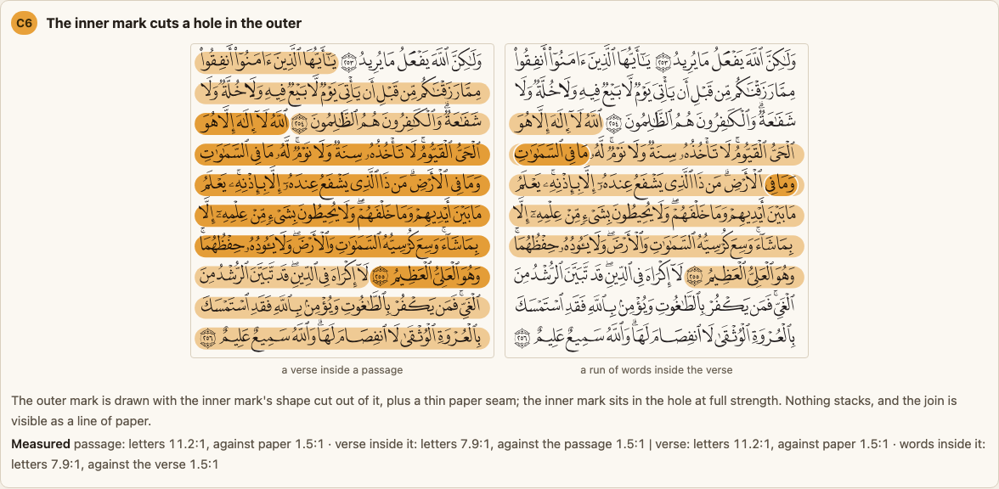 **C6 The inner mark cuts a hole** | The passage is cut away around the verse, leaving a thin paper gap, then the verse drawn in it. | Very crisp edges. | The gap only shows at the ends of shared lines, because the pen already leaves paper between lines. Extra work for little. | Masking code for a small gain. |

On a phone, rule C3:
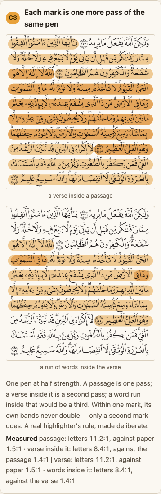

### Which options only show themselves moving?

These are live buttons on the drawn page. The stills below are their starting state.

| | What it does | What I found by pressing it |
| --- | --- | --- |
| 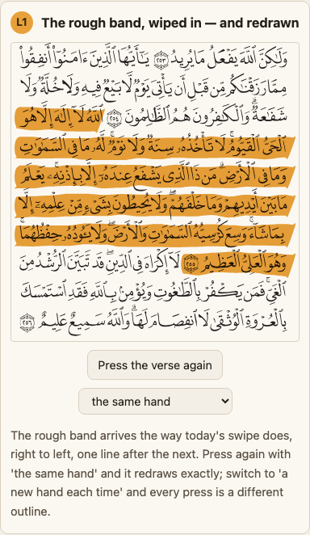 **L1 The rough band, wiped in and redrawn** | Wipes the rough band in right to left, like today's swipe. A switch between "the same hand" and "a new hand each time". | The wipe works for any shape, not only the clean swipe. With "a new hand each time", two presses give the same verse visibly different edges and ends; with "the same hand" the two presses match exactly. A mark that changes each time cannot become familiar, so the same hand is right. |
| 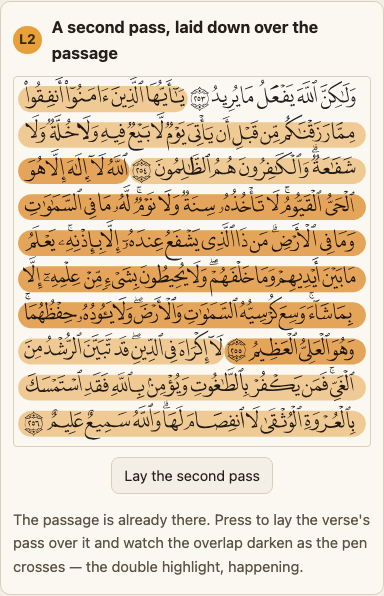 **L2 A second pass, laid over** | Lays the verse's pass over an existing passage. | This is the double highlight, happening. The verse darkens inside the passage while its letters stay black. The step is visible but gentle, the same finding as the still of rule C3. |
| 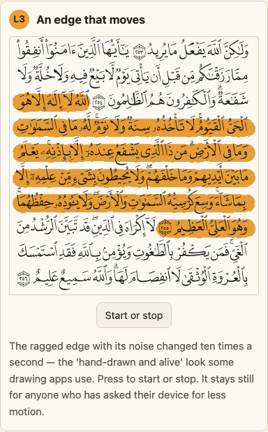 **L3 An edge that moves** | The ragged edge redrawn ten times a second, the "hand-drawn and alive" look. It does not start for anyone who asked their device for less motion. | Two frames a third of a second apart show different edges on every line, so the mark keeps changing around the letters while you read. With less motion asked for, the button is switched off. Rejected for scripture. |

## What would I choose, and why?

- **Rule C3 for stacking.** It is the only rule that is both what the owner asked for (real
  highlighter build-up) and safe at every level (letters 8.4:1). One adjustment: a verse on its own
  should get two passes, so it is not as faint as a passage. Worked out by the same sum: one pass is
  1.5:1 against paper, two passes 2.0:1, three 2.6:1; today's full-strength verse is 2.2:1.

*An honest gap: no mark on this page, today's included, reaches the 3:1 the guideline asks for a
"this is selected" sign against bare paper. Today's swipe is 2.2:1. A highlighter is pale by
nature; the letters under it are what stays strong. If 3:1 is to be met, it needs a stronger pen
for every option, which is a separate tuning question.*
- **S2, the rough band, as the hand-drawn shape.** Seeded, no library, same contrast as today.
- **Flat ink.** Every texture either hurts the verse's end (drying ink, chisel), looks like
  something else (streaks), or needs a filter we have not yet tried on an iPhone (grain, ragged).
- **Join each line's pieces into one band per mark,** which fixes the pinch in every option.

## What only the build turned up

These were not in any list of pros and cons before I drew them:

1. **The pinch at verse boundaries,** in the app today, and not fixed by any stacking rule alone.
2. **A filter on a level line disappears in Chromium and WebKit** (Firefox draws it). The browser
   measures the filter's area from the line's own box, which has no height. Set the area in page
   units and it draws everywhere.
3. **"One more pass" and "the stronger one wins" look the same at two levels.** They only part at a
   third level and in how a lone verse looks. The choice between them is about behaviour, not about
   this picture.
4. **Drying ink is palest at the verse's number.** Every line ends pale, and the last line ends at
   the verse's end.
5. **The hole rule only shows at line ends.**
6. **Grain depends on the screen;** it nearly vanishes on a desk screen.
7. **A new random hand on every press changes the same verse visibly;** a fixed hand per verse is not optional.

## What else could we consider, and why is it not here?

- **Rough.js or perfect-freehand.** Tried as a cost, not drawn: 8.9 KB and 2.0 KB of the 16.4 KB of
  room the app has left, for a look our own sub-1 KB code already gives. perfect-freehand also needs
  a traced gesture, which a pressed verse does not have.
- **Merge into one** (the Apple Books way). It removes stacking entirely, which is the opposite of
  what was asked.
- **Fluorescent glow.** Real highlighter ink glows; a screen cannot copy that without looking like a
  lamp.
- **An underline for the inner mark** (the Kindle "popular highlights" way, snippet only). A second
  kind of mark, which is the mistake-marking decision's territory.

## What would change the answer?

- **A real iPhone renders filter-plus-blend correctly and fast.** Then grain (T2) becomes worth
  offering as polish.
- **The owner finds C3's steps too gentle** in the live card. Then C3 with a slightly stronger
  pen, or C4 with a chosen ladder of three strengths.
- **The reader's shape menu is built first.** Then S2 goes in as the swipe's hand-drawn twin
  rather than as a new default.

## What is this not settling?

- **The default mark.** The earlier options record owns that; this one adds shapes and a stacking
  rule to it.
- **What a mark means** (the verse you are on, a mistake, a note). That is the mistake-marking
  decision.
- **Exact strengths, seeds and timings.** Tuning, done when it is built.
- **The tajweed colouring.** A separate feature.

## Where is the code?

- The drawn page: `docs/design/highlight-texture-options-b.html`, rebuilt by
  `node scripts/build-highlight-texture-options-b.mjs` (needs `packages/core/dist/ink.js`, so run
  `make core` first). It uses page 42's shipped print and verse boxes, the app's colour tokens and
  the app's own pen (`swipesFromPath`, `swipesFromRects`), and refuses to write a page carrying any
  Arabic codepoint or SVG text element.
- The pictures: `docs/design/highlight-texture-options-b/`, cut by
  `node scripts/shoot-highlight-texture-options-b.mjs` (Chromium; also WebKit shots when Playwright's
  WebKit is installed, and three-times close-ups).
- Stacking rules are `RULES` in the builder (`alpha`, `today`, `passes`, `wins`, `hues`, `hole`);
  shapes are `roughBand`, `patch`, `chisel`; the contrast maths is `stack`, `letters`, `vsPaper`,
  `between`.
- The pinch comes from `drawSwipes` in `packages/core/src/highlighter.ts`, which draws one element
  per verse.
- The sources: [highlight-texture-research-b.md](highlight-texture-research-b.md).
