# Could the mark look like a real highlighter: rough at the edges, and darker where two marks stack?

*The consolidated page, 2026-09-30, open. Two researchers answered this question separately, each
with a drawn page and a research file, without reading each other's work:
[researcher A's page](highlight-texture-options-a.md) (sources in
[A's research notes](highlight-texture-research-a.md)) and
[researcher B's page](highlight-texture-options-b.md) (sources in
[B's research notes](highlight-texture-research-b.md)). A third pass — this one — read both, went
back to the sources behind every claim a recommendation rests on, reproduced the two browser
findings in Chromium and WebKit, re-measured every option with one method, and confirmed the
one app-today defect in the real app. The two researcher pages are the independent passes this
was built from; they stay as the record. The one page to open is on the site at
<https://blog.bytesofpurpose.com/hifth/docs/design/highlight-texture-options.html> and checked in
beside this file; the decision itself is written up in
[the decision record](../decisions/highlight-texture.md).*

The owner asked to see different shapes and textures for the mark: a rough, hand-drawn look, and
see-through patches that build up into a darker double highlight where two marks overlap, the
way a real highlighter does on paper.

---

## The short version

- **What is being decided:** three things. The **shape** of the mark's edge. What the **ink** does
  inside it. And what happens **where one mark lands inside another** — a verse inside a swept
  passage, or a few words inside a verse.
- **What it changes for a hafiz:** today, a verse inside a passage goes a warm brown and a word
  run inside it goes darker still, with no rule behind it; and a swept passage breaks at every
  verse number. With the recommendation, the shade tells you how deep you are — one pass for a
  passage, two for a verse, three for a run of words, never more — the letters stay black at
  every depth, the passage is one unbroken band per line, and the edge looks drawn by a hand
  that is the same hand every time you come back.
- **Where the two researchers agreed:** the ink should darken where marks cross, the way a real
  highlighter does (both found the same behaviour in Zotero, GoodNotes, Procreate and tldraw);
  a rough edge must be seeded from the verse so it never shimmers; the rough band is the shape
  to take; a browser filter is not to be trusted on a phone until seen on one; no library is
  needed; no wash on any page reaches the 3:1 floor against paper, today's included.
- **Where they disagreed, and what settled it:** *how the passes are counted* (B: every mark is
  one more pass of a half-strength pen; A: a fixed count per kind of mark, at 60%, capped at
  three). The two rules draw the same picture where a verse sits inside a passage; they differ
  for a verse on its own and for a repeat press. Both are drawn, static and live. The record
  recommends A's counted rule, because a verse on its own — the commonest thing the app shows —
  should keep today's weight, and a repeat press should never darken. *Flat ink or a second pass
  a little apart* — both drawn; the second pass comes free with the counted rule. *Another colour
  blended or cut out* — both drawn and toggled live; the measurement settles it (blended drops
  the letters to 4.0:1, under the reading floor).
- **What only one found, now confirmed:** the passage's ink breaks at every verse number in the
  real app (B; confirmed with a screenshot, an open defect below). A blend nested inside a
  clipped, masked or filtered group paints solid over the letters (A; reproduced). A filter on a
  level line draws nothing unless its region is given in page units (B; reproduced).
- **What could not be verified:** how Kindle and Apple Books treat overlapping highlights (both
  researchers had only search snippets; the pages could not be fetched), and whether the
  filtered ink draws correctly on a real iPhone (no iPhone was available; one report says an
  older Safari drew it as a flat rectangle).

---

## A few words, defined once

- **The mark** — the amber the app lays over what you selected: the verse you are on, a passage
  you swept, or a run of words you held.
- **The pen** — how the app draws a mark: one round-ended band along each line, blended into
  the print so the letters stay black. Its strength is how see-through the band is.
- **A pass** — one laying-down of the pen. Two passes over the same place are darker than one,
  as on paper.
- **Shape** — the outline of the band: clean and round-ended today.
- **Ink** — what happens inside the outline: flat today.
- **Overlap** — where one mark sits inside another. The three that happen in the app: a verse
  inside a passage; a run of words inside a verse; and, on paper, a second mark of another colour.
- **Letters on the mark** — how well the black print reads through the amber, as a ratio.
  4.5:1 is the reading floor the web accessibility guideline sets for text; 3:1 is its floor for a
  "you are here" sign against its surroundings.

## What is being decided?

1. **What shape does the pen leave?** Today's clean swipe, or a rough band whose edges drift a
   little, the same way for the same verse every time.
2. **What does the ink do inside it?** Flat; two passes laid a little apart, whose edges are the
   texture; or streaks along the line made by a browser filter.
3. **What happens where two marks overlap?** Today's two pens with no rule; one pen where every
   mark is one more pass; a counted number of passes per kind of mark, capped; and, for a mark
   of another colour, blended in or cut out.

## What does it change for a hafiz?

> You are working through a passage and press one verse in it. You should see both at once — the
> passage you are revising, and the verse you are on, darker inside it — and every letter still
> black. Hold a few words you keep slipping on and they go one step darker again. Three depths
> of the same pen, never a muddy colour, never greyed letters, and the passage one unbroken band
> along each line rather than a chain of pieces with a gap at every verse number. Come back
> tomorrow and the rough edge is exactly where it was.

Per option, what a hafiz sees is stated on each card of the page and under each option in the
decision record.

## Why is this being asked now?

The owner asked for it, in those words, after the earlier options page settled that the mark is
a swipe per line and a reader may pick its shape and strength. The highlighter is the thing a
hafiz looks at most in this app, and the pitch build is meant to feel like the real thing.

## What happens if nobody decides?

The app keeps two pens and no rule: a verse inside a passage is a brown nobody chose, a word
run inside that is darker again, a fourth mark would go darker still, and the passage stays
notched at every verse number. Nothing breaks; it just never looks like a highlighter.

## What does the app do today, and what is it costing?

Screenshotted in the real app on a phone, page 42, the passage 2:254 to 2:256 opened from a link
(the passage menu is still up, because closing it drops the ink):

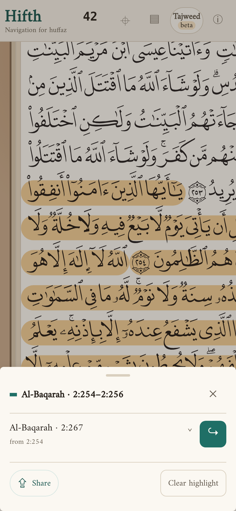

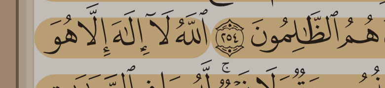

- A **passage** is the pen held at 50%, painted one verse at a time. Where two verses share a
  line, their round ends meet and leave a notch of paper at the verse number (the close-up; the
  gap is about 40 pixels wide on a phone, on each of the two rows where it happens). This is a defect, listed
  under open questions below.
- The **verse** you are on is the pen at full. Inside a passage it lands on top and the two
  blend: a warm brown, letters at 6.3:1, the mark at 2.8:1 against paper.
- A **run of words** is drawn with the same full-strength pen as the verse (confirmed in the
  code that paints it), so inside a verse it is full over full: letters at 4.9:1, just above the
  floor. A fourth mark would drop below it.

Drawn by the page, the same thing at three times the size, with the notch:

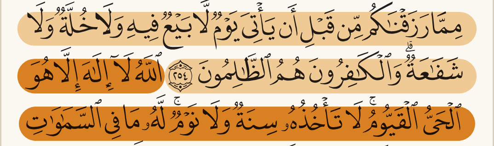

## What do people outside this project do about this?

Every source both researchers relied on was reopened by the checker unless marked otherwise; the
full list with what each says is in the two research files linked at the top.

- **Real highlighter ink and the drawing apps that copy it** darken where a stroke crosses
  itself or another: Zotero's overlapping highlights are deliberately darker; GoodNotes'
  highlighter darkens where it overlaps itself, and a request to stop that has 261 votes and no
  reply; Procreate's "glazed" brushes build up per stroke; tldraw draws its highlighter as two
  passes, a heavier underlay and a lighter overlay. SaneNotes went the other way on purpose:
  highlighting twice does not darken, the mark sits behind the text. Kindle and Apple Books:
  snippet only, not verified.
- **Hand-drawn edges are seeded, never random**: Excalidraw fixes the seed per shape so nothing
  shimmers on redraw; the rough-notation library draws its highlighter as two passes of a rough
  line at 95% of the line height, with no blend.
- **A capped stack** is what Hypothesis does: a second level of highlight at a lower strength,
  and deeper levels transparent.
- **Browsers**: the compositing specification says a multiply blend darkens by the product of
  the two colours, and that filters apply before clipping and masking, and blending after; the
  filter specification gives a filtered element a region of its own box plus 10%, so a level
  line's region has no height. Firefox has never implemented the part of SVG filters that would
  read the page behind a mark. SVG filters are reported slow on iOS by people who ship them.
- **Nobody found a Qur'an app** that stacks marks; the one issue found on a Qur'an project asks
  for overlapping highlights without a design.

## What have we already decided that constrains this?

- The mark is drawn per line, never as one box around the run
  ([the earlier shape decision](../decisions/highlight-style.md)); a reader may choose swipe,
  fill or outline, and a strength in a few named steps. So the pen's strength here is what the
  reader's step scales, not a new fixed number.
- The mark is blended into the print so the letters stay black
  ([the mark options page](highlight-options.md)); an inner mark cutting itself out of an outer
  one is already drawn there for another colour.
- The bundle has 16.4 KB left of its 175 KB budget. The measured libraries would take 8.9 KB
  (rough.js), 2.0 KB (perfect-freehand) or 4.0 KB (rough-notation) of it; the rough band on this
  page costs under 1 KB of our own code and needs none of them.

## The options, drawn

Every picture is on the real page 42 at the width a phone gives it; the overlap rules are drawn
three times each — the verse alone, the verse inside a passage, six words inside the verse —
because the verse alone is where the two researchers' rules part company.

### What shape does the pen leave?

|                                                                                             | what it is                                                                                                                                                                                                                                      | for a hafiz                                                                                                    |         |
| ------------------------------------------------------------------------------------------- | ----------------------------------------------------------------------------------------------------------------------------------------------------------------------------------------------------------------------------------------------- | -------------------------------------------------------------------------------------------------------------- | ------- |
| 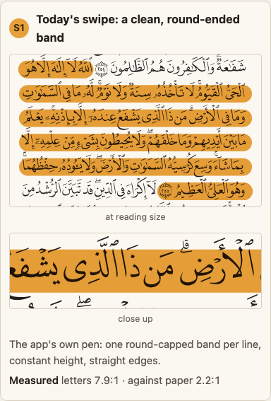 **S1 Today's swipe**                                  | The app's pen: a round-ended band per line, straight edges.                                                                                                                                                                                     | Nothing changes.                                                                                               |         |
| 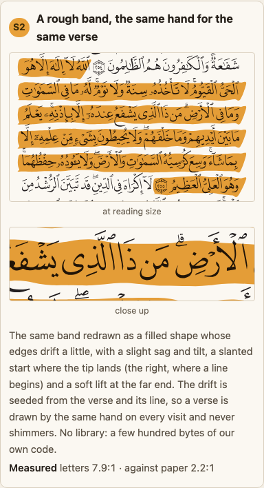 **S2 A rough band, the same hand for the same verse** | A filled shape whose edges drift a little, with a slight sag and tilt, a slanted start where the tip lands and a soft lift at the far end; seeded from the verse and its line. Both researchers built this independently and both recommend it. | The mark reads as drawn by a hand — and it is the same hand every visit, so it can be learned like a landmark. | ^1c4lpn |

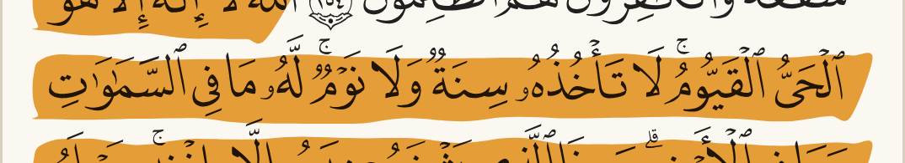

### What does the ink do inside the shape?

|                                                                                           | what it is                                                                                                                                                            | for a hafiz                                                                                                                                                           |         |
| ----------------------------------------------------------------------------------------- | --------------------------------------------------------------------------------------------------------------------------------------------------------------------- | --------------------------------------------------------------------------------------------------------------------------------------------------------------------- | ------- |
| 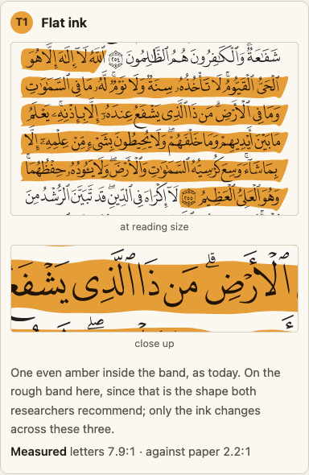 **T1 Flat**                                         | One even amber, as today.                                                                                                                                             | The cleanest read of the letters.                                                                                                                                     |         |
| 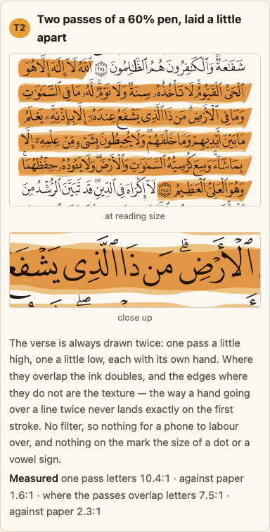 **T2 Two passes of a 60% pen, laid a little apart** | The verse is always drawn twice, one pass a little high and one a little low, each with its own hand; the edges where they do not overlap are the texture. No filter. | Looks like a hand that went over the line twice. Letters 7.5:1 where the passes overlap, 10.4:1 where only one lies.                                                  |         |
| 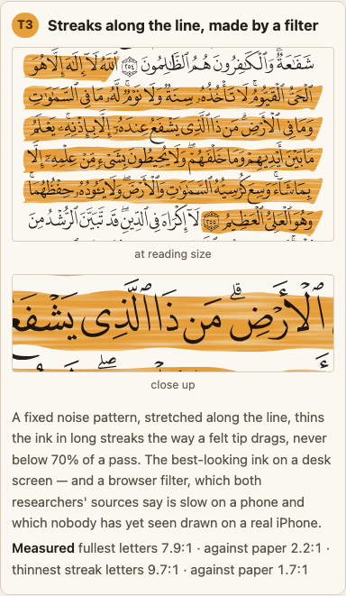 **T3 Streaks along the line, by a filter**          | A fixed noise pattern stretched along the line thins the ink in long streaks, never below 70% of a pass.                                                              | The most felt-tip of the three on a desk screen. A browser filter, which both researchers' sources say is slow on a phone; nobody has seen it drawn on a real iPhone. | ^562lz9 |

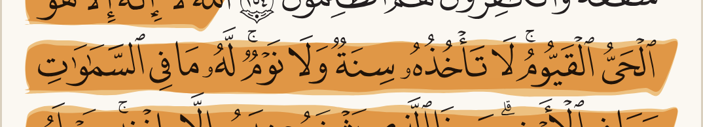

### What happens where two marks overlap?

| | what it is | for a hafiz |
| --- | --- | --- |
| 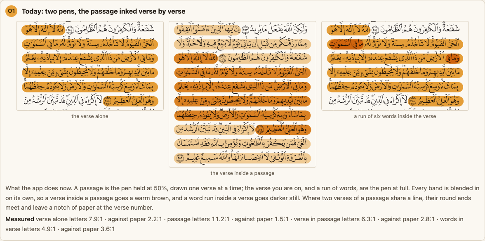 **O1 Today: two pens, the passage inked verse by verse** | The passage at 50%, the verse and a word run at full, every band blended on its own, the passage in pieces. | A brown nobody chose inside a passage; a notch at every verse number; a word run at 4.9:1, one step from the floor. |
| 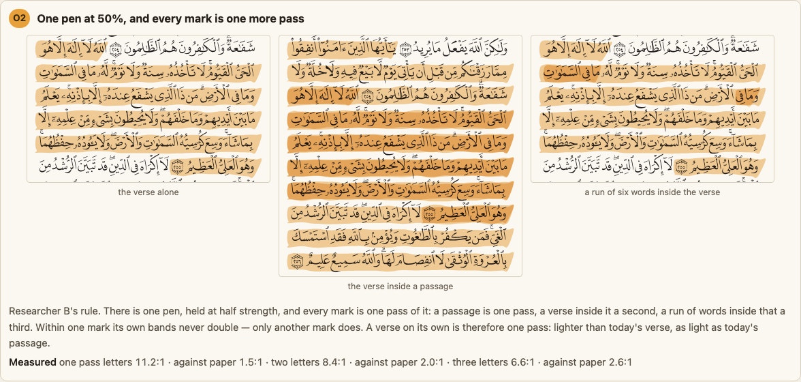 **O2 One pen at 50%, every mark one more pass** (researcher B) | A passage is one pass, a verse inside it a second, a word run a third; within one mark nothing doubles. A verse on its own is one pass. | Inside a passage: exactly what O3 shows. On its own, the verse is as light as today's passage (letters 11.2:1, 1.5:1 against paper), lighter than today's verse. Nothing caps a fourth. |
| 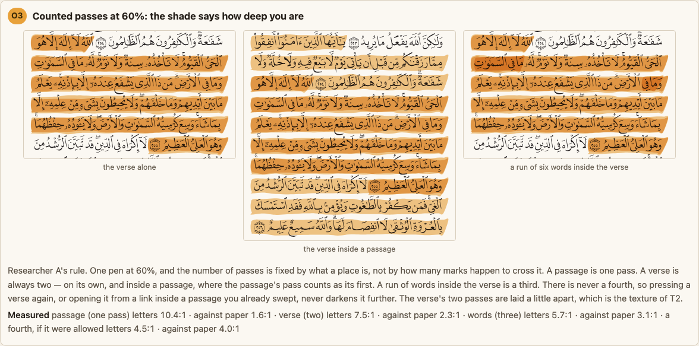 **O3 Counted passes at 60%: the shade says how deep you are** (researcher A) | A passage is one pass; a verse is always two, on its own or inside a passage (where the passage's pass is its first); a word run is a third; never a fourth. The verse's two passes are laid a little apart (T2). | The depth is legible: 10.4:1, 7.5:1, 5.7:1 letters at one, two and three; a verse alone keeps today's weight; a repeat press or a link into a swept passage never darkens it further. |
| 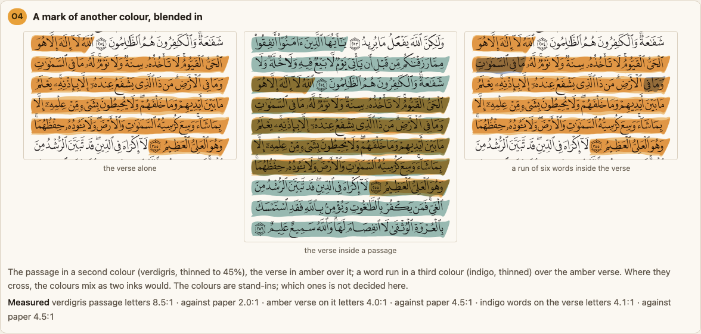 **O4 A mark of another colour, blended in** | Verdigris for a passage under the amber verse; indigo for a run over it (stand-in colours). The colours mix where they cross. | Where they cross the letters fall to 4.0:1, under the floor, and the colour is a mud that means neither mark. |
| 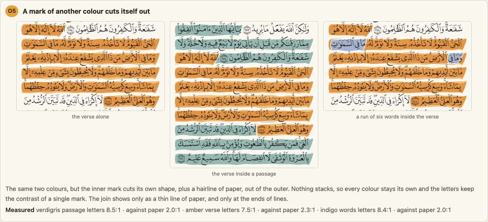 **O5 A mark of another colour cuts itself out** | The inner mark cuts its own shape and a hairline of paper out of the outer. | Every colour stays its own; the letters keep a single mark's contrast (7.5:1 under the verse); the seam shows only as a thin line at line ends. |

The middle scene of each, at three times the pixels, where the passage's first verse ends and
the verse begins:

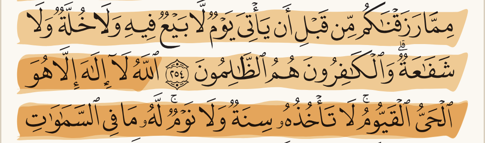

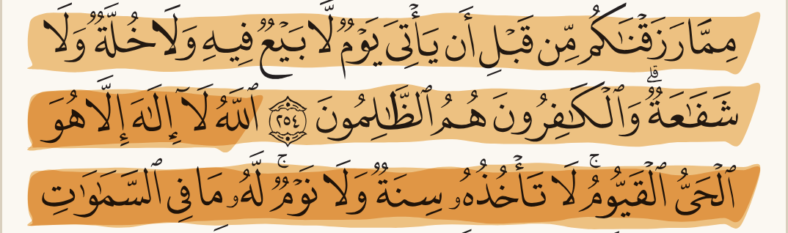

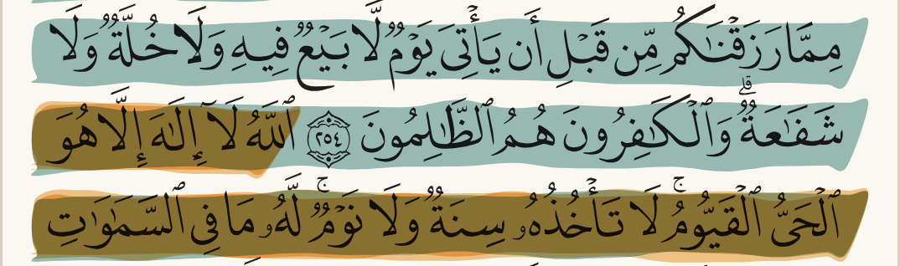

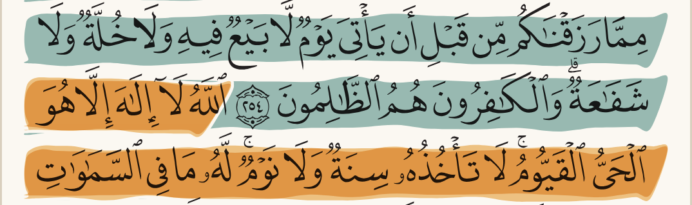

### What does it feel like when the mark goes down? (live on the page)

|                                                                                      | what it is                                                                                                                                               | what a hand finds                                                                                                                               |         |
| ------------------------------------------------------------------------------------ | -------------------------------------------------------------------------------------------------------------------------------------------------------- | ----------------------------------------------------------------------------------------------------------------------------------------------- | ------- |
| 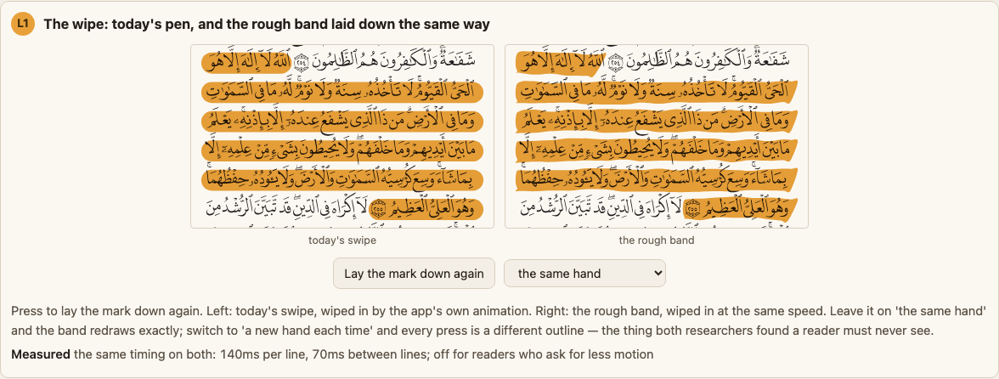 **L1 The wipe**                                | Today's swipe and the rough band, wiped in at the same speed; a switch between "the same hand" and "a new hand each time".                               | With a new hand each press the mark shimmers between visits — the thing both researchers said a reader must never see, felt rather than argued. |         |
| 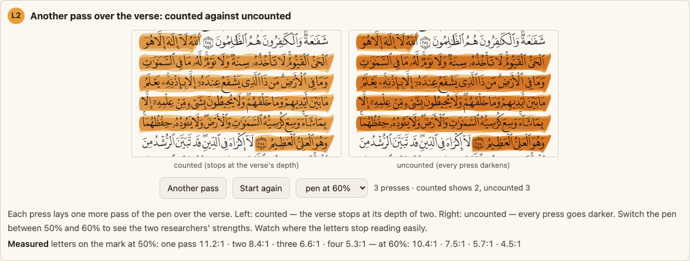 **L2 Another pass, counted against uncounted** | Each press lays one more pass; the counted side stops at the verse's depth of two, the uncounted side keeps going; the pen switches between 50% and 60%. | Where the letters stop reading easily: at four passes of 60% they are at 4.5:1, the floor itself.                                               |         |
| 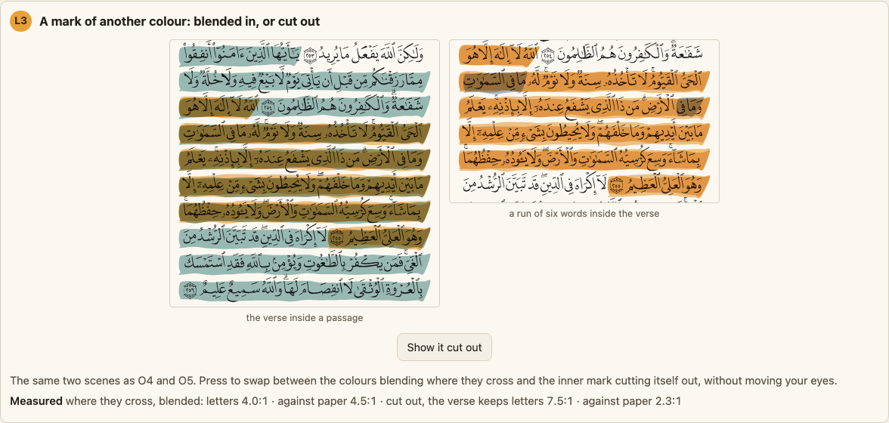 **L3 Another colour, blended or cut out**      | The two scenes of O4 and O5 swapped in place by one button.                                                                                              | The blended crossing turns brown-green; the cut-out keeps both colours honest.                                                                  | ^0vhzys |

The same cards in WebKit (Safari's engine), for the combinations that one engine or the other
has got wrong: `webkit-S2.png`, `webkit-T3.png`, `webkit-O1.png`, `webkit-O4.png`,
`webkit-O5.png`, `webkit-L1.png` beside the others. They match Chromium.

## Where the two researchers agreed, where they disagreed, and what only one found

Each claim a recommendation rests on, its source, and whether the checker reopened it.

| claim | A | B | source | reopened? | verdict |
| --- | --- | --- | --- | --- | --- |
| Real highlighter ink and the drawing apps that copy it darken where marks overlap | yes | yes | Zotero forum thread 110523; GoodNotes request 18526903; Procreate handbook (glazed brushes); tldraw's highlighter code (underlay 0.82, overlay 0.35) | yes, all four fetched | agree, supported |
| Kindle and Apple Books darken overlapping highlights | snippet | snippet | Amazon forum; Apple Books guide | tried, could not fetch either | unverified — not relied on |
| FigJam darkens overlapping highlights | yes | yes | FigJam help page | yes | the page says nothing about overlap; dropped |
| SaneNotes chose not to darken (mark behind the text) | — | yes | SaneNotes issue 152 | yes | only B; supported |
| Hypothesis caps the stack (second level lighter, deeper levels transparent) | yes | — | Hypothesis client stylesheet | yes | only A; supported |
| A rough edge must be seeded so it never shimmers | yes | yes | Excalidraw issues 70 and 362 | yes | agree, supported |
| rough-notation draws two passes at 95% of the line height with no blend | yes | yes | its render source | yes | agree, supported |
| A multiply blend darkens by the product; filters apply before clip and mask, blend after | yes | yes | the compositing specification | yes | agree, supported |
| A blend nested inside a clipped or filtered group paints solid over the letters | yes | — | A's own repro | yes, in Chromium 149 and WebKit 26.5 | only A; true in Chromium for a clip or filter, in both engines for a mask; the fix (blend on the same element, or outside the filtered group) works in both |
| A filter on a level line draws nothing unless its region is given in page units | — | yes | B's own repro; the filter specification's default region | yes, both engines | only B; reproduced; the fix works in both |
| Firefox does not implement the filter input that reads the page behind a mark | — | yes | Mozilla bug 437554 | yes | only B; supported |
| SVG filters are slow on iOS | yes | yes | a GSAP forum thread; general reports | yes | agree; supported by reports, not measured here |
| An older Safari drew a filtered, multiplied line as a flat rectangle | yes | — | A's own note of an iOS 26.3 device | no iPhone available | only A; unverifiable |
| Library sizes: rough.js 8.9 KB, perfect-freehand 2.0 KB, rough-notation 4.0 KB gzipped; 16.4 KB of budget left | yes | yes | measured from the packages and the bundle baseline | yes, re-measured | agree, supported |
| The passage's ink breaks at every verse number in the app | — | yes (drawn) | the app itself | yes, screenshot in the real built app | only B; confirmed — a defect |
| A word run today is drawn with the same full pen as the verse | yes | — | the code that paints it | yes | only A; confirmed |
| No wash on either page reaches 3:1 against paper; every mark is found by its size | yes | yes | both pages' measurements | re-measured with one method | agree |
| **Where a verse sits inside a passage, the right picture is two passes of one pen** | yes | yes | — | — | agree |
| **A verse on its own is one pass (B) or two (A)** | two | one | — | drawn both, static and live | a genuine choice; the record recommends two |
| **A fourth mark is capped (A) or not (B)** | capped | uncapped | — | drawn both, live | a genuine choice; the record recommends capped |
| **The pen's strength: 50% (B) or 60% (A)** | 60% | 50% | — | measured both at every depth, one method | the reader's strength step scales it; the page shows both |
| **Ink: flat (B) or a second pass a little apart (A)** | second pass | flat | — | drawn both | a genuine choice; the second pass comes free with the counted rule |
| **A mark of another colour: blended (B) or cut out (A)** | cut out | blended | the earlier mark options page already draws the cut-out | measured both | the measurement settles it: blended is under the reading floor |

On the two researchers' measurements: A measured black letters against the mark's colour; B
measured the letters as they sit under the mark against the paper under the same mark. B's is
what the eye meets, and this page uses it for every figure, at both pen strengths. That is why
the numbers on this page do not match A's page to the decimal.

## What else could we consider, and why is it not here?

- **A ragged edge made by a filter** (both drew it): a filter, with the phone cost and the
  iPhone doubt, for an edge the seeded band gives without one.
- **A patch per line** and **a chisel stroke** (both drew them): the patch looks like a sticker
  and blurs where a verse ends; the chisel narrows at the ends where the verse number sits.
- **A pressure stroke** (A): a band that swells and thins reads as a mistake at reading size.
- **Grain** (both): the grain's dots are the size of a vowel sign; on this print they compete
  with it.
- **Drying ink** (both): a gradient along the line that says nothing a hafiz needs.
- **Plain see-through paint instead of a blend** (both): greys the letters; rejected by the
  earlier mark options page already.
- **Two hues multiplied** as the default (both): mud where they cross — O4 shows it.
- **A moving edge** (B): motion on a page a hafiz reads; nothing it would tell them.
- **Strongest mark wins** (B, from the browser's own highlight rule): the inner mark hides the
  outer one, so you cannot see both at once.
- **Merge every mark into one shape**: loses the depths altogether.
- **A drawing library** (both measured three): none needed for the surviving options, and the
  cheapest would take an eighth of the remaining budget.

## What would change the answer?

- **A real iPhone showing the filtered ink fast and right** would bring T3 back as the ink, with
  the rest unchanged.
- **The owner preferring a verse on its own to be light**, as light as a passage, would pick B's
  uncounted rule over A's counted one; the rest of the recommendation stands either way.
- **A reader test where the second pass's doubled edge reads as a mistake** would drop T2 for
  flat ink, with the counted rule kept (the two passes then land exactly on each other).
- **A change to the strength steps** the reader may choose would move the 60% figure; the counts
  do not move.

## What is this not settling?

- Which colours a passage or a word run would be if they were not amber — the tajweed-colours
  and mark-options decisions own that. Verdigris and indigo here are stand-ins.
- Whether the rough band is the default shape or one more choice on the reader's menu beside
  the swipe, fill and outline.
- Whether a word run is drawn at all inside a verse you are not on.
- Anything about the notes, the crumbs or the dashed look-alike outline.

## Open questions, and what would answer each

### ① The passage's ink breaks at every verse number · **fixed**

**Fixed the same day:** the pen now gathers every band of the passage and joins the ones that
sit on one line into a single band before it goes down, so a passage is one pass per line
whatever the shape and overlap rule chosen. The tests that would catch it coming back are in
`packages/core/src/ink.test.ts` (the joining itself) and `packages/core/src/highlighter.test.ts`
(two verses sharing a line paint as one band); the phrase golden on page 604 re-baselined with
the notch closed.

Found 2026-09-30 by researcher B on the drawn page, confirmed the same day by the checker in the
real built app on a phone (page 42, the passage 2:254 to 2:256 opened from a link; the two
screenshots above). The pen paints a passage one verse at a time, one round-ended band per
verse per line, so where a verse ends and the next begins on the same line the two ends meet
and leave a notch of paper around the verse number — on this passage, on the rows where 2:254
ends and where 2:255 ends. It shows at reading size on a phone. The fix is to paint a passage as
one band per line, joining the verses that share a line before the pen goes down, whichever
shape and overlap rule is chosen; the test that would catch it coming back reads the passage's
bands and expects one per line where two verses share one.

### ② Which two colours should a passage and a run of words take? · **fixed**

The owner chose a colour per meaning, blended where the marks cross (2026-09-30). The green and
blue in the app are stand-ins from this page, and where either crosses the amber verse the
letters fall to about 4.0 to 1, under the 4.5 to 1 floor. What would answer it: a few real
pairs drawn on page 42 at phone size, each measured where it crosses the amber, and the owner
picking one from the picture.

**Drawn 2026-09-30.** Four pairs, each the strongest its two colours can be while the letters
still clear 4.5 to 1 where they cross the amber, put on the real app on page 42 at phone size:

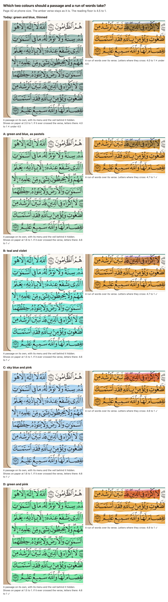

| pair | passage | run of words | letters where the run crosses the verse | how plainly the passage shows on paper | how plainly the run shows on paper |
| --- | --- | --- | --- | --- | --- |
| today | thinned green | thinned blue | 4.0 to 1 ✗ | 2.0 to 1 | 2.0 to 1 |
| A | pastel green | pastel blue | 4.7 to 1 | 1.6 to 1 | 1.6 to 1 |
| B | teal | violet | 4.7 to 1 | 1.5 to 1 | 1.7 to 1 |
| C | sky blue | pink | 4.6 to 1 | 1.6 to 1 | 2.1 to 1 |
| D | green | pink | 4.6 to 1 | 1.5 to 1 | 2.1 to 1 |

What the pictures taught that the numbers did not:

- **Only one crossing happens in the app today.** Tapping a verse clears a passage, and a run
  of words lives only inside its verse, so a reader never sees a passage and a verse at once.
  The one place two colours meet is a run of words over its amber verse. Every pair's passage
  would also clear 4.5 to 1 over the verse (4.6), so none of them closes a door if passages and
  verses are ever shown together.
- **A light blue over amber turns a muddy olive.** Pair A's run reads as a dull, dirty patch on
  the verse rather than a second colour. The pinks (C, D) turn the amber a clear coral, and the
  violet (B) a dusky mauve: both read as *a different mark*, which is the point of a run.
- **Every passable passage colour is paler than today's.** The floor is paid for in strength.
  On its own on the paper each still reads as a wash of colour at phone size.

Drawn by `node scripts/shoot-ink-colours.mjs` after `make build`, which also prints the figures.

**Settled 2026-09-30 by the owner:** "pastel green and blue", "and yellow", "and pink", "should
be defaults", "there should be settings to update them", "selectable from the toolbar for the
highlighter". So the highlighter now carries four pastel pens (green, blue, yellow and pink),
each as strong as it can be while the letters still clear 4.5 to 1 where it crosses the amber
verse:

| pen | letters where it crosses the verse | how plainly it shows on paper |
| --- | --- | --- |
| green | 4.6 to 1 | 1.6 to 1 |
| blue | 4.7 to 1 | 1.6 to 1 |
| yellow | 5.9 to 1 | 1.4 to 1 |
| pink | 4.6 to 1 | 2.1 to 1 |

- **A passage is green** until the reader picks another pen. While the highlighter is on, the
  four pens sit beside it in the tools bar, on a computer and on a phone; the pen picked colours
  the passage and is remembered on that device.
- **A run of words is blue**, over the amber verse, whichever pen is picked for passages.
- **The verse stays amber.**

Left for later, on the backlog: whether the reader should also be able to change the run's
colour, or mix a pen of their own. The pens are held to the floor by a test that works out
each one's contrast over the amber, so a new pen that fails it cannot be added by accident.

### ③ Does the streak filter slow a page turn on a real iPhone? · **blocked**

The streaks are drawn by one filter shared by every mark on the page. A laptop does not notice
it; a phone might, on the frame a page turns. What would answer it: turn twenty pages with a
verse and a passage marked on a real iPhone and watch for a stutter. If it stutters, the flat
ink the app already falls back to is the fix.

### ④ Does Safari draw the mark going down, or show it whole? · **blocked**

The mark is revealed from right to left as it goes down, by clipping the whole group. Chromium
and Firefox draw it; whether Safari clips a group that way was not checked on a device. If it
does not, the mark simply appears whole, which is what a reader who asked for less motion
already sees. What would answer it: select a verse in Safari on an iPhone and watch.

### ⑤ Should a reader also choose the colour of a run of words, or mix a pen of their own? · **open**

The highlighter's pen is picked from four pastels in the tools bar, and a run of words is
always blue. The owner asked for "settings to update them"; the four pens answer that for a
passage. What is still open: whether a run of words gets a choice too, and whether a reader may
mix a colour of their own. A free colour picker cannot promise the letters stay readable where
the colour crosses the amber verse, so a pen of the reader's own would have to be checked, and
pulled paler, before it is used. Nothing is lost by waiting: the four pens already pass.

---

*The page is rebuilt by `scripts/build-highlight-texture-options.mjs`; its pictures are cut by
`scripts/shoot-highlight-texture-options.mjs`; the two screenshots of the app were taken with
`apps/web/e2e/tools/drive.mjs` against the built app. The checker's browser reproduction of the
two engine findings is described in the table above; both researchers' own reproductions are in
their research notes.*
