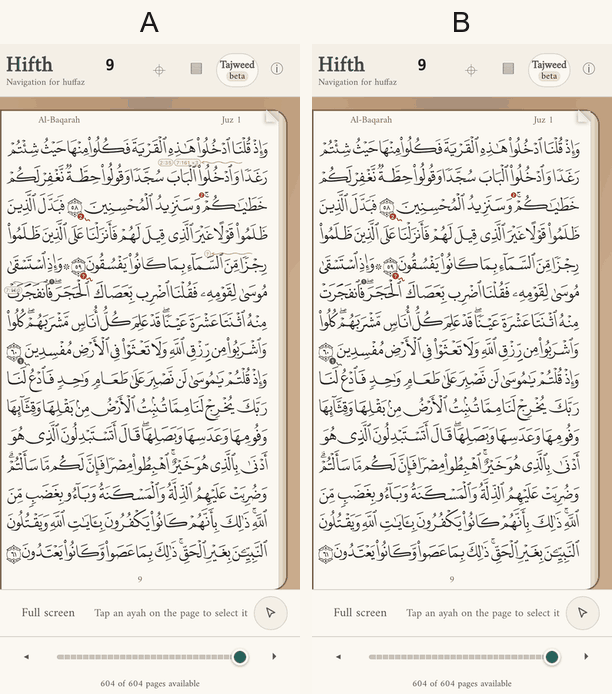
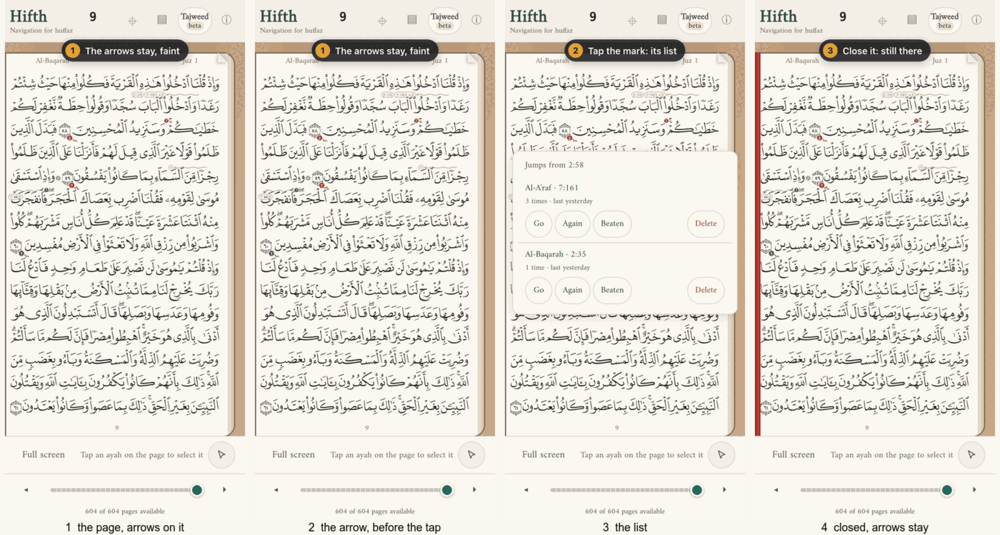
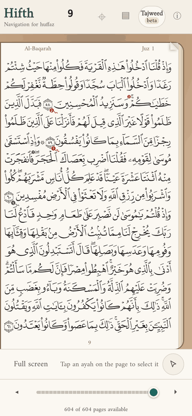
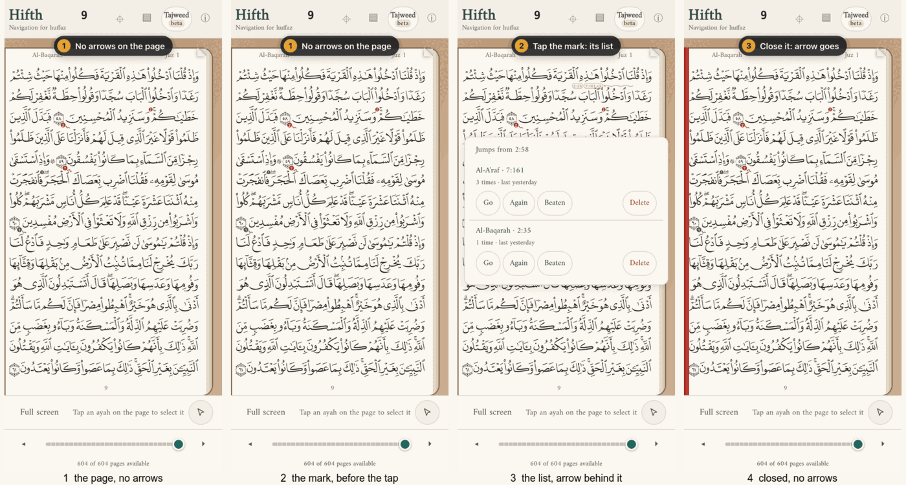
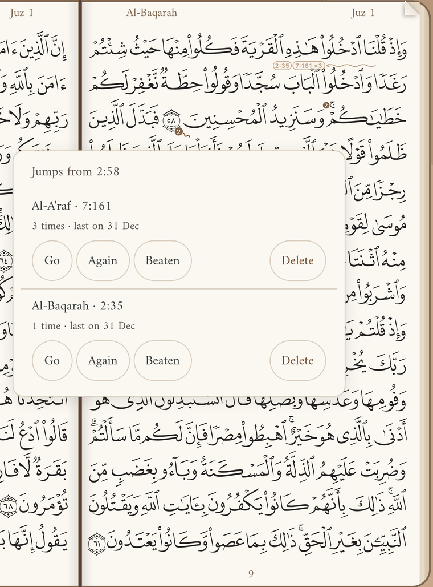
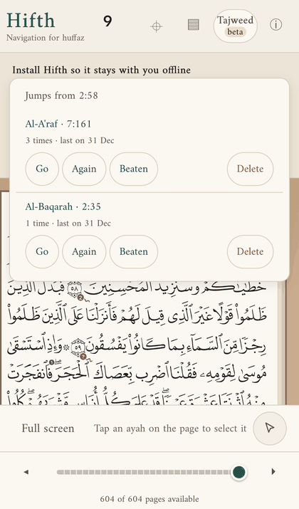
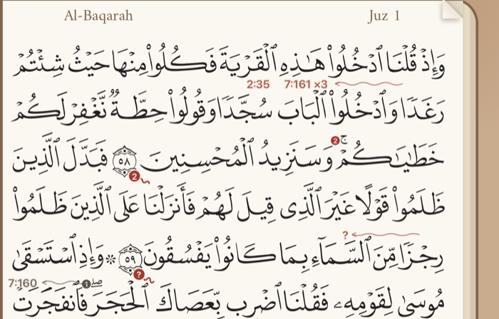

# Should the saved arrows stay on the page, or show only when you ask?

*Decided 2026-10-03 by the owner: **A**, the arrows stay, faint, and B is kept as a setting ("Saved jump arrows" in the info panel) for a reader who wants a clean page. This is question 4 of [the wavy arrow for the places your memory jumps](confusion-jumps.md#4--does-the-arrow-stay-on-the-page-or-only-show-when-you-ask). This page holds what building both taught us.*

> [!success] Decided
> **A by default, B as a setting.** Every device starts with the arrows on the page, faint. Picking "Only when you ask" in the info panel switches that device to B, and it is remembered. Findings 3 and 4 below (small labels, labels near the edge) were fixed the same day; see *What changed after the choice?* Finding 1 (on a phone, B's list covering its own arrow) still matters for anyone who picks B.

> [!tip] Recommended
> **A: the arrows stay on the page, faint.** The arrow is the only thing that shows *where* in the verse your memory left it, and on a phone the list that B relies on can open right over the arrow it is meant to reveal. Two things are worth fixing whichever way you choose (below): the labels are small, and near the edge of the page they land on letters.

**2 options**, both recorded on page 9 of a phone, with four made-up jumps. **4 things came up while building** that no list made beforehand had in it; see *What did building them teach us?*

---

## A few words, defined once

- **Verse**: one ayah, with its number in the round marker at its end.
- **Jump**: a place where your recitation left one verse and carried on in another that looks like it. The Jump tool (key J) marks one.
- **The arrow**: a short wavy red line under the word where you left the verse, ending in a small label for each verse you went to ("7:161 ×3" means three times). A "?" label means a jump you have not said the destination of yet. A greyed arrow is one you marked as beaten.
- **The mark**: the small red count under the verse number. Tapping it lists the verse's jumps.
- **The four jumps in the pictures** are made up for this page: 2:58 to 7:161 (three times) and to 2:35; 2:59 to a verse not named yet; 2:60 to 7:160, marked beaten.

## What changes for a hafiz?

> [!important] For a hafiz mid-revision
> **The mark says *that* you slip in a verse; the arrow says *where*.** With A, you see the exact word before you reach it, which is the moment the warning helps. But you also see it while testing yourself, when a hint is the last thing you want. With B, the page is clean while you recite, and you see where you slip only once you stop and tap. That is after the slip, not before it.

## How does each one behave? — 2 options

**Watch the two side by side first.** The grey circle is a finger, and the numbered label at the top says what is happening.

Both clips are the real app on a phone. A short script seeds the four jumps ([seed-jumps.js](jump-arrows-options/mocks/seed-jumps.js)), and [record.sh](jump-arrows-options/mocks/record.sh) records them again.

### A — The arrows stay, faint *(recommended)*

Every saved arrow is drawn at about half strength whenever the page is open. Hovering or focusing one brings it to full strength. Tapping its label opens that verse's list.

> [!example]- A, step by step, and on a computer: 2 pictures
> 
>
> **The right-hand page of a two-page spread on a computer**
>
> 

### B — Only when you ask

No arrows on the page. A verse's arrow shows while its list is open, and every arrow shows while the Jump tool is on. Closing the list or putting the tool down hides them again. The red mark under the verse number still warns you either way.

> [!example]- B, step by step, on a computer, and the list covering its own arrow: 3 pictures
> 
>
> **On a computer: the list opens beside the verse, and the arrow shows next to it**
>
> 
>
> **On a phone, when the verse sits lower on the screen: the list opens above the mark and covers the very arrow it revealed**
>
> 

## What did building them teach us? — 4 things

1. **On a phone, B's list can hide its own arrow.** The list opens below the mark when the mark is high on the screen, and above it otherwise. The arrow is under the verse's first line, which is above the mark. So whenever the list opens upwards it covers the arrow it was opened to show. In the recording the verse sat high and it worked; with the install notice pushing the page down, it did not (last folded picture under B). On a computer the list opens beside the verse and this never happens.
2. **The arrow lives in the narrow gap between two lines**, so its wave crosses the harakat of the line below. Faint, it reads as a pencil mark; at full strength it competes with the signs.
3. **The labels are small.** At normal size they come out about 6–7 points tall on a phone, and about the same on a computer spread. They were enlarged once during the build. Any larger and they cover more letters.
4. **Near the left edge of the page the labels have nowhere to go.** The arrow runs leftwards from the word. When the word is close to the edge (2:60 here), the labels drop under the arrow and sit on the next line's letters.

## What changed after the choice?

Findings 3 and 4, fixed on 2026-10-03, because with A the labels are always on the page:

- **Bigger, and bare.** A label is now about 9 points on a phone instead of 6–7. It no longer stands on a filled pill, which hid the harakat beneath it; the letters of the label get a thin edge of paper instead, so they stay readable where they cross a stroke. The labels are nearly full strength, and the wave stays faint.
- **In the gap.** The arrow and its labels sit in the middle of the white gap between the two lines, not on top of the next line's harakat.
- **Near the edge, a shorter arrow.** When the word is close to the left edge, the arrow is cut shorter so its labels still fit beside it on the same line. 2:60's "7:160" now ends its own arrow instead of dropping onto the line below. If even a short arrow leaves no room, the labels go behind the arrow's start.

## What does each option cost? — side by side

| | **A — stays, faint** *(recommended)* | **B — only when you ask** |
| --- | --- | --- |
| **Pros** | Shows where you slip before you reach it. What the owner described. Tapping a label is one more way into the list. | The page is clean while you recite. The mark still warns. With the Jump tool on, every arrow shows at once: a "show me my jumps" view for free. |
| **Cons** | A page with many jumps gets busy, and you see the hint while testing yourself. The faint wave sits over the next line's harakat. | You only learn *where* after you tap, which is usually after the slip. On a phone the list can cover the arrow it reveals (finding 1). |
| **Implications** | A "hide my marks while I test myself" switch may be wanted later; it would be one setting, not a redesign. Findings 3 and 4 have to be solved, because the labels are always visible. | The phone list would need to open below the verse's first line, or move aside, before B is usable on a phone. The labels matter less, because they show only on request. |

## What else could be considered?

- **C: stays until beaten, then gone** (from the design). Not built: it is A with one rule added, and A has to be right first. It can follow once beaten arrows have been lived with as grey.
- **A with a switch to hide all marks while testing yourself.** This is A plus the "hide" setting in A's implications. It is worth building only if A turns out busy in real revision.

## What would change the answer?

- If a real revision with A on a page with five or more jumps feels like a page of hints, then B, or A with the hide switch.
- If the labels cannot be made readable without covering letters (findings 3 and 4), the arrow could become only the wave, with no labels, and the list does the naming.

## What this is not settling

- What the arrow looks like (its colour, wave and head). That was settled in [the design](confusion-jumps.md).
- A place to see dismissed jumps. Built the same day: a folded "Dismissed" group in the page map's list of jumps, each with Bring back.
