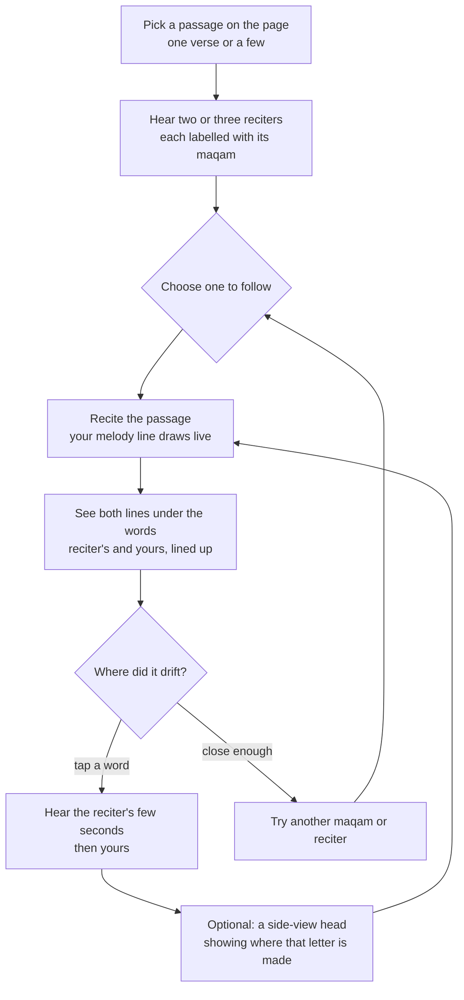
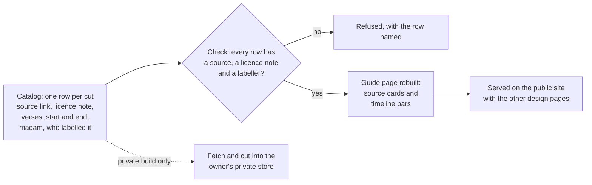
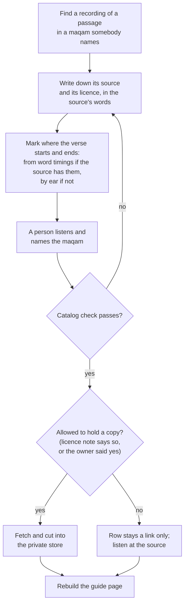

# Could the app let a hafiz recite a passage, hear it in several maqamat, and see where their voice drifts from a reciter they choose to follow?

*Design note, 2026-10-09, open. Nothing here is built. It is a first look, written from outside
sources, so that a rough build can be started; the options and their pros and cons below are
the ones visible before building, and they get rewritten once the rough build exists. No
decision is recorded for it yet.*

The owner asked: look at recording one chosen passage, find different recitations of it in
different maqamat, then compare my voice to them, and maybe even a throat picture showing where
I go wrong and how to follow the reciter. A rough build, with a way to pick the maqam.

> [!note] How this note read the request
> Two words in the request were read one way; if either reading is wrong, say so and this note
> changes.
> - **"Reporting a specific area"** is read as **recording a chosen passage**: one verse, or a few
>   verses in a row, that the reader picks on the page. If it meant *a report on one area of the
>   voice* (say, only the high notes), the comparison below still applies, narrowed to that part.
> - **"A poem"** is read as **a POC**: a quick, rough, throwaway build to try it out. If it meant
>   reciting poetry (a nasheed or a qasida) rather than the Qur'an, everything about following a
>   melody carries over unchanged, the licences get simpler (a poem's recordings are not tied to
>   the Qur'an collections below), and the articulation half matters less.

---

## The short version

> [!tip] Recommended
> **Build the melody half first, and build it small.** One short passage, two or three reciters,
> each recording tagged with its maqam *by a person*, a maqam picker, and two lines drawn under
> the verse's words: the reciter's melody and yours, live as you recite, lined up word by word.
> Tap a word to hear the reciter's few seconds and then your own.
> **Line the two voices up by their home note, not by the piano.** You will not recite at the
> reciter's pitch, and several maqamat sit on notes between a piano's keys, so the lines are
> shifted to each voice's own home note and measured in fine steps, never snapped to twelve notes.
> **Run it all in the browser on the iPad**, with the reciters' melody lines worked out ahead of
> time on the laptop. No server for the rough build.
> **Treat the throat picture as a teaching picture, not a measurement.** A microphone cannot see
> a tongue. It can hear whether a madd was held long enough and, with less certainty, whether a
> ghunnah was there. So: a side-view head that shows *where a letter should be made*, opened from
> the word you tapped, and a plain "held two counts, the reciter held four" for madd.

- **What it changes for a hafiz:** see the highlighted box just below.
- **The biggest thing the research found:** no collection anywhere labels recordings by maqam. The
  Qur'an audio collections label reciter and style, never maqam, and the research collections that
  do label maqam are not downloadable from anywhere this note could find. So the labels in a first
  build come from a person, and "the app tells you which maqam" is a later step, not a starting one.
- **The second biggest:** no source opened here grants the right to put reciters' recordings in a
  public repository. The recordings stay in the owner's private store, off the repository, like the
  other held outside data.
- **Where it runs:** in the browser on the iPad. The one iPad risk found is that Safari may lower
  the sound quality while the microphone is open; the rough build checks this first, on the real
  iPad and in Firefox.
- **Recordings already named by maqam:** a starting list was found, all from search summaries and
  none heard. Surah 1 appears in Hijaz and in Saba from the same reciter, and a course claims Rast
  for it. The best source, a teacher's blog with the same verses in several maqamat, can no longer be
  reached, so the next step is to write to its author. No verse timings were found anywhere.
- **Do we need yt-dlp?** Not for the rough build. QUL's per-verse files and word timings need no
  cutting. ffmpeg comes in for long recordings. YouTube's terms forbid downloading even for private
  study, so yt-dlp is a last resort, used only with the recording owner's written yes, and asking
  them for the file comes first.
- **A public guide to the sources:** one page, rebuilt from a hand-edited catalog. It has a card per
  source with its licence, and a bar on each recording's timeline for each cut, marked with the maqam
  and who named it. Links and timings only, never audio.
- **Growing the catalog:** one skill with five scripts. A check refuses any row with no source, no
  licence note or no labeller. A person names every maqam. Audio goes only into the private store,
  and only when the licence or the owner allows it. It is one more held-copy source, with its
  licence check inside it.
- **What it is not settling:** whether this belongs in the demo for The Study Quran team, which
  reciters, or anything about grading a recitation.

> [!important] What it changes for a hafiz mid-revision
> Today a hafiz who wants to recite a passage the way a favourite reciter does has two ears and
> a memory: listen, try, and guess whether it matched. With this, they pick the passage on the
> page, hear it from two or three reciters with the maqam named on each, choose one to follow,
> recite, and *see* the two melodies side by side under the very words they said — where they
> went flat on a long vowel, where they rose a word too early, where they cut a madd short. They
> can tap that word and hear the reciter's version and theirs back to back, then try again. It
> turns "that didn't sound right" into "this word, this much, this way". It does **not** check
> that the words were right (that is memorisation, a separate job), and it does not grade them.

---

## A few words, defined once

- **Hafiz** (plural *huffaz*) — someone who has memorised the whole Qur'an. The app is for them.
- **Tajweed** — the rules for reciting the Qur'an correctly: how each letter is made, how long
  vowels are held, where sounds merge.
- **Makharij** (singular *makhraj*) — the places a letter is made: deep, middle or top of the
  throat, parts of the tongue against the teeth or palate, the lips, the nose.
- **Ghunnah** — the humming sound through the nose held on certain letters, about two counts long.
- **Madd** — lengthening a vowel, held for a set number of counts (two, four, five or six,
  depending on the rule).
- **Maqam** (plural *maqamat*) — a family of melody in Arabic music: a set of notes, which ones it
  rests on, and how it tends to move. Reciters recite in them; the common ones are Bayati, Saba,
  Hijaz, Rast, Nahawand, Sikah, Ajam and Kurd. A maqam is not a fixed tune; the same verse can be
  recited many ways inside one.
- **Murattal / mujawwad** — two styles of recitation: murattal is steadier and plainer, with a
  narrower melodic range; mujawwad is slow and melodic, with the maqam fully on show.
- **Pitch** — how high or low the voice is at one moment. (In this note it never means the demo
  for The Study Quran team; that is called *the private demo*.)
- **Melody line** — pitch drawn over time: a line that rises when the voice goes up.
- **Home note** — the note a voice keeps coming back to and resting on; in a maqam, its base.
- **A hundredth of a semitone** — the fine step used to measure pitch. A piano's neighbouring keys
  are a hundred of these apart; the "half-flat" notes of Bayati, Rast and Sikah sit about fifty
  from a key.

---

## What does the reader actually do, step by step?



> [!example]- The same steps in words
> 1. **Pick a passage.** Hold or sweep across verses on the page, the way the app already selects a
>    passage, and choose "follow a reciter".
> 2. **Hear the renderings.** Two or three short cards, one per recording: reciter, style
>    (murattal or mujawwad), maqam, and how the maqam label was arrived at ("tagged by a teacher"
>    or, later, "the app's guess"). Each plays the passage.
> 3. **Choose one.** The chosen recording becomes the line to follow. A maqam picker above the cards
>    filters them; with only a few recordings it is mostly a label, not a search.
> 4. **Recite.** The reciter's line is already drawn faintly under the words; your line draws over
>    it as you go. Optionally the reciter plays softly in headphones while you recite along.
> 5. **Compare.** When you stop, the two lines are lined up word by word, and the places they part
>    by more than a set amount are shaded.
> 6. **Listen.** Tap a word to hear that word from the reciter and then from you.
> 7. **The letter, if it is a letter problem.** If the word holds a madd or ghunnah the app already
>    knows about, the card says how long you held it against the reciter. A small head drawing shows
>    where the word's hard letter is made.
> 8. **Again.** Recite again; the previous try stays as a faint third line so you can see whether it
>    moved.

---

## Where would the recitations come from, and what may we do with them?

The short answer: there are good per-verse recordings with word timings, **none of them labelled
by maqam, and none of them cleared to be put in a public repository.** The recordings belong in the
owner's private store, outside the repository and outside what the public app ships, the same way
the app already holds its other outside data. That is not a new rule; it is the boundary the
project already drew for outside data (see "What have we already decided" below).

| Source | What it gives | Maqam labels? | What the licence says | Opened? |
| --- | --- | --- | --- | --- |
| [QUL recitations](https://qul.tarteel.ai/docs/with-segments) (the Quranic Universal Library, from Tarteel) | Per-verse and per-surah recordings for many reciters; for some, the start and end of **every word** in milliseconds, downloadable as data files | No (labelled reciter, style, riwayah) | No licence on the recording's page ([example: as-Sudais](https://qul.tarteel.ai/resources/recitation/102)); [the FAQ](https://qul.tarteel.ai/faq) says each resource has its own status and to check its author's terms | Opened |
| [everyayah.com](https://everyayah.com/) | Per-verse recordings for many reciters, plus timing files | No | No site-wide licence on the front page. A mirror project's survey ([Maqra](https://huggingface.co/datasets/maqra-project/az-balayev)) found the only written term is on the timing files ("link back to our site"), a dead licence link, and one reciter's notes saying "Recitation license: UNKNOWN" | Front page and Maqra card opened; the timing disclaimer itself not opened |
| [quran.com / Quran Foundation](https://api-docs.quran.foundation/legal/developer-terms/) | Per-verse and per-surah audio through a keyed service | No | The developer terms count audio as their content: no keeping it longer than a week outside their sync, no scraping, no building learning models from it without written consent, and "transformed media" stays under the same limits. A melody line worked out from their audio may itself count as transformed media | Terms opened |
| [alquran.cloud](https://alquran.cloud/terms-and-conditions) | Per-verse audio through an open service | No | The clearest terms found: recitations "licensed to us by the reciters or their estates for free, non-commercial redistribution"; the reciters keep the copyright and may ask for removal | Opened |
| [quranicaudio.com](https://www.quranicaudio.com/about) | Whole-surah recordings | No | Personal use only, no commercial use; many files ripped from CDs | Search snippet only |
| [Tadabur](https://huggingface.co/datasets/MShakir7137/tadabur) | Over 1,400 hours from 600+ reciters, murattal and mujawwad | No | CC BY-NC 4.0, research and education only | Opened |
| Maqam research sets (Shahriar & Tariq's "Maqam-478"; the eight-maqam set Rababaah used) | Recitations labelled by one of eight maqamat | **Yes** | Unknown; no download link found | Not opened (search snippets; the repository pages refused the fetch) |
| A teacher, or the owner, recording | The same passage, deliberately, in several maqamat | Yes, by construction | Whatever the person agrees to | — |

> [!example]- What this means in practice
> - **Word timings are the most useful thing here.** QUL's per-word start and end times mean the
>   reciter's melody line can be cut at word boundaries and drawn under the right words without any
>   guessing. Not every reciter has them; the listing differs between snapshots, so check the live page.
> - **Murattal is the common case and it barely moves.** Most per-verse recordings are murattal,
>   which teaching sources (seen only as search snippets) describe as using a maqam within a
>   narrower range, sometimes only its first few notes. Two murattal
>   reciters will often differ more in their home note than in their maqam. To *hear* the maqamat
>   differ on one passage, mujawwad recordings, or one teacher reciting the same verses in several
>   maqamat on purpose, are what make the comparison come alive. One maqam teacher (ReciteinTune)
>   is said to have published exactly that, for two passages; that page can no longer be reached, so
>   it is unverified (see "Which real recordings already have a verse recited in a named maqam?").
> - **The cleanest route for the private demo** is QUL recordings with word timings, held privately,
>   with the owner (or a teacher he trusts) tagging the maqam by ear. If a recording is ever to be
>   shown more widely, alquran.cloud's terms are the clearest found, and asking the reciter or
>   publisher is the only real answer.
> - **Quran Foundation's audio is the one to avoid for this**, because its terms treat derived
>   media, and machine-learning use, as theirs to permit.
> - **Nothing from any of these goes in the repository**: not a recording, not a cut of one. The
>   melody lines worked out from them are numbers, but they can be played back as a hum of the
>   original melody, so they stay in the private store too until a licence says otherwise.

---

## How does the app follow the rise and fall of a voice?

It listens to short slices of sound, about a hundredth of a second each, and for each slice
estimates the one note the voice is on, plus how sure it is. Joined up, those estimates are the
melody line. Breaths and hard consonants have no note; the line simply breaks there.

> [!example]- The ways to do it, and which fits where
> - **A small library in the page itself.** *pitchy* ([opened](https://github.com/ianprime0509/pitchy))
>   is a JavaScript implementation of the McLeod method, written for live uses like tuners, under
>   the very permissive 0BSD licence. Each slice gives a note and a "clarity" score from 0 to 1, so
>   unsure slices can be dropped. This is the one for the live line on the iPad.
> - **The browser's own audio tools** do the listening (the microphone and the audio graph that
>   hands the page raw sound), but do not themselves name the note; they feed the library above.
> - **A trained model.** *CREPE* ([opened](https://github.com/marl/crepe)), MIT-licensed, comes in
>   five sizes from tiny to full and its authors report it beats pYIN. It is more robust on breathy
>   or noisy voices. It runs well on a laptop; a browser version exists through ml5, but its download
>   size could not be confirmed here.
> - **pYIN**, the classic careful method (in the Python audio library librosa; its documentation
>   page would not open from here). Good for working out the reciters' lines ahead of time on the
>   laptop, where speed does not matter.
> - **Plan:** reciters' lines worked out once, on the laptop, with the careful method; the reader's
>   line live, in the page, with the small library. Re-run the reader's take with the careful
>   method afterwards only if the live line proves too jumpy.

## Why can't the two lines just be laid on top of each other?

Because nobody recites at the reciter's pitch. A man with a lower voice, a woman or a child an
octave up, or just a different day, would put the whole line above or below the reciter's, and
every word would look wrong. So each line is first shifted so that **its own home note sits at
zero**, and the comparison is of the *shape*: how far above or below home, word by word.

And the measuring has to be fine. Several maqamat (Bayati, Rast, Sikah among them) rest on notes
that fall between a piano's keys, and their exact height changes with region and performer;
[Wikipedia's article on Arabic maqam](https://en.wikipedia.org/wiki/Arabic_maqam) (opened) calls
the usual quarter-tone notation "entirely a notational convention" and "not exact", and says
maqamat are "mostly learned auditorally". So the lines are measured in hundredths of a semitone and
never rounded to piano notes. A line snapped to a keyboard would tell a Bayati reciter that the
reciter is out of tune.

> [!example]- How the home note is found
> The simplest way is to count how much time the voice spends on each fine step and take the
> busiest one near the bottom of the range; verse endings usually settle there. Research on Turkish
> makam music does a refined version: it builds a fine histogram of every note a recording spends
> time on and slides a template of each maqam along it until it fits, which gives the home note and
> a maqam guess at once (Gedik and Bozkurt, 2010; a later reproduction reported about 70% for the
> home note on one collection; [search snippet only](https://compmusic.upf.edu/ar/node/164)). For
> the rough build, the reciters' home notes can simply be set by hand.

## How does the app line up your timing with the reciter's?

You will not recite at the reciter's speed, and you will stretch and shorten different words. So
the app has to match *which moment of your recording* goes with *which moment of the reciter's*
before it compares their melodies. The standard way is **time-warping**: it compares the two
recordings slice by slice by the *character* of the sound (which vowel, which consonant), not by
pitch (which differs by key), and finds the one path through both that keeps them in order with the
least mismatch. [The textbook explanation](https://www.audiolabs-erlangen.de/resources/MIR/FMP/C3/C3S2_DTWbasic.html)
(opened) notes it is used exactly to align two recordings of the same piece.

> [!example]- Why this is affordable, and what it gives for free
> - The reciter's word boundaries are already known (from QUL's timings). Once your recording is
>   warped onto the reciter's, your word boundaries come out of it for free, so both lines can be
>   cut and drawn under the right words.
> - The work grows with the length of both recordings multiplied together. For one verse, a few
>   seconds each, that is small enough for the iPad's browser. For a long passage, do it a verse at
>   a time.
> - It also gives a second useful number for free: where you were much slower or faster than the
>   reciter, which is often where a madd was held too long or cut short.

## Can the app tell which maqam a reciter used?

Sometimes, and not reliably enough to lead with. Research classifying Qur'an recitations into the
eight common maqamat reports high scores (around 95 to 97%) in two studies, but those come from
abstracts and search snippets only, on small collections that could not be found to download. The
one study found that tested on separate reciters scored much lower: about 81% for one and 70% for
another (a university thesis over two Egyptian reciters, search snippet only). Teaching sources
also warn that maqamat are flexible and borrow from each other, and a mujawwad recitation will often
move through several maqamat in one passage, so "which maqam" may not have one answer.

> [!example]- What that means for the design
> - **The app cannot guess until someone labels.** With no labelled collection to learn from or
>   test against, the first labels come from a person by ear. That makes "the reader picks" not
>   just a style choice but the only honest starting point.
> - **A guess, when it comes, is shown as a guess**, with how sure it is, and with the person's
>   label winning when there is one.
> - **Label the passage, not the reciter.** The same reciter changes maqam between passages, and
>   inside one.

---

## Could the app show, with a throat picture, where my voice goes wrong?

Two different things are being asked for here, and they need different pictures.

**The melody — the maqam, the rise and fall.** That is pitch over time. No picture of a throat
shows pitch: the voice box tightening by a fraction is invisible from the side and makes no sense
to a reader as a drawing. The melody line *is* the picture for this, and it is the one this note
recommends.

**How the letters are made — makharij, ghunnah, madd.** This is what a side-view drawing of a head
and throat is good at: where a letter is made (deep in the throat, the back of the tongue, the tip
against the teeth, the lips), whether air goes through the nose. University phonetics sites show
exactly this; [Seeing Speech](https://www.seeingspeech.ac.uk/) (opened) pairs each sound with an
animated head, MRI and ultrasound of a real tongue.

### What can a phone or iPad microphone actually tell about the letters?

| What | Can the microphone tell? | How sure |
| --- | --- | --- |
| A madd held too short or too long | **Yes.** Once you are lined up with the reciter, the length of the held vowel is measured directly, and the app already knows where every madd on the page is (it paints the tajweed rules) | Good. The simplest and most honest thing to show |
| A ghunnah there or missing | **Mostly.** The nasal hum has a recognisable sound. [One study](https://arxiv.org/html/2503.23470v3) (opened) reports 99% for ghunnah and 95% for madd, but on 1,505 recordings of a single verse (5:109) | Fair, on the verse it was trained on; untested elsewhere |
| A throat letter made in the wrong place | **Somewhat.** One small study of throat letters reported about 89% (search snippet only). Newer open work ([Quran Muaalem](https://obadx.github.io/quran-muaalem/en/), [paper](https://arxiv.org/abs/2509.00094), both opened) checks letters and their qualities across 848 hours of audio, with a tajweed score of about 76% | Fair to poor; a server-sized model, not a browser one |
| Where your tongue or lips actually were | **No.** A microphone hears the result, not the shape that made it. Only imaging (ultrasound, MRI) or a camera on the lips shows that | Not possible from sound alone |

So the honest throat picture **shows where the letter should be made**, as a teaching diagram,
opened from the word you tapped. It does not and cannot show where *your* tongue was. It can sit
next to a measured fact ("you held this madd for two counts, the reciter for four"), and for the
throat letters, a careful "this letter sounded unlike the reciter's" — never "your tongue was too far back".

> [!example]- Can we use Seeing Speech's drawings?
> No. They are CC BY-NC-ND 4.0: copy them unchanged, non-commercially, with credit, and the site
> forbids "automated transformation" without written consent. We may link to them; any head we
> show is drawn by us. The site's pages did not say whether it covers the deep-throat sounds Arabic
> uses; its charts would need to be checked by hand.

---

## Where should the listening and comparing run?

| | **In the iPad's browser** (recommended for the rough build) | **On a server** | **In the app's native iPad shell** |
| --- | --- | --- | --- |
| **What it buys** | No server, nothing to host; the live line is instant; the recording never leaves the device | The careful pitch method, the trained letter-checking models, a maqam guess | The iPad's own audio system, without the browser's limits |
| **What it costs** | Only the small, quicker pitch method live; no letter-checking model | A server to run and pay for; the reader's voice is sent off the device; a delay | Building the feature twice (the web page and the shell); slower to change |
| **What it commits to** | Reciters' lines worked out ahead of time on the laptop | A privacy promise about voice recordings, and somewhere the held recordings live online | The shell owning a feature the web app doesn't have |
| **iPad risk found** | A [WebKit bug report](https://bugs.webkit.org/show_bug.cgi?id=311451) (opened, still open as of 2026-10-08) says Safari on iPad honours only the echo-cancellation setting and lowers the sound quality while the microphone is open | — | Avoids that bug |

**Recommendation:** the browser, with the reciters' lines prepared on the laptop. First thing the
rough build does: on the real iPad, and in Firefox, log what the microphone actually delivers before
trusting a single number.

## How should the comparison be shown?

| | **Two lines under the words** (recommended default) | **A lane that scrolls, like a singing game** | **A colour per word** | **Listen only** |
| --- | --- | --- | --- | --- |
| **What the reader sees** | The reciter's melody line faint, yours bold, both cut at word boundaries, places that part shaded | The reciter's line scrolls toward a fixed point; your live dot rides on it | Each word tinted by how closely it matched | Nothing new: reciter plays, then you |
| **Pros** | Shows *how* it differs (too high, too early, too short); works after the fact; ties every drift to a word | The most "follow along" feeling; good while reciting | Instantly readable; fits on the page itself | Simplest; no picture to misread |
| **Cons** | Two lines take room; needs the alignment to be right | Hard to tie to words; nothing to look back at | Hides *why*; a grade invites a score-chasing mindset tajweed teachers warn against | Leaves the reader guessing, which is today |
| **Implications** | The alignment must work first | Needs a playback-in-headphones mode | Needs a threshold someone chose | — |

**Recommendation:** two lines under the words as the default; the scrolling lane as a setting for
reciting along (the house habit: build the main ways, keep the runner-up as a setting). Singing-
training apps show both patterns; a [Qur'an app called Tajweeed](https://apps.apple.com/mx/app/tajweeed/id6760212781)
(opened) grades each word A to D after comparing your pitch to a reciter's, which is the colour-per-
word option in the wild.

## Who chooses the maqam?

| | **The reader picks, from labels a person put on** (recommended now) | **The app guesses** | **Both: the app suggests, a person confirms** |
| --- | --- | --- | --- |
| **Pros** | Honest; works on day one; a teacher's label is worth more than a model's | Scales to every recording without anyone listening | The best of both, eventually |
| **Cons** | Someone has to listen and tag each recording; slow to grow | No labelled collection to learn from or test on; reported accuracy falls across reciters; one passage may move between maqamat | Needs the guesser *and* a labelling flow |
| **Implications** | The labels become the seed collection a later guesser is tested against | Must show its uncertainty; must defer to a person's label | Decide later, once there are enough labels to measure a guess against |

**Recommendation:** the reader picks from labels a person put on, now. Every label is kept with who
gave it, so that it can later test any guess the app makes.

## Where should the reciters' recordings be kept?

| | **The owner's private store, off the repository** (recommended) | **Streamed from the source each time** | **Recorded on purpose by a teacher** |
| --- | --- | --- | --- |
| **Pros** | Fits the boundary already drawn for outside data; works offline; the melody lines can be prepared once | Nothing held at all | Same passage, several maqamat, clear permission, labelled by construction |
| **Cons** | No licence found that allows more than private use; must never leak into the public build | Depends on outside services staying up; some terms forbid the analysis; the line must be worked out on the device | Needs a willing teacher; one voice only |
| **Implications** | The feature lives in the private demo build until a licence says otherwise | The quran.com route is ruled out by its terms | The best material for the private demo, if one can be found |

**Recommendation:** the private store for the rough build, with a teacher's purpose-made recordings
as the thing to seek if this goes further.

---

## Which real recordings already have a verse recited in a named maqam?

The owner asked for a starting list: real recordings of particular verses, each in a maqam that
somebody has named, ideally the same verses in two or three maqamat. This is what the search found.
It is a list of **links and names, never audio**.

**Three things to know before reading the table:**

- **Nothing here was heard, and no verse timing was seen.** Every row came from a search engine's
  summary of a page. No source gave a verse's start and end time inside a recording, so every
  row's timing is "to be marked by ear".
- **The best source has gone dark.** Almost every row comes from one maqam teacher's blog,
  ReciteinTune, which lists short clips by maqam. Its address now lands on its web host's
  "this site is not set up yet" page, and the Internet Archive's lookup found no copy of the post that has
  the same verses in several maqamat. The rows are leads to follow up, for example by writing to
  the teacher, who also sells maqam courses.
- **Most listings name a surah, not verses.** Which verses each clip covers was not visible.

| Passage | Reciter | Maqam | Who says it is that maqam | Where | Start to end | Opened? |
| --- | --- | --- | --- | --- | --- | --- |
| 2:21–22 | The ReciteinTune teacher, three takes | Bayati, Ajam, Nahawand | The teacher, on the post | [post 87](https://reciteintune.com/?p=87) | Not seen; to be marked by ear | Snippet; the site no longer serves it |
| Opening of surah 73 | The ReciteinTune teacher, five takes | Bayati, Hijaz, Saba, Sikah, Nahawand | The teacher, on the post | [post 87](https://reciteintune.com/?p=87) | Not seen | Snippet; the site no longer serves it |
| Surah 1 | Umar al-Qazabri | Hijaz | ReciteinTune's Hijaz post | [post 84](https://reciteintune.com/?p=84) | Not seen | Snippet |
| Surah 1 | Umar al-Qazabri | Saba | ReciteinTune's Saba post | [post 105](https://reciteintune.com/?p=105) | Not seen | Snippet |
| Surah 1 | Muhammad Ayyub | Saba | ReciteinTune's Saba post | [post 105](https://reciteintune.com/?p=105) | Not seen | Snippet |
| Surah 1 | Not named (a lesson) | Rast | ReciteinTune's Rast course page, which also says ash-Shuraim and al-Juhany recite in Rast | [course page](https://reciteintune.teachable.com/p/maqam-rast-masterclass) | Behind payment | Snippet |
| Surah 93 | Mishary al-Afasy | Hijaz | ReciteinTune's Hijaz post | [post 84](https://reciteintune.com/?p=84) | Not seen | Snippet |
| Surah 92 | Hani ar-Rifa'i | Hijaz | ReciteinTune's Hijaz post | [post 84](https://reciteintune.com/?p=84) | Not seen | Snippet |
| Surah 36 | Abdul Basit Abdus-Samad | Hijaz | ReciteinTune's Hijaz post | [post 84](https://reciteintune.com/?p=84) | Not seen | Snippet |
| End of surah 89; surah 49 | Muhammad Siddiq al-Minshawi | Hijaz | ReciteinTune's Hijaz post | [post 84](https://reciteintune.com/?p=84) | Not seen | Snippet |
| Surah 59 | Muhammad Ayyub; al-Minshawi | Saba | ReciteinTune's Saba post | [post 105](https://reciteintune.com/?p=105) | Not seen | Snippet |
| Surah 6 | Umar al-Qazabri | Saba | ReciteinTune's Saba post | [post 105](https://reciteintune.com/?p=105) | Not seen | Snippet |
| Surah 23 | Mishary al-Afasy | Saba | ReciteinTune's Saba post | [post 105](https://reciteintune.com/?p=105) | Not seen | Snippet |
| Surah 55 | Khalid al-Qahtani | Saba | ReciteinTune's Saba post | [post 105](https://reciteintune.com/?p=105) | Not seen | Snippet |
| Opening of surah 21 | Not named in the snippet | Nahawand | ReciteinTune's Nahawand and Bayati post | [post 77](https://reciteintune.com/?p=77) | Not seen | Snippet |
| Surahs 82 and 102 | Not named in the snippet | Bayati | ReciteinTune's Nahawand and Bayati post | [post 77](https://reciteintune.com/?p=77) | Not seen | Snippet |
| Selected passages, not named | Fares Abbad | Bayati | The video's own title | [equran.me listing](https://equran.me/showvideo-101.html) (a YouTube video) | Not seen | Snippet; the page refused the fetch |

**What stands out:** surah 1 is the rough build's own passage, and it turns up in **Hijaz and in
Saba from the same reciter**, Umar al-Qazabri, with Rast claimed for it by a course. That is the
same verses in two or three maqamat, the thing the owner asked for. Surah 93, the rough build's
second choice, has al-Afasy in Hijaz.

> [!example]- Sources that sounded right but are not rows
> - **A 2025 voice-science abstract** ([Voice Foundation](https://voicefoundation.org/view/2025-abstracts/entry/3031/),
>   opened) measured Abdul Basit's pitch lines across ten surahs and found them moving through Bayati,
>   Sikah, Saba and Rast. It does not say which surahs, so it cannot give a row.
> - **A Persian study** (snippet) found reciters favour Bayati, Saba, Hijaz, Rast and Sikah for one
>   surah about the Day of Judgment; no reciter or timing was visible.
> - **A Qasid lesson on Bayati** (opened, through a video-summary site) teaches the maqam without
>   Qur'an examples.
> - **Udemy maqam courses** (snippets) promise "examples from Quran" for all eight maqamat, behind payment.

**Recommendation:** start the collection with the surah 1 rows. Write to the ReciteinTune teacher for
the clips with the same verses in several maqamat, since that page is the best match found and it
can no longer be reached. Give each row a maqam label of our own, from a person who listened,
before anything uses it.

## Do we need to download and cut recordings ourselves, and are we allowed to?

There are three places a recording can come from. Each needs different tools and comes with
different terms. Both download tools are already on the laptop: yt-dlp, which fetches a video's
sound from YouTube, and ffmpeg, which cuts a file between two times. Neither was run for this note.

| | **Per-verse files from the Qur'an audio collections** (recommended) | **Long recordings on the Internet Archive** | **YouTube videos** |
| --- | --- | --- | --- |
| **Where** | QUL, everyayah, alquran.cloud: one file per verse; QUL and quranicaudio also have whole surahs | Uploaded tapes, concerts, whole-mushaf sets | Lessons, concerts, the teachers' own clips |
| **What it buys** | No cutting at all for a single verse. For a passage, QUL's word timings say exactly where each verse starts and ends. The most reciters and the cleanest sound | Mujawwad and concert recordings the collections lack, for example a long recitation in several maqamat | The only place found for the teaching clips, where one voice recites the same verses in several maqamat |
| **What it costs** | Mostly murattal, so the maqamat barely differ (see above). No maqam labels | Someone marks each verse's start and end by ear, and ffmpeg cuts it. Uploads vary in quality and in who uploaded them | Someone marks each verse by ear. yt-dlp to fetch, ffmpeg to cut, and yt-dlp breaks whenever YouTube changes |
| **What the terms allow** | Per collection, as in the sources table above. alquran.cloud allows free non-commercial sharing; QUL and everyayah state no licence; quranicaudio says personal use only (snippet) | The Archive's own terms page would not open from here, twice. An upload's rights belong to whoever owns the recording, and the uploader may not be that person | YouTube's terms (opened) allow you to "view or listen to Content for your personal, non-commercial use", but forbid you to "access, reproduce, download" it except "as expressly authorized by the Service", and forbid "automated means" without YouTube's written permission. yt-dlp is both of those |
| **Implications** | The rough build needs no new tool. The cut points come from data, not from someone's ear | It needs ffmpeg only. Each row needs its owner checked, one at a time | Private study does not change YouTube's terms: they allow viewing for personal use, not keeping a copy. The recording also belongs to the reciter or publisher, whoever uploaded it. Whether a country's private-copy or research exception would cover it was **not looked up** |

**When is yt-dlp warranted?** Only when three things are all true. First, the recording exists
nowhere else. Second, it matters for the demo, which in practice means the clips with the same
verses in several maqamat. Third, its owner has said yes in writing. Even then, the better first
ask is for the owner to send the file. A channel owner can usually download their own upload from
YouTube's own tools (not checked here), and a file they send needs no yt-dlp and breaks none of
YouTube's terms. If they say "take it from my channel", the catalog row records that permission,
and only then does the fetch step accept a YouTube link.

**Recommendation:** the rough build uses QUL's per-verse and per-surah files with word timings: no
cutting by ear and no new tool. ffmpeg comes in for the first Internet Archive or teacher's
recording. yt-dlp is the last resort, used only with the owner's written yes, and asking them for
the file comes first.

## How would a reader see every source and the exact piece taken from it?

The owner asked for a guide that shows each source and the cut taken from it for each verse. It is
one page on the public site, beside the other design pages, and it carries **links and timings,
never audio**. Anyone can open it and check where each piece came from and who named its maqam.
Only the owner's private build can play the pieces.

**What the page shows:**

- **One card per source:** what it is, who runs it, the licence in its own words (or "none stated"),
  whether that licence was actually read or only seen in a search, and a link.
- **One block per passage,** grouped by verse. Under it, each recording's timeline is drawn as a
  thin grey line, the length of the whole recording. **The cut is a coloured bar on that line**,
  from the verse's start to its end, and beside the bar sit the maqam and two names: who the
  source says it is, and who in this project listened and agreed. A source's claim and our own
  label are kept apart, because the first is a lead and the second is a check.
- **A "listen at the source" link** on each bar opens the source's own page at that moment, where
  the source allows it, so the person checking hears the original and not our copy.
- **The same verses in several maqamat sit next to each other**, so the guide shows at a glance
  which passages are ready to compare and which have only one maqam so far.

A sketch of one passage block. The times are made up; no real timing was found.

```
Surah 1, verses 1 to 7

QUL · reciter A (murattal) · licence: none stated, read                 0:00 ────────────────────── 0:52
  whole file is the passage   ██████████████████████████████  Hijaz   source: names none · ours: owner, 2026-10-xx

ReciteinTune · Umar al-Qazabri · licence: none stated, snippet only     0:00 ────────────────────── 3:10
  1:1–1:7   0:12 – 0:58       ░░░██████████░░░░░░░░░░░░░░░░░░  Hijaz   source: the teacher · ours: owner, 2026-10-xx

ReciteinTune · Umar al-Qazabri · licence: none stated, snippet only     0:00 ────────────────────── 2:40
  1:1–1:7   0:05 – 0:49       ░██████████░░░░░░░░░░░░░░░░░░░░  Saba    source: the teacher · ours: owner, 2026-10-xx
```

**How it is rebuilt.** The page is generated from one hand-edited list, the catalog, in the same
way the decisions page is generated from the decision index. Nobody edits the page itself.



The catalog lives in the repository's docs folder as a JSON list, like the other registers. Each row
carries the source link, a licence note, the verse range, the start and end in milliseconds, the
maqam, what the source claims, who labelled it and when, and whether the licence was read or only
seen in a search. A command (`make maqam-recordings`, proposed) rebuilds the page from it, and the
pre-commit check fails if the page is stale, as it does for the decisions page.

**Recommendation:** one generated page, with source cards and a timeline bar for each cut, rebuilt
from the catalog. It stays public because it holds nothing but links, timings and names.

## How do we add a new recording to the collection without breaking the rules?

The owner asked for skills to grow the collection. One skill is enough. Its steps are:



The **maqam label is a person's call**, never a script's, because the research found no reliable
automatic maqam detection (see "Can the app tell which maqam a reciter used?"). It joins the
project's existing list of things only a person can check: each label is one entry there, with who
gave it and when, and a second listener can confirm or dispute it.

> [!example]- The skill, its dispatch line and its scripts
> **Name:** `grow-maqam-catalog`, in `.claude/skills/grow-maqam-catalog/`.
>
> **Frontmatter description (the dispatch line):**
>
> ```
> description: Add a recording to the maqam recordings catalog, or check and rebuild it. Use when
>   asked to find audio of a verse in a named maqam, to add or correct a catalog row, to mark a
>   verse's start and end in a recording, to record who labelled a maqam, to fetch and cut a
>   recording into the private store, or when deciding whether yt-dlp or ffmpeg is needed. Holds
>   the rules that keep audio out of the repository: every row needs a source, a licence note and
>   a person who labelled the maqam; YouTube is fetched only with the owner's written permission.
> ```
>
> **Scripts, when to use each** (all in the skill's own scripts folder):
>
> | Script | What it does | When to reach for it | Command |
> | --- | --- | --- | --- |
> | `check-catalog.mjs` | The check. Refuses a row with no source link, no licence note, or no labeller; a start not before its end; a verse range that does not exist; any Arabic script in a text field (no Qur'an text in the repository); and any audio file under the docs folder | Before every commit; it joins the fast pre-commit checks | `pnpm gate:maqam-catalog` (proposed) |
> | `cut-points-from-word-timings.mjs` | Reads QUL's word timings from the gitignored cache and prints the start and end in milliseconds for a verse range, to paste into a row | Any row from a source with word timings, so nobody marks it by ear | `node .claude/skills/grow-maqam-catalog/scripts/cut-points-from-word-timings.mjs --reciter <id> --verses 1:1-1:7` |
> | `fetch-and-cut.mjs` | Downloads a row's file into the private store and cuts it with ffmpeg between its start and end. Refuses a row the check refuses, a row whose licence note does not allow holding a copy, and a YouTube link without a recorded permission. It is the only script that calls yt-dlp. It records each file's fingerprint in the private store, not in the catalog | When a row should be playable in the private build | `node .claude/skills/grow-maqam-catalog/scripts/fetch-and-cut.mjs --id <row>` |
> | `audition.mjs` | Plays a held cut with a second of lead-in and lead-out, so a person can confirm the start and end by ear, and the maqam | After marking by ear, and when labelling | `node .claude/skills/grow-maqam-catalog/scripts/audition.mjs --id <row>` |
> | `render-guide.mjs` | Rebuilds the public guide page from the catalog | After any catalog change; the check fails if the page is stale | `make maqam-recordings` (proposed) |
>
> **One catalog row, as it would look** (an example, not a real row):
>
> ```json
> {
>   "id": "qazabri-1-1-7-saba",
>   "verses": "1:1-1:7",
>   "reciter": "Umar al-Qazabri",
>   "source": { "name": "ReciteinTune", "url": "https://reciteintune.com/?p=105", "opened": false },
>   "licence": { "note": "none stated", "read": false, "hold_copy": "no" },
>   "start_ms": null, "end_ms": null, "marked_by": null,
>   "maqam": "Saba",
>   "source_claims": "Saba",
>   "labelled_by": "owner", "labelled_on": "2026-10-xx",
>   "permission": null
> }
> ```
>
> A recording nobody here has listened to yet is a lead, and leads live in this note's starter
> table, not in the catalog. A row enters the catalog only once a person has listened and put their
> name on it; the check refuses it before then. Even when it passes, the fetch step still refuses this
> example: its licence note does not allow a copy and no permission is recorded, so it stays a link,
> heard at the source. The catalog is hand-edited, like every other register here.
> Once it exists, it gets a row in the project's table of registers.

**How it fits "every source of Qur'an data is a plugin".** A recordings source is a **held-copy
plugin**: it holds outside bytes, in this case audio, in the owner's private store, off the
repository and off the shipped app, and it ships nothing. It enters the same way the other sources
do: one named plugin behind the shared interface, picked up by the runner and not wired in by hand.
Its licence check sits inside it. The catalog's licence note decides whether a copy may be held at
all, and the fetch step refuses otherwise, so the runner never routes around it. The public catalog
and guide are its outward face, and they carry no audio, only links and timings, much as the
measuring plugins publish agreement figures and never the outside text.

**Recommendation:** one skill with five scripts in its own folder, a hand-edited catalog checked
before every commit, and the maqam label left to a person. Audio is fetched only when the licence
or the owner allows it.

## What else could be considered, and why isn't it here?

- **Checking the words themselves** (missed or wrong words). That is memorisation checking, which
  [Tarteel](https://tarteel.ai/blog/introducing-mistake-detection/) (opened) already does for missed,
  wrong and extra words; it says letter, vowel and tajweed errors are not yet covered, and melody is
  not mentioned. Separate feature, separate note.
- **A full tajweed grader.** The open research above is promising but server-sized and not yet
  reliable outside the verses it was trained on.
- **An animated head driven by your voice.** It would have to invent the tongue position it cannot
  measure. Left out on purpose.
- **Teaching the maqamat from scratch** (lessons, scales on a keyboard). Courses and apps exist for
  that; this note is about following a reciter on a passage you already know.

## What have we already decided that constrains this?

- **Outside data is measured, or held privately, never copied into what ships.** The app leans on the
  outside Qur'an library under [a boundary already drawn](../decisions/qul-reliance.md), and what the
  privately held copy is for is [its own decision](../decisions/qul-store-purpose.md). Recordings fall
  squarely inside that boundary.
- **Each source of Qur'an data enters as a plugin** behind one shared shape, with its own licence
  check inside it ([the plugin decision](../decisions/qul-etl-plugins.md)). A recordings source would
  be one more plugin, held-copy kind, its licence read owed before anything is held.
- **No Qur'an text and no held commentary in the public repository or the public app.** This note
  names verses by number only, and the feature would live in the private demo build.
- **The app already knows where every tajweed rule falls on the page**, down to the letter
  ([tajweed colours](../decisions/tajweed-colours.md), [mark granularity](../decisions/mark-granularity.md)),
  so the madd and ghunnah checks know where to look without guessing.
- **Every design is public.** This note is served on the site like every other.

## What would a rough build look like, the smallest one you could hear and feel?

The point is to find out what a list cannot: whether the two lines feel useful or noisy, whether
the home-note shift feels right, whether tapping a word to hear both is the thing a hafiz reaches for.

1. **One passage.** Al-Fatihah, 1:1 to 1:7: every reciter has it, every hafiz knows it, and it is short.
   (A short surah recited melodically, such as 93, as a second try if the Fatihah recordings barely move.)
2. **Two or three recordings**, from QUL reciters that have word timings, one murattal and at least one
   mujawwad, held in the private store. The owner tags each with its maqam by ear.
3. **Reciters' melody lines worked out once on the laptop**, with the careful pitch method, saved as plain
   numbers per word in the private store; each one's home note set by hand.
4. **A page in the private build**: the passage's words, a maqam picker, the recording cards, a record button.
5. **Your live line** in the browser with the small pitch library, shifted to your own home note, drawn over
   the reciter's faint line.
6. **After you stop**: line up the two recordings by time-warping, redraw both lines word by word, shade where
   they part by more than a quarter of a semitone (a guess to tune), and let a tap on a word play both.
7. **First check, before anything else:** on the real iPad and in Firefox, log what the microphone delivers
   (sample rate, whether echo cancellation was really switched off) and listen for the quality drop while
   recording.
8. **Not in the rough build:** the head drawing, any maqam guess, any grade, any server.

The pros and cons in this note are the ones visible before building. **Once the rough build exists, they get
rewritten from what it taught**, and only then does a decision get written up.

## What would change the answer?

- **A labelled maqam collection turns up**, downloadable and licensed: then the app's guess becomes testable
  and the "both" option moves forward.
- **A reciter, publisher or teacher grants permission**: then recordings could be shown more widely, and
  purpose-made multi-maqam recordings become the backbone.
- **The iPad's browser microphone proves too degraded**: then the native shell option moves forward.
- **The live line proves too jumpy in the small method**: then the trained model in the browser, or a
  re-run after recording, takes its place.
- **The owner reads "a poem" as poetry, not a rough build**: the licence section simplifies and the
  articulation half shrinks.

## What is this not settling?

- Whether this feature belongs in the private demo for The Study Quran team. The demo is built around the
  commentary beside the scripture; a recitation coach is a different strength, and this note does not argue
  it should displace anything there.
- Which reciters, beyond the rough build's two or three.
- Any grading or scoring of a recitation.
- Whether women's and children's voices work as well (one research note says most online recitations are by
  adult men, which limits models trained on them; search snippet only).
- Word-level memorisation checking.
- Whether training deliberately in the maqamat is fitting at all. Some scholars object to trained
  melody in recitation, as distinct from a natural, unforced beautiful voice; others treat the
  maqamat as permitted and widely used, but not required
  ([one discussion](https://library.amauacademy.com/qa/what-is-the-ruling-on-reciting-the-quran-with-maqamat/),
  search snippet only). This note takes no position. It is worth knowing before showing the
  feature to scholars, and it argues for presenting the maqam as an aid to listening rather than
  a standard to meet.

---

## What do others already do?

| Who | What they do | Melody? | Letters? | Opened? |
| --- | --- | --- | --- | --- |
| [Tajweeed](https://apps.apple.com/mx/app/tajweeed/id6760212781) (iPad app) | Record, compare your pitch live to a reference reciter, grade each word A to D | Yes, pitch | Not stated | Opened (store listing) |
| [Tarteel](https://tarteel.ai/blog/introducing-mistake-detection/) | Listens while you recite from memory and flags missed, wrong or extra words | No | Not yet | Opened |
| [Nextayah](https://apps.apple.com/us/app/-/id6714477289) | Scores your recitation against well-known reciters | Not stated | Not stated | Search snippet only |
| Fahm (Product Hunt launch) | Word-level feedback, side by side with one reciter | Not stated | Not stated | Search snippet only |
| [Quran Muaalem](https://obadx.github.io/quran-muaalem/en/) (open research) | Checks letters, vowels and their qualities against the expected reading | No | Yes | Opened |
| Maqam lesson courses and apps (ReciteinTune, an Arabic maqamat app, a Udemy course) | Teach the maqamat with reciter examples | Taught, not measured | No | Search snippets only; ReciteinTune would not open |
| Singing trainers (Singing Tutor, Singing Carrots, Vocal Pitch, PitchMonitorPro) | Your live pitch line over a reference melody | Yes | No | Search snippets only |
| [Seeing Speech](https://www.seeingspeech.ac.uk/) | Animated heads, MRI and ultrasound per sound | No | Shows, does not measure | Opened |

No app was found that labels recordings by maqam and compares your melody to a maqam you choose. The
nearest is Tajweeed, whose listing names recitation styles but not maqam. None of the apps above were
installed and tried; everything about them is from their own pages.

## Which sources were opened, and which only seen in a search?

> [!example]- Every source, and whether it was opened or only seen as a search snippet
> **Opened**
> - QUL word-timing documentation — <https://qul.tarteel.ai/docs/with-segments>
> - QUL recitation page, as-Sudais — <https://qul.tarteel.ai/resources/recitation/102>
> - QUL FAQ — <https://qul.tarteel.ai/faq>
> - everyayah.com front page — <https://everyayah.com/>
> - Maqra mirror card (everyayah licence survey) — <https://huggingface.co/datasets/maqra-project/az-balayev>
> - Quran Foundation developer terms — <https://api-docs.quran.foundation/legal/developer-terms/>
> - alquran.cloud terms — <https://alquran.cloud/terms-and-conditions>
> - Tadabur dataset card — <https://huggingface.co/datasets/MShakir7137/tadabur>
> - Tajweed rules on one verse (ghunnah, madd, ikhfa) — <https://arxiv.org/html/2503.23470v3>
> - Quran Muaalem project — <https://obadx.github.io/quran-muaalem/en/> and paper <https://arxiv.org/abs/2509.00094>
> - Qur'anic mispronunciation benchmark — <https://arxiv.org/abs/2506.07722>
> - Tarteel mistake detection — <https://tarteel.ai/blog/introducing-mistake-detection/>
> - Tajweeed store listing — <https://apps.apple.com/mx/app/tajweeed/id6760212781>
> - pitchy — <https://github.com/ianprime0509/pitchy>
> - CREPE — <https://github.com/marl/crepe>
> - Time-warping explained — <https://www.audiolabs-erlangen.de/resources/MIR/FMP/C3/C3S2_DTWbasic.html>
> - Seeing Speech — <https://www.seeingspeech.ac.uk/>
> - WebKit microphone-quality bug — <https://bugs.webkit.org/show_bug.cgi?id=311451>
> - Arabic maqam (Wikipedia) — <https://en.wikipedia.org/wiki/Arabic_maqam>
> - Maqam World, Bayati — <https://www.maqamworld.com/en/maqam/bayati.php> (opened, but the text gave no interval detail)
> - YouTube terms of service — <https://www.youtube.com/static?template=terms> (the permissions and restrictions section)
> - Voice Foundation 2025 abstract on Abdul Basit's pitch lines — <https://voicefoundation.org/view/2025-abstracts/entry/3031/> (names no surahs)
> - Quran Lab per-verse audio manifest — <https://huggingface.co/datasets/quranlab/quran-audio> (one file per verse; licence line "mixed-per-row-reference-and-cc-by-timing")
> - Qasid lesson on Bayati, through a video-summary site — <https://videohighlight.com/v/07Tb1qxjepw> (no Qur'an examples)
>
> **Search snippet only, or would not open**
> - Shahriar and Tariq, maqam classification of Qur'an recitations, "Maqam-478" — repository page refused the fetch
> - Rababaah, eight-maqam classification — repository page refused the fetch
> - Khodabandeh, Sharif University thesis on six maqam families — certificate error
> - Gedik and Bozkurt (2010) and the 2013 reproduction — <https://compmusic.upf.edu/ar/node/164>, snippet
> - ReciteinTune maqam posts 77, 84, 87 and 105 — certificate error, then the host's default page; every starter-list row from them is a search summary
> - ReciteinTune Rast course page — <https://reciteintune.teachable.com/p/maqam-rast-masterclass>, snippet; the course itself is paid
> - equran.me, Fares Abbad in Bayati — <https://equran.me/showvideo-101.html>, refused the fetch
> - Internet Archive terms of use — <https://archive.org/about/terms.php>, would not open (twice; only the site title came back)
> - YouTube search results for maqam recitations — returned no content
> - Persian study on maqam choice for a Day-of-Judgment surah — snippet
> - Udemy maqam courses with Qur'an examples — snippets
> - Discussion of the ruling on reciting with maqamat — <https://library.amauacademy.com/qa/what-is-the-ruling-on-reciting-the-quran-with-maqamat/>, snippet
> - Whether a channel owner can download their own upload from YouTube's own tools — not checked
> - librosa's pYIN page — not found at the addresses tried
> - ml5's browser version of CREPE and its download size — snippet
> - quranicaudio.com About page — snippet
> - Throat-letter study (IIUM) — snippet
> - Nextayah, Fahm, singing-trainer apps, maqam courses — snippets
> - Note on recordings being mostly by adult men — snippet
