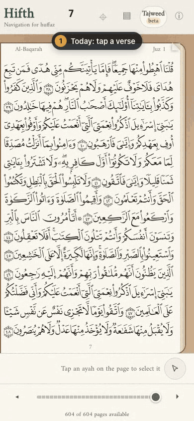
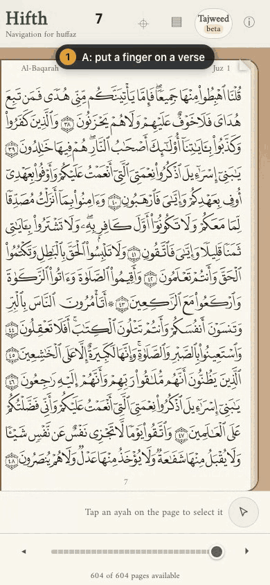
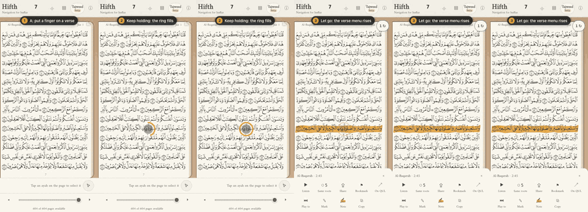

# How should an options note show a tap, a hold, and what happens after?

*Research note A of two, 2026-10-01. Written independently of note B; a third pass compares them. It recommends, it does not build: the recording tool and the skill are unchanged.*

> [!tip] Recommended
> **Short looping GIFs of the real app, made by our own small scripts: a finger mark that fills a ring while held, a numbered step label at the top, the last frame held, one clip per option side by side in the table, and a still strip of the same clip folded beneath.** No outside tool draws a held finger on a scripted, re-runnable recording, so we add four small scripts to the recording skill rather than adopt one.

The samples below were made that way today, from the public app, in about a minute each.

---

## A few words, defined once

- **Tap** — a finger goes down and up straight away.
- **Hold** — a finger stays on one spot, without moving, for about a third to half a second.
- **Finger mark** — a grey dot drawn where the finger is, so a viewer can see a touch that a screen recording never shows.
- **Ring** — a circle around the finger mark that fills while the finger stays, so a viewer can tell a hold from a tap.
- **Step label** — a numbered caption at the top of the clip: "1 Put a finger on a verse", "2 Keep holding", "3 Let go".
- **Still strip** — a few frames of the clip laid side by side as one picture.

## What does it look like?

| Today: a tap | Option A: a hold |
| --- | --- |
|  |  |

> [!example]- The hold, as six stills (for print, or if the GIF does not play)
> 

Checked by eye, frame by frame: step 1 over a calm page; step 2 with the grey fingertip on verse 2:45 and the amber ring filling, then full; step 3 with the verse painted and the menu up with its four new buttons; the last frame held for a second and a half.

A tap shows a small ripple and no ring; a hold shows the ring fill. That one difference is what the owner's comment said was missing.

## What does a reader need to see in the clip?

- **That a finger touched, and where** — a screen recording shows no finger at all.
- **How long it stayed** — a ring that fills, so a tap and a hold look different.
- **What happened, in order** — a numbered step label that changes as each thing happens.
- **The end state long enough to read it** — the last frame held, not a loop that snaps back at once.
- **Options side by side, at phone size** — so the eye can compare them without scrolling.

## Can Obsidian play a moving picture at all?

- **GIF: yes**, in the note and in a table cell, looping on its own, with the same size syntax as a still. This is the one format that plays everywhere this note will be read: Obsidian, GitHub, and the public site.
- **Animated WebP: listed as an image format** by Obsidian; that it animates is my inference from Obsidian running on Chromium, not something I saw documented.
- **MP4 and WebM: they embed, but they do not loop or start on their own** — they show a player with a play button. A video tag with autoplay and loop was reported to work only with a full path on one computer, which breaks for anyone else.
- **Several GIFs in one note can make Obsidian sluggish**; the usual answer is to fold the long ones inside a closed callout, so they only load when opened.

## How big are the files?

The same 6.8-second hold clip, 390 pixels wide, measured here:

| Format | Size | Loops on its own in Obsidian? |
| --- | --- | --- |
| GIF, 256 colours, dithered, 12 frames a second | 1.48 MB | yes |
| **GIF, 64 colours, no dither, 10 frames a second, start trimmed** | **0.95 MB** (0.89 MB in the final cut) | yes |
| Animated WebP | 0.56 MB | probably (not checked) |
| MP4 | 0.12 MB | no, shows a player |

At 64 colours the page, the amber ring and the orange verse all read cleanly, because the app's page is a few flat colours.

The best GIF maker, gifski, makes files 20–70% smaller than the method used here, but on this machine it would not start: it was built against an older ffmpeg than the one installed. Upgrading it is one command; I did not, to leave system packages alone.

## What do other people use?

- **Design systems show timing as short looping clips.** Google's Material motion pages are mostly animated GIFs, some showing normal speed and slow motion side by side; Apple's gesture pages use short videos. Both name a tap and a "touch and hold" as different gestures with different jobs.
- **Handoff notes give before and after frames plus the duration** — the still strip folded under each clip is that.
- **Storyboards number their frames and caption each one** — the step label is that, drawn into the clip.
- **Playwright, which our recorder is built on, can now draw a mouse pointer and chapter titles into a recording**, but it has no finger, no hold and no ring. Its touch support is a tap only; a request for press-and-hold was closed as low priority.
- **The phone simulators can show touches**, but Apple's setting does not appear in a scripted recording, and both need a real phone build we do not have.
- **Small web libraries draw taps on a page**; the one I read draws a dot per tap and nothing for a hold.
- **Desktop recorders (Kap, CleanShot, Screen Studio) and walkthrough makers (Arcade, Supademo)** highlight clicks and export GIFs, but a person drives them by hand, so a clip cannot be remade after the app changes.
- **The closest idea is charm's VHS**, which writes terminal GIFs from a short script file and remakes them on every change. That is the shape to copy: a script per clip, the GIF made from it.

## What are the options?

| | How | Good | Costs | Commits us to |
| --- | --- | --- | --- | --- |
| **A. Our own scripts, GIFs (recommended)** | Our recorder plus a finger-mark script and a GIF script | Shows hold versus tap; remade by one command; plays everywhere | Four small scripts to keep; GIFs near 1 MB each | A hold step in the recorder; GIFs committed beside the note |
| **B. Stills plus numbered strip only** | What the notes do today, with a frame strip | Tiny files; no new tools | The ring filling and the menu rising are not seen, only implied | The owner's comment stays unanswered |
| **C. Playwright's own pointer and titles** | Turn on its built-in action markers | Nothing to write | A mouse arrow, not a finger; no hold; adds about half a second per action | Fine later for desktop clips, not phone ones |
| **D. Video files** | Keep the recorder's video, embed it | Ten times smaller | Does not loop or start on its own in Obsidian; a play button in each table cell | Readers must press play on each option |
| **E. A desktop or walkthrough tool** | Record by hand | Polished look | Not scripted, cannot be remade, some are paid | A re-shoot by hand after every app change |
| **F. Phone simulator touches** | Turn on the simulator's touch dots | The real finger dot | Not shown in scripted recordings; needs a native build | Out of reach for this web app |

## What should the recording skill get?

Four scripts in the skill's own scripts folder, each one job:

- **touch-marks.js** — draws the finger mark, the filling ring, the tap ripple and the numbered step label onto the page; it never takes a touch itself. The version here is in this note's mocks folder.
- **A hold step in the recorder** — hold a point or a named element for a set time, then lift. Today a page script stands in for it (press-verse.js here); built into the recorder it could use a real held touch instead of a made-up one.
- **make-gif.sh** — cut the page loading off the front, hold the last frame, 10 frames a second, 64 colours, and warn if the file is over 1 MB.
- **strip.sh** — the still strip: a few chosen frames side by side, for checking by eye and for the folded fallback.

A fifth, **side-by-side.sh**, joins two option clips into one GIF with a label over each, if table cells turn out to drift out of step; the table was enough here.

## What should the skill text say?

- **Show touches whenever the clip is about a touch.** Load the finger-mark script before the first step; label each step with a number and a few words.
- **Make the ring last as long as the app's real hold**, so the clip does not teach a timing the app does not have.
- **Keep the clip short and the end long**: one gesture per clip, under about 7 seconds, last frame held a second and a half.
- **Check it by eye before calling it done**: make the strip, look at it, say what each frame shows.
- **Commit the GIF a note embeds, and the script that remakes it; do not commit raw recordings.** A note's picture is part of the note, so it is committed beside it, under about 1 MB, with the script one folder down. The raw videos and scratch frames stay out of the repository, as today.
- **Fold long or extra clips** inside a closed callout, so a note with many clips stays quick to open.
- **Record only the public app.** Never the private pitch build, and no commentary text in any frame.

## What did the samples teach that a list would not have?

- **The app reacts when the finger lifts, not when the ring fills.** In today's app the menu rises on let-go, so the clip shows "let go, then the menu"; option A as built might open the menu the moment the ring is full. The clip must follow whatever the built version does, which argues for recording the real build, not a mock.
- **A menu script must be ready before the finger goes down**, or the new buttons pop in a frame after the menu rises and the clip shows a flicker that is not the design.
- **The menu rises in one or two frames at 10 a second.** If the rise itself is what is being judged, that clip needs 20 or more frames a second, and a bigger file.
- **The first 1.7 seconds of every recording is the page loading**, so trimming the start is not optional.

## What would change the answer?

- If Obsidian is shown to loop a video with no controls from a path inside the vault, video wins on size by ten times.
- If the gifski maker is working, the same clips come out a third to two thirds smaller.
- If the options are ever desktop flows with a mouse, Playwright's own pointer is enough and the finger mark is not needed.
- If notes start carrying many clips each, a side-by-side GIF per gesture replaces one GIF per cell.

## What is this not settling?

- Which tap-and-hold option to build: that is the tap-and-hold note's question.
- How long the app's real hold should be.

---

## How were these pictures made?

Serve the built app, then run the record script in this note's mocks folder; it records both clips and makes both GIFs and strips:

```
make preview PORT=4181
docs/design/moving-option-pictures-a/mocks/record.sh http://localhost:4181
```

- `mocks/touch-marks.js` — finger mark, ring, ripple, step label.
- `mocks/press-verse.js` — a made-up touch on verse 2:45, held or tapped; stands in for the missing hold step.
- `mocks/fuller-menu-on-open.js` — adds option A's four buttons the moment the menu appears.
- `mocks/record.sh` — the recorder calls, the GIF settings and the strip.

The picture's finger is a made-up touch event sent by a page script, not a real touchscreen, so it proves the clip, not the gesture code.

## Sources

Each says whether I opened the page (**fetched**) or only saw a search result (**snippet**), and the one fact it supports.

**Obsidian**

- https://help.obsidian.md/file-formats — fetched — Obsidian embeds GIF and WebP as images and MP4, WebM, MOV, MKV, OGV as video, depending on the device's codecs.
- https://help.obsidian.md/embeds — fetched — embeds take a width after a bar; nothing about loop or autoplay for video.
- https://forum.obsidian.md/t/loop-video-playback/10892 — fetched — an embedded video does not loop or autoplay; a 2026 reply suggests a GIF instead.
- https://forum.obsidian.md/t/embeded-videos-with-options/63754 — fetched — a video tag with autoplay and loop worked only with a full file path, not a vault-relative one.
- https://forum.obsidian.md/t/a-play-button-for-gifs-to-save-resources/65380 — fetched — several GIFs in one note make it lag; workarounds are folding and hover tricks.
- https://forum.obsidian.md/t/can-animated-gifs-be-made-to-play/32767 — fetched — a GIF saved in the vault plays in a note.

**Recording and touches**

- https://playwright.dev/docs/api/class-screencast — fetched (and the installed version's type file) — Playwright 1.59+ can draw action markers, a pointer and chapter titles into a recording; no touch mark.
- https://playwright.dev/docs/touch-events — fetched — beyond a tap, touch gestures have to be sent by hand.
- https://github.com/microsoft/playwright/issues/10740 — fetched — press-and-hold was requested in 2021 and closed as low priority.
- https://github.com/ExaDev/talktrack — fetched — a Playwright demo recorder with a cursor and captions; no touch.
- playwright-recast (npm) — snippet — an animated cursor and click markers for Playwright recordings.
- https://maestro.dev/blog — fetched (the post on simulator recordings) — the simulator's touch dots do not appear in a scripted simulator recording.
- iOS simulator ShowSingleTouches setting — snippet — a command turns on touch dots in the simulator.
- Android "show taps" setting through adb — snippet — turns on touch dots for a screen recording.
- https://github.com/jonahvsweb/touchpoint-js — fetched — a 4 KB script that draws a dot per tap; no hold state.
- show-touches-js, TouchShow, The Finger — snippet — other tap-drawing scripts.
- https://getkap.co — fetched — open-source recorder that highlights clicks and exports GIF, MP4, WebM, APNG; driven by hand.
- https://screen.studio/guide/auto-zoom — fetched — desktop recorder that zooms on clicks; driven by hand.
- CleanShot X — snippet — highlights clicks and keys while recording by hand.
- Rotato — snippet — device mock-up animations with a keyframe timeline.
- Arcade — snippet — exports GIF or MP4 from a clicked-through demo; API on the top plan only.
- https://docs.supademo.com (export page) — fetched — exports MP4 or GIF from demo steps, up to 70 steps.
- https://github.com/charmbracelet/vhs — fetched — "write terminal GIFs as code": a script file remade into a GIF on every change.

**How designers show timing**

- https://m1.material.io/motion/duration-easing.html — fetched — mobile transitions around 300 ms; entering 225 ms, leaving 195 ms.
- https://github.com/material-components/material-components-android/blob/master/docs/theming/Motion.md — fetched — motion examples are animated GIFs, some at normal and slow speed side by side.
- Apple Human Interface Guidelines, gestures — fetched — tap selects; touch and hold reveals more controls; the page uses short videos.
- Storyboard and motion handoff guides (UX Blueprints, Figma, Interaction Design Foundation) — snippet — numbered captioned frames; handoff gives before and after frames, duration and easing.
- m3.material.io and a Medium article on communicating motion — could not be read (blocked), so not used.

**Making GIFs**

- https://github.com/ImageOptim/gifski — fetched — a GIF maker with better colours across frames; width and quality settings.
- gifski versus ffmpeg size comparisons — snippet — gifski files 20–70% smaller.
- Sizes in *How big are the files?* — measured here, on this clip.
