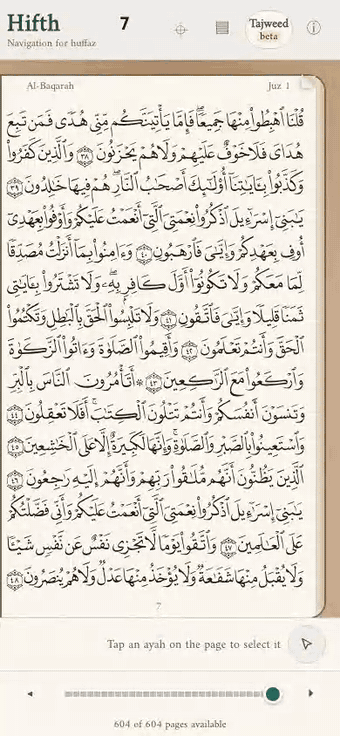
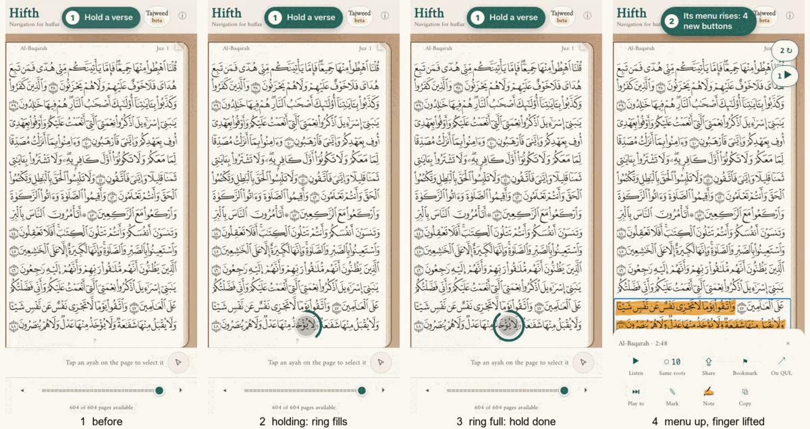
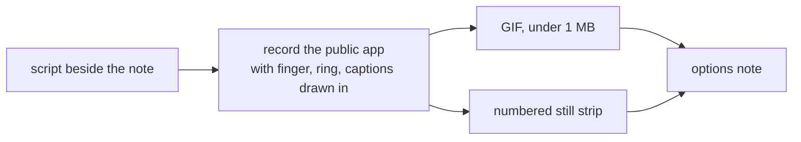

# How should an options note show a tap or a hold as it happens?

*Research note B of two, 2026-10-01. Written to answer a comment on the tap-and-hold note: "the transition/timeline of this is unclear … can Obsidian support gifs? do we need to update our skills to show tapping circle, holding, etc". A checker reads this and note A side by side and writes the one we act on.*

> [!tip] Recommended
> **Short looping GIFs of the real app, made by a script kept beside the note, with a drawn finger and a ring that fills while it is held, and a strip of numbered stills under each one.**
> Build the few small scripts ourselves on top of the recorder we already have; no outside tool draws a hold, and none can be re-run from the repository.

Here is what that looks like, made today from the public app with the scripts this note proposes (option A of the tap-and-hold note):

It is 526 KB, 340 pixels wide, six and a half seconds, and loops. It was made by one script: [mocks/retake.sh](moving-option-pictures-b/mocks/retake.sh).

---

## A few words, defined once

- **Verse** — one ayah, with its number in the round marker at its end.
- **Hold** — keep a finger on one spot without moving it until something happens.
- **GIF** — a picture file that plays a short silent clip over and over by itself. Every browser and Obsidian play it with no button.
- **Video file** — an MP4 or WebM clip. Much smaller than a GIF, but it waits for someone to press play.
- **Still strip** — a row of numbered stills taken from the clip, like the frames of a comic, so the steps can be read at a glance and printed.
- **Finger mark** — a grey dot drawn where the finger is. A screen recording of a web page shows no finger at all, so it has to be drawn in.

## What does a reader of an options note need to see?

Four things the current still pictures cannot carry: **where** the finger went, **how long** it stayed, **what moved** in response and **in what order**.
A still of the menu already open answers none of those: a reader cannot tell a tap from a hold, or whether the menu rose before or after the finger lifted.
A hold is the hardest of these, because the thing that matters is time passing with nothing visibly happening; the ring that fills is what makes the wait visible.
Numbered captions ("1 Hold a verse", "2 Its menu rises") tie the clip to the steps the note talks about, so a comment can say "at step 2 …".
Options must sit side by side at the same size and the same speed, or the reader compares the recording instead of the option.
And the clip must survive a retake: when the app changes, the picture is re-made by running a script, not by someone redoing it by hand.

## Can Obsidian play these?

**GIFs: yes, by themselves, everywhere.** Obsidian lists GIF among the picture types it shows, and a GIF saved in the vault plays and loops inside a note, inside a table cell, and on the public site.
**Video files: only with a press of play.** Obsidian embeds MP4 and WebM with a play button, but has no way to make them start by themselves or loop. People have asked for that since January 2021, and the request is still open.
Writing a raw video tag into the note can make it loop, but Obsidian only finds the file if the tag carries the full path on one person's computer, which breaks for everyone else and on the site.
A community plugin (Autoplay and Loop) adds both, but it is one more thing every reader must install, and one search summary says it was pulled from the plugin list in May 2026 while the plugin page we opened still lists it: unsettled.
Animated PNG is not on Obsidian's list of picture types; animated WebP is a WebP, which is on the list, but we did not test that it animates.
A picture inside a table needs its width written as `\|190` (the bar escaped), as the tap-and-hold note already does.
*Not yet checked by eye:* the sample GIF opened inside Obsidian itself. It was checked frame by frame from the file, not in the app.

## What do people outside this project use?

| Kind of tool | Examples | Draws a hold? | Re-runnable from the repo? | Notes |
| --- | --- | --- | --- | --- |
| Browser test recorders | Playwright (we use it), Puppeteer | No | **Yes** | Playwright 1.59 added captions, chapter cards and a pointer to its recordings; nothing for touch or hold. Puppeteer's screencast is marked obsolete. |
| Phone settings that show touches | iOS Simulator "show single touches", Android "Show taps" | Tap circle only, no ring | Partly | Only for a native app on a simulator or phone, not our web page in a headless browser. |
| Touch-dot scripts for web pages | TouchPoint.js, show-touches-js, TouchShow | No (expanding circle on tap) | Yes | Small, MIT, little upkeep; none fills a ring while held. |
| Desktop screen recorders | Screen Studio, Kap, CleanShot X | No (click highlight) | **No** | Hand-driven; nice zooms and GIF export; Screen Studio is paid. |
| Click-through demo makers | Arcade, Supademo | No | **No** | Captured by hand in a browser extension; hosted; export to GIF or video. |
| Demos written as scripts | charm VHS (for terminals) | n/a | **Yes** | The model to copy: a short script in git, run it, get the GIF. |

What design guides say about showing a gesture: Apple's guidelines describe "touch and hold" as revealing extra controls, without a duration; Google's older Material guide draws long press as "one-finger press, wait, lift" in still pictures.
The research on storyboards (Goldman and others, University of Washington and Adobe) makes the case for the still strip: a storyboard is still like a filmstrip but marked up to show order and direction like an animation, and a ten-minute clip takes ten minutes to watch while a storyboard is taken in at once.
**So the gap is real:** nobody makes a re-runnable recording of a web page that shows a hold. The recorder we already have does the hard part; the missing pieces are small.

## What are the options?

| | **A. Scripted GIF + still strip** (recommended) | B. Scripted video files | C. Hand-recorded with a desktop recorder | D. Still strips only |
| --- | --- | --- | --- | --- |
| What the reader gets | Clip plays and loops by itself, in a table cell, in Obsidian and on the site; numbered stills under it | A play button per option; no loop | A polished clip | Numbered stills, no motion |
| Pros | Shows tap vs hold and order; re-made by one command; nothing to install to view | About **9 times smaller** (the same clip: 88 KB as MP4, 526 KB as GIF) and sharper | Real phone, real finger, smooth zooms; quickest the first time | Smallest; prints; easy to comment on a step |
| Cons | Each clip is half a megabyte to a megabyte in the repository; GIF colours are limited, so text is a little soft | Will not play side by side by itself; three options means three presses at different moments; looping needs a plugin | Cannot be re-made when the app changes without redoing it by hand; paid tools; no hold ring | Cannot show how long a hold lasts or how something slides |
| What it commits us to | Committing small clips under `docs/`; a size limit; a script per note | Every reader installing a plugin, or accepting no loop | Someone redoing every clip by hand on each change | Living without motion |

**What else was considered and is not here:** Playwright's new built-in captions could replace our caption pill, but not the finger or the ring, so they are a detail inside A, not an option. A device frame around the clip (the iPhone outline) is nice-to-have and can come later. gifski, a GIF maker known for smaller files, was ruled out for now: it is a different licence (AGPL) and on this Mac it broke after a Homebrew update, unable to find the ffmpeg it was built against.

## What did making the sample teach us?

The recording of the same steps came out at **anywhere from 0.8 MB to 2.8 MB** from run to run, with the same encoding settings.
The cause is faint flicker the browser's recording adds between frames, which makes the GIF redraw the whole page each frame; smoothing it over time and dropping frames that barely changed brought the worst run to under 0.6 MB.
Dropping frames also dropped the pause at the end of the loop; holding the last frame for a second and a half puts it back.
The recorder records at the window's size, not the phone's sharper screen size, so the Arabic is softer than a screenshot; recording at the phone's pixel size is worth trying.
The first half second of every recording is a blank grey frame and must be cut.
A caption longer than about 28 characters wraps and covers the app's own buttons; captions must be short.
A mock that adds buttons after the menu has risen makes the menu jump taller in one step; a mock that matters for the clip should be in place before the step that reveals it.
Text that only exists in the picture (like the numbered captions) must stay in English, and the clip must be the public app: no Study Quran text, no private demo.

## Which scripts belong in the record-demo skill?

Four small files in `.claude/skills/record-demo/scripts/`, each one job:

- **touch-marks.js** — draws the finger mark, the ring that fills over a given time, and a numbered caption, on top of the page without catching touches. The version in this note's folder works today.
- **make-gif.sh** — turns a recording into a GIF: cuts the blank start, smooths the flicker, drops near-repeat frames, holds the last frame, and **refuses a result over 1 MB** with the width and speed to try next.
- **frame-strip.sh** — takes the stills at given moments and lays them out in a row with numbered labels.
- **side-by-side.sh** — puts option A, B and C's clips into one GIF with the letter above each, so they play in step and a reader compares the option, not the timing.

And three changes to the recorder itself, recommended here, not made:

- a **hold** step (a point and a time) that presses, waits, lifts and draws the finger and ring by itself;
- a **tap** step that does the same with no ring;
- recording at the phone's pixel size rather than the window's.

## What should the skill say?

Proposed text for the record-demo skill, replacing the part that says never to commit a recording:

> **When a clip belongs in a note.** A clip that an options note embeds is committed beside the note, in the note's own folder, with the script that made it in a `mocks/` folder next to it. Keep it under 1 MB (make-gif refuses more), 12 frames a second, about 340 wide, under 8 seconds, looping, with the last frame held. Put a numbered still strip under every clip. Record only the public app, never the private demo, and draw no Study Quran text into it. Every other recording, a check, a draft, a one-off, stays out of the repository: keep the command, not the file.
>
> **Showing a touch.** A recording of a web page shows no finger. Load touch-marks first; mark every tap with the finger, every hold with the finger and a filling ring, and number the steps with short captions (under about 28 characters). Retake the whole clip by running the script, never by editing the GIF.
>
> **Look before you commit.** Tile every frame of the GIF into one sheet and read it: the start is not blank, the ring fills, the steps are in order, nothing covers the part of the page the option is about.

## What would change the answer?

- **Obsidian learning to loop and auto-start video** (the 2021 request), or the reader accepting one plugin: then video files win, at a ninth of the size.
- **The repository getting heavy:** at about half a megabyte per clip, a hundred clips is fifty megabytes; past that, move clips out to a file store and keep only the script and the still strip in git.
- **Needing a real phone in the clip** (the native shell, a real swipe): then the iOS Simulator with touches shown, recorded from its own window, is the tool, and the scripts still apply after.
- **gifski working again on this Mac:** worth a size test against the settings above; not worth a licence question until then.

## What is this not settling?

Which of the tap-and-hold options wins; how long a hold should be; whether the app itself should show a ring while you hold (that is a design question for the app, not for the pictures).

---

## Sources

Each line says whether the page was opened and read (**fetched**) or only seen as a search result (**snippet**).

- https://obsidian.md/help/file-formats — **fetched** — the picture and video types Obsidian shows (GIF yes; APNG not listed).
- https://obsidian.md/help/embeds — **fetched** — how pictures and videos are embedded, and the width syntax.
- https://forum.obsidian.md/t/loop-video-playback/10892 — **fetched** — request for looping video, opened 2021-01-04, still open, last reply 2026-04-06.
- https://forum.obsidian.md/t/embeded-videos-with-options/63754 — **fetched** — a raw video tag only finds the file with a full path on one computer.
- https://forum.obsidian.md/t/can-animated-gifs-be-made-to-play-in-obsidian/32767 — **fetched** — GIFs saved in the vault play.
- https://forum.obsidian.md/t/resize-image-within-a-table/30687 — **fetched** — the bar in a picture's width has to be escaped inside a table.
- https://community.obsidian.md/plugins/autoplay-and-loop — **fetched** — the Autoplay and Loop plugin, version 1.0.2, listed.
- Search result for "obsidian-autoplay-and-loop plugin" — **snippet** — says the same plugin was removed from the list on 2026-05-27. Conflicts with the page above.
- https://playwright.dev/docs/videos — **fetched** — recordings default to the window size scaled to fit 800 by 800.
- https://playwright.dev/docs/api/class-screencast — **fetched** — captions, chapter cards, overlays and a pointer on recordings; nothing on touch or hold.
- https://github.com/microsoft/playwright/releases/tag/v1.59.0 — **fetched** — the screencast features arrived in 1.59.
- https://playwright.dev/agent-cli/commands/video-recording — **fetched** — the same features from the command line.
- https://pptr.dev/api/puppeteer.page.screencast — **fetched** — Puppeteer's recorder, marked obsolete, needs ffmpeg.
- https://xenodium.com/show-ios-simulator-touches/ — **fetched** — the iOS Simulator setting that shows touches.
- Search result for Android "Show taps" — **snippet** — Developer options has "Show taps" and "Pointer location".
- https://github.com/jonahvsweb/touchpoint-js — **fetched** — touch-dot script for web pages, MIT, circle on tap, nothing for hold.
- https://github.com/ipepe/show-touches-js — **fetched** — touch-dot script, MIT, four commits, hold not mentioned.
- https://github.com/jbjord/TouchShow — **snippet** — numbered touch dots.
- https://screen.studio/ — **fetched** — desktop recorder with click effects, iPhone over cable, GIF export, paid.
- https://github.com/wulkano/Kap — **fetched** — open-source Mac recorder, exports GIF, MP4, WebM and APNG.
- Search results for Kap and CleanShot X — **snippet** — both highlight clicks; CleanShot exports GIF.
- Search result for Rotato — **snippet** — 3D phone frames around a recording.
- https://www.arcade.software/ — **fetched** — click-through demos captured in the browser, GIF export.
- https://www.supademo.com/ — **fetched** — the same, captured by hand, with an API.
- https://github.com/charmbracelet/vhs — **fetched** — terminal demos written as a script in git and re-run to make the GIF.
- https://developer.apple.com/tutorials/data/design/human-interface-guidelines/gestures.json — **fetched** — "touch and hold" reveals extra controls; no duration given.
- https://m1.material.io/patterns/gestures.html — **fetched** — long press drawn in stills as "one-finger press, wait, lift".
- https://grail.cs.washington.edu/projects/storyboards/paper/review-4-19.pdf — **fetched (first page)** — storyboards are still but marked up to show order and direction; a clip takes as long to watch as it lasts.
- Search results on long-press timing and motion timing — **snippet** — iOS long press around half a second; short UI motions 100 to 500 ms; three to six frames to show one action. Not relied on.
- https://m3.material.io/styles/motion/overview and https://developer.apple.com/design/human-interface-guidelines/gestures — **fetched, empty** — both pages are drawn by script and returned nothing.
- https://blog.pkh.me/p/21-high-quality-gif-with-ffmpeg.html — **fetched** — the colour-table settings used here: favour moving pixels, ordered dithering, redraw only the changed box.
- https://ayosec.github.io/ffmpeg-filters-docs/7.1/Filters/Video/tpad.html — **fetched** — holding the last frame.
- https://gif.ski/ and https://github.com/ImageOptim/gifski — **fetched** — gifski's options and its AGPL licence.
- Search result comparing gifski with ffmpeg — **snippet** — gifski about 40% smaller at the same quality. Not tested here.
- Our own measurements, this session — the size range from run to run, MP4 against GIF, the blank first frame, gifski failing to start.
