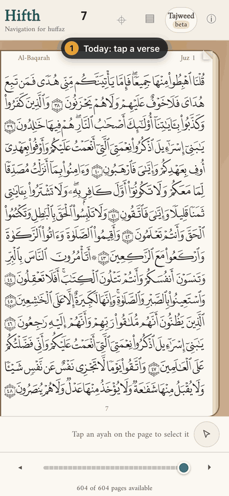
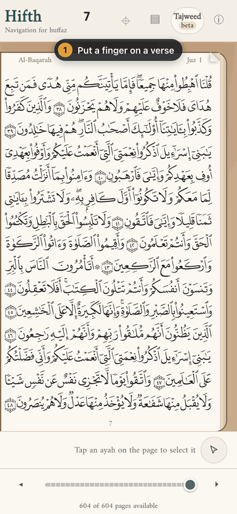
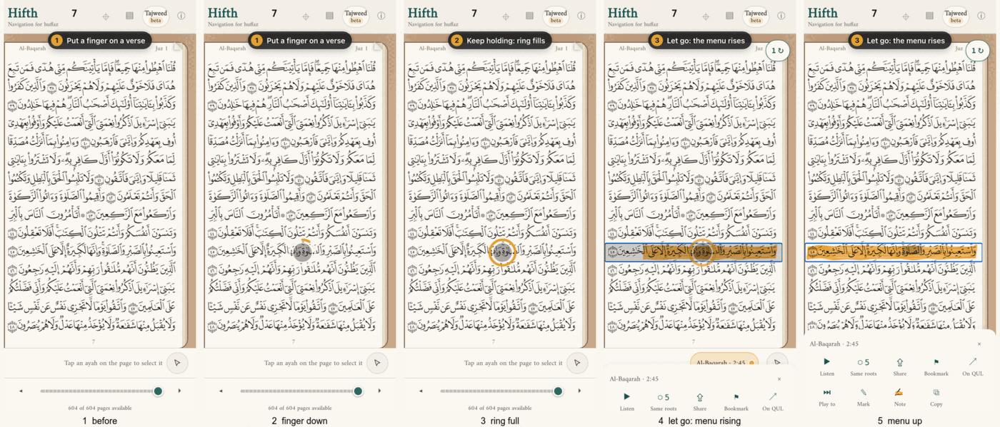
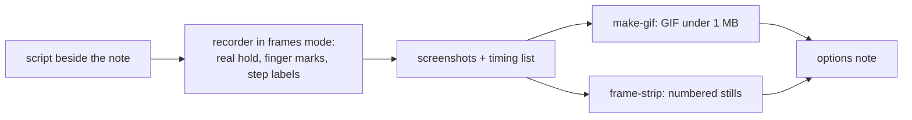

# How should an options note show a tap or a hold as it happens?

*Checker's note, 2026-10-01. It reads [research note A](moving-option-pictures-a.md) and [research note B](moving-option-pictures-b.md) side by side, re-opens their sources, re-measures where they disagree, and is the one to act on. The two notes stay as the record it was built from. Nothing here is built into the recording tool or the skills yet.*

> [!tip] Recommended
> **Short looping GIFs of the public app, made by our own small scripts.** The recorder makes a real held touch on the verse, a grey finger mark and a ring that fills are drawn from that touch, a numbered step label says what is happening, and the last frame is held for a second and a half.
> **Take the frames as screenshots, not as the browser's video.** Screenshots are twice as sharp and carry no flicker, so the GIF comes out about 140 KB instead of 0.5 to 0.9 MB.
> **Put one numbered still strip under every clip, folded shut.** Commit the GIF, the strip and the script that remakes them beside the note; keep raw recordings out; no GIF over 1 MB.

Both researchers recommended the same thing in outline; the measurements below changed how the clip is recorded and shrunk it six times.

| Today: a tap | Option A of the tap-and-hold note: a hold |
| --- | --- |
|  |  |

> [!example]- The hold as five numbered stills
> 

The tap GIF is 129 KB and the hold 143 KB, both 390 pixels wide (the phone's own width), made by one script: [mocks/remake.sh](moving-option-pictures/mocks/remake.sh).
Checked by eye, frame by frame: a calm page under step 1; the finger lands on verse 2:45; the ring fills under step 2; the finger lifts, the verse is painted and the menu rises in about two frames under step 3; the last frame is clean, with no leftover finger mark.
*Not yet checked by anyone:* that these GIFs play inside Obsidian itself. All three of us checked the files, not the vault.

---

## A few words, defined once

- **Verse** — one ayah, with its number in the round marker at its end.
- **Tap** — a finger goes down and up straight away.
- **Hold** — a finger stays on one spot, without moving, for about half a second.
- **Finger mark** — a grey dot drawn where the finger is; a recording of a web page shows no finger, so it has to be drawn in.
- **Ring** — a circle round the finger mark that fills while the finger stays, so a tap and a hold look different.
- **Step label** — a numbered caption at the top of the clip, such as "2 Keep holding: ring fills".
- **Still strip** — a few frames of the clip side by side as one picture, numbered.
- **GIF** — a picture file that plays a short silent clip over and over by itself, with no play button.

## What did both researchers agree on?

- A GIF is the only moving picture that plays and loops by itself in Obsidian, in a table cell, on GitHub and on the public site.
- A video file is about ten times smaller but shows a play button and will not loop; a raw video tag only works with a full path on one computer.
- No outside tool draws a held finger on a recording that can be re-made from a script; build the small missing pieces on the recorder we already have.
- The shape to copy is charm's VHS: a short script in the repository, run it, get the GIF.
- Draw a finger mark, a filling ring and numbered step labels; hold the last frame a second and a half.
- Any mock that adds buttons must be loaded before the finger goes down, or the menu jumps taller a frame after it rises.
- Commit the GIF a note embeds and the script that remakes it; do not commit raw recordings; record only the public app.
- The four scripts: finger marks, a GIF maker with a 1 MB limit, a still strip, and a side-by-side joiner.
- The recorder needs a hold step and a tap step.
- gifski, the GIF maker known for smaller files, would not start on this Mac (it was built against an older ffmpeg). It is still broken; the checker did not upgrade it either.

## Where did they disagree, and what did the measurements say?

Every size below comes from the same few recordings of the same hold on verse 2:45, encoded each researcher's way.

| Question | Note A said | Note B said | Measured | Verdict |
| --- | --- | --- | --- | --- |
| How do we keep the GIF small? | 64 colours, no dither, 10 a second: about 0.9 MB | Smooth the flicker over time and drop frames that barely changed: under 0.6 MB | On one recording: A's way 802 KB, A plus smoothing 720 KB, A plus dropping 272 KB, B's full way 279 KB. Over four recordings A's way gave 539 to 802 KB and B's 212 to 279 KB | **B was right about the cause** (the browser's video flickers), but **dropping frames does nearly all the work**; colours and dither barely matter. Better still: screenshots have no flicker at all, 133 to 138 KB |
| Does dropping frames have a cost? | Did not try | Lost the pause at the end; fixed by holding the last frame | In three of the test GIFs the dropped frames left a half-faded finger mark frozen on the long final frame | **A risk B did not see.** With screenshots nothing needs dropping. If a video ever must be dropped, the finger mark has to vanish at once, and the last frame must be looked at |
| Can we record at the phone's full sharpness? | Did not try | Worth trying | The browser's video records at window size only: asking for twice the size gives the same small picture in the top-left corner with grey padding, for both of Playwright's video recorders. A screenshot loop gives full-sharpness frames at about 19 a second | **Screenshots.** The recorder already sets the phone's sharpness for screenshots; the video simply ignores it |
| How wide? | 390, the phone's width | 340 | From screenshots: 135 KB at 390, 231 KB at 585 | **390.** It is the size the reader would see, and the 1 MB limit is far away |
| How is the touch made? | Made-up touch events sent to the verse by a page script; the ring is drawn from them | The ring is drawn on a timer while the recorder clicks the verse | A real held touch through the browser's own input works: the finger mark and ring are drawn from it, the app opens the menu, and the fuller menu shows | **Neither: a real touch.** In B's clip the app received a click while the picture showed a hold, so the clip can teach a hold the app never saw. A real touch also showed a blue outline round the chosen verse that A's made-up events did not; whether a real phone shows it too is a question for the app, not this note |
| Where does the still strip go? | Six stills, folded under the clip, for print or if the GIF does not play | Four stills under every clip, always shown, with numbered labels | Strip 103 KB. Several GIFs in one note are known to make Obsidian slow; folded pictures only load when opened | **Both:** one strip under every clip (B), numbered labels (B), folded shut in a closed callout (A) |
| Which verse? | 2:45 | 2:48 | On page 7 the risen menu reaches the last lines, where 2:48 sits; 2:45 stays clear above it | **2:45**, which stays in view above the menu; pick a verse the menu does not cover |
| Is animated WebP worth it? | 0.56 MB against 0.95 MB for the GIF | Not tested | From clean screenshot frames the WebP is larger: 201 KB against 138 KB for the GIF. Obsidian lists WebP as a picture but does not say it animates | **No.** Its only advantage came from the flicker, which screenshots remove |
| How long can a step label be? | No rule | Under about 28 characters, or it wraps over the app's buttons | B's own "Keep holding: the ring fills" is 29 characters and did wrap in its clip | **B's rule is right; B broke it.** Keep labels short, then look at the frame |
| Was the Autoplay and Loop plugin pulled? | Not mentioned | Unsettled: a search summary said removed, the plugin page said listed | It is missing from Obsidian's official plugin list fetched today, and a plugin statistics site gives the removal date as 2026-05-27 | **Removed.** The plugin page is out of date. It was never a good answer anyway: every reader would have to install it |

## What did only one of them find?

Found only by note A:

- The app reacts when the finger lifts, not when the ring fills; the clip must follow what the built version does, so record the real build once an option exists.
- The menu rises in one or two frames at 10 a second; judging the rise itself needs 20 or more a second.
- The first 1.7 seconds of a video recording is the page loading. With screenshots the frames start when the script says, so there is nothing to cut.
- Several GIFs in one note make Obsidian sluggish, so extra clips fold shut.
- Playwright's press-and-hold request was closed without being built (re-opened: it is closed and labelled as collecting feedback).

Found only by note B:

- The same recording varied from 0.8 to 2.8 MB run to run, and the cause is flicker the browser's video adds.
- A picture inside a table needs its width bar escaped, as in this page's table.
- Storyboard research backs the still strip: a strip is read at a glance, a clip takes as long as it lasts.
- gifski is AGPL-licensed, so it is a licence question as well as a broken install.
- Puppeteer's recorder is marked obsolete, so it is no fallback.

Found only by the checker:

- Screenshots beat the browser's video on both sharpness and size.
- Dropping frames can freeze a half-faded finger mark on the last frame.
- A real held touch can be sent through the browser's own input, which neither researcher used.

## Which scripts go in the record-demo skill?

Four files in `.claude/skills/record-demo/scripts/`, none of them built yet:

| Script | One line | Inputs |
| --- | --- | --- |
| `touch-marks.js` | Draws the finger mark, the ring, the tap ripple and the step label from the page's real pointer events, never catching a touch itself (start from note A's, which already does this) | the hold time to fill the ring over (match the app's); how fast the mark fades (0 when frames will be dropped); labels through `__step(n, text)` |
| `make-gif.sh` | Turns frames or a video into a GIF: 390 wide, 10 a second, 64 colours, last frame held 1.5 s; smooths and drops frames only when the source is a video; refuses anything over 1 MB and prints the width and speed to try next | a frames list or a video; start time (video only); width; frames per second; colours; output path |
| `frame-strip.sh` | Lays chosen frames side by side with numbered labels, for the folded strip and for checking by eye | a frames list or a GIF; the frame numbers; one label each; output path |
| `side-by-side.sh` | Joins two to four option clips into one GIF with a letter over each, so they play in step (only when table cells drift apart) | the GIFs; their letters; output path |

There is no press script: the made-up press note A needed is replaced by a hold step in the recorder.

## What should the recorder gain?

Steps for its little step language, recommended here and not made:

- **`hold=<css>|<ms>`** or **`hold=<x>,<y>|<ms>`** — put a real finger down through the browser's own touch input, wait, lift.
- **`tap=<css>`** or **`tap=<x>,<y>`** — the same, lifted at once.
- **`step=<n>|<text>`** — set the numbered step label (needs `touch-marks.js` loaded).
- **A frames mode, `--frames <dir>`** — instead of video, take screenshots at the phone's sharpness as fast as they come and write a list of each frame and how long it shows, ready for `make-gif.sh`.

How it fits together:

## What should the record-demo skill say?

This text replaces the skill's "Why not commit it" part:

> **When a clip belongs in a note.** A clip that an options note embeds is committed in the note's own folder, with its numbered still strip and the script that remade it in a `mocks/` folder beside it. Every other recording (a check, a draft, a one-off) stays out of the repository: keep the command, not the file. Raw videos and frames always stay out.
>
> **Size.** No committed GIF over 1 MB; `make-gif.sh` refuses more. Aim for 390 wide, 10 frames a second, 64 colours, one gesture per clip, under about 7 seconds, last frame held a second and a half.
>
> **Record frames, not video, for a clip you commit.** Use the recorder's frames mode: screenshots are twice as sharp and have no flicker, so nothing is dropped and the file is a fraction of the size. Only fall back to video for long clips, and then the finger mark must vanish at once.
>
> **Showing a touch.** A recording of a web page shows no finger. Load `touch-marks.js` before the first step and drive every touch with the recorder's `hold=` or `tap=` steps, so the ring is drawn from a real touch the app also received. Make the ring fill over the app's real hold time. Number the steps with labels under about 28 characters. Load any mock before the step that reveals it.
>
> **Look before you commit.** Make the strip, open it, and say what each frame shows: the finger lands where intended, the ring fills, the steps are in order, nothing covers the verse the option is about, and the last frame has no leftover finger mark.
>
> **Only the public app.** Never the private pitch build, and no Study Quran text in any frame or label. Labels are English.

## What should the other two skills say?

- **write-obsidian-note:** When a note shows a tap, a hold or anything that moves, embed a looping GIF made by the record-demo skill, with its numbered still strip folded shut under it in a closed `[!example]-` callout. Inside a table, escape the width bar (`\|190`).
- **decide:** When options differ in timing or gesture, show each one as a clip of the same length, side by side at phone size, and commit the script that remakes them so the pictures can be retaken when the app changes.

## What would change the answer?

- Obsidian looping and starting video on its own (asked for since January 2021, still open): video would then win on size.
- gifski working again, and its licence accepted: worth one size test; screenshots already removed most of what it would save.
- A clip that must judge a fast movement (the menu rising): that clip needs 20 or more frames a second and a bigger file.
- A native phone build: the simulator's own touch dots would show a real finger, and these scripts would still make the GIF and the strip.

## What is this not settling?

- Which tap-and-hold option to build; that is the tap-and-hold note's question.
- How long the app's real hold should be.
- Whether the blue outline a real touch left round the verse is a bug in the app; it was seen in these clips and is passed on, not judged.

---

## How was this measured?

> [!example]- The measurements in detail
> Built the public app and served it on this Mac; recorded the same hold on verse 2:45 of page 7 at phone size (390 by 844, twice-sharp screen, touch on).
> Four browser-video recordings plus one with a real touch, each encoded six ways: A's way, A plus smoothing, A plus frame dropping, A plus both, B's way, and B's way without its flicker fix.
> Asked both Playwright video recorders for twice the window size: each gave the same 390 by 844 picture in the top-left corner of a grey 780 by 1688 frame.
> Took screenshots in a loop instead: 19 to 20 a second at full sharpness, each with the time it was taken, turned into a GIF that shows each frame for as long as it really lasted.
> Turned off ffmpeg's habit of only redrawing the pixels that changed: the screenshot GIF doubled, 138 KB to 272 KB, so that default stays on.
> Looked at every frame of every GIF as a tiled sheet, and at the last frame on its own, before trusting a size.
> The recording scripts are in [mocks/](moving-option-pictures/mocks/): `remake.mjs` (one clip, real touch, screenshots) and `remake.sh` (both clips, both GIFs, the strip, the 1 MB check). They reuse note A's finger-mark and fuller-menu scripts.

## Sources

Each says what the checker found when it re-opened the claim: **confirmed**, **contradicted**, **snippet only** (seen in a search result, never opened by anyone), or **not re-opened** (one researcher opened it and nothing here hangs on it).

**Obsidian**

- https://obsidian.md/help/file-formats — **confirmed** — GIF and WebP are pictures; MP4 and WebM are video; animated PNG is not listed; nothing says WebP animates.
- https://forum.obsidian.md/t/loop-video-playback/10892 — **confirmed** — request for looping, self-starting video, opened 2021-01-04, still open.
- https://forum.obsidian.md/t/embeded-videos-with-options/63754 — **confirmed** — a video tag with autoplay and loop works, but only with a full file path, not a vault-relative one.
- https://community.obsidian.md/plugins/autoplay-and-loop — **contradicted** — still shows the plugin, but it is gone from Obsidian's official plugin list (https://github.com/obsidianmd/obsidian-releases, community-plugins.json, fetched 2026-10-01).
- Search result that the Autoplay and Loop plugin was removed on 2026-05-27 — **confirmed** — by the official list above and by the obsidian-stats plugin page.
- https://forum.obsidian.md/t/a-play-button-for-gifs-to-save-resources/65380 — **not re-opened** — several GIFs in one note make it lag.
- https://forum.obsidian.md/t/resize-image-within-a-table/30687 — **not re-opened** — the width bar must be escaped in a table; this page uses it and the existing tap-and-hold note does too.

**Recording and touches**

- https://playwright.dev/docs/videos and https://playwright.dev/docs/api/class-screencast — **confirmed by measurement** — both recorders capture at window size; captions, chapter cards and a pointer, nothing for touch.
- https://playwright.dev/docs/touch-events — **confirmed** — the installed Playwright's touchscreen has a tap and nothing else.
- https://github.com/microsoft/playwright/issues/10740 — **confirmed** — press-and-hold and multi-finger touch requested in 2021; closed, labelled as collecting feedback.
- https://github.com/ipepe/show-touches-js — **confirmed** — its script listens for touch start, move and end and moves a fixed two-circle picture with the finger; nothing changes while a finger is held.
- https://github.com/jbjord/TouchShow — **confirmed** (was snippet only in both notes) — draws numbered dots that fade; nothing for a hold.
- https://github.com/ThePatriczek/playwright-recast — **confirmed** (was snippet only in note A) — MIT, turns a Playwright trace into a video with a moving mouse cursor and click highlights; nothing for touch, tap or hold.
- https://github.com/jonahvsweb/touchpoint-js — **not re-opened** — both notes read it the same way: a dot per tap, nothing for a hold.
- https://xenodium.com/show-ios-simulator-touches/ and https://maestro.dev/blog — **not re-opened** — simulator touch dots exist but do not appear in a scripted recording; out of reach for a web page.
- Android "Show taps" — **snippet only**.
- https://pptr.dev/api/puppeteer.page.screencast — **not re-opened** — Puppeteer's recorder is marked obsolete.
- https://getkap.co, https://screen.studio, https://www.arcade.software, https://www.supademo.com — **not re-opened** — both notes agree all are driven by hand.
- CleanShot X, Rotato — **snippet only**.
- https://github.com/charmbracelet/vhs — **not re-opened** — both notes fetched it and agree.

**Making GIFs**

- https://blog.pkh.me/p/21-high-quality-gif-with-ffmpeg.html — **not re-opened; measured instead** — the colour settings it describes change the size little here; dropping repeated frames and avoiding flicker matter far more.
- https://github.com/ImageOptim/gifski — **not re-opened** — AGPL; still broken on this Mac and left alone.
- Search results that gifski makes files 20 to 70 percent smaller — **snippet only** — not testable here.

**How designers show timing**

- Material motion pages, Apple's gesture guidance, the University of Washington storyboard paper — **not re-opened** — background for why a clip and a strip both help; nothing here depends on them.
