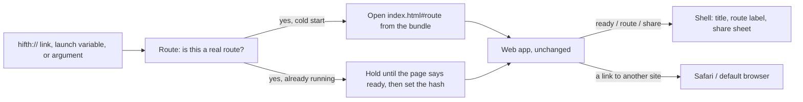

# The Mac and iPad shell: what a rough build taught us

> A thin Apple app around the web app, built 2026-09-29 as a proof-of-concept and then kept.
> It exists for one reason: a mus'haf on an iPad, and a Mac window with a real title bar, feel
> like a product in a way a browser tab does not, and the pitch to The Study Quran team is
> better for it. The public site does not change. Nothing here reaches it.

**Status:** built, tested, and in use for the pitch. Not in any store. The open questions are
at the end, in §⑧, and every one has a row in `docs/issues.json`.

## The short version

- **What it is.** One Swift app, two targets (Mac, iPad), one source folder. It hosts the web
  app exactly as built, served from inside the app bundle. The shell adds no page grammar, no
  screens of its own, and no data: it opens a route, shows what the web app shows, and hands
  the share sheet and outside links to the operating system.
- **What it took.** About a day, most of it on four things the web app could not know it was
  inside an app: where to serve the files from, how to open at a verse, how a shared link
  stays a public link, and how the app says "I am ready" so a test can wait for it.
- **How to drive it.** `make app-run-mac`, `make app-run-ipad`, `make app-shot`, `make
  app-open`, `make app-test`. The `native-shell` skill lists them with one line each.
- **What it does not settle.** Whether a build with the held commentary may go to outside
  testers through TestFlight. That is the `native-testflight-licence` decision, and it gates
  the first upload, not the build.

Glossary, once: a **route** is the part of a Hifth link after the `#`, such as
`/hafs-kfqc/2:255` (edition, then a verse, page or range); a **shell** is the native app that
holds the web app; the **pitch build** is the private web build that carries The Study Quran's
commentary, and the **public build** is what the site ships.

## What does the shell actually do?

Three pieces, and each one is small on purpose:

1. **A private address for the files.** The web app is served from `hifth-app://app/…`, by
   the app itself, out of the copied build folder. The address never changes, because it is
   also where the reader's bookmarks and notes are stored.
2. **A route parser.** A `hifth://` link, a launch environment variable or a `--route=`
   argument each carry a route verbatim. The parser accepts `/<edition>/<target>[?query]` and
   nothing else; a bad link is dropped, not opened.
3. **A three-word bridge.** The page tells the shell `ready`, `route` and `share`. The shell
   tells the page one thing at start, in a small object: that it is inside a shell, which
   platform, and the public site's address for links. Since 2026-09-29 the page also lends the
   shell one action, turning the page, for the Mac's Page menu (see ④).

## What did the rough build find that a list would not have?

These are the things that only showed up once the app was running. Each one changed the code.

- **The files could not be opened as plain files.** WebKit will show a page opened from a
  file path, but it refuses to *fetch* other files from one, and every page of the mus'haf is
  fetched. The app booted to an empty stage. Serving through the app's own scheme fixed it,
  and the app then behaved as if it were on a normal website: secure context, caches,
  storage, all reported present (the probe table below).
- **The share button would have shared a dead link.** Inside the shell the page's own address
  is private, so a link built from it opens nowhere. The shell now tells the page the public
  site's address and every shared link uses that. The Playwright `ipad` project and the
  vitest for the bridge both check it.
- **The dark desk was already a route.** We expected to need a native dark-mode switch. The
  web app colours the desk from `?field=dark` in the route, so a `hifth://` link carries it
  and the shell has nothing to do. A launch variable for appearance exists, and it only
  colours the native window chrome.
- **The page reports page 1 before it reports the verse it was opened at.** On a cold start
  the first route the page sends the shell is `/hafs-kfqc/p1`, and the requested verse arrives
  a moment later. Tests wait for the route they asked for, so they are fine, but a probe that
  reads "the route at ready" reads the wrong one. Open in §⑧ ⑧.
- **A test on the Mac needs a permission a script cannot grant.** Apple's UI test runner drives
  the Mac app through Accessibility, and the terminal running it has to be allowed to do that
  once, by hand, in System Settings. The iPad simulator has no such gate, so the everyday test
  target runs there and the Mac run is a separate, opt-in target.
- **Two of the plan's traps were real and one was not.** Serving a module script without the
  right content type breaks the page silently: real. Answering a stopped file request on a
  fast page turn crashes the app: real, and the handler now checks. Bridging the trackpad
  pinch by hand: not needed, WebKit forwards the pinch as gesture events the web app already
  handles. Whether it *feels* right on a real Mac trackpad is a by-hand check, §⑧ ②.

### What can the page see inside the shell?

Measured on the Mac with `make app-probe`. Every row is what a website would see, which is
the point: the web app runs unchanged.

| what the page asked | answer |
| --- | --- |
| its address | `hifth-app://app/index.html#/hafs-kfqc/p1` |
| secure context | yes |
| caches, service worker, storage | present (the service worker is deliberately not registered in-shell) |
| clipboard, share | present, and share goes through the shell's sheet instead |
| the shell's note to the page | platform `macos`, public site address for links |
| window | 1280 × 828 points at 2× |
| touch | none on the Mac; the iPad reports touch and lays out for it |

## How does the reader get to a verse?

Two paths, because timing differs:

- **Cold start.** The route goes into the first address the shell loads, as the hash. No wait,
  no race; the web app restores it the way it restores any pasted link.
- **Already running.** A `hifth://` link while the app is open is held until the page has said
  `ready`, then the shell sets the page's hash. The page treats it as a normal navigation.

For a script the launch variable is the reliable door, not an `open` of the link: opening a
link into a fresh simulator install shows an "open in Hifth?" prompt that a script cannot
answer. `make app-run-ipad ROUTE=…` and `make app-shot ROUTE=…` both use the variable.

## Can another app ask the shell to open something, and hear back?

Yes, since 2026-09-29, by the x-callback-url convention other apps on the Mac and iPad
already speak (Shortcuts, Drafts, a script). A plain `hifth://` link only turns the page and
says nothing; a request under `hifth://x-callback-url/` names one action and where to
answer, and the shell opens that address when it is done:

- **open** — say the place plainly (`page=45`, `verse=2:255&words=3-7`, `surah=36` for a
  surah's context), how to open it (`mode=note` for the tool in hand, `open=commentary` for
  the verse's commentary or `open=context` for it led by the surah's introduction,
  `view=one|two`), or hand over a whole route. Once the page shows it, `x-success` is opened
  with the route and the same place's public link. A misspelt mode or panel, a page of 0, or a
  place the page never shows is reported on `x-error` with a code and a plain message, so a
  caller learns about a typo instead of a page that quietly opened without it. A link may
  name only a mus'haf the app ships (`hafs-kfqc` today); the three others the app knows are
  refused by name with the reason and the shipped ids in the message, and a name it has never
  heard of the same way, since 2026-09-29.
- **current** — answers with the route and public link on screen.

The whole contract is one file, `docs/design/app-url-scheme.openapi.json`, rendered as
[the app links page](app-url-scheme.html) and browsable in [Swagger UI](app-url-scheme.swagger.html)
(`make app-links-ui` serves it locally). The rendered page carries a live link builder: a form
that composes the plain link, the request and the site link, and says what the app will do with
them, run by a JavaScript copy of the shell's rules kept in the core package. It is held honest
from four sides: the Swift tests run every example in it through the real parser, a vitest
holds its lists of panels, tools and editions to the web router, another runs the same
examples through the JavaScript copy, and a node test refuses a stale rendered page. Which
mus'haf names a link may use, and where a person builds one, is
[its own page](app-links-editions-and-builder.md).

## How is it tested?

| layer | proves | tool | how to run |
| --- | --- | --- | --- |
| the web app at iPad size | one page upright, an open mus'haf on its side, place kept across rotation, a finger selects a verse | Playwright, `ipad` project on WebKit | `pnpm -C apps/web exec playwright test --project=ipad` |
| the web app's look at iPad size | two golden images, landscape and portrait, with a selection | Playwright, `ipad-golden` | `make golden` (the web goldens now include these) |
| the shell itself | opens at a route, the route label matches, a `hifth://` link turns the page, rotation keeps the place | XCUITest on the iPad simulator | `make app-test` |
| the shell on the Mac | same smoke, on the Mac | XCUITest, opt-in | `make app-test-mac-ui` (permission needed, see below) |
| the real app's look | a screenshot per route matches its baseline, on the iPad and one on an iPhone | `make app-golden` against `native/shots/baseline/` | `make app-golden`, then `make app-golden-update` after looking |
| an x-callback request through macOS | the operating system carries a request in and the answer out to another process, on the success and the refusal path | a shell script and a one-request receiver | `make app-callback-check` (opens a browser tab per leg) |
| route parsing, file paths, the bridge | pure logic, seconds | Swift Testing | `make app-unit-test` |

**The Mac permission, once.** Open System Settings → Privacy & Security → Accessibility and
allow the terminal you run `make` from (Terminal, iTerm, or the editor). Without it the run
stops with "Timed out while enabling automation mode". This is why the Mac UI test is not in
`make app-test`: a target that fails on a fresh machine for a reason no script can fix would be
switched off inside a week.

## What does this leave alone?

- **The public site.** Nothing under `native/` is in the site build. The public web build is
  unchanged apart from one small bridge module that does nothing outside a shell, and the
  gates that keep held text out of the public bundle still run.
- **The private data.** `make app-web` copies the pitch build by default and refuses to copy
  the private folder into a public-flavoured shell. The copied build and the generated Xcode
  project are ignored by git.
- **The licence question.** The shell is signed for the owner's own devices. Any distribution
  beyond that, TestFlight first, reopens the question `track-b-native.md` §⑦ ② holds, and the
  `native-testflight-licence` decision carries it.

## What did we decide by building it, and why?

Pros and cons written after the build, as the tenet asks, with what each option would have
cost a hafiz.

| choice | what we did | what it buys | what it costs | what it rules out |
| --- | --- | --- | --- | --- |
| how the files are served | the app's own scheme, `hifth-app://app` | the page works as on a website; storage stays put across updates | the address is frozen for ever, because moving it moves the reader's notes | never renaming the scheme or host |
| what the shell knows about routes | nothing; it passes the web app's own link grammar through | one grammar, no drift; a shared link and a `hifth://` link are the same string | a bad plain link is dropped silently rather than explained (an x-callback-url request is explained, on the caller's error address) | a native "go to" screen of its own |
| how big the Mac window opens | large enough for the two-page spread on first launch | a Mac user sees the open mus'haf, not a phone layout in a big window | a small laptop screen still gets the single page below the breakpoint | nothing; the reader can resize |
| trackpad pinch | left to WebKit and the web app | one zoom behaviour everywhere | untested by a machine on a real trackpad | a native zoom control |
| what the shell shows besides the page | a hidden route label and the window title | tests and screenshots have something native to wait on | nothing visible to a reader | nothing |
| where the everyday tests run | the iPad simulator | no permission dialogs, runs on any Mac | the Mac path is only checked when someone opts in | nothing |

## ⑧ Open questions, and what would answer each

### ① The Mac smoke test only runs after a permission a person grants · **blocked**

Apple's UI test runner needs the terminal to be allowed under Accessibility. It is a one-time
setting on each Mac, and no script can set it. Until the owner grants it here, `make
app-test-mac-ui` fails with "Timed out while enabling automation mode", and the Mac shell is
covered only by the unit tests and the by-hand checks.

**What would answer it:** the owner allows their terminal once, runs the target, and it goes
green; then it can join the pre-push set on this machine.

### ② Whether a trackpad pinch on a real Mac feels right · **open**

WebKit forwards the pinch as gesture events and the web app already handles them, so no code
was written. Nothing has measured whether the zoom is smooth, centred under the fingers, and
free of the page-level zoom a browser would add. A machine cannot feel this. It is on the
manual-testing checklist.

**What would answer it:** one sitting on a Mac with a trackpad, pinching on a page and on the
spread; anything wrong becomes a Playwright or XCUITest case.

### ③ The iPhone layout has not been looked at · **answered**

The iOS target allows iPhone, and the web app has an iPhone layout, but nobody has opened the
shell on one. The launch screen, safe areas and the phone toolbar may all need a pass.

**What was seen (2026-09-29):** the shell was opened on an iPhone 17 simulator at a verse, at a
page, and at the page with the dark desk in dark appearance, and the same pitch build was opened
in a phone-sized browser beside it. The two match to the pixel: the launch screen is not
letterboxed, the header clears the notch and the page bar clears the home indicator, the
commentary sheet rises from the bottom, and nothing the shell adds (safe areas, insets, the
launch screen) changes the phone layout. Two things looked wrong, and both are the web app's
own phone layout rather than the shell:

- **The dark desk is invisible on a phone.** The page fills the width, so the desk it sits on
  is a strip a few pixels wide either side. That is not a defect: the night desk was made for
  a table the page does not cover, and a phone has no such table.
- **The hop chips sit on the verse they are about.** With a verse open, the page is lifted so
  the verse sits above the bottom sheet, which puts its first line in the corner the chips
  float in. On an iPad the chips sit on the desk beside the page; on a phone there is no desk,
  so they sit on the words. Item ⑩ carries it. (An upright iPad has no desk either once a link
  magnifies the page to its width; there the chips now leave the page for a row of their own,
  item ⑧ of the look-alike rows page.)

An `iphone` row now sits in the shell goldens (`GOLDEN_IPHONE_ROUTES`, the verse route on an
iPhone 17), so the phone look is checked every time the iPad's is.

### ⑩ On a phone, the hop chips cover the first line of the open verse · **fixed**

Found by ③. When a verse with hops is open on a phone, the two floating chips (the loop and
the later-in-the-mus'haf counts) sit in the top corner of the stage, and the verse's first
line, lifted above the bottom sheet, runs under them. On an iPad and on the Mac the same
chips sit on the desk beside the page, over nothing. It is the web app's phone layout, in
the public build as much as the pitch build; the shell only shows it.

**What would answer it:** a choice about where the chips live on a phone, made with a hand on
it rather than from a picture, since the difference is felt: keep the chips where they are but
lift the verse only as far as the band beneath them; or move the chips into the sheet's own
header row, beside the close button, so nothing floats over the page at all. Whichever wins
ships with a phone test that opens a verse with hops and checks the chips and the first
highlighted word do not overlap.

**What was done (2026-09-29):** measured before choosing. On a phone with Āyat al-Kursī open,
the chips sat on the last words of the verse *before* it, and the open verse's second line ran
up to the chips' bottom edge — the highlighted verse touched the chips rather than lay under
them, but the eye reads it as covered. The first placement was built: the chips now report
where they end, and the lift above the note stops the verse's first line a little beneath
them instead of at the very top of the screen. The whole verse still fits above the note, and
the chips sit over the earlier verse's lines, over nothing a reader is holding. The second
placement (chips in the note's own header) was not built: it would move the chips off the page
on every phone, note or no note, which is a wider change than the defect asked for. The test
opens the verse on a phone, waits for the page to stop moving, and checks that no highlighted
line, at its drawn thickness, meets the chips, and that the first line is still above the note.

### ④ The Mac has no menu items for turning the page · **fixed**

A Mac app is expected to show its page turns in a menu, with the shortcut beside each. The
plain arrow keys turned the page inside the web view, but the Mac had no menu for it.

**What it was (2026-09-29):** the note above said ⌘← and ⌘→ already reached the page. They
did not: the web app drops any key held with ⌘, ctrl or alt on purpose, so the browser's own
shortcuts keep working. A menu that sent a key would have done nothing. Instead the page lends
the shell its own turn, inside the shell only, and the Page menu (Next Page ⌘←, Previous Page
⌘→) calls it by name; a press before the page is ready is dropped, not saved up. Checked on
the running Mac app: ⌘← took page 45 to 47 on the spread, ⌘→ brought it back, and the menu
item did the same. `native/HifthTests/ShellMenuTests.swift` holds the shell to the one line it
runs; `apps/web/src/native-bridge.test.ts` holds the page to lending the turn only inside the
shell; the Mac smoke test presses the real shortcut.

### ⑤ A web link cannot open the app on iPad without a paid membership · **blocked**

A tapped link to the public site opens Safari, not the shell. Universal Links would fix that,
and they need an associated-domains entitlement, which needs a paid Apple Developer team.

**What would answer it:** the membership question in the TestFlight decision. Once paid, the
entitlement plus a small JSON file on the site.

### ⑥ Apple's newer web view could replace the wrapper · **open**

iOS 26 and macOS 26 ship a SwiftUI web view of their own. The shell uses the older
representable wrapper because the newer one hides the scroll view the iPad settings need and
raises the minimum OS. When the deployment target moves, the swap is worth trying.

**What would answer it:** a branch that swaps it, and the XCUITest smoke still green on both
platforms.

### ⑦ The App Store is not a target · **blocked**

The shell carries the same GPL-derived data the website does, and the store's terms are the
ones `track-b-native.md` argues a GPL binary cannot accept. TestFlight for named testers is a
narrower question and has its own decision; a store listing waits on the licensing opinion.

**What would answer it:** the same opinion `gpl-and-the-app-store` waits on.

### ⑧ The first route the page reports is page 1, not the verse it opened at · **fixed**

Seen in the Mac probe: opened at `/hafs-kfqc/2:255`, the page's address at `ready` still read
`/hafs-kfqc/p1`, and the verse arrived on the next route message. Every test waits for the
route it asked for, so nothing is wrong on screen, but the shell's window title flickers and
anything reading "the route at ready" is misled — a `current` request queued before the first
route was answered with page 1.

**What it was (2026-09-29):** the app's first view (page 1, nothing selected) comes into being
in the same moment the link is read, and the hash router reported that view — and wrote it over
the link in the address bar — before the restore had moved the view to the verse. Fixed in the
router itself: it now remembers where the link points and says nothing until the view is there,
comparing only the page or verse (a link's word span, panel or tool never comes back out of the
view, so a link to the page already showing is reported at once). The skip is spent on the cold
open only. Held by `apps/web/src/useHashRouter.native.test.tsx`: the first route after `ready`
is the verse the link named, the address bar is never rewritten to page 1, a link to the page
already showing and no link at all are both reported as before.

### ⑨ No test drives an x-callback-url request through the real operating system · **fixed**

The x-callback door is proven in unit tests only: the parser on every example in the
contract, and the shell model played by hand (the page's `ready` and `route` messages fed
in, the answer collected by a fake opener). Nobody has yet had the operating system hand the
app a real `hifth://x-callback-url/open?…&x-success=…` and watched a second app receive the
answer, on the Mac or the iPad. The plain `hifth://` link is covered by the XCUITest smoke;
the request-and-answer path is not.

**What would answer it:** an XCUITest that launches the app, opens a request whose
`x-success` is a scheme the test can observe (a second tiny test app, or the shell's own
`hifth://` refused on purpose so the error path fires), and asserts the answer arrived; or a
Shortcuts shortcut run by hand once per release and recorded in the manual checklist.

**What was done (2026-09-29):** `make app-callback-check` does it on the Mac, with no
permission and no second app: a small receiver (`native/scripts/callback-receiver.py`) opens
a free port and waits for one request; the built app is registered and opened; the script
hands macOS a real request whose `x-success` and `x-error` point at the receiver; the app
turns the page and answers by asking macOS to open the address, and the default browser
fetches it from the receiver, which writes the answer down. Two legs, both green on this Mac:
a page request answered on `x-success` with the route and the public link, and a page of 0
answered on `x-error` with `bad-route` and its message. The one moment worth proving is the
answer leaving the app and reaching another process, and the receiver is that process. It
opens a browser tab per leg, so it is its own target, not part of pre-push. The iPad is not
covered: a request sent to the simulator with `simctl openurl` stops at an "Open in Hifth?"
alert (the same trap that keeps the smoke test on the launch variable), and the plain link is
already covered there by the XCUITest smoke.

### ⑪ On the Mac, the app's own picture of the page comes out empty · **fixed**

Seen walking the pitch in the apps on 2026-10-08: asked for a picture of page 45 on the Mac,
the app wrote an empty file, and asked what it could see, the page reported a window of zero by
zero. The same requests on the iPad simulator give a full picture and the real screen size. So
the Mac app, started straight from the command line the way the picture and probe jobs start
it, seems to load the page before its window has any size, or without putting a window on
screen at all. The app itself, opened normally, shows the page; this is about the automatic
picture, which is how a walk checks the Mac without a person looking.

**What would answer it:** run the Mac picture job and the probe again, and print the window's
size and whether it is on screen at the moment the page says it is ready. If the window has no
size yet, wait for it before taking the picture; if there is no window, the command-line start
needs one. A Mac picture of page 45 that is not empty, checked by a script, closes it.

**What it was (2026-10-08):** there was no window at all. Asked which windows the running app
had, macOS listed none, and the page still said zero by zero four seconds after it was ready. A
SwiftUI Mac app only opens its first window when macOS's launcher tells it the app was opened;
a program started by running the file inside the app never gets that message, so it runs with
nothing on screen. Started through the launcher (`open`), the same build opens at 1280 by 860
and photographs the two pages properly. A reader always starts it that way, so only our own
picture, probe and console jobs were affected. They now start it through the launcher, in the
background so it does not take the keyboard from whatever you are in. The picture job now also
fails on an empty file or a picture with no pixels. Before, it printed a tick for the empty
file, which is why this went unnoticed.

### ⑫ On the iPad, a pinch that ends on a verse selects it and opens its menu · **fixed**

Seen walking the pitch in the iPad app on 2026-10-08: pinching page 45 to look closer jumped the
reader to a verse further down the page, selected it and opened the menu a long press opens. A
pinch is two fingers, and the page was counting each finger's lift on its own: the second
finger came down, rested a moment while the first one moved, and lifted where it landed, so
the page read it as a long press on whatever verse was under it. The note tool had the same gap
and would have dropped a note there.

**What it was, and the fix:** the browser marks the first finger of a touch as the main one and
any finger that joins it as not. Both places that listen for a tap now treat a stroke as a pinch
from the moment a second finger joins it, and nothing in a pinch is a tap or a hold, whichever
finger lifts last. The next one-finger tap counts again. Tests: three in the page's own
tap-reading code, two in the iPad browser tests (a verse is not selected, a note is not pinned),
and one in the app on the simulator that pinches page 45 and checks the reader is still there.

### ⑬ On the iPad, the zoom readout stays at 100% after a pinch · **fixed**

Seen walking the pitch in the iPad app on 2026-10-08: after a pinch had made page 45 several
times larger, the readout between − and + still said 100%, and pressing + then dropped the page
to 125%. Only the two buttons ever told the readout anything; a pinch moved the paper and said
nothing. With the book open, the other page stayed behind at its old size too.

**The fix:** when the fingers lift, the page says what level the pinch left it at. The readout
takes that level, the other page of an open book moves to it, and the next + or − starts from
there. Test: one in the app on the simulator that pinches page 45 and checks the readout no
longer says 100%.

### ⑭ On the iPad held sideways, a pinch selects a run of verses instead of magnifying · **fixed**

Seen the same day, with the book open: pinching across the fold selected verses on both pages,
opened the panel for that passage, and magnified nothing. Each page of the open book is its own
surface and hears only the finger that lands on it. A pinch across the fold puts one finger on
each page, so each page heard one finger resting and then moving, which is how a reader sweeps
a run of verses.

**The fix:** one small counter listens to the whole screen and knows how many fingers are down.
Each page asks it before treating a finger as a tap, a sweep, a pan or a turn, and stands aside
once a second finger is down anywhere. The app, which sees both pages, grows the open book by
how far the two fingers spread, from the fold, as the + button does. Tests: the counter's own
unit tests, one for a tap on one page while the other finger is on the facing page, one in the
iPad browser tests that pinches across the fold and checks nothing is selected and the pages
grew, and one in the app on the simulator that does the same.

### ⑮ A link that asks for a verse's look-alikes opens its note instead · **fixed**

Seen walking the pitch in the iPad app on 2026-10-08, with a picture of each link taken by the
new walk camera: a link to 2:48 that asked for its look-alike list opened the Study Quran note,
though 2:48 has two look-alikes in its surah. The browser did the same once the timing lined up.
The app waited for "the surah's file" before opening the list, and counted either of two files
as that: the look-alike file, or the private file that also carries the notes. When the private
file came first, the list was opened with nothing in it yet, and the note took its place.

**The fix:** the app now notes when each file has come back, empty or not, and opens the list
only once both have. A surah with no look-alikes at all (Al-Fātiḥah) still counts as come back,
so its link opens the verse as before. Tests: one in the pitch browser tests that holds the
look-alike file back a second and a half and checks the list opens, not the note (failed first);
the 57 public link tests unchanged; and the walk camera's own picture of 2:48 in the app.

**The walk camera:** `make app-walk ROUTES='…' [SIDEWAYS=1]` opens each route in the iPad app,
upright or turned, and keeps one picture per route in `native/shots/walk/`, named after the
route. It is how this was found: ten links photographed in one run, not ten launches by hand.

### ⑯ The tajweed key says no rule is on the page while the colours are off · **fixed**

Seen walking the pitch in the iPad app on 2026-10-08: the ⓘ beside the Tajweed button, or a link
that opens the key, listed every rule as "None on this page" on page 45, which is full of madd and
ghunnah. The browser and the public site did the same. The key counts the rules on the page in
view, but the rules themselves were only fetched once the colours went on, so with the colours off
it was counting nothing and reporting that as an answer.

**The fix:** opening the key now fetches the page's rules too, without switching the colours on,
and while they are still on their way each rule's count is left blank rather than saying "none".
Tests: two in the tajweed browser tests, one that opens the key with the colours off and expects
a count, one that holds the rules back a second and a half and expects no "none" in the meantime
(both failed first); and the walk camera's picture of page 45 with the key open in the app.

### ⑰ The app explains itself in our own words, and calls an iPad a phone · **fixed**

Seen in the same walk, 2026-10-08. The tajweed key said the layer marks each ayah by its "most
salient rule" because the pages "vendored so far carry no letter ids"; the editions list said
moving between editions "goes through a concordance table, never through shared numbering"; the
map said "30 of 30 juz in this build". Those are our words for how the app is put together, and a
hafiz should not need them to read a sentence. The shelf for keeping a juz offline was headed
"Kept on this phone" on an iPad, and inside the iPad and Mac app it offered to keep pages that the
app already carries.

**The fix:** each of those lines now says the plain thing ("its main rule", "the pages we have so
far do not say where each letter sits", "editions number some ayahs differently, so switching
finds the same ayah, not just the same number", "available"), in English and Arabic; "this phone"
became "this device"; and the keep-offline shelf is not shown inside the app. Tests: a check over
every line a reader sees, in both languages, that fails on any of our plumbing words or on "this
phone"; and one that the shelf is absent inside the app (all failed first).

### ⑱ The Mac app's own pictures froze mid-animation and carried a blank band · **fixed**

Seen walking the pitch in the Mac app on 2026-10-08. Every picture the app took of itself showed
the page caught halfway: a note half slid in, the look-alike chip still white instead of filled,
no verse coloured. Waiting longer before the picture changed nothing. Asked from inside the page,
it said it was hidden and its fades had not moved past their first frame. The picture job opens
the app behind the windows already on screen, so it does not take the keyboard from whatever the
owner is in, and behind other windows macOS's web view decides nobody can see the page and stops
drawing its movement. A reader with the window in front never sees this; only our pictures did.

Each picture also had an empty strip along the bottom, about the height of the title bar. The web
view runs on up under the title bar, so it is taller than the page it shows, and the picture took
the whole view.

**The fix:** only for the picture and probe jobs, and only in a test build, the web view is told
to keep drawing while behind other windows. Apple gives no public switch for this; the private
one is asked for by name and skipped if it is missing, so a future macOS without it makes the
picture fail its own check rather than crash. The picture is now taken of the page's own area.
Two checks on every Mac picture, both seen failing first: the picture job refuses a page that says
it is hidden, and refuses a picture whose size is not the page's size.

### ⑲ The iPad and iPhone app pictures are compared with an out-of-date record, and two of them show The Study Quran's words · **confirmed**

Found on 2026-10-08 while checking that ⑱ changed nothing on the iPad. The saved pictures the app
is compared against were taken before three fixes: the two pages drawn stamp-sized on an upright
iPad, the note opening as a sheet from the bottom, and the phone page fitting its width. So the
comparison now fails on all four pictures, every difference an improvement. Nothing runs the
comparison on its own (it needs the simulators, and it takes minutes), which is how it fell behind
unnoticed.

Looking at them side by side showed something worse. The two pictures of verse 2:255 were taken
of the pitch build with the verse's note open, so they carry The Study Quran's translation and
commentary, readably, in a repository anyone can open. They have been there since 2026-09-29. No
check could have seen it: the checks for held text read text, and these are pixels.

**Done so far:** the two pictures are out of the tree; the comparison now refuses to run unless
the app holds the public build, which has no held text to photograph; and the same four routes,
taken of the public build, are ready to become the new record.

**New record saved (2026-10-08).** The owner looked at the side-by-side pictures and said yes, so
the four public-build pictures are now the record, each looked at by eye first: no note open, no
translation, only the page and its bar.

**History rewritten (2026-10-08).** The owner chose to remove the two old pictures from the
repository's history, knowing every later commit changes for anyone holding a copy. Only those two
picture versions were stripped, by their content, not by their file names, so the new public-build
pictures saved under the same names stay. Main went from `f94a8f1` to `bac4da8`; every commit since
2026-09-29 has a new id, earlier ones kept theirs, and the files at the tip are byte-for-byte what
they were, so nothing new was pushed that the checks had not already passed.

**Nothing else needed purging (checked 2026-10-08).** Before naming anything to GitHub, every
picture version that has left the tree since the pitch build began was looked at by eye: 140
versions, every third frame of each moving picture. Only the two known pictures show held text.
Every commit message and every change to a text file in the same span was also compared, run of
seven words by run of seven words, against the private translation and commentary: nothing
matched beyond a stock phrase in a note of our own. So the request to GitHub names two pictures
and no more, and should not need a second one.

**Still to do, all the owner's:**

- **Delete the old branches on GitHub.** 134 merged branches still carry the old history, so the
  two pictures can still be reached through them. Every one is merged into main, so nothing is lost
  by deleting them. The permission check refused to let the agent delete them, so it waits on the
  owner.
- **Ask GitHub Support to purge the old commits.** Every pull request keeps a read-only copy of its
  commits that only GitHub can remove, so the two pictures stay reachable by a direct link until
  Support purges them. Name the repository and the two picture versions:
  `8b7c1d134d364ff18ec5aca04f58e4f17321b173` (iPad) and
  `5f251330bd9a6690b9010ccbecd4288efbd303c7` (iPhone).
- **Move the older app branch onto the new main.** The native-shell branch in the second checkout
  (never pushed, last touched 2026-09-30) still sits on the old history. Whoever picks it up runs
  `git rebase --onto bac4da8 f94a8f1 native-shell`, after first bringing in anything on old main it
  lacks.
- **Decide whether the comparison runs before every push.** It adds a few minutes, and a fresh yes
  whenever the page's look changes.

### ⑳ Switching the app to the public build kept the pitch's private folder · **fixed**

Found the same day, switching the app to the public build to retake those pictures. The copy into
the app skips the private folder, and a folder the copy skips is also one it never deletes, so the
pitch's private folder stayed behind. The check after the copy refused the result, so nothing
held went anywhere, but the switch did not work. The public copy now deletes skipped folders too.
Tests drive the copy alone, without a web build: switching leaves no private folder, and a public
build that somehow carries one is copied without it (both failed first).

### ㉑ The tajweed key hid its last rule and the source's credit, with nothing to say there was more · **fixed**

Found walking the pitch in the Mac app on 2026-10-08, and the same in a laptop-sized browser
window: the key is taller than its card there, so the last rule was cut off at the card's edge and
the credit to the rules' source, which its licence asks us to show, sat out of sight. Nothing said
the card scrolled; the cut line looked like the end.

**The fix:** while there is more below, the card's foot fades into the paper, so the last line
visibly runs on; once the reader scrolls to the end, the fade goes. Tests: two in the tajweed
browser tests, one on a laptop-sized window that expects the cue and then, scrolled to the end,
no cue and the credit's link in view (failed first), and one on a tall window where the key fits
and no cue shows.

### ㉒ The sideways walk and tests passed on an iPad that never turned · **fixed**

Found re-walking the iPad app on 2026-10-08. Every picture the sideways walk took was upright, and
the two tests that turn the iPad sideways still passed. The simulator was stuck: asked to turn, it
said it had, and nothing on the screen moved, not even its own home screen. A sideways test whose
checks also hold upright cannot tell the difference, so both passed on a portrait page. When the
simulator got stuck is not known; the sideways-pages fix (㉞ in the commentary record) was seen
failing on a turned iPad before it was fixed.

**The fix:** the walk and both sideways tests now check their own picture is wider than it is
tall, and fail with "asked for sideways, got an upright picture". Restarting the simulator cured
it; the native-shell skill says so. With the check on, the sideways walk shows the two pages full
size, page 1's text large and centred, and the note opening beside its verse; both sideways tests
pass. The walk also kept one folder for both turns, so a sideways run deleted the upright pictures
before anyone had looked at them; each turn now has its own folder. And naming two tests in one
run stopped before testing anything; it now takes several. A small test checks both plans
(failed first).

It came back the next day (2026-10-09), and again only a restart cured it, so a sideways walk now
restarts the simulator before it starts, about 20 seconds, and a test of the walk's plan checks it
does (failed first). The same walk found the probe could not wait: a question that presses
something and then counts what changed got `{}` back, because the answer comes a moment after the
press. The probe now waits for an answer that comes later; three tests run its question in a real
web view (the waiting one and a failing one failed first). With both, the iPad app at 2:255 shows
the line under its eight related verses, and pressing it lists all 25.

### ㉓ Scrolled to its end, the tajweed key took its title and close button with it · **fixed**

Found walking the pitch on a laptop-sized window on 2026-10-09, just after ㉑: scrolled down to
reach the credit, the key moved as one, so its title and its close button went up and out of the
card and the top line was cut part way. The look-alike list had the same fault and the same fix
(⑨ in the commentary record).

**The fix:** the title row stays pinned to the top of the card over the scrolling rules, and the
handle is drawn above it. A browser test scrolls the key to its end on a laptop-sized window and
expects the title and the close button still inside the card and not covered (failed first, on
phone-sized Safari and Chrome); it runs in Firefox too.

### ㉔ In Firefox the credit's web address broke in two · **fixed**

Found on the same walk, in Firefox: the address of the rules' source broke after its "https://",
so the first half ended one line and the rest began the next, and in Arabic the two halves read
as two things. Chrome and Safari kept it whole.

**The fix:** the address moves to its own line whole, and a card narrower than it still wraps it
rather than let it spill out. A browser test counts the lines the address takes, at the default
size and on a laptop-sized window, and expects one and that it fits the card (failed first in
Firefox only, which is why the key's tests now also run there).

### ㉕ Have the latest list and note fixes been seen in the real iPad and Mac apps? · **answered**

The last few changes (the lists opening short with no veil on an upright iPad, the corner card
keeping its height at one page, each row's go-to button staying near its verse) were checked in
the browser tests and in browser pictures, but the app's own copy of the web build is older than
all of them. Every walk of the real app so far has found something the browser tests did not:
the go-to arrows drawn as emoji tiles, the veil over the page, the list height. So this is the
next thing to look at for the pitch, which is shown on the iPad and the Mac.

**What closes it:** rebuild the app's copy of the pitch build, then walk the iPad app upright in
English (the roots list, the look-alike list, the note, a page turn), then the Mac app in English
and in Arabic. Each new fault gets its own item, a test, and a walk checklist line.

**Seen, 2026-10-10.** The app's copy of the pitch build was rebuilt and walked. On the iPad held
upright, in English, the roots list and the look-alike list lie across the foot of the page with
their rows centred and each go-to button beside its verse, and the note reads as before; the
swipe page turn passes in the simulator. On the Mac, in English and in Arabic, each list and the
note sit over the facing page with the buttons within reach, mirrored correctly in Arabic.
Nothing new turned up, so no new item. The Mac's own Page-menu test was not run: it presses keys
on this laptop's keyboard, and the swipe and the browser tests already cover the turn.

### ㉖ Does the whole demo, surah introduction included, look right in the iPad app on today's build? · **answered**

The app's copy of the pitch build was rebuilt on 2026-10-10 with the note's look-alike rows (look-alike
rows ⑦), and the walks since ㉕ looked at single lists, not the path a scholar is shown from the start.
No walk of the real app has opened a surah's introduction yet, and that is among the first things shown.

**What closes it:** walk the iPad app upright in Arabic and on its side in English, by picture, over
the demo path: the introduction from a surah's first verse and from a verse far into it, the notes
of 2:255, 2:48, 15:30 and 18:60, 2:48's look-alikes, 2:255's roots, and a plain page. Each new fault
gets its own item, a test, and a walk checklist line.

**Seen, 2026-10-10.** Walked by picture in the iPad app on the rebuilt pitch build, upright in Arabic
and on its side in English, over the whole path. Upright, each introduction and note lies across the
foot of the page with the surah's name or the verse in sight above it; on its side, each lies over the
facing page beside its verse, and a plain spread reads in the right order. The roots list, 2:48's
look-alikes with their shared-words pictures, and the notes of 2:255, 2:48, 15:30 and 18:60 all read
as they do in the browser. Nothing new turned up, so no new item. The red strip at 15:30's inner
edge is the where-you-left-off ribbon, as before.

### ㉗ Do the notes one tap from the demo look right in the iPad app? · **fixed**

The walks so far follow the demo's own stops. The first thing a scholar does off that path is tap a
verse a note cites, and none of the notes that lands on had been looked at in the app.

**What it changes for a hafiz:** a note the book shares across a run of verses opens on the run, so a
reader knows the note covers the verse beside it and its neighbours. Set in the prose's own type, the
run read as the first words of the first sentence.

**Seen, 2026-10-10.** Walked by picture in the iPad app on its side, in English: the notes of 3:91,
5:36, 70:11, 7:156, 2:143 and 18:50, each one tap from a demo note. Each lay over the facing page
beside its verse, its slanted words and links as in the browser. One fault: 5:36's and 70:11's notes
open on their run of verses (70:11 holds two shared notes, so two runs) at body weight, run into the
sentence. The print sets that run smaller, in its red, with a gap before the prose. The demo's own
shared notes, 15:30's and 18:60's, opened the same way.

**The fix:** a run at the head of a paragraph that holds the note's own verse is drawn apart: smaller,
in the book's red (not the link colour, so it does not read as something to tap), with a gap after it.
A number that only opens a sentence, or a run that does not hold the verse, stays prose. Looked at
again in the iPad app at 70:11 and 15:30, and measured in Firefox with the app in Arabic.
Built one way only, with no setting: the point is to match the print, so there is no second way worth
a switch.
Walked again upright with the app in Arabic (2026-10-10), on 70:11, 3:91, 36:1, 55:13, 112:1 and
18:50: each note lies over the page foot with its verse in sight, and 70:11's two heads are red and
spaced. A same-surah reference near the drawer's lower edge looks plain because the fade hides its
underline; it is still a link (measured), so nothing to fix.
Measured in the Mac app too (2026-10-10, 70:11): both heads open their paragraphs, in the book's red,
with the gap after them.

Tests: unit tests on the drawer (a run at the head is set apart; each paragraph opening a new run is;
a number opening a sentence, a run mid-line, and a run that misses the verse are not), and a browser
test on 15:30, 18:60, 70:11 and 2:255 that counts the runs and checks each sits first, in its own
colour, with a gap. Both failed first.

### ㉘ Can we play a recitation in the iPad app while it is on its side? · **fixed**

The demo will most likely be shown on an iPad on its side, as an open book. Today the app can be
turned on its side only by the walk that takes pictures, and that walk turns it upright again before
anything else can run. The tool that presses things in the app and reports what the page shows only
runs upright. So anything that moves, such as a recitation turning the book, can be watched in the
app upright and only as still pictures on its side.

**What it changes for a hafiz:** nothing directly. It decides whether a fault that shows only on the
open book in the real app is found before the room finds it.

**Found, 2026-10-10.** A surah played from its corner was checked on the open book at the size of an
iPad on its side, in the same browser engine the app uses, and was clean (a test covers it). It could
not be walked in the app itself on its side.

**What would answer it:** let the app be started on its side when asked at launch, so the same probe
runs on the open book; or have the walk run a probe between its turn and its turn back. Either needs
a check that the app really is on its side (a wide picture), since the simulator sometimes says it
turned and stays upright.

**Fixed, 2026-10-10.** The app cannot turn itself: the system refuses an iPad app that may share
the screen the right to choose its own orientation. So a UI test turns the simulator, starts the
app with the probe asked for, and reads the answer back from a file; it fails when the page it
answered from was not wider than tall. The first run walked the surah played from its corner on
the open book in the real app: back to the opening where the surah starts, forward with the
recitation, and its last verse lit at the end, clean. What was tried and why is in
`docs/issues/ipad-app-cannot-turn-itself.md`; the command is `make app-probe TARGET=ipad SIDEWAYS=1`.
