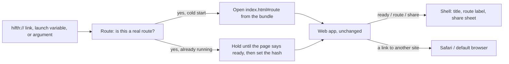

# The Mac and iPad shell: what a rough build taught us

> A thin Apple app around the web app, built 2026-09-29 as a proof-of-concept and then kept.
> It exists for one reason: a mus'haf on an iPad, and a Mac window with a real title bar, feel
> like a product in a way a browser tab does not, and the pitch to The Study Quran team is
> better for it. The public site does not change. Nothing here reaches it.

**Status:** built, tested, and in use for the pitch. Not in any store. The open questions are
at the end, in §⑧, and every one has a row in `docs/issues.json`.

## The short version

- **What it is.** One Swift app, two targets (Mac, iPad), one source folder. It hosts the web
  app exactly as built, served from inside the app bundle. The shell adds no page grammar, no
  screens of its own, and no data: it opens a route, shows what the web app shows, and hands
  the share sheet and outside links to the operating system.
- **What it took.** About a day, most of it on four things the web app could not know it was
  inside an app: where to serve the files from, how to open at a verse, how a shared link
  stays a public link, and how the app says "I am ready" so a test can wait for it.
- **How to drive it.** `make app-run-mac`, `make app-run-ipad`, `make app-shot`, `make
  app-open`, `make app-test`. The `native-shell` skill lists them with one line each.
- **What it does not settle.** Whether a build with the held commentary may go to outside
  testers through TestFlight. That is the `native-testflight-licence` decision, and it gates
  the first upload, not the build.

Glossary, once: a **route** is the part of a Hifth link after the `#`, such as
`/hafs-kfqc/2:255` (edition, then a verse, page or range); a **shell** is the native app that
holds the web app; the **pitch build** is the private web build that carries The Study Quran's
commentary, and the **public build** is what the site ships.

## What does the shell actually do?

Three pieces, and each one is small on purpose:

1. **A private address for the files.** The web app is served from `hifth-app://app/…`, by
   the app itself, out of the copied build folder. The address never changes, because it is
   also where the reader's bookmarks and notes are stored.
2. **A route parser.** A `hifth://` link, a launch environment variable or a `--route=`
   argument each carry a route verbatim. The parser accepts `/<edition>/<target>[?query]` and
   nothing else; a bad link is dropped, not opened.
3. **A three-word bridge.** The page tells the shell `ready`, `route` and `share`. The shell
   tells the page one thing at start, in a small object: that it is inside a shell, which
   platform, and the public site's address for links.

## What did the rough build find that a list would not have?

These are the things that only showed up once the app was running. Each one changed the code.

- **The files could not be opened as plain files.** WebKit will show a page opened from a
  file path, but it refuses to *fetch* other files from one, and every page of the mus'haf is
  fetched. The app booted to an empty stage. Serving through the app's own scheme fixed it,
  and the app then behaved as if it were on a normal website: secure context, caches,
  storage, all reported present (the probe table below).
- **The share button would have shared a dead link.** Inside the shell the page's own address
  is private, so a link built from it opens nowhere. The shell now tells the page the public
  site's address and every shared link uses that. The Playwright `ipad` project and the
  vitest for the bridge both check it.
- **The dark desk was already a route.** We expected to need a native dark-mode switch. The
  web app colours the desk from `?field=dark` in the route, so a `hifth://` link carries it
  and the shell has nothing to do. A launch variable for appearance exists, and it only
  colours the native window chrome.
- **The page reports page 1 before it reports the verse it was opened at.** On a cold start
  the first route the page sends the shell is `/hafs-kfqc/p1`, and the requested verse arrives
  a moment later. Tests wait for the route they asked for, so they are fine, but a probe that
  reads "the route at ready" reads the wrong one. Open in §⑧ ⑧.
- **A test on the Mac needs a permission a script cannot grant.** Apple's UI test runner drives
  the Mac app through Accessibility, and the terminal running it has to be allowed to do that
  once, by hand, in System Settings. The iPad simulator has no such gate, so the everyday test
  target runs there and the Mac run is a separate, opt-in target.
- **Two of the plan's traps were real and one was not.** Serving a module script without the
  right content type breaks the page silently: real. Answering a stopped file request on a
  fast page turn crashes the app: real, and the handler now checks. Bridging the trackpad
  pinch by hand: not needed, WebKit forwards the pinch as gesture events the web app already
  handles. Whether it *feels* right on a real Mac trackpad is a by-hand check, §⑧ ②.

### What can the page see inside the shell?

Measured on the Mac with `make app-probe`. Every row is what a website would see, which is
the point: the web app runs unchanged.

| what the page asked | answer |
| --- | --- |
| its address | `hifth-app://app/index.html#/hafs-kfqc/p1` |
| secure context | yes |
| caches, service worker, storage | present (the service worker is deliberately not registered in-shell) |
| clipboard, share | present, and share goes through the shell's sheet instead |
| the shell's note to the page | platform `macos`, public site address for links |
| window | 1280 × 828 points at 2× |
| touch | none on the Mac; the iPad reports touch and lays out for it |

## How does the reader get to a verse?

Two paths, because timing differs:

- **Cold start.** The route goes into the first address the shell loads, as the hash. No wait,
  no race; the web app restores it the way it restores any pasted link.
- **Already running.** A `hifth://` link while the app is open is held until the page has said
  `ready`, then the shell sets the page's hash. The page treats it as a normal navigation.

For a script the launch variable is the reliable door, not an `open` of the link: opening a
link into a fresh simulator install shows an "open in Hifth?" prompt that a script cannot
answer. `make app-run-ipad ROUTE=…` and `make app-shot ROUTE=…` both use the variable.

## How is it tested?

| layer | proves | tool | how to run |
| --- | --- | --- | --- |
| the web app at iPad size | one page upright, an open mus'haf on its side, place kept across rotation, a finger selects a verse | Playwright, `ipad` project on WebKit | `pnpm -C apps/web exec playwright test --project=ipad` |
| the web app's look at iPad size | two golden images, landscape and portrait, with a selection | Playwright, `ipad-golden` | `make golden` (the web goldens now include these) |
| the shell itself | opens at a route, the route label matches, a `hifth://` link turns the page, rotation keeps the place | XCUITest on the iPad simulator | `make app-test` |
| the shell on the Mac | same smoke, on the Mac | XCUITest, opt-in | `make app-test-mac-ui` (permission needed, see below) |
| the real app's look | a screenshot per route matches its baseline | `make app-golden` against `native/shots/baseline/` | `make app-golden`, then `make app-golden-update` after looking |
| route parsing, file paths, the bridge | pure logic, seconds | Swift Testing | `make app-unit-test` |

**The Mac permission, once.** Open System Settings → Privacy & Security → Accessibility and
allow the terminal you run `make` from (Terminal, iTerm, or the editor). Without it the run
stops with "Timed out while enabling automation mode". This is why the Mac UI test is not in
`make app-test`: a target that fails on a fresh machine for a reason no script can fix would be
switched off inside a week.

## What does this leave alone?

- **The public site.** Nothing under `native/` is in the site build. The public web build is
  unchanged apart from one small bridge module that does nothing outside a shell, and the
  gates that keep held text out of the public bundle still run.
- **The private data.** `make app-web` copies the pitch build by default and refuses to copy
  the private folder into a public-flavoured shell. The copied build and the generated Xcode
  project are ignored by git.
- **The licence question.** The shell is signed for the owner's own devices. Any distribution
  beyond that, TestFlight first, reopens the question `track-b-native.md` §⑦ ② holds, and the
  `native-testflight-licence` decision carries it.

## What did we decide by building it, and why?

Pros and cons written after the build, as the tenet asks, with what each option would have
cost a hafiz.

| choice | what we did | what it buys | what it costs | what it rules out |
| --- | --- | --- | --- | --- |
| how the files are served | the app's own scheme, `hifth-app://app` | the page works as on a website; storage stays put across updates | the address is frozen for ever, because moving it moves the reader's notes | never renaming the scheme or host |
| what the shell knows about routes | nothing; it passes the web app's own link grammar through | one grammar, no drift; a shared link and a `hifth://` link are the same string | a bad link is dropped silently rather than explained | a native "go to" screen of its own |
| how big the Mac window opens | large enough for the two-page spread on first launch | a Mac user sees the open mus'haf, not a phone layout in a big window | a small laptop screen still gets the single page below the breakpoint | nothing; the reader can resize |
| trackpad pinch | left to WebKit and the web app | one zoom behaviour everywhere | untested by a machine on a real trackpad | a native zoom control |
| what the shell shows besides the page | a hidden route label and the window title | tests and screenshots have something native to wait on | nothing visible to a reader | nothing |
| where the everyday tests run | the iPad simulator | no permission dialogs, runs on any Mac | the Mac path is only checked when someone opts in | nothing |

## ⑧ Open questions, and what would answer each

### ① The Mac smoke test only runs after a permission a person grants · **blocked**

Apple's UI test runner needs the terminal to be allowed under Accessibility. It is a one-time
setting on each Mac, and no script can set it. Until the owner grants it here, `make
app-test-mac-ui` fails with "Timed out while enabling automation mode", and the Mac shell is
covered only by the unit tests and the by-hand checks.

**What would answer it:** the owner allows their terminal once, runs the target, and it goes
green; then it can join the pre-push set on this machine.

### ② Whether a trackpad pinch on a real Mac feels right · **open**

WebKit forwards the pinch as gesture events and the web app already handles them, so no code
was written. Nothing has measured whether the zoom is smooth, centred under the fingers, and
free of the page-level zoom a browser would add. A machine cannot feel this. It is on the
manual-testing checklist.

**What would answer it:** one sitting on a Mac with a trackpad, pinching on a page and on the
spread; anything wrong becomes a Playwright or XCUITest case.

### ③ The iPhone layout has not been looked at · **open**

The iOS target allows iPhone, and the web app has an iPhone layout, but nobody has opened the
shell on one. The launch screen, safe areas and the phone toolbar may all need a pass.

**What would answer it:** `make app-run-ipad IPAD="iPhone 17"` (any iPhone simulator name), a
look, and an `iphone` row in the shell goldens.

### ④ The Mac has no menu items for turning the page · **open**

Cmd+← and Cmd+→ reach the page only because the web app already listens for arrow keys in the
window. A Mac app is expected to show them in a menu, with the shortcut beside each.

**What would answer it:** a small `CommandMenu` that forwards to the page through the bridge,
and a unit test on the message it sends.

### ⑤ A web link cannot open the app on iPad without a paid membership · **blocked**

A tapped link to the public site opens Safari, not the shell. Universal Links would fix that,
and they need an associated-domains entitlement, which needs a paid Apple Developer team.

**What would answer it:** the membership question in the TestFlight decision. Once paid, the
entitlement plus a small JSON file on the site.

### ⑥ Apple's newer web view could replace the wrapper · **open**

iOS 26 and macOS 26 ship a SwiftUI web view of their own. The shell uses the older
representable wrapper because the newer one hides the scroll view the iPad settings need and
raises the minimum OS. When the deployment target moves, the swap is worth trying.

**What would answer it:** a branch that swaps it, and the XCUITest smoke still green on both
platforms.

### ⑦ The App Store is not a target · **blocked**

The shell carries the same GPL-derived data the website does, and the store's terms are the
ones `track-b-native.md` argues a GPL binary cannot accept. TestFlight for named testers is a
narrower question and has its own decision; a store listing waits on the licensing opinion.

**What would answer it:** the same opinion `gpl-and-the-app-store` waits on.

### ⑧ The first route the page reports is page 1, not the verse it opened at · **confirmed**

Seen in the Mac probe: opened at `/hafs-kfqc/2:255`, the page's address at `ready` still read
`/hafs-kfqc/p1`, and the verse arrived on the next route message. Every test waits for the
route it asked for, so nothing is wrong on screen, but the shell's window title flickers and
anything reading "the route at ready" is misled.

**What would answer it:** the web app should send `ready` after the cold-open restore has
resolved, or the shell should ignore route messages until the first one that is not page 1.
Either way, a test that asserts the first `route` message after `ready` names the requested
verse.
