# Could Hifth's iPad tool bar work like the Apple Notes markup palette?

Research note, 2026-10-05. Written with its sister study, [the pencil gestures note](pencil-gestures.md).

## What is the short answer?

Yes, partly. The parts of the Notes palette that a hafiz would feel are easy to borrow, and the web app can do them on its own:

- a row of tools, each drawn as a pen, where the chosen tool rises out of the row;
- a second tap on the chosen tool opens its choices;
- one colour circle for the highlighter;
- a Done tick that puts the page back to reading.

The Notes palette floats over the drawing and can be dragged to any edge. That part is wrong for us. In landscape it lands on the last line of the page, and this app already moved its bar off the page once because a floating bar covered the first line. So keep the Notes *shape*, but give it a fixed home that covers no scripture.

**Recommendation: B.** A "Mark up" button in the header, with the palette in the bottom row. B puts the iPad and the phone on one design, and the page gets taller by the strip it drops. While nothing is open, the page is for reading only. Build B and C as two swappable pieces and try both by hand on a real iPad, because the reach and the drag can only be judged that way.

- **A · Floating palette, the Notes shape.** It looks most like Notes and can be dragged anywhere, but it sits on the verses.
- **B · Mark up button, palette in the bottom row (recommended).** It covers no line, works the same on phone and iPad, and gives the page about 56 points more height. The cost is one tap to start marking.
- **C · Palette docked down the side.** It uses the empty margin beside the book in landscape and covers no line. Portrait has no margin, so there it falls back to B.

Glossary: **verse**, one ayah. **Mus'haf**, the printed Qur'an. Our page is a drawing of the King Fahd Complex (KFQC) print. **Harakat**, the vowel-signs over and under the letters. **Hafiz**, someone who has memorised the Qur'an and revises it from the page.

## What does it change for a hafiz?

> **A hafiz revising from the page meets a short, familiar row of pens instead of a ten-button strip, and the page stays readable while they mark.**
>
> - In A, the palette sits on the last line or two until they move it. That is the line they are checking.
> - In B, every line stays clear, and nothing gets marked by accident while they read.
> - In C, every line stays clear in landscape, and the tools sit under the hand that holds the edge of the page.

Today the tool strip shows ten buttons above the page, and one of them is always on. A mistaken tap on the page can therefore drop a highlight or a slip mark in the middle of a recitation. The Notes shape makes "reading" the resting state. You mark only after you pick up a pen, and the tick puts it down again.

## How does the Notes palette work today?

All of these are from iPadOS 27, the current Apple Support default. Pages for iPadOS 26 and 18 were also saved and say the same, except where noted. Each source is marked **fetched** (I saved the page and read the article text) or **snippet** (I only saw a search-result summary).

| What it does | Exactly what Apple says, or what was seen | Source |
| --- | --- | --- |
| It can be moved to any edge. | "Drag the toolbar to any edge of the screen. (Drag from the edge of the toolbar closest to the center of the screen.)" | Apple Support, Markup on iPad, iPadOS 27 · fetched |
| It can shrink. | Turn on Auto-minimize (under More). It shrinks while you draw; "tap the minimized version" to bring it back. | same · fetched |
| A second tap opens a tool's options. | "Tap the selected drawing tool, then tap an option" for line weight; opacity is a slider. | same · fetched |
| Colours | "Tap [colour], tap Grid, Spectrum, or Sliders." This is a free colour picker. | same · fetched |
| Eraser modes | Pixel or Object, chosen by tapping the eraser again. | same · fetched |
| Lasso and ruler | The lasso sits after the eraser. The ruler switches on and off; it does not become the chosen tool. | same; WWDC24 session 10214 · fetched |
| Hiding it | Done hides the palette (a tick in Notes). | Markup on iPad; Draw with Notes 108919 · fetched |
| More tools than fit | "For more drawing tools, swipe left or right in the Markup toolbar." | Apple Support 108919 (Jan 2026) · fetched |
| The + menu | Sticker, Text, Signature, Shape, Loupe. The loupe is a magnifier, like our Harakat tool. | same · fetched |
| Finger compared with pencil | The Pencil draws straight away. To draw with a finger, tap the Markup button first. Settings has an "Only Draw with Apple Pencil" switch. | Notes drawing, iPadOS 27 and 18 · fetched; OSXDaily · fetched |
| Fingers scroll when pencil-only is on | Seen in a summary only. | snippet |
| Pencil hover | It previews the tool up to 12 mm above the screen. | Draw with Apple Pencil · fetched |
| Shape while moving | Four states: across the bottom, down a side, minimised to one circle showing the chosen tool, and in motion. On iPhone it docks. | PencilKitForSketch README (iPadOS 14) · fetched |
| A small "single little circle" when shrunk; a handle to drag | Older (2019), but it agrees with the row above. | MacMost · fetched |
| Apps can choose its tools (iPadOS 18) | Custom items, a trailing accessory button, and saved state. "a person may reposition it anywhere within the current window." It does not show in Mac Catalyst. | Apple PencilKit docs for the tool picker · fetched; WWDC24 10214 · fetched |
| The small layout drops undo/redo | "Let people choose when to switch between Apple Pencil and finger input." | Apple design guide, Apple Pencil · fetched |
| Tool bars in general | At most three groups; extra items fold away when narrow; people can customise them on iPad. | Apple design guide, Toolbars · fetched |
| iPadOS 26 additions | A reed pen modelled on the qalam of Arabic, Persian and Turkish calligraphers, with angle presets. The toolbar swipes and adapts. | AppleInsider; 9to5Mac · fetched |
| **The chosen pen rises out of the row** | I remember this from using the app. I did **not** find it in any source. | memory · unverified |
| How it docks in Split View or a narrow window | Summary only. | snippet |

Sources:
- https://support.apple.com/guide/ipad/draw-and-handwrite-with-markup-ipad6350b8dc/ipados (27; 26 and 18 at the "write-and-draw-in-documents" address)
- https://support.apple.com/en-us/108919
- https://support.apple.com/guide/ipad/add-drawings-and-handwriting-ipada87a6078/ipados
- https://support.apple.com/guide/ipad/draw-with-apple-pencil-ipadc55b6c7a/ipados
- https://developer.apple.com/documentation/pencilkit/pktoolpicker
- https://developer.apple.com/videos/play/wwdc2024/10214/
- https://developer.apple.com/design/human-interface-guidelines/apple-pencil-and-scribble
- https://developer.apple.com/design/human-interface-guidelines/toolbars
- https://appleinsider.com/articles/25/06/18/the-ipados-26-reed-pen-tool-is-a-great-calligraphy-addition
- https://9to5mac.com/2025/10/16/heres-everything-new-for-apple-notes-in-ios-26/
- https://macmost.com/learn-to-use-the-new-markup-tools-in-ipados.html
- https://github.com/WireFrameRate/PencilKitForSketch
- https://osxdaily.com/2022/03/06/cant-draw-with-finger-ipad-fix/

The Apple Support pages were saved and read in full while this was written; the copies are not kept here.

Pencil double-tap and squeeze, and whether Apple's own palette can carry our tools, belong to the other study, [the pencil gestures note](pencil-gestures.md). It matters here at one point only, under "What can the web app do alone?".

## What does the app show today?

On an iPad held sideways (1180 by 820), the app shows the desktop layout: ten tools in a strip above the page, with Select on. Held upright (820 by 1180), and in Split View, it switches to the phone layout. There, a Tools button in the bottom row slides the tools up in its place.

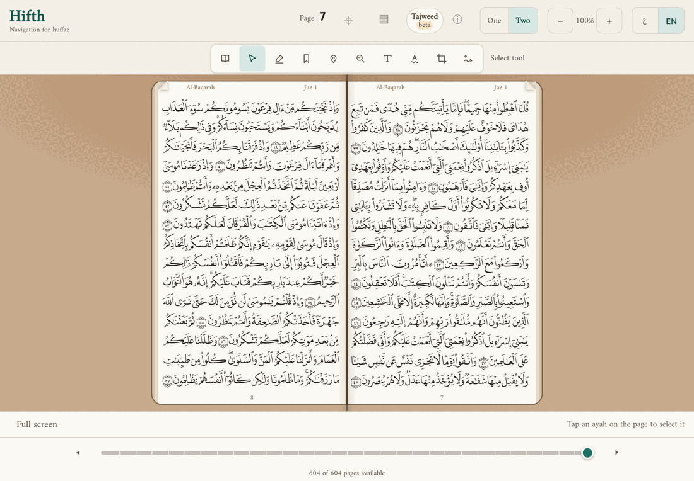
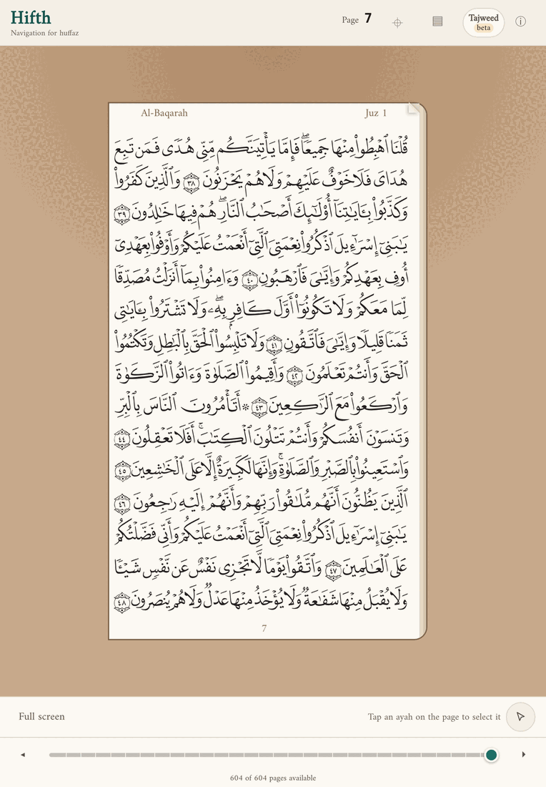

Measured sideways: the header is about 71 points, the tool strip row about 56 (about a tenth of the page's height), and the bottom rows about 118. The page is about 553 points tall. Each margin beside the open book is about 258 points wide.

## Which of our tools fit the Notes shape?

| Our tool today | Where it goes | Why |
| --- | --- | --- |
| Read | It becomes the closed palette, or the Done tick. | Notes has no "read" tool. Putting the pen down is reading. |
| Select | The first pen, in the lasso's place. | It plays the same part: pick up what is already on the page. |
| Highlight | A pen, plus the colour circle. | Notes' highlighter. Our four pens stay fixed: no colour wheel, because each pen is tested to keep the words under it readable. |
| Mistake | A pen (red). | It marks the page in place, like a pen. |
| Jump | A pen. | You drag from where you left the verse to where your memory went, which is a stroke on the page. |
| Note, Harakat, Word | **One** pen, "Note", with three ways to aim it on the second tap: a word or verse; one vowel-sign, with the magnifier; one part of a word, opened up. | All three point at a spot on the page and attach something to it. Notes' eraser shows the pattern: one tool, with modes behind a second tap. This takes three buttons off the bar. |
| Bookmark | A pen. | One tap places it. |
| Eraser | **New.** | Notes has one and we do not. Today a mark is removed through each tool's own way of undoing it. |
| Crop | Behind the ⋯ (or the side slot). | It makes a picture to share; it does not mark the page. |
| Page zoom | It stays in the header (− 100% +). | It is about viewing, not marking. |

Notes also has **undo and redo**, and we do not. They are worth adding in whichever option wins.

## What are the options, drawn on a real page?

Each one is drawn over KFQC pages 7 and 8, at iPad size (1180 by 820, and 820 by 1180 upright). The page is the real page drawing; the tool bar is the mock. The mock was a throwaway page drawn for these pictures; it is not kept.

### A · What if the palette floats over the page, as in Notes?

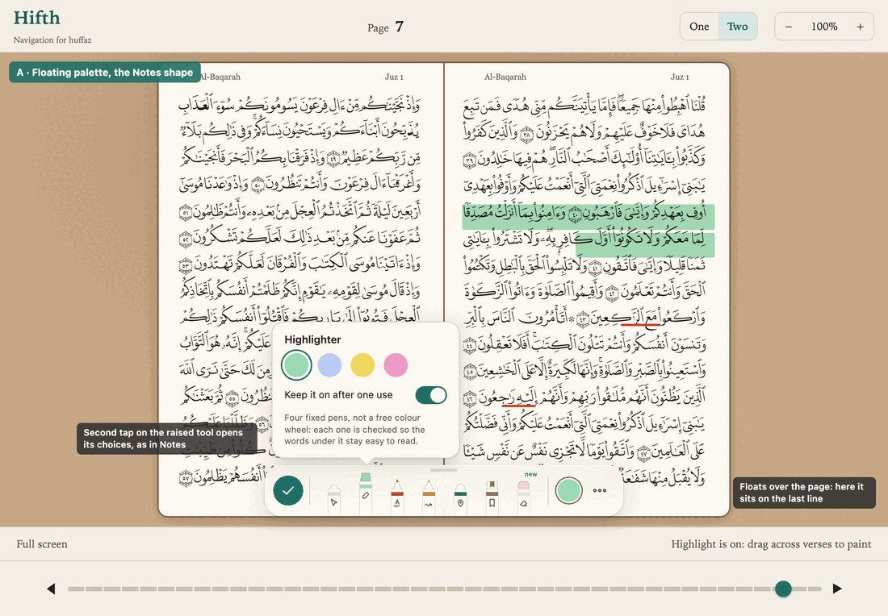
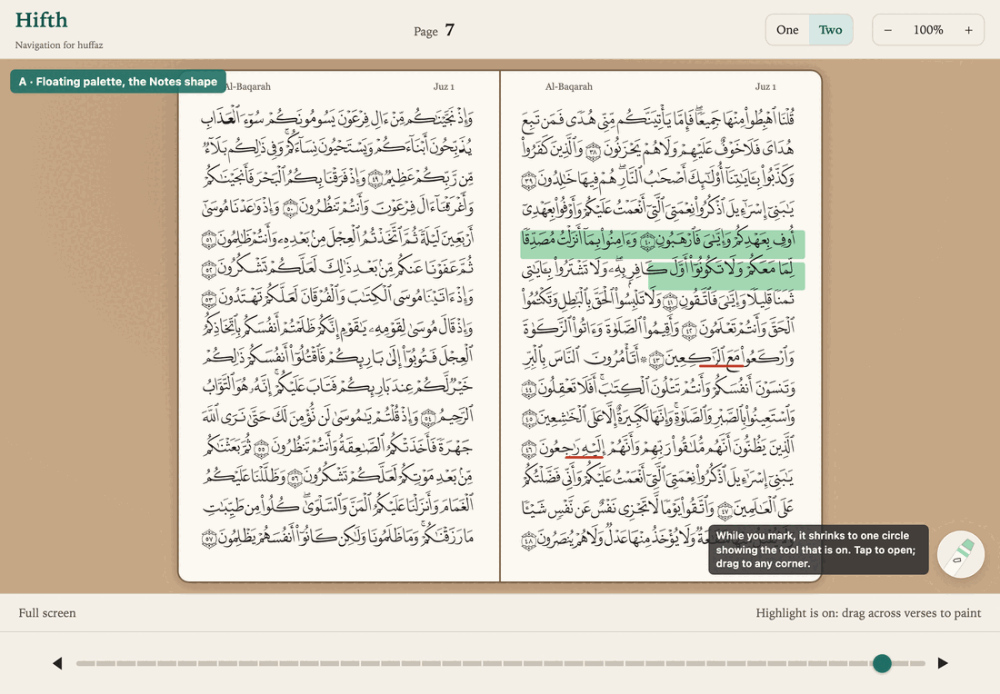
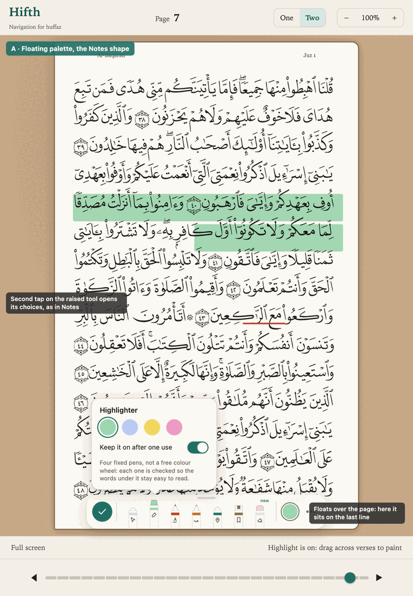

Seen in the shots: across the bottom, the palette covers the last line of the right-hand page. Its option card covers about four more lines while it is open. Shrunk to one circle, it still sits on the corner of the page. Upright, it covers the last line too.

- **What it changes for a hafiz:** it feels most like Notes. The line they are checking may be under it until they drag it away, on every page where that line matters.
- **Pros:** it is the most familiar shape. It can go anywhere, so left- and right-handed readers each choose their own spot. Shrinking it keeps it small while marking.
- **Cons:** it sits on scripture. We already pulled a floating bar off the page for exactly this reason. Dragging it is an extra job, and a drag on the page can be mistaken for a mark or a page turn.
- **Implications:** we would need snap-to-edge rules, a remembered position, and a rule for what happens when it covers a mark. On a phone there is no room to float, so it would dock anyway. That makes phone and iPad two designs.
- **Phone:** it does not fit floating. It would have to dock at the bottom, which is B.

### B · What if a Mark up button opens the palette in the bottom row?

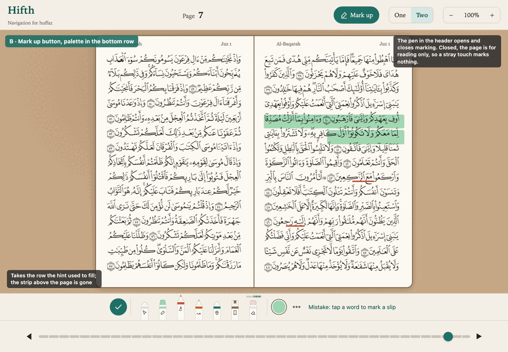
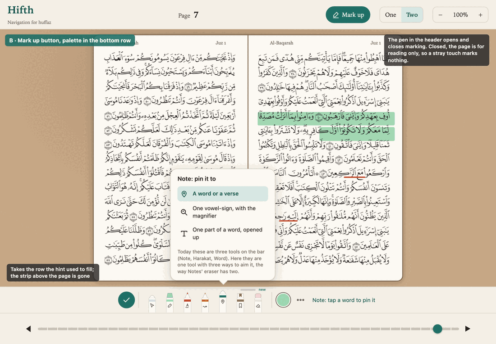
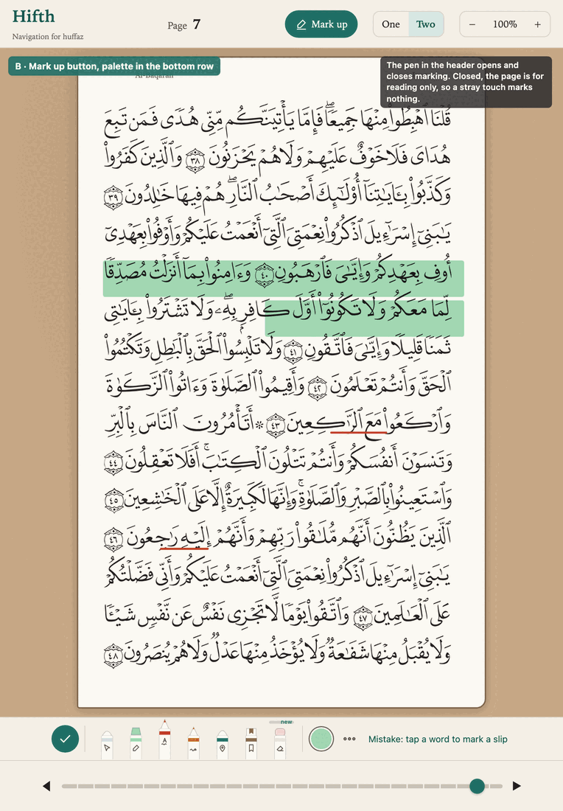
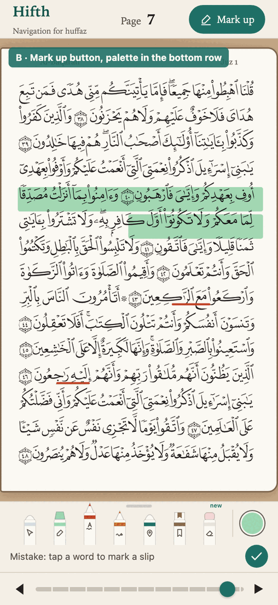

Seen in the shots: the strip above the page is gone, so the book is visibly taller. The palette takes the row where the hint used to be, and the tool's name prints beside it ("Mistake: tap a word to mark a slip"). The second tap on Note opens a card above the row, with its three ways to aim it. On the phone, the same row fits seven pens and the colour circle, with the tick below.

- **What it changes for a hafiz:** every line stays clear. Reading is the resting state, so a stray thumb marks nothing in the middle of a recitation. Marking is one tap on "Mark up" away.
- **Pros:** it covers no line. One design serves phone, iPad upright, iPad sideways and Split View, and it is close to the tray already chosen for the phone on 2026-09-26. The page gains about 56 points in height. It matches Notes' own Markup button, so there is nothing new to learn.
- **Cons:** it takes one more tap to start marking than today. The pens sit at the bottom, a reach from the top of the page. It cannot be dragged to the side.
- **Implications:** the phone's Tools button and this button become the same idea, so the phone tray and the iPad bar merge into one piece of the app. The hint row needs a new home when the palette is open; the name printed beside the pens covers it. It rules out a free-floating palette, unless we later add one as a setting.
- **Phone:** it fits as drawn.

### C · What if the palette docks down the side, in the empty margin?

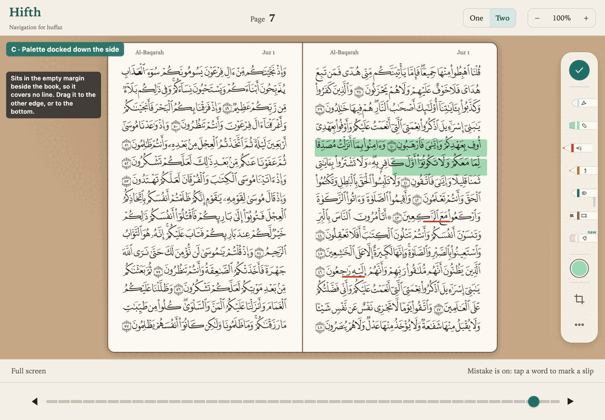

Seen in the shot: a tall rail sits in the right-hand margin beside the book, with the tick at the top, the pens pointing in towards the page, then the colour circle, crop and ⋯. Every line is clear. (The pens in this rough drawing are cut off at the right edge of the rail. A real build would size them properly.)

- **What it changes for a hafiz:** every line stays clear in landscape. The pens are under the hand that rests on the side of the iPad, a short reach to any line.
- **Pros:** it uses space that is empty today, about 258 points either side. It can sit on either edge, for either hand. It is the "dock down a side" state that Notes itself has.
- **Cons:** the margin exists only in landscape at normal size. Upright, zoomed in, or in Split View, it has to fall back to the bottom row. So it is two placements to build and to test.
- **Implications:** it means building B anyway, as the fallback. The real question then is whether the side rail is worth adding *on top of* B in landscape. It may become a setting for readers who prefer it, as happened with earlier runner-up options.
- **Phone:** no margin, so it falls back to B.

### What else was considered, and why is it not here?

- **Keep today's strip and only restyle the buttons as pens.** Cheap, but it keeps "one tool always on". A stray tap still marks the page, which is the thing the Notes shape fixes.
- **Use Apple's own palette.** Only possible in the native app. Whether it can carry our tools is the other study's question.
- **A free colour wheel.** Ruled out: our pens are fixed so the words under them stay readable.

## What can the web app do alone, and what needs the native app?

| The web app on iPad Safari can | Only the native app can |
| --- | --- |
| Draw any of A, B and C, including a draggable palette that snaps to an edge and remembers where it was | Pencil double-tap, squeeze and barrel roll (the other study) |
| Tell a Pencil from a finger on each touch. So the Pencil can mark while a finger turns the page, and touches can be ignored while the Pencil is down. | Apple's own palette, with its own tools, if the other study finds it can carry ours |
| Read Pencil pressure and tilt, and hover on Pencils that support it (snippet only) | Apple's own palm handling, and haptics |
| Keep clear of the rounded corners and the home bar, and change layout when Split View narrows the window | Full screen without Safari's own bars |

Whether Safari's colour input opens Apple's colour picker is unverified. It does not matter, because our pens are fixed.

The one point where the other study decides this one: **if Apple's own palette can carry our tools**, the native app could show A for free, as Apple's palette, and it would float over the page. That makes B or C (which cover no line) even more worth having as the web version, and as a setting.

## What would we still have to learn by building it?

- Whether one tap on "Mark up" feels like a cost or a relief in a real revision session. Only a hand on a real iPad will tell.
- Whether the side rail in C is easier to reach than the bottom row in B when the iPad is held in two hands.
- Whether merging Note, Harakat and Word into one pen with three ways to aim it is clear, or whether the three are used often enough that a second tap is too much.
- Whether pens that rise out of the row read clearly at real size. (I remember this from Notes but did not find it in a source.)
- What the eraser should remove: one mark at a time (like Notes' Object eraser), or anything you drag across.
- Whether a Pencil-only marking mode (the finger turns pages, the Pencil marks, with no button) should be on by default when a Pencil is used.

## What is this not settling?

It does not settle Pencil gestures or Apple's own palette; those belong to the other study. It does not settle which tools exist, only where they sit. It does not change the four highlighter pens.

## Open questions, and what would answer each

### ① Where should the marking pens live on an iPad: the bottom row, the side margin, or both? · **open**

B (a Mark up button, pens in the bottom row) is recommended, and C (pens down the empty side
margin in landscape) is worth trying beside it. What would answer it: both built as swappable
pieces and tried by hand on a real iPad, in a real revision session, for reach and for whether
the one extra tap to start marking feels like a cost or a relief.

**Built, all of them, as a setting (owner, 2026-10-05: "can we implement all and have settings
option?").** Settings now has "Where the page tools sit", with four answers: above the page
(today's strip, still the default), floating (A), a Mark up button (B) and down the side (C). It
shows on a computer and on an iPad held sideways; an upright iPad and a phone already have their
own bottom-row tray. What is still open is which one becomes the default, and that waits on
trying them by hand.

What building them taught, that the drawings did not:

| home | what it is like | what it costs |
| --- | --- | --- |
| A · floating | Drag it by its handle and it lands on the nearest edge, lying flat on the top or bottom, standing up on a side. On the left or right it sits in the empty margin and covers nothing. Where you left it is remembered. | Its starting place, the bottom edge, sits over the page slider. On a side it is the best of the four; at the bottom it is the worst. |
| B · Mark up button | The page is for reading until you press the button; then the tools take the bottom row, with the pens and what the tool does beside them, until Done. | The button first sat on top of the "tap a verse" line, then made the row taller and the page 18 pixels shorter; it now takes its own place and reaches into the row's padding instead. One extra press before every marking session. |
| C · down the side | The tools stand in the margin beside the book, one reach from the hand holding the iPad, covering no line. | With the highlighter's pens under them the rail grew down over the bottom row, so the pens now stand in a second column beside it. Where the margin is too narrow (a tall window, or the single page) it falls back to B by itself. A page zoomed in can slide under it. |

Each one, at an iPad held sideways (1180 by 820):

| A on the bottom edge | A dragged to the left edge |
| --- | --- |
| 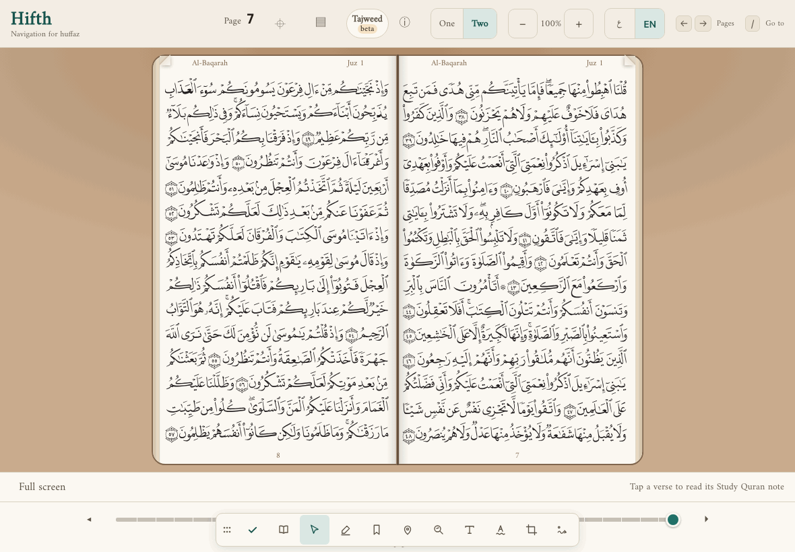 | 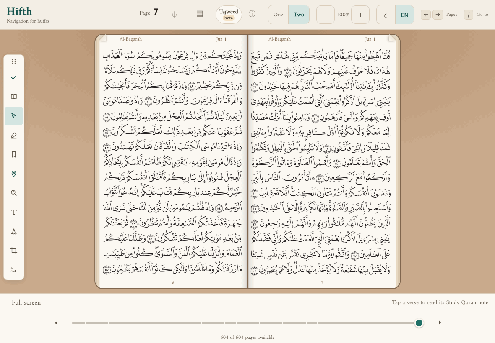 |

| B closed | B open, highlighter on |
| --- | --- |
| 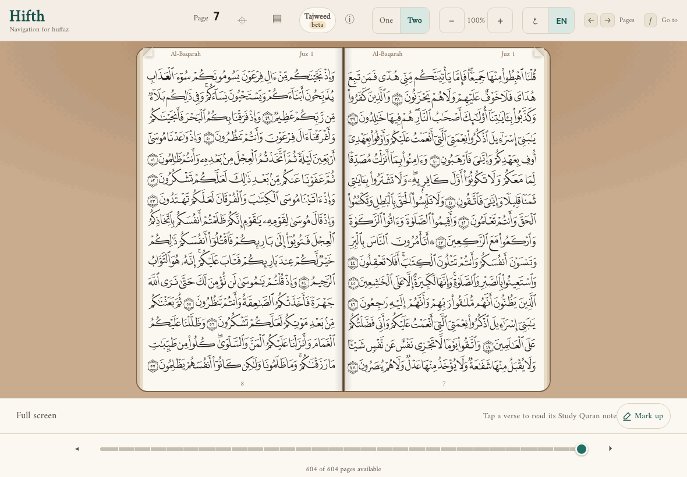 | 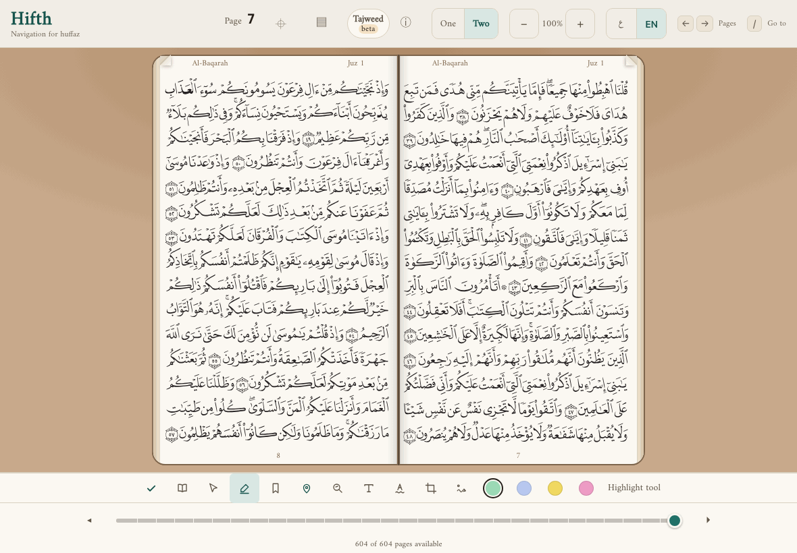 |

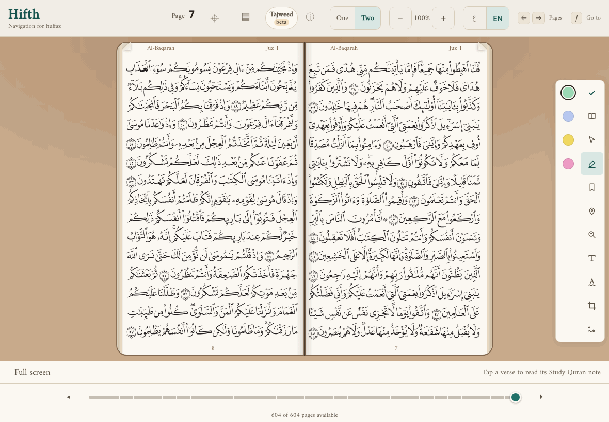

### ② Should Note, Harakat and Word become one pen with three ways to aim it? · **open**

It takes three buttons off the bar, the way Notes keeps its two erasers behind one pen. What
would answer it: whether a hafiz uses the three often enough that a second tap to switch
between them is too much. Watching one revise with the merged pen would show it.

### ③ Should marking gain an eraser, and undo and redo? · **open**

Notes has all three and Hifth has none of them: today a mark comes off through its own tool. What
would answer it: deciding what the eraser removes (one mark at a time, like Notes' object
eraser, or anything dragged across), then building it with whichever home ① picks.
