# How does all the outside-library data fit together?

This is the whole of the outside library of Qur'an data, drawn as one picture: every file it
comes in, and the exact keys that clip one file to the next. It is the map you read before
asking what the app can build from this library, or before adding a new piece of it — the
[join map](qul-data-join-map.html) is the same spine drawn by hand and argued through; this page
is the full entity diagram behind it.

It carries **no Qur'an text**. Every column that would hold Arabic is named and counted, never
shown.

## A few words first

- **Word id** — a single number, 1 to 83,668, that names each word of the mus'haf in reading
  order. It is the main backbone: most files hang off it.
- **Verse key** — the pair *surah:ayah* (for example 2:255), naming one verse. It is the
  second backbone, the one everything verse-level hangs off.
- **Location** — the triple *surah:ayah:word*, naming one word inside its verse. It is how the
  grammar files (root, lemma, stem) point at a word.
- **Layout** — which words sit on which printed page and line. The V4 mus'haf plan.
- **Ruler / reference** — a file we only measure our own work against and link back to; we keep
  none of its bytes. **Held** — a file we keep a copy of, in a store the owner controls, off the
  code and off what the app ships.

## The whole thing, in one diagram

Three backbones, and every file clips onto one of them: the **word id** spine down the middle,
the **verse key** spine on the verse side, and the **location** triple that the grammar files
use. The counts on each box are measured row counts, not estimates.

```mermaid
erDiagram
  WORDS_TEXT ||--|| LAYOUT : "word id 1..83668"
  WORDS_TEXT ||--o{ WORD_ROOT : "location surah:ayah:word"
  WORDS_TEXT ||--o{ WORD_LEMMA : "location"
  WORDS_TEXT ||--o{ WORD_STEM : "location"
  WORDS_TEXT }o--|| AYAH_REGISTRY : "verse key surah:ayah"
  AYAH_REGISTRY ||--o{ AYAH_ROOT : "verse key"
  AYAH_REGISTRY ||--o{ AYAH_LEMMA : "verse key"
  AYAH_REGISTRY ||--o{ AYAH_STEM : "verse key"
  AYAH_REGISTRY ||--o{ THEMES : "surah + ayah range"
  AYAH_REGISTRY ||--o{ TOPICS : "verse key list"
  AYAH_REGISTRY ||--o{ MATCHING_AYAH : "verse key + matched key"
  AYAH_REGISTRY ||--o{ MUTASHABIHAT : "verse key + word range"
  AYAH_REGISTRY ||--o{ META_RANGES : "first/last verse key"
  SURAH_REGISTRY ||--o{ AYAH_REGISTRY : "surah number"
  SURAH_REGISTRY ||--o{ SURAH_INFO_EN : "surah number"
  LAYOUT }o--|| FONT_SURAHNAME : "draws surah-name lines"
  WORDS_TEXT }o--|| FONT_NASTALEEQ : "draws word glyphs"

  WORDS_TEXT { int word_id "qpc-v4 · 83,668 words · HELD, loaded" }
  LAYOUT { int first_last_word_id "digital-khatt · 9,046 lines · 604 pages · HELD, loaded" }
  WORD_ROOT { txt location "50,298 words rooted (60%)" }
  WORD_LEMMA { txt location "72,510 words lemmatised (87%)" }
  WORD_STEM { txt location "77,427 words stemmed (93%)" }
  AYAH_REGISTRY { int ayah_ordinal "metadata · 6,236 ayahs · 1..6236" }
  AYAH_ROOT { txt verse_key "6,214 ayahs" }
  AYAH_LEMMA { txt verse_key "6,216 ayahs" }
  AYAH_STEM { txt verse_key "6,236 ayahs" }
  THEMES { txt ayah_range "2,098 labelled ranges" }
  TOPICS { int topic_id "2,512 topics" }
  MATCHING_AYAH { txt pair "3,552 pairs" }
  MUTASHABIHAT { int phrase_id "814 phrases · 2,232 verses" }
  META_RANGES { txt ranges "juz hizb rub manzil ruku sajda" }
  SURAH_REGISTRY { int surah_number "metadata · 114 surahs" }
  SURAH_INFO_EN { int surah_number "114 English descriptions" }
  FONT_SURAHNAME { txt glyphs "surah-name-v4 · 116 glyphs" }
  FONT_NASTALEEQ { txt glyphs "KFGQPC Nastaleeq" }
```

## What each backbone does

**The word id (1 to 83,668).** This is the main spine. The layout stores, for each printed
line, its first and last word id; the word text stores the same ids on its own rows. So to draw
a page you walk its lines and, for each line, pull the words whose id falls in that line's range.
The two run the same 1-to-83,668 with no gaps — which is the single fact that makes drawing our
own page from this library possible at all.

**The location (surah:ayah:word).** The three grammar files — root, lemma, stem — point at a
word by this triple. Not every word has all three (particles and some names have no triliteral
root), so their coverage is 60%, 87%, and 93% of the 83,668 words. What matters is the other
direction: every grammar row points at a word that exists — no broken pointers — so the gap is
only "some words have no root", never "a root points nowhere".

**The verse key (surah:ayah) and the ayah ordinal (1 to 6,236).** Everything verse-level clips
here: the per-verse grammar roll-ups, the themes, the topic lists, the two "similar verse" sets,
and the division ranges (juz, hizb, rub, manzil, ruku, sajda). The ayah registry is the hub —
its ordinal 1-to-6,236 and its verse key are what all of these join through.

## Which of this does the app hold, and which does it only measure against?

This is where the diagram meets the two ways the app takes in Qur'an data (the plugin tenet, and
the [qul-etl-plugins](../decisions/qul-etl-plugins.md) decision):

- **Held** — the two boxes marked HELD, the **word text** and the **layout**, are the V4 pair the
  app keeps a copy of, so it can draw its own word-by-word page and stand it beside the printed
  one to check it. That is settled by [qul-store-purpose](../decisions/qul-store-purpose.md). The
  two **fonts** are held too, as the thing that draws the held text. None of it ships to readers;
  each needed its licence read first, and those reads cleared on 8 September 2026; the word text and the layout are now loaded and verified in the store, while the two fonts are cleared to hold but not loaded yet.
- **Reference only** — everything else on the diagram (the grammar files, the themes and topics,
  the two similar-verse sets, the division ranges) is a ruler: the app measures its own work
  against it and links back to it, and keeps none of its bytes. Whether any of these is ever held
  is a separate, still-open question.

The line between the two is the whole of [qul-reliance](../decisions/qul-reliance.md), and it is
why the word-text and font boxes carry a licence obligation the ruler boxes do not.

## The files behind the boxes

Each box above is one file in the library. This is which file, how many rows, what key it joins
by, whether it carries Arabic, and what the library's own page says about its licence.

| Box | File | Rows | Joins by | Carries Arabic? | Library resource | Licence on its page |
|---|---|---|---|---|---|---|
| LAYOUT | digital-khatt 15-line layout | 9,046 lines / 604 pages | word id range per line | No — numbers only | Mushaf layout (id 21) | none shown |
| WORDS_TEXT | qpc-v4 word text | 83,668 words | word id; location | Yes | Quran script (id 47) | none shown |
| WORD_ROOT | word → root | 50,298 | location | Yes | Grammar & morphology | none shown |
| WORD_LEMMA | word → lemma | 72,510 | location | Yes | Grammar & morphology | none shown |
| WORD_STEM | word → stem | 77,427 | location | Yes | Grammar & morphology | none shown |
| AYAH_ROOT | per-ayah roots | 6,214 | verse key | Yes | Grammar & morphology | none shown |
| AYAH_LEMMA | per-ayah lemmas | 6,216 | verse key | Yes | Grammar & morphology | none shown |
| AYAH_STEM | per-ayah stems | 6,236 | verse key | Yes | Grammar & morphology | none shown |
| THEMES | theme label + ayah range | 2,098 | surah + ayah range | No (English) | Ayah theme | none shown |
| TOPICS | topic ontology + ayah lists | 2,512 | topic id; verse key list | Yes | Topics and concepts | none shown |
| MATCHING_AYAH | similar-verse pairs | 3,552 | verse key + matched key | No | Similar ayahs | none shown |
| MUTASHABIHAT | repeated-phrase set | 814 phrases / 2,232 verses | verse key + word range | Yes | Mutashabihat | none shown |
| AYAH_REGISTRY | ayah registry (the ordinal spine) | 6,236 | ayah ordinal; verse key | Yes | Quran metadata | none shown |
| SURAH_REGISTRY | surah registry | 114 | surah number | Yes | Quran metadata | none shown |
| SURAH_INFO_EN | English surah descriptions | 114 | surah number | Mostly English | Surah information | none shown |
| META_RANGES | juz / hizb / rub / manzil / ruku / sajda ranges | 30 / 60 / 240 / 7 / ~558 / 15 | first/last verse key | No | Quran metadata | none shown |
| FONT_SURAHNAME | surah-name display font | 116 glyphs | draws surah-name lines | Rendering asset | Quran font (id 457) | none shown |
| FONT_NASTALEEQ | Nastaleeq Arabic text font | — | draws word glyphs | Rendering asset | Quran font (id 462) | none shown |

## The licence, in one line

Not one of these pages shows a licence, and the library states terms **per resource**, not in a
blanket. So before any text, font, or morphology box is held, that resource's own page is read
and its terms recorded — the human check
[qul-held-copy-licensed-and-offbundle](../validation/) stands in front of exactly that, and the
tool that holds the copy refuses to run until it is done; that check passed on 8 September 2026, and the word text and layout have since been loaded and verified in the store. Attribution is owed even for the
numbers-only boxes we merely measure against.

## Where this lives

The shape drawn here is the `etl-plugins` and `etl-pipeline` features of the code map. The two
held boxes are what the held-copy source keeps; the rest are what the derive-and-measure source
checks its own numbers against. The decisions this rests on are
[qul-reliance](../decisions/qul-reliance.md) (may a copy be held),
[qul-store-purpose](../decisions/qul-store-purpose.md) (what the held copy is for), and
[qul-etl-plugins](../decisions/qul-etl-plugins.md) (how the two sources sit side by side).
