# How should adding a verse to a note feel, and how should the page show a verse that is in one? ^sn4q6f

*Answered 2026-10-02: **C and A**, the recommended pair ([the record](../decisions/scoped-notes.md#when-you-tap-a-verse-with-the-note-tool-what-opens)). These are questions 4 and 6 of [notes that gather verses](scoped-notes.md#what-needs-the-owners-call). Steps 1 and 2 of that feature are built; step 3 (the note tool offering your notes) builds the first answer, and step 4 (seeing your notes from the page) the second. Both are about how something feels in the hand, so each option was built on the real app on a phone and recorded, rather than described.*

> [!tip] Recommended
> **Question 1 — C: tapping a verse with the note tool still opens a new note at once, and its box offers your three likeliest notes as one-tap choices.** Today's one tap for a new thought is kept, and adding to a note you already have is one more tap, never a detour.
>
> **Question 2 — A: a small dot by the verse number, with a count when the verse is in more than one note.** It reads at phone size, covers none of the words, and a tap on it lists the notes.

**2 questions**, **4 options each**, all recorded on page 7 of a phone. **3 things surprised us** while recording, and two of them change the case: see *What did building them teach us?* below.

To answer: leave a comment on this note, or tell Claude two letters, one per question (for example "C and A").

---

## A few words, defined once

- **Verse** — one ayah, with its number in the round marker at its end.
- **Note** — your own words about one or more verses. Since step 2, a note can gather verses from one part of the Qur'an: a page, a hizb, a juz, a surah, or the whole Qur'an.
- **The note tool** — the pin in the tools tray at the bottom of the page. Pick it, tap a verse, and a note box opens there.
- **The verse menu** — the tray that rises when a verse is chosen: Listen, Same roots, Share, Bookmark, On QUL.
- **The three notes in the pictures** are made up for this page: *Bani Isra'il look-alikes* (whole Qur'an, 3 verses), *Page 7 slips* (2 verses) and *Juz 1 madd to watch* (5 verses).

## What changes for a hafiz?

> [!important] For a hafiz mid-revision
> **Adding a verse to a note is how a slip gets recorded,** and it happens with the mus'haf open, often while reciting to someone. Every extra tap is paid on every slip, and a slip filed in the wrong note is worse than one not filed at all. **The mark on the page is the reminder "you slipped here before".** Too loud and it is a hint while you test yourself; too quiet and it never reminds you.

## What does the app do today? — 2 things

1. **Pick the note tool, tap a verse:** a new, empty note opens on that verse. There is no way to add the verse to a note you already have.
2. **The tool is put down after each note.** The next tap on a verse is an ordinary tap: it paints the verse orange and opens the verse menu. So recording three slips is six taps: the tool, the verse, three times.

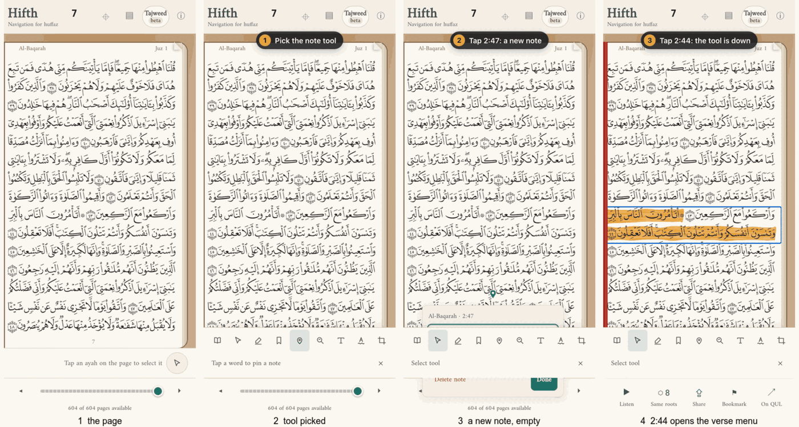

A verse in a note shows nothing on the page today unless it carries a pin.

## Question 1: when you tap a verse with the note tool, what opens? — 4 options

**Watch the four play side by side first.** The grey circle is a finger. The numbered label at the top says what is happening.

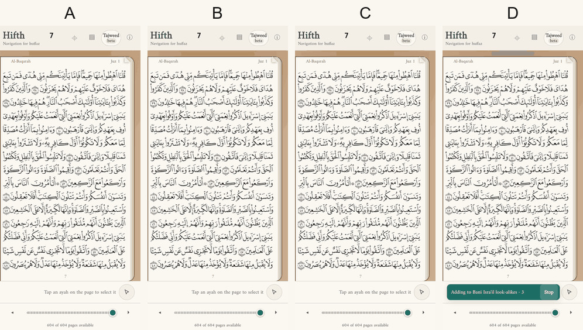

Each clip is the real app on a phone, with the option's new parts added to the live page by a short script kept beside this note, so every one can be recorded again.

### A — A new note at once, as today

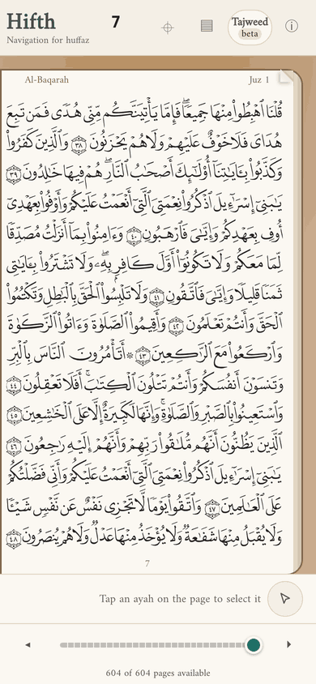

### B — Offer your notes first; "New note…" is one of the choices

A list rises in place of the box: your three likeliest notes, then *New note…*. Choosing a note adds the verse and says so, with Undo.

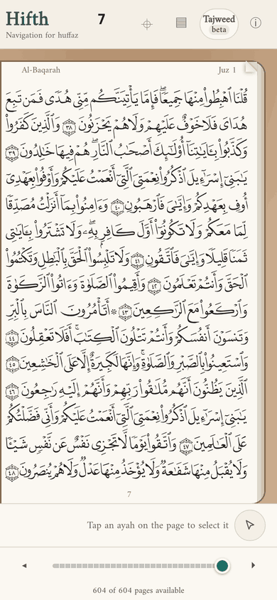

> [!example]- B, step by step: 4 stills
> 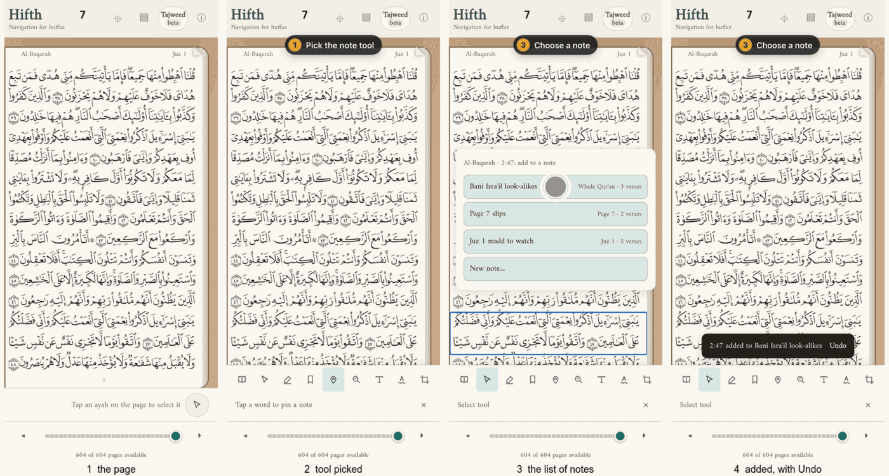

### C — A new note at once, with your notes as one-tap choices in its box *(recommended)*

The box opens exactly as today, with one more line under the text: *Or add this verse to*, three choices, and *More…*. Tapping a choice turns the box into that note: its name and part of the Qur'an at the top, its words, its verses with the new one picked out, and *2:47 added to this note · Undo*.

> [!example]- C, step by step, and the version with full rows: 5 pictures
> 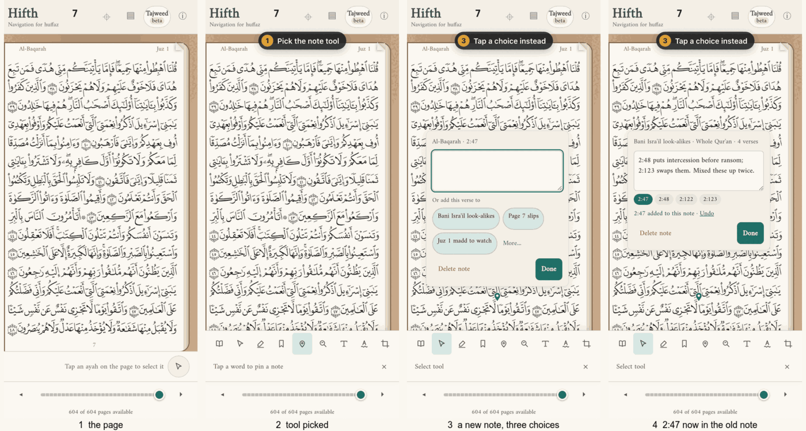
>
> **The same box with each note on a full row, as first drawn**
>
> 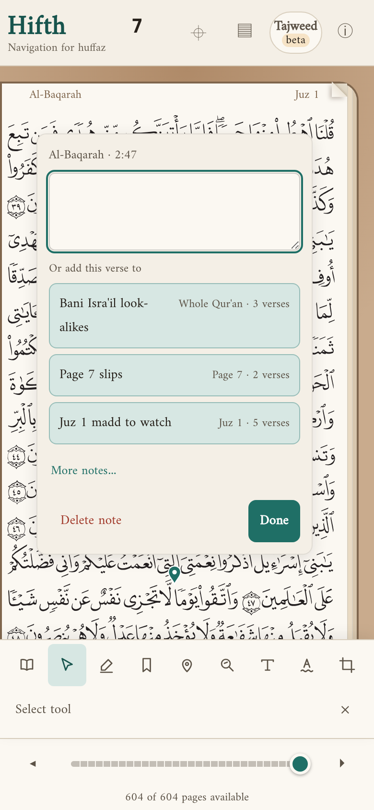

### D — "Keep adding": every tap goes into the last note used, until you stop

A bar above the tools says where taps are going: *Adding to Bani Isra'il look-alikes · 3*, with a Stop button. Each tap on a verse adds it, flashes it, and says so with Undo. No box opens.

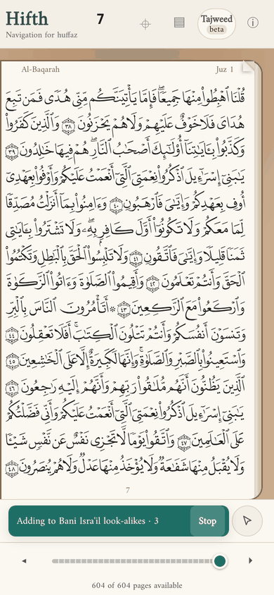

> [!example]- D, step by step: 4 stills
> 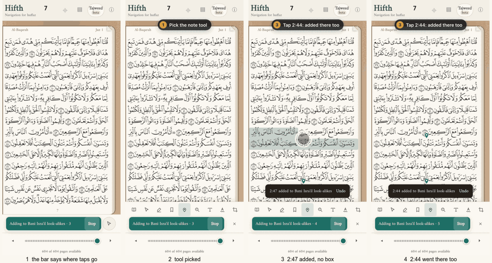

## Question 2: how does the page show that a verse is in a note? — 4 options

All four on page 7, where 2:40, 2:44, 2:47 and 2:48 are in the made-up notes (2:44 in two of them).

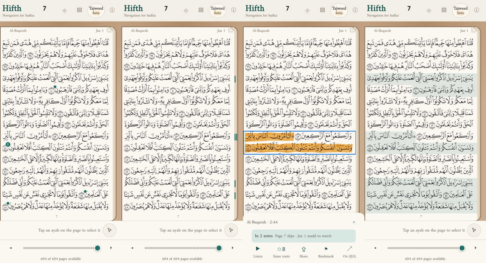

| | **A** *(recommended)* | **B** | **C** | **D** |
| --- | --- | --- | --- | --- |
| **What you see** | A small dot at the top edge of the verse number; a number in it when the verse is in more than one note | A thin upright mark at the page's outer edge beside the verse's first line, one per note | Nothing; the notes show in the verse menu | A faint green tint over the whole verse |
| **What a tap does** | Lists the verse's notes beside it | Not built; would list them the same way | Tap the verse: the menu says *In 2 notes* and names them | The tap paints the verse as today |

> [!example]- Each option at full size, and A's list opened: 5 pictures
> **A — dots by the verse numbers**
>
> 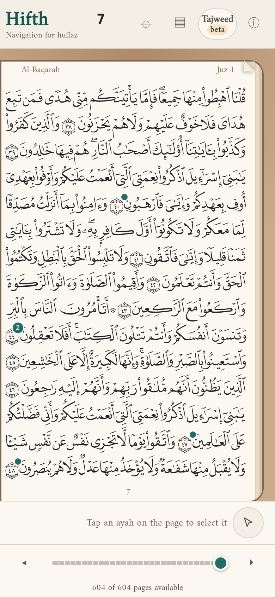
>
> **A — a tap on the dot lists the verse's notes**
>
> 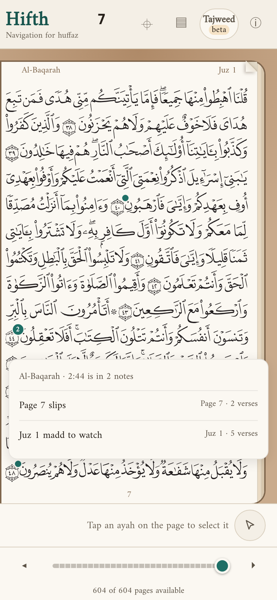
>
> **B — marks at the outer edge**
>
> 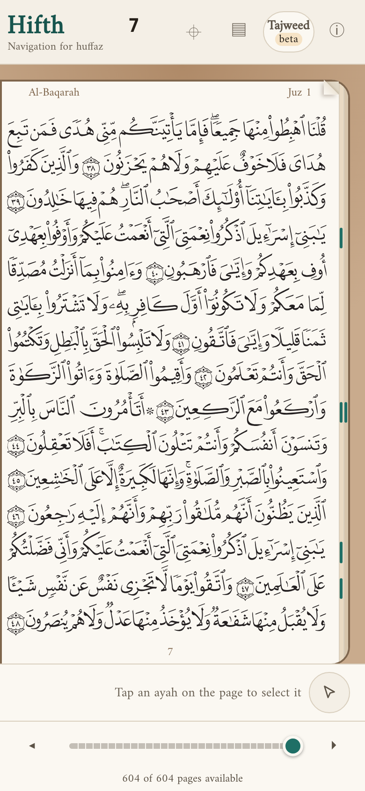
>
> **C — nothing on the page; the verse menu names the notes**
>
> 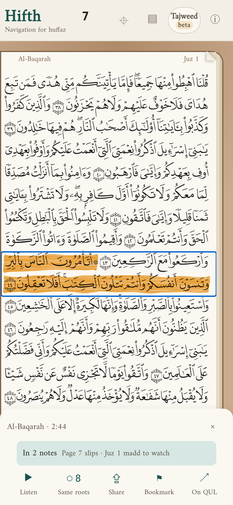
>
> **D — a tint over each verse**
>
> 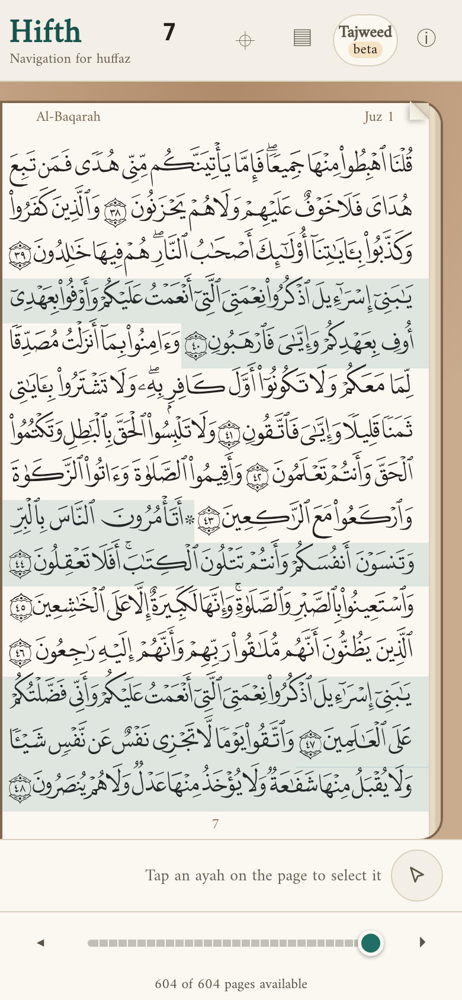

## What did building them teach us? — 3 things

No list of pros and cons written beforehand had these:

1. **D files slips in the wrong note without a word.** In the clip, 2:44 is a page-7 slip, not a look-alike, and it went straight into *Bani Isra'il look-alikes*. The bar says where taps go, but your eyes are on the page, not the bar. The Undo line is the only catch, and it is gone in a few seconds.
2. **Today's tool already costs two taps a slip.** The tool is put down after every note, so a run of slips means picking it again each time. That is the real problem D was reaching for, and it can be fixed on its own whatever you pick here: keep the tool picked until you put it down.
3. **C's box is about three lines taller than today's, and with each note on a full row it covered nine lines of the page,** often the verses just above the one you tapped. Small side-by-side choices keep it to three.

And for question 2: **D's tint covered about a third of page 7** with only four verses in notes, and it reads like the highlighter. **B's marks are hard to see** at phone size and sit right where a thumb turns the page.

## How do they compare? — side by side

**Question 1: when you tap a verse with the note tool**

| | **A** today | **B** notes first | **C** choices in the box *(recommended)* | **D** keep adding |
| --- | --- | --- | --- | --- |
| **For a hafiz** | A new slip is fast; adding to a note you have is impossible | Every new thought pays one extra tap | A new slip as fast as today; adding to a note is one more tap | Fastest for a run of slips, but a slip can land in the wrong note |
| **Pros** | Nothing to learn. Smallest box. | Adding to a note is the natural path. The box is simple. | Today's one tap kept. Your likeliest notes in reach without a detour. | One tap a slip once started. |
| **Cons** | Notes can never gather verses from the page; the feature has no way in from the tool. | One more tap for every new note, and most notes start new. | The box is about three lines taller and covers more of the page. | Files silently into the wrong note (clip 3). Needs a bar on screen the whole time. |
| **What it commits you to** | Adding to a note only from the verse menu, once that is built. | The tool feels slower than today. | The choices must stay small enough not to hide the text box; *More…* opens the full list. | A state you must remember to stop, and a bar the page has to make room for. |

**Question 2: how the page shows a verse in a note**

| | **A** dot by the number *(recommended)* | **B** edge mark | **C** nothing | **D** tint |
| --- | --- | --- | --- | --- |
| **For a hafiz** | A quiet reminder at the verse's end, where a slip is often remembered | Seen as the eye reaches the line, if seen at all | No reminder unless you open the menu | A loud reminder: a hint while testing yourself |
| **Pros** | One mark per verse however many notes. Covers no words. Readable at phone size. | Away from the text. | The cleanest page. | Unmissable. |
| **Cons** | At the end of the verse, not its start. A dot this small needs a big enough place to tap. | Hard to see; sits where the thumb turns the page. | The page says nothing about your notes. | Covered a third of the page; looks like the highlighter. |
| **What it commits you to** | Moving the dot off any pin already on that verse number. | Sharing the outer edge with the page-turn strip. | Notes are found only through the menu and the list of notes. | Giving up a colour the highlighter and look-alikes may need. |

> [!note]- What stays the same whichever you pick
> - A pin on a word or a sign stays where it was pinned; these questions are about verses in notes, not pins.
> - The verse menu will gain a *Note* button with the same choices, once holding a verse opens it (the [tap and hold](verse-tap-and-hold.md) question).
> - Undo is offered every time a verse is added to a note.
> - The three notes offered are the ones that can take the verse, the one used last first (the order step 1 already built).

> [!note]- What would change the answer
> - If you mostly record **several slips in one sitting**, D's speed matters more; but the clip shows the cost, and keeping the tool picked (thing 2 above) gets most of the speed without it.
> - If you want **a bare page while reciting**, C for question 2, and find notes through the list.
> - Nobody outside this project was surveyed for this page. The design note's [look at other apps](scoped-notes.md#what-do-other-quran-and-reading-apps-do) covers how they gather notes, not these two gestures.

> [!note]- What this is not settling
> - Whether the tool stays picked after a note (thing 2 above): a separate, small change worth making either way.
> - What the list of notes and one note's page look like (step 4 builds them).
> - The dot's exact size and colour, which is tuned on a real phone once chosen.

## What happens next?

Once you pick, step 3 builds the winner of question 1 into the note tool and step 4 the winner of question 2 onto the page, each with its browser tests, and the losing mocks are deleted. Step 3 is built (2026-10-02), and so are step 4's list of notes and following one; the dot is next. The mocks stay until the dot is built too, because one script records both questions from them; the pictures and clips on this page stay as the record of the choice.

**To answer:** comment on this note, or tell Claude two letters, for example "C and A".
