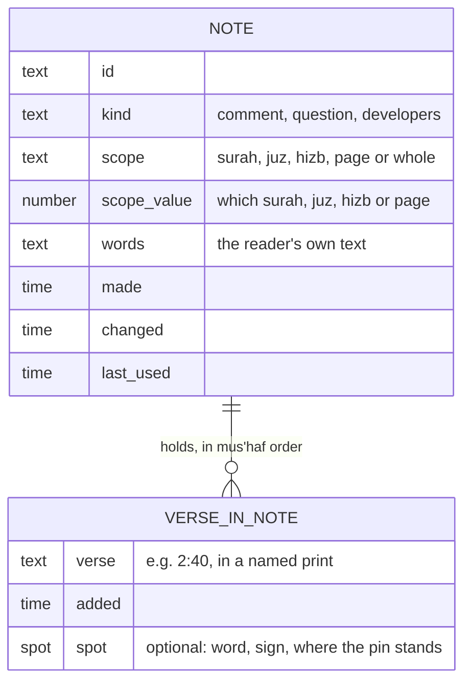
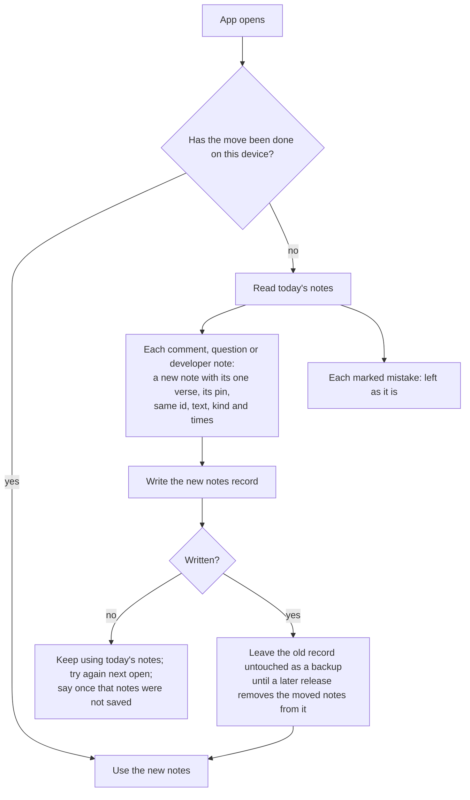
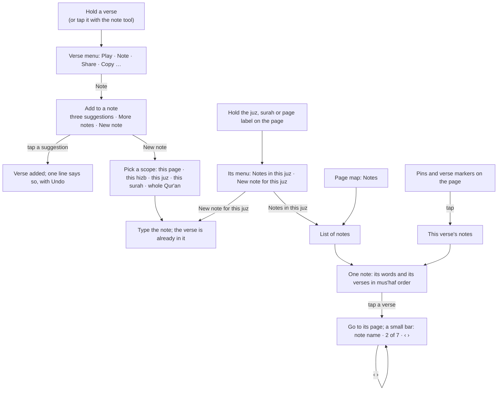
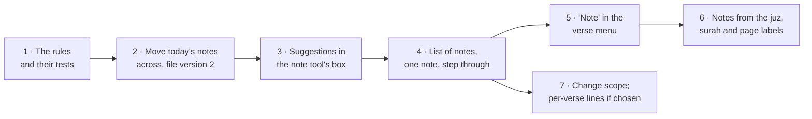

# Notes that gather verses: how should one note hold many verses from one part of the Qur'an?

> Asked by the owner on 2026-09-30: *"I want a robust note system. I want to declare a note
> scope (surah, juz, hizb, page, etc). Scope dictates which ayahs I can add to a note; a note
> can have many ayahs added to it. Based on scope, we can suggest a note to add an ayah to,
> especially recent notes in the same scope."*

**Status:** steps 1 and 2 of 7 built on 2026-10-01, step 3 on 2026-10-02. Step 1 is the rules (what each scope holds, adding and removing verses, which notes are offered, moving today's notes across, the saved file's version 2), with their tests. Step 2 moves today's notes across on the device the first time the app opens, keeps the old record untouched as a backup, and saves and loads the new kind of note in the file; the pins on the page look exactly as before. Step 3 is the note tool offering existing notes, as question 4 was answered: a tap still makes a new note, its box offers up to three notes that can take the verse (the last used first, the rest behind *More notes…*), and one tap moves the verse into that note, with an Undo. The choices go away once you start typing, so a tap never throws words away; and on a note of several verses, the box's Delete takes only that verse out. Three of the seven questions near the end were answered by
the owner on 2026-09-30; the two about feel will be built as live options and tried.

## The short version

- **A note becomes something that gathers verses.** Today a note is a few words pinned to one
  word of one verse. Under this design a note is your own words *plus a list of verses*, and
  you can keep adding verses to it.
- **Every note has a scope, chosen when you make it:** a surah, a juz, a hizb, a page, or the
  whole Qur'an. The scope decides which verses the note can take. A note scoped to juz 1 can
  take any verse in juz 1 and nothing else.
- **When you add a verse to a note, the app offers the notes that can take it**, the one you
  used most recently first, three at most, then "New note". A note whose scope does not hold
  the verse is never offered.
- **A verse can be in as many notes as you like.** Inside a note, verses are kept in mus'haf
  order, and you can step from one to the next across pages.
- **Every note you have today moves across untouched**: each becomes a note holding its one
  verse, pinned where it was. Marked mistakes stay what they are.
- **It plugs into the long-press verse menu** already planned: its "Note" action opens the
  "add to a note" sheet. Holding the surah name, the juz or the page number (also planned)
  offers a new note scoped to that surah, juz or page.
- **Seven questions need the owner** (the table in [What needs the owner's call?](#what-needs-the-owners-call)).
  Two of them are about how something feels in the hand, so they should be built as live
  options and tried, not chosen from a picture.
- **Build order:** the rules first with their tests, then the move-across of today's notes,
  then the note tool's box, then the list of notes and stepping through them, then the
  long-press menus. Each step ships on its own.

> **For a hafiz:** this is how a hafiz keeps *a list of trouble spots* instead of scattered
> pins. Revising juz 5, you hit three places you keep slipping on; each one is a single tap
> into "Juz 5 — weak spots", because that note is the first thing offered. Before reciting
> to your teacher you open the note and step through its verses in order, page by page. And
> the most valuable list a hafiz keeps, **look-alike verses that differ by a word** (2:58 and
> 7:161, say), spans two surahs, so it needs the whole-Qur'an scope: without it, the scope
> rule would forbid the very note a hafiz needs most.

## A few words, defined once

- **Verse** (ayah) — one numbered verse of the Qur'an. Written surah:verse, so 2:255 is the
  255th verse of the second surah.
- **Surah** — one of the 114 chapters.
- **Juz** — one of 30 roughly equal parts the Qur'an is divided into; the usual unit for
  planning revision. Juz 1 runs from 1:1 to 2:141, 148 verses.
- **Hizb** — half a juz, so 60 in all. Its boundaries are not exactly half-way through the
  juz; the app holds the real ones. Hizb 1 runs from 1:1 to 2:74, 81 verses.
- **Page** — a page of the printed mus'haf the app shows (the 604-page Madani print). Page 7
  holds 2:38 to 2:48. A page number belongs to that print; page 7 of another print is
  different verses.
- **Scope** — the owner's word for *which part of the Qur'an a note is about*: one surah, one
  juz, one hizb, one page, or the whole Qur'an.
- **Spot** — the exact place a pin stands on a verse: a word, or a vowel sign on a word.

## What is being decided?

Whether a note should hold many verses inside a scope the reader picks, and if so: what the
note is made of, how today's notes become that without losing any, which notes the app
offers when a verse is added, and what a reader sees on each screen.

## What does the app do today, and where does it stop?

Measured from the app as it is on main, 2026-09-30.

- **A note is one pin on one verse.** The note tool (key N on a computer, the tools menu on a
  phone) drops a pin on the word under the tap and opens a small box to type in. Closing it
  empty throws it away; Delete can be undone for a few seconds. The harakat and word tools
  pin a note to one vowel sign, or to several on the same word.
- **A note knows** its verse, its page, the word number, where the pin stands, which sign or
  letter it sits on if any, its kind (a comment, a correction, a question for scholars, a
  note to the developers), its text (up to 2,000 characters), and when it was made and last
  changed.
- **A marked mistake is stored as a note** of the kind "correction" with no text, one per
  word. It is drawn as a red mark on the word, not as a pin, and it also feeds the revision
  calendar's red dots.
- **There is no list of notes anywhere.** A note can only be found by turning to its page and
  seeing its pin. Ten notes about juz 5 are ten pins on ten pages with nothing tying them
  together.
- **The same thought on two verses is two notes**, typed twice, and changing one leaves the
  other behind.
- **Notes are kept on the device** in the same private database as the bookmarks, the whole
  list written at once on every change, and they travel in the same saved file as the
  bookmarks. That file is the decided backup.

<details>
<summary>Where this lives in the code</summary>

- The rules: `packages/core/src/notes.ts` (`Note`, `addNote`, `editNote`, `removeNote`,
  `notesOnPage`, `isMistake`, `markMistake`, `mergeNotes`, `isNote`), tested in
  `notes.test.ts`.
- Storage: `apps/web/src/bookmark-store.ts`. IndexedDB database `hifth.bookmarks.v1`, object
  store `sets`, record id `notes` holding `{ id: "notes", notes: Note[] }`. Not localStorage:
  the `hifth.` localStorage prefix in `storage.ts` is only for dismissed notices.
- The saved file: `toBookmarkFile` / `parseBookmarkFile` in `packages/core/src/bookmarks.ts`,
  `{ kind: "hifth.bookmarks", version: 1, savedAt, bookmarks, notes? }`. A file whose notes
  fail `isNote` is refused whole. Unknown top-level fields are silently dropped, so an older
  app reading a newer file would lose anything new without saying so.
- The box: `apps/web/src/components/NoteBox.tsx`. Pins: `drawNotePins` in `PageStage.tsx`.
  Wiring: `useNotes` in `useBookmarks.ts`, `placeNote` / `closeNote` / `deleteNote` in
  `App.tsx`.
- Browser tests: `apps/web/e2e/notes.spec.ts` (pin, type, reload; keyboard; delete and Undo)
  and `mistakes.spec.ts`.
- The divisions: `juzOf`, `hizbOf`, `JUZ_STARTS`, `HIZB_STARTS`, `AYAH_COUNTS` in
  `packages/core/src/quran-meta.ts`; verse to page in the print's manifest
  (`ayahPages`, one page per verse; the manifest refuses a verse on two pages). Pages hold
  1 to 40 verses, 8 in the middle.

</details>

## What do other Qur'an and reading apps do?

Looked at on 2026-09-30. "Read" means the page was opened; "snippet" means only a search
result's summary was seen.

| App | What a note or a collection is | Seen how |
| --- | --- | --- |
| Quran.com, notes | A note sits on **one verse**; a verse with notes shows a coloured icon; notes are listed in your profile and sync to your account. No ranges, no grouping. ([take notes](https://quran.com/en/take-notes)) | read |
| Quran.com, collections | Bookmarks gathered into **named collections**; one verse can be in **several** collections; collections sort by recent use or by name; inside one, verses sort by date added or **mus'haf order**. No limit on which verses go in. ([collections](https://quran.com/product-updates/introducing-bookmarks-collections)) | read |
| Quran app by GTAF | **Collections** are folders of any number of verses; notes are per verse, "organized by surah". ([library](https://gtaf.org/blog/library-bookmarks-notes-in-quran-app/)) | read |
| Logos Bible Software | **One note can be anchored to many passages** (their example: Genesis 1 and John 1, or a topic like "creation"); notes live in notebooks, and you can set a **default notebook** so new notes go there without asking. ([features write-up](https://biblestudy.tips/unique-logos-notes-features/)) | read (a third-party write-up; Logos's own help page refused us, seen as a snippet only) |

What carries over, and what does not:

- **A verse in many groups, and mus'haf order inside a group, are the norm.** Both are taken
  here.
- **One note on many passages exists** (Logos), but there it is a study tool for a scholar,
  not a revision aid, and nothing limits which passages.
- **Nobody we saw limits a group to a part of the Qur'an.** The scope is new. Its value here
  is that it keeps the "add to which note?" list short and relevant mid-revision; the cost
  is the whole-Qur'an scope this design has to add back for look-alike verses.
- **"Default notebook" (Logos) is the nearest thing to our suggestion rule**: a reader rarely
  wants to choose a destination every time. We did not confirm how any app orders a
  "recently used" picker; that rule here is our own.
- **Not looked at:** Tarteel, Ayah, Muslim Pro, Kindle collections, and how any hifz tracker
  groups weak verses. Worth a look before the note list's design is final, not before the
  rules are built.

## What have we already decided that shapes this?

- **Where a note can be pinned** (`mistake-note-anchor`, decided 2026-09-02): down to a single
  mark, *and also* to a whole line, a whole page, or a division such as a juz's start or a
  hizb quarter. That second half was never built; its open part was "where does the marker
  for a note about a whole page or juz go". A scoped note is the follow-through: a note about
  juz 5 is a juz-scoped note. Pins on exact spots stay as decided.
- **The kinds of note** (`mistake-note-kinds`): a comment, a correction, a question for
  scholars, a note to the developers, kept in one place and shareable. A scoped note keeps a
  kind.
- **How notes leave the device** (`note-persistence` = a saved file, and an email; cloud on
  sign-in) and **what that file holds** (`note-export-shape` = the reader's whole state in one
  file). So scoped notes go into the same file, not a second one.
- **One drawer at a time; on a phone, drawers rise from the bottom** (`ayah-drawer`,
  `selection-drawer`). The "add to a note" sheet is one of those.
- **The page tools reach a phone** (`phone-toolbar`). The note tool works there too.
- **The share tray** (`share-sheet-builder` = C) is what the long-press menu's Share opens; a
  note's own sharing is not settled here.
- **Planned, not built** (the plan's items 25 to 28, asked 2026-09-30): a long-press menu on a
  verse with a "Note" action; the surah name, juz and page number printed on the page; a
  long-press on each of those giving its own menu. This design says what "Note" does in
  those menus.
- **A mistake stays one mark per word**, counted on the revision calendar. It is not a note
  that gathers verses, and this design leaves it alone.

## What is a note made of?



**The rules, in words:**

1. **A note has exactly one scope**, picked when it is made: a surah, a juz, a hizb, a page,
   or the whole Qur'an. A page scope also names the print, because page numbers belong to it.
2. **A verse can be added only if it lies inside the scope.** Inside means: same surah; in
   that juz or hizb by the app's own division tables; on that page of that print; or anything
   for the whole Qur'an.
3. **A verse appears at most once in a note**, and may be in any number of notes.
4. **A verse in a note may carry a spot** (a word, a sign) when it was added by pinning, and
   the pin is drawn there. A verse added from the verse menu has no spot; it belongs to the
   whole verse.
5. **Verses are shown in mus'haf order.** When each was added is kept too, so "order added"
   can be offered later at no cost.
6. **A note can hold no verses.** One made from the juz label, before any verse is added, is
   just words with a scope. Removing the last verse does not delete the note.
7. **Widening the scope is always allowed** (a page note can become its juz). **Narrowing is
   allowed only if every verse still fits**; otherwise the app names the verses that would
   fall outside and changes nothing until they are removed. The app never drops a verse to
   make a scope fit.
8. **A verse outside its note's scope can only arrive from a loaded file** (an edited file,
   or one from a future version). It is kept, marked "outside this note's scope", and never
   dropped, matching "loading never deletes".
9. **Text is one body per note**, its first line serving as the note's title in lists. A
   short line per verse is question 5.
10. **Marked mistakes are not affected.** They keep their own one-per-word record.

<details>
<summary>The shape, for whoever builds it</summary>

```ts
type NoteScope =
  | { type: "surah"; surah: number }            // 1..114
  | { type: "juz"; juz: number }                // 1..30, by JUZ_STARTS
  | { type: "hizb"; hizb: number }              // 1..60, by HIZB_STARTS
  | { type: "page"; edition: EditionId; page: number } // by that print's ayahPages
  | { type: "whole" };

interface NoteVerse {
  readonly key: string;            // canonical ayah key, carries the print
  readonly addedAt: number;
  readonly spot?: {                // present when pinned; same fields as today's Note
    readonly page: number; readonly word: number | null;
    readonly x: number; readonly y: number;
    readonly mark?: number | null; readonly marks?: readonly number[];
    readonly letter?: number; readonly onHarakah: boolean;
  };
}

interface ScopedNote {
  readonly id: string;             // today's ids are kept as they are
  readonly kind: "comment" | "question" | "developers";
  readonly scope: NoteScope;
  readonly text: string;           // NOTE_TEXT_MAX still applies
  readonly verses: readonly NoteVerse[]; // stored in mus'haf order, no repeats
  readonly createdAt: number;
  readonly updatedAt: number;      // text or scope changed
  readonly usedAt: number;         // see the suggestion rule
}
```

Pure, clockless functions in core, like the rest of the notes module: `scopeContains(scope,
key, pageOf)`, `scopeSize(scope)` (verse count: page 7 is 11, hizb 1 is 81, juz 1 is 148,
Al-Baqarah 286, whole 6,236), `addVerse`, `removeVerse`, `changeScope` (returns the verses
that would fall out instead of a new note when narrowing fails), `suggestNotes`,
`migrateV1Notes`, `isScopedNote`, `mergeScopedNotes`. The page lookup is passed in, since the
print's verse-to-page table is loaded by the app, not held in core.

Stored as a new record (id `scoped-notes`) in the same database, written whole like the
others. The saved file becomes `version: 2` with a `scopedNotes` field; the app reads both 1
and 2. An older app refuses a version-2 file out loud instead of quietly losing the notes,
which is the honest failure.

</details>

## How do today's notes move across without losing any?

Every comment, question and developer note becomes a note holding one verse, scoped to the
page it was pinned on (question 1 asks whether page is the right default), with its pin, its
text, its kind, its id and its times unchanged. Its "last used" time is the time it was last
changed. Marked mistakes are left exactly where they are.



- **Nothing is deleted on the way.** The old record stays as it was, so going back to an older
  version of the app loses nothing either.
- **Running it twice changes nothing**: ids are kept, so a note already moved is skipped.
- **An old saved file still loads**: its notes go through the same move, then merge with
  what is on the device by id, the copy changed last winning, as today.

## Which notes does the app offer when you add a verse?

When a reader adds a verse (from the verse menu's "Note", or the note tool's box), the app
lists notes to add it to. Exactly:

1. **Take every note that can take the verse:** its scope holds the verse, and the verse is
   not already in it. Marked mistakes are never candidates.
2. **Order them by when each was last used, most recent first.** A note is *used* when it is
   made, when its text or scope changes, and when a verse is added to it or removed from it.
   Opening or reading a note does not count (an assumption; reading is not a sign you are
   working on it, and it keeps a glance from reshuffling the list).
3. **Ties**, which in practice only happen with notes loaded from a file in one moment: the
   note with the **smaller scope** first (fewer verses, so page before hizb before juz before
   a long surah before whole), then the **more recently made**, then by id so the order never
   wobbles.
4. **Show the first three**, then "More notes…" if there are others (opening the rest in the
   same order), then "New note". Three keeps the sheet short enough that "New note" stays
   above the thumb on a phone; that number is tuning, not a principle.
5. **If no note can take it, show only "New note"**, with the scope picker ready.
6. **Notes that already hold the verse** are not offered; the sheet names them on one quiet
   line ("Already in: Juz 1 — weak spots") so the reader is not left wondering.

**Worked example.** A reader on page 7 adds 2:40. They have four notes:

| Note | Scope | Last used | Offered? |
| --- | --- | --- | --- |
| Juz 1 — weak spots | juz 1 | today 09:12 | yes, 1st |
| Look-alikes | whole Qur'an | yesterday | yes, 2nd |
| Bani Isra'il passages | Al-Baqarah | last week | yes, 3rd |
| Page 7 madd | page 7 | last month | under "More notes…" |
| Al-Imran weak spots | Al-Imran | today 09:30 | no: 2:40 is not in Al-Imran |

The owner's phrase "especially recent notes in the same scope" is read here as *recent notes
whose scope holds this verse*. Another reading, *prefer notes of the same kind of scope as the
one you used last*, is question 3's option D.

## What are the main screens and flows?



**1 · Adding a verse to a note** (the sheet the verse menu's "Note" opens; on a computer it
stands beside the verse, on a phone it rises from the bottom).

```
┌──────────────────────────────────────┐
│ Al-Baqarah 40 — add to a note        │
│                                      │
│  Juz 1 — weak spots        juz 1   › │
│  Look-alikes               whole   › │
│  Bani Isra'il passages  Al-Baqarah › │
│  More notes… (1)                     │
│ ──────────────────────────────────── │
│  + New note                          │
│  Already in: none                    │
└──────────────────────────────────────┘
```

**2 · A new note: picking its scope.** Each choice names how many verses it covers, worked
out from the verse in hand, so the reader sees what they are committing to.

```
┌──────────────────────────────────────┐
│ New note on Al-Baqarah 40            │
│ What is this note about?             │
│  ○ This page (7)          11 verses  │
│  ○ This hizb (1)          81 verses  │
│  ● This juz (1)          148 verses  │
│  ○ This surah (Al-Baqarah) 286 verses│
│  ○ The whole Qur'an                  │
│ ┌──────────────────────────────────┐ │
│ │ Juz 1 — weak spots               │ │
│ └──────────────────────────────────┘ │
│                     Cancel   Create  │
└──────────────────────────────────────┘
```

**3 · One note, and stepping through it.**

```
┌──────────────────────────────────────┐        on the page, while following:
│ Juz 1 — weak spots          juz 1  ⋯ │        ┌────────────────────────────┐
│ Watch the madd before the pause in   │        │ Juz 1 — weak spots  2 of 3 │
│ each of these.                       │        │        ‹      ›      ✕     │
│ ──────────────────────────────────── │        └────────────────────────────┘
│  2:40   page 7                     › │
│  2:58   page 9                     › │
│  2:124  page 19                    › │
└──────────────────────────────────────┘
```

**4 · A verse's notes on the page.** A pinned spot keeps its pin. A verse that is in a note
without a spot shows one small marker by its verse number, with a count when it is in more
than one note (question 6). Tapping either lists that verse's notes.

<details>
<summary>How it plugs into the long-press menus and the note tool</summary>

- **The verse menu (plan item 25).** "Note" opens sheet 1 for that verse. On a phone this is
  the quickest way in, quicker than picking the note tool and tapping a word.
- **The labels on the page (items 26 and 27).** Holding the juz label offers "Notes in this
  juz" (the list, filtered to notes whose scope is juz N or lies inside it) and "New note for
  this juz" (sheet 2 with juz N chosen and no verse yet). The surah name and the page number
  do the same for their surah and page. This is also the answer the pin decision left open:
  a note *about* a juz is reached from the juz's own label, not from a marker squeezed onto
  the text.
- **The note tool (N).** Still pins to the exact word or sign. What the box offers is
  question 4: the recommended answer keeps today's one tap for a new note and puts the
  suggestions in the box as one-tap choices.
- **Following a note** reuses the idea of the trail of visited verses: a small bar names the
  note and where you are in it; Escape or ✕ leaves it. It does not record a revision look,
  for the same reason a hop does not: the app moved you.

</details>

## What needs the owner's call?

| # | Question | Recommended |
| --- | --- | --- |
| 1 | What scope does each of today's notes get when it moves across? | The page it is pinned on |
| 2 | Which scopes can a note have? | Surah, juz, hizb, page, and the whole Qur'an |
| 3 | When several notes could take a verse, which comes first? | The one used most recently |
| 4 | When the note tool taps a word, does it start a new note or offer existing ones? | A new note at once, with the suggestions in its box |
| 5 | Does each verse in a note get its own line of text? | Not in the first build |
| 6 | How does the page show that a verse is in a note? | A small marker by the verse number, with a count |
| 7 | Which scope is ready-picked when making a new note? | The kind you picked last time; the surah the first time |

**Answered by the owner, 2026-09-30:** 1 (the page it is pinned on), 2 (the four plus the
whole Qur'an) and 5 (one text per note, for now), each as recommended; the reasons are in
[the decision record](../decisions/scoped-notes.md). 3 and 7 are being built as recommended,
since they are easy to change.

Questions 4 and 6 are about how something feels in the hand, so each option was built on the
real app on a phone and recorded: **[how adding a verse to a note should feel, and how the page
shows it](scoped-notes-feel.md)** has the clips and what building them taught us. **Answered by
the owner, 2026-10-02:** 4 is C and 6 is A, each as recommended.

### 1 · What scope does each of today's notes get when it moves across?

> **For a hafiz:** decides whether an old note shows up as a suggestion while revising
> nearby. Too narrow and it is never offered; too wide and every old note crowds the list.

| Option | Pros | Cons | Implications |
| --- | --- | --- | --- |
| **A · The page it is pinned on** *(recommended)* | Matches where the reader wrote it; offered only when they add a verse on that page, so old notes do not crowd the list | A note that was really about a whole surah is under-scoped until widened | Widening is one step, so the cost of being wrong is one tap |
| **B · Its surah** | Old notes stay available while working through the surah | Long surahs (Al-Baqarah, 48 pages) put every old note in every list | The suggestion list fills with migrated notes for weeks |
| **C · The whole Qur'an** | Never blocks adding anything | Every old note is offered on every verse; the scope means nothing for them | Makes the list depend entirely on recency |
| **D · Ask on first open** | The reader decides | A question about plumbing on a day they came to revise | Needs a one-off screen nobody sees twice |

Recommended A: the narrowest true answer, and widening is cheap.

### 2 · Which scopes can a note have?

> **For a hafiz:** look-alike verses, the hafiz's biggest source of slips, almost always sit
> in different surahs. Without a whole-Qur'an scope they cannot share a note.

| Option | Pros | Cons | Implications |
| --- | --- | --- | --- |
| **A · Surah, juz, hizb, page** (the four named) | Exactly what was asked; every note is tied to a part of the book | No note can hold look-alikes across surahs | A look-alike list would need a separate feature |
| **B · The four, plus the whole Qur'an** *(recommended)* | Covers look-alikes and topic lists; one more choice on the picker | A whole-Qur'an note is offered on every verse when recently used | The suggestion rule has to cope with it (it does: recency first, three at most) |
| **C · B, plus a quarter-hizb and a run of verses you pick** | Finest control; a quarter-hizb is a common daily revision unit | A bigger picker; a run of verses needs a from-to chooser | Quarter boundaries exist in the vendored source data but not yet in the app's tables; another table and its check to add |

Recommended B now; C's quarter-hizb is cheap to add later if revision by quarters is how the
owner works.

### 3 · When several notes could take a verse, which comes first?

> **For a hafiz:** mid-revision the right note should be one tap away without reading a
> list. Getting this wrong costs a scroll on every verse added.

| Option | Pros | Cons | Implications |
| --- | --- | --- | --- |
| **A · Most recently used** *(recommended)* | The note you are working on stays on top through a whole session | A busy whole-Qur'an note can sit above a closer one | Simple to explain: "the one you used last" |
| **B · Narrowest scope** | The most specific note always leads | A stale page note from last year beats today's juz note | Recency stops mattering, against what was asked |
| **C · Used in the last 7 days first, narrowest among those; then the rest by recency** | Balances both | Harder to predict; the order changes on its own as days pass | A time window to tune |
| **D · Same kind of scope as your last note first, then recency** | Keeps a reader working "by juz" in juz notes | Surprising when switching tasks | Needs to remember the last scope kind |

Recommended A, with the narrower scope breaking ties.

### 4 · When the note tool taps a word, does it start a new note or offer existing ones?

> **For a hafiz:** this is the fastest path to recording a weak spot. Every extra tap here is
> paid on every slip.

| Option | Pros | Cons | Implications |
| --- | --- | --- | --- |
| **A · A new note at once, as today** | Fastest for a new thought; nothing changes | Adding to an existing note means making one, then moving it | Suggestions only live in the verse menu |
| **B · Offer the notes first, then type** | Adding to an existing note is natural | One more tap for every new note | The tool feels slower than today |
| **C · A new note at once, its box showing the suggestions as one-tap choices** *(recommended)* | Today's one tap is kept; adding to a note is one more tap, not a detour | A busier box | The box needs room for three choices without hiding the text field |
| **D · "Keep adding" mode: pins go to the last note used until you stop** | Quickest for a run of slips in one sitting | A pin can land in the wrong note without the reader noticing | Needs a visible "adding to …" state on the bar |

**Decided C** (owner, 2026-10-02; [the record](../decisions/scoped-notes.md#when-you-tap-a-verse-with-the-note-tool-what-opens)). All four were built and recorded: [the clips](scoped-notes-feel.md#question-1-when-you-tap-a-verse-with-the-note-tool-what-opens--4-options).

### 5 · Does each verse in a note get its own line of text?

> **For a hafiz:** a look-alike note is most useful when it says, verse by verse, which word
> differs. One body of text can say that too, just less neatly.

| Option | Pros | Cons | Implications |
| --- | --- | --- | --- |
| **A · One text per note** *(recommended for the first build)* | Simplest; today's pins move across as they are | "This one says X" has to name the verse in the text | Can grow into B later without moving anything |
| **B · One text per note, plus an optional line per verse** | Look-alike notes read clearly; each pin can carry its own words | Two places to type; a heavier note view | The file shape gains a field per verse |
| **C · A line per verse only, no note-wide text** | Each verse speaks for itself | Loses the note's own heading and summary | Today's text has to go somewhere; it would land on the one verse |

Recommended A now, B as soon as the first look-alike note is written and feels cramped.

### 6 · How does the page show that a verse is in a note?

> **For a hafiz:** markers on the page are a reminder "you slipped here before". Too loud,
> and they distract from recitation; too quiet, and the reminder is lost.

| Option | Pros | Cons | Implications |
| --- | --- | --- | --- |
| **A · A small marker by the verse number, with a count** *(recommended)* | One place per verse however many notes; does not cover the words | The verse number is at the end of the verse, away from the start of the line | Needs a size that reads at phone size and does not hide the number |
| **B · A mark in the margin beside the verse's first line** | Seen as the eye reaches the verse | Crowds the margin where the page bar and turn strip sit | Clashes with the page-turn strip on the outer edge |
| **C · Nothing on the page; only in the verse's menu** | The cleanest page | The reminder is gone unless you hold the verse | The page no longer tells you anything about your notes |
| **D · A faint wash over the verse** | Unmissable | Competes with the highlighter and look-alike colours | Takes a colour the page may need for something else |

**Decided A** (owner, 2026-10-02; [the record](../decisions/scoped-notes.md#how-does-the-page-show-that-a-verse-is-in-a-note)). All four were drawn on page 7 at phone size: [the pictures](scoped-notes-feel.md#question-2-how-does-the-page-show-that-a-verse-is-in-a-note--4-options).

### 7 · Which scope is ready-picked when making a new note?

> **For a hafiz:** barely matters; one tap either way. Decide quickly.

| Option | Pros | Cons | Implications |
| --- | --- | --- | --- |
| **A · Always the surah** | Predictable | Wrong for a reader who works by juz | — |
| **B · Always the page** | The narrowest, safe default | Most notes are about more than a page | Many notes widened by hand |
| **C · The kind you picked last time; the surah the first time** *(recommended)* | Learns how you work in one go | Slightly less predictable | Remembers one small setting on the device |
| **D · Nothing picked; you must choose** | Deliberate | One more tap every time | — |

Recommended C.

## What else was considered, and why is it not here?

- **Tags instead of notes** (label a verse "madd", "look-alike"). Tags group verses but hold
  no text; the request is for notes that hold words *and* verses. A note's scope plus its
  first line covers most of what a tag would.
- **Folders of notes.** A second level of grouping before there are enough notes to need one.
- **A note made automatically from the app's own look-alike list** (offer "make a note of
  2:58 and its look-alikes"). Valuable, and a natural next step once whole-Qur'an notes
  exist; a feature of its own.
- **Sharing a note with a teacher.** The decided way out is the saved file and an email;
  sending one note on its own is a separate question.
- **Putting marked mistakes into notes.** A slip is a fact about one word, counted on the
  calendar; folding it into a gathering note would blur both. A later "add this slip to a
  note" action can link them without merging them.

## What would change the answer?

- **The owner revising by quarter-hizb** would bring the quarter scope (question 2, C)
  forward.
- **A look-alike note feeling cramped** in one body of text would bring per-verse lines
  (question 5, B) forward.
- **Suggestions turning out to be wrong more often than right** in real use would point at
  question 3's C or D.
- **A second print** with its own page numbers would mean a page-scoped note cannot move
  between prints; the other scopes can.
- **Sign-in and cloud copies** arriving would need merge rules for two devices editing one
  note's verse list, not only its text.

## What is this not settling?

- How the long-press verse menu itself looks, or what else is in it (plan item 25).
- Where the surah name, juz and page number sit on the page (plan item 26).
- The look of the note list in the page map, beyond "most recently used first".
- Two pins on two different words of the same verse *in one note* (this design allows one
  entry per verse; two pins on one verse stay two notes, as today).
- Searching notes by their text.
- Anything about The Study Quran's commentary; these are the reader's own notes only.

## How will we know it works?

Every test below is written before the code it checks, and watched failing for the right
reason first.

<details open>
<summary>Rule tests (no browser)</summary>

- **What a scope holds, at its edges:** juz 2 starts at 2:142, so 2:141 is out and 2:142 is
  in; hizb 2 starts at 2:75; page 7 holds 2:38 to 2:48 by the print's table; a surah holds
  only its own verses; the whole Qur'an holds all 6,236. A verse number past the end of its
  surah is held by nothing.
- **How big each scope is:** page 7 is 11, hizb 1 is 81, juz 1 is 148, Al-Baqarah 286,
  whole 6,236.
- **Adding a verse:** refused outside the scope; refused twice; kept in mus'haf order
  whatever order it was added in; marks the note used.
- **Removing a verse:** the note stays when it is the last.
- **Changing scope:** widening always works; narrowing returns the verses that would fall
  out and changes nothing.
- **Suggestions:** order by last used; the tie rules in order (smaller scope, newer, id);
  three at most; never a note already holding the verse; never a note whose scope misses it;
  never a mistake; nothing when no note fits.
- **Moving today's notes across:** each comment, question and developer note becomes a note
  of one verse with the same id, text, kind, times and spot; a pin with no word keeps no
  word; mistakes untouched; running it twice adds nothing.
- **The saved file:** a version-2 file round-trips; a version-1 file loads and moves across;
  merging never deletes and keeps the copy changed last; a verse outside its scope loads and
  is marked, not dropped; a broken note refuses the file as today.

</details>

<details open>
<summary>Browser tests (Playwright)</summary>

- **Today's notes survive the upgrade.** Seed the device's store with two pinned notes and a
  marked mistake as the current app writes them; open the app: both pins are on page 7, the
  note list shows two notes of one verse each, the mistake is still red, and a reload changes
  nothing.
- **Adding to a suggested note from the note tool.** Pin and write a note on 2:39; pin on
  2:40: its box offers the first note; take it: that note now holds 2:39 and 2:40; reload;
  still so.
- **The scope limits what is offered.** Make a juz 1 note; go to page 22 (juz 2), pin on a
  verse: the juz 1 note is not offered.
- **Stepping through a note.** Open a note of three verses on three pages; tap the first;
  the bar says 1 of 3; › turns to the next page and selects the next verse; Escape leaves.
- **A verse's notes from the page.** A verse in two notes shows one marker with 2; tapping
  it lists both by name.
- **Save and load.** Save the file, clear the device's store, load the file: every note and
  every verse is back.
- **Phone.** On the phone project, hold a verse, choose Note, add to the suggested note
  (lands with the verse menu, plan item 25).
- **Spoken names.** The sheet is a dialog named for the verse; each suggestion is a button
  named with the note's title and scope.

</details>

## In what order do we build it?



1. **The rules, pure, with their tests.** Scopes, what each holds, adding and removing
   verses, the suggestion rule, the move-across, the file's new version. Nothing on screen
   changes. Ships alone.
2. **Moving today's notes across and storing the new notes.** The upgrade test above, written
   first. Pins look exactly as before; the old record is kept as a backup.
3. **Suggestions in the note tool's box** (question 4's answer). The first thing a reader
   sees change: pinning near an existing note offers it.
4. **The list of notes, one note's view, and stepping through its verses.** In the page map
   beside the bookmarks. This is where a note stops being invisible.
5. **"Note" in the long-press verse menu.** Lands with plan item 25; the phone's quick way
   in.
6. **Notes from the juz, surah and page labels.** Lands with plan items 26 and 27.
7. **Changing a note's scope**, and per-verse lines if question 5 goes that way.

Steps 1 and 2 can start before any question is answered, using the recommended answers to
questions 1 and 2. Step 3 waited on question 4 and is built. Step 4's list of notes and following one are built (2026-10-02): the list sits under the bookmarks in the page map, newest first, and following a note shows a dark bar of its own above the bottom line — floating over the page it covered the tools, so it takes a row instead. The dot by the verse number (question 6) is built too (2026-10-03): it sits on the upper shoulder of the number, in the gap after the verse's last word, and is left off a verse whose every note already pinned it, since the pin shows it. A tap lists the verse's notes under its line, or over it when there is no room below, so the list never covers the verse; on a two-page spread it opens beside the dot instead of across both pages. Step 6 is built (2026-10-03): holding the juz name, the surah name or the page number offers "Notes (n)" when any note is about that part, and "New note" always. The list counts a note about the part or about a smaller part inside it (a page note shows under its surah and its juz), and any note holding one of its verses. A new note starts with no verse and is kept only once something is typed; a note with no verse opens its words from a list rather than being followed, and Delete on it has an Undo. Step 5 is built (2026-10-03): "Note" in the menu a hold on a verse opens goes the same way a pin does, so it starts a new note at once and offers the notes the verse could join; a browser test on the computer and both phones holds it. Step 7 is built (2026-10-03): in a pinned note's box, the part the note is about is a button in the top line, and it lists every part that holds the note's first verse, narrowest first: its page, hizb, juz, surah, and the whole Qur'an. A wider part applies at once, and the note is then offered to pins anywhere inside it. A narrower one that would leave a verse outside names that verse, says to take it out first, and changes nothing. A note with no verse (one started from a juz, surah or page label) has the same button (2026-10-03): with no verse to start from, it lists the parts around the page open now when that page lies inside the note's part, or else around where its part starts, and holding no verse it can be widened or narrowed freely. Per-verse lines wait on question 5, which stays with one body of text.
