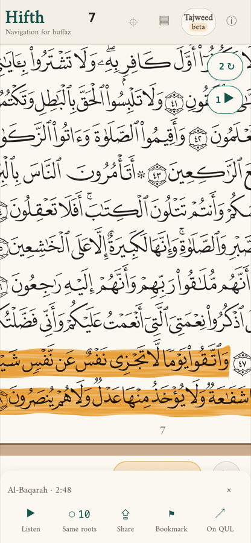
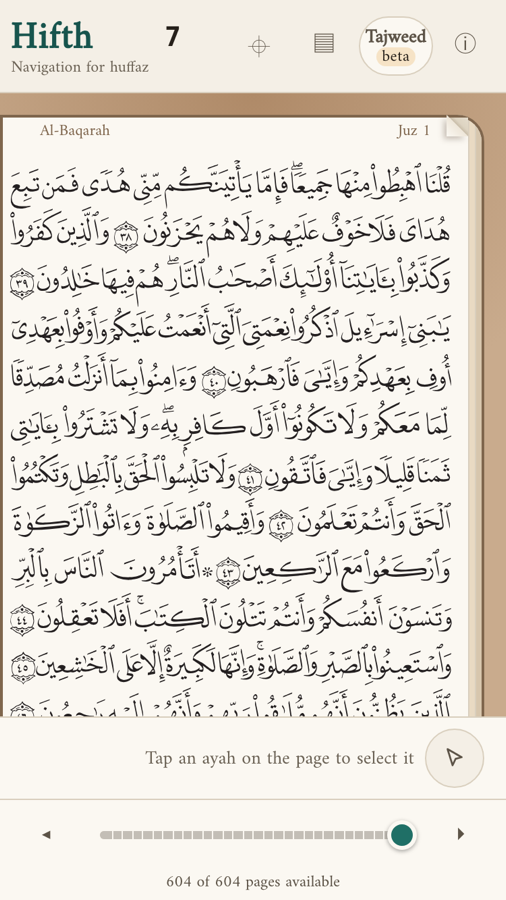
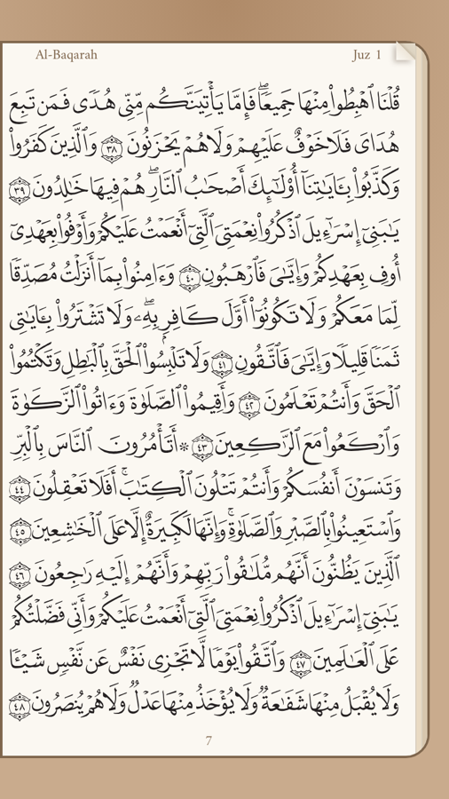
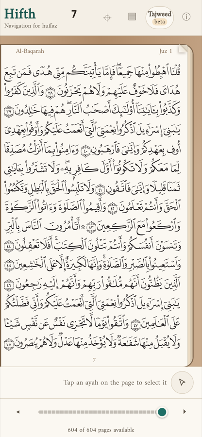
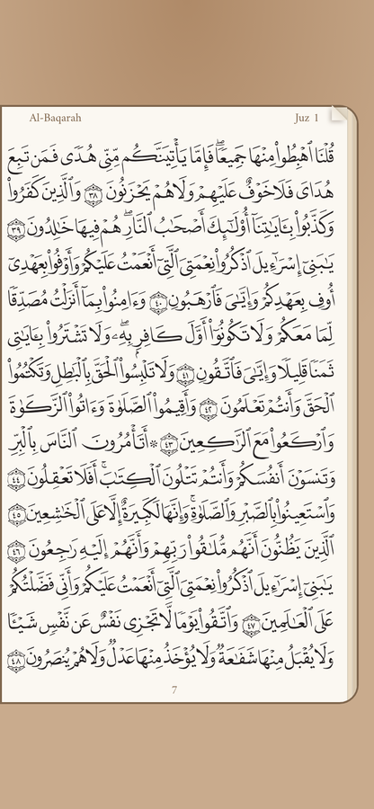
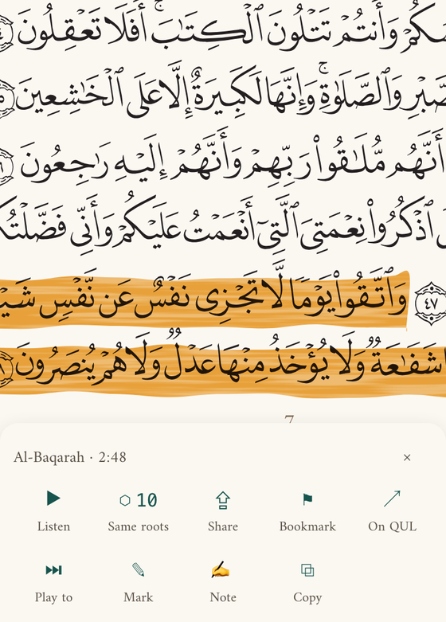
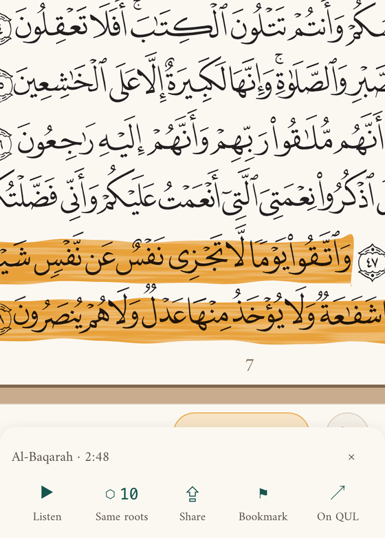
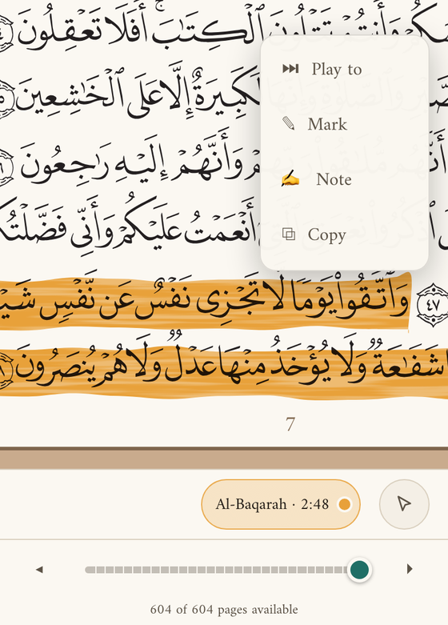
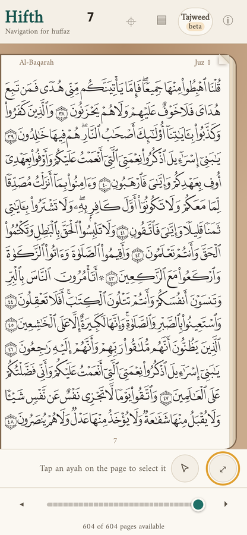
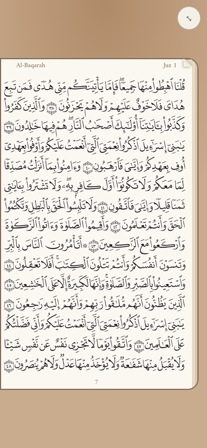

# What should a tap on a verse do, and what should holding your finger on it do?

*Open, 2026-09-30. Two features are waiting on this one answer: a menu that opens when you hold your finger on a verse, and full-screen reading, where a tap on the page hides the bars. Both want the plain tap, and today the tap already has a job. Pictures are from the real app on a phone; where an option adds something new, a short script added it to the live page for the picture.*

> [!tip] Recommended
> **A — holding a verse opens its menu, and a tap hides or shows the bars.** The page becomes something you read, not something a stray tap paints orange, and on a smaller phone a tap gives you back the last four lines the bars cover today.

**3 options** are drawn below. **1 thing surprised us** while taking the pictures, and it changes the case for full-screen: see *What does hiding the bars actually give you?* below.

To answer: leave a comment on this note, or tell Claude the letter.

---

## A few words, defined once

- **Verse** — one ayah, with its number in the round marker at its end.
- **The bars** — the strip at the top (the app's name, the page number, the tajweed switch) and the two strips at the bottom (the hint line and the page slider).
- **The verse menu** — the tray that rises from the bottom when a verse is chosen: the verse's name, then Listen, Same roots, Share, Bookmark and On QUL. In the private demo it also has the commentary.
- **Hold** — keep a finger on one spot for about a third of a second without moving it.

## What changes for a hafiz?

> [!important] For a hafiz mid-revision
> Reciting from memory, you want the page and nothing else. Today a tap meant only to wake the screen or steady the phone **chooses a verse and paints it orange** — a hint you did not ask for, on the very page you are testing yourself on. With A a stray tap only hides the bars; nothing on the page changes colour unless you hold on purpose.

## What does the app do today? — 3 things

1. **A tap on a verse** chooses it, paints it, and opens the verse menu.
2. **Hold, then drag** paints a run of verses or words.
3. **Hold and let go without moving** does nothing you would notice.

The hint line at the bottom says *"Tap an ayah on the page to select it"*, so a new reader has already been taught the tap.

## What does hiding the bars actually give you? — 2 phones

This is the part the pictures taught us, and no list of pros and cons would have:

- **On a tall phone (an iPhone 14 or 15)** the page is as wide as the screen already, so hiding the bars does **not** make the letters any bigger. The page just sits in the middle with paper around it. What you gain is quiet: nothing on screen but the page.
- **On a shorter phone (an iPhone SE)** the bars **cover the last four lines of the page** today; you have to scroll to read them. Hiding the bars shows the whole page at once.

> [!example]- 3 more pictures: the short phone with the bars hidden, and the tall phone both ways
> **The shorter phone, bars hidden: the whole page fits**
>
> 
>
> **The tall phone today, bars showing**
>
> 
>
> **The tall phone, bars hidden: same size page, more paper around it**
>
> 

So full-screen is worth most to people on smaller phones, and to anyone who wants a bare page while reciting. It is not a way to make the text bigger on a big phone.

## What are the options? — 3

Each picture is the real app on a phone, with the option's new parts added to the live page by a short script kept beside this note, so every picture can be taken again. The menu pictures are cropped to the lower part of the screen so the buttons can be read.

| | **A** *(recommended)* | **B** | **C** |
| --- | --- | --- | --- |
| **Tap a verse** |  The bars hide and nothing is painted. Tap again and they come back. |  The verse is painted and the menu opens, now with **Play to, Mark, Note, Copy**. |  Exactly as today. |
| **Hold a verse** |  The menu opens, now with **Play to, Mark, Note, Copy**. | The same menu as a tap. |  A second, small menu beside the verse. |
| **Full screen** | A tap, as above. No button needed. |  A button. The top bar is already full on a phone, so it goes in the bottom line. | The same button as B. |
| **Getting the bars back** | Another tap. |  A small button has to stay on the page. | The same as B. |

### A — Hold opens the verse menu; a tap hides or shows the bars *(recommended)*

The verse menu you have today stays the one and only menu. It gains **Play to** (play from here to a verse you pick), **Mark**, **Note** and **Copy**. Holding and *dragging* still paints a run of verses, as it does now; the menu opens only if you let go without moving.

### B — Keep the tap as it is; a hold opens the same menu; full-screen gets a button

Nothing anyone has learned changes. Full-screen needs its own button, and the pictures showed that the top bar has no room left on a phone (its six buttons already reach the right edge), so the button sits in the bottom line instead. Once the bars are gone, so is the button, so a second small button has to stay on the page to bring them back. That button sits over the page you are reciting from.

### C — A tap opens today's menu; a hold opens a second, separate menu

A quick tap for the everyday buttons, a hold for the rest. Full-screen still needs a button, as in B.

## How do the three compare? — side by side

| | **A** hold = menu, tap = bars | **B** tap = menu, button = bars | **C** two menus |
| --- | --- | --- | --- |
| **For a hafiz reciting** | A stray tap never paints the page | A stray tap still paints it | A stray tap still paints it |
| **Pros** | One menu, one gesture each. The page is for reading. Short phones get their last four lines back with one tap. Matches the app you shared. | Nothing to relearn. Smallest change. | The everyday buttons stay one tap away. |
| **Cons** | Everyone who learned "tap a verse" must learn "hold". A hold is harder to discover, so the hint line and first-run tips must teach it. | Full-screen needs a button that disappears with the bars, then a second way back. A stray tap still paints. | Two menus for one verse: you have to remember which holds what. Full-screen still needs a button. |
| **What it commits you to** | Both features ship together. The hint line, the first-run tips and the tests that tap a verse are rewritten. | Full-screen becomes a small extra; the hold menu adds little, since a tap already opens the same thing. | Undoes the earlier choice of one verse menu, which would need reopening. |

> [!note]- What stays the same whichever you pick
> - A link to a verse still opens the app with that verse chosen.
> - Holding and dragging still paints a run of verses or words.
> - On a computer with a mouse, a click on a verse keeps opening the menu (a mouse has no natural "hold"), and full-screen there would be a key. This is an assumption; say if you want it otherwise.
> - **Copy copies the verse's name and a link to it, not its words.** The public app carries no Qur'an text of its own, so it cannot hand you the words to paste. The private demo could copy the words too.

> [!note]- What would change the answer
> - If you mostly tap a verse to **listen** to it, the tap already earns its place, and B costs you least.
> - If reading on a **small phone** or reciting from a bare page matters most, A.
> - Nobody outside this project was surveyed beyond the app you shared screenshots of, which does A. We did not look at other apps.

> [!note]- What this is not settling
> - Where each new button sits in the menu, and its icon.
> - What holding the page number, the surah name or the juz does (the next feature after this).
> - How the page shows a verse that is already in a note.

## What happens next?

Once you pick, the two features are built together and the feel is tried on a real phone before it is final: how long a hold must be, whether the bars slide or fade, and whether a hold that turns into a drag ever opens the menu by mistake. Those are things only a thumb can judge.

**To answer:** comment on this note, or tell Claude "A", "B" or "C".
