<!-- use-cases-hash: 451c3fcb6122 -->
<!-- GENERATED by scripts/build-use-cases.mjs from docs/use-cases.json.
     Edit the JSON, then run `make use-cases-doc`. Hand edits are lost
     and gate:use-cases fails when this file and the source disagree. -->

# Who uses Hifth, and what proves it works

Every promise this app makes, whose promise it is, where it happens in the code, and the test or gate that would fail if we broke it. Generated from [`docs/use-cases.json`](use-cases.json) — see that file's `$comment` for why each field exists.

Sister documents: [`docs/map.json`](map.json) answers *where do I change this* (`make map`), and [`docs/validation/ledger.json`](validation/ledger.json) tracks the checks a machine cannot do (`make validate`).

```mermaid
flowchart LR
  subgraph ac_hafiz_g["الحافظ · the hafiz"]
    direction TB
    uc_select_the_ayah_i_am_on("Put my finger on an ayah and have<br/>the app agree that is the one I<br/>mean.")
    uc_select_a_whole_passage("Drag across several ayahs, because<br/>the thing I half-remember spans<br/>more than one.")
    uc_narrow_down_to_the_words_i_mean("The ayah is not the thing I keep<br/>confusing — a phrase inside it is.<br/>Let me point at just those words.")
    uc_hop_to_something_that_resembles_it("Show me the ayahs I keep confusing<br/>this one with — the reason I<br/>opened this app.")
    uc_hop_from_a_passage("Ask the same question about a<br/>passage, and get one list rather<br/>than one per ayah.")
    uc_see_exactly_what_differs("Show me the words that differ<br/>between the two readings, because<br/>that is the thing I actually have<br/>to memorise.")
    uc_find_ayahs_sharing_a_root("Show me every ayah built on the<br/>same Arabic root — the other way<br/>ayahs rhyme.")
    uc_get_back_to_where_i_was("After three hops, take me back — I<br/>came here from somewhere and I<br/>want to finish that page.")
    uc_send_someone_what_i_am_looking_at("Send this exact view to someone<br/>else, and have them see what I<br/>see.")
    uc_open_a_link_someone_sent_me("Open their link cold and land on<br/>the ayah, the page and the trail<br/>they had.")
    uc_jump_to_a_place_i_can_name("I know where I want to be — البقرة<br/>٢٥٥ — take me there without<br/>turning pages.")
    uc_turn_the_page("Move to the next page the way a<br/>mushaf moves — right to left — and<br/>be told honestly when there is no<br/>next page.")
    uc_move_across_the_whole_mushaf("Get from where I am to somewhere<br/>far away in the book by dragging,<br/>and know before I let go where I<br/>will actually land.")
    uc_read_a_spread_on_a_big_screen("When I open this on a laptop, show<br/>me the mus'haf the way it is bound<br/>— two pages facing each other, the<br/>earlier one on my right — instead<br/>of one page floating in a field of<br/>empty.")
    uc_choose_one_page_or_two("Let me say whether I want the<br/>opening or the one page, and let<br/>me make that page bigger, with a<br/>control I can see — not by<br/>discovering that scrolling with a<br/>key held does something.")
    uc_jump_a_juz_without_leaving_the_page("On a laptop, get to the start of<br/>the next juz with the same wheel I<br/>turn pages with — and do not<br/>teleport me twenty pages because I<br/>pinched the trackpad.")
    uc_see_which_half_of_the_mushaf_is_missing("Do not show me a blank sheet of<br/>paper and let me think page 8 is<br/>empty. Tell me it is not in this<br/>build.")
    uc_reach_the_settings_a_phone_had_to_hide("On a screen with room, stop making<br/>me open a sheet to change the<br/>language, and tell me the keyboard<br/>can turn pages.")
    uc_learn_the_gestures_once("Tell me what I can do here the<br/>first time, and then never again.")
    uc_read_with_tajweed_colouring("Colour the rules while I revise,<br/>and take the colour away again<br/>without moving a single glyph.")
    uc_read_the_print_i_memorised_from("Use the mushaf my eyes know, and<br/>be told plainly which ones do not<br/>exist yet rather than shown a<br/>substitute.")
    uc_revise_with_no_network("Open it in a masjid basement, on a<br/>plane, a week after I last used<br/>it, and have it just work.")
    uc_keep_a_juz_on_this_phone("Say which juz I am revising, keep<br/>the whole of it on this phone<br/>before I leave, and be told — in<br/>words, while I still have signal —<br/>if the phone ever takes it back.")
    uc_see_what_i_have_not_opened_lately("Keep a private record of what I<br/>have actually opened, see it —<br/>which pages, hizb or juz have gone<br/>weeks without me — and press the<br/>one that has waited longest to<br/>open it.")
    uc_use_it_without_seeing_it("Reach every ayah, every hop and<br/>every control with a screen reader<br/>or a keyboard, hearing words<br/>rather than glyphs.")
    uc_read_the_chrome_in_a_language_i_read("Let me drive the app in English if<br/>that is the language I think in —<br/>without turning the mus'haf itself<br/>into something it is not.")
    uc_hear_my_own_grammar_not_a_translation_of_it("When the app counts something in<br/>Arabic, let it count the way<br/>Arabic counts — «صفحتان», «٣<br/>صفحات», «١٠٣ صفحات» — instead of<br/>the nearest thing a ternary could<br/>manage.")
    uc_know_where_this_text_came_from("Tell me whose mushaf this is and<br/>under what terms, without making<br/>me hunt for it.")
  end
  subgraph ac_validator_g["the validator"]
    direction TB
    uc_run_a_check_a_machine_cannot("Do the check that needs a phone or<br/>a printed mushaf, following<br/>instructions on the device I am<br/>holding.")
    uc_bank_a_verdict_so_it_cannot_be_lost("Record what I found in one line,<br/>and be told immediately what that<br/>verdict now obliges us to build.")
  end
  subgraph ac_maintainer_g["the maintainer"]
    direction TB
    uc_add_a_language_without_retyping_the_chrome("Give the app a third language by<br/>writing that language, not by<br/>re-typing 134 interface members<br/>and hoping I got the plural rules<br/>right.")
    uc_find_where_a_feature_lives("Arrive cold and find the<br/>entrypoint of the thing I have<br/>been asked to change, without<br/>grepping.")
    uc_know_what_we_promise_and_what_proves_it("See every promise this app makes,<br/>whose promise it is, and which<br/>test would fail if I broke it.")
    uc_rebuild_the_hop_edges_from_the_dataset("Regenerate the mutashabihat shards<br/>and know the output is the same as<br/>anyone else would have produced.")
    uc_vendor_another_mushaf_page("Add pages to the corpus and have<br/>the polygons stay clickable and<br/>the glyphs stay outlines.")
    uc_prove_the_source_offer_before_publishing("Before publishing, know the GPL<br/>source offer resolves for a<br/>stranger — not just for me, signed<br/>in.")
  end
  subgraph ac_ci_g["CI"]
    direction TB
    uc_refuse_a_half_translated_build("Refuse to ship a locale that is<br/>missing a key, whose plurals are<br/>incomplete, or whose generated<br/>code was never regenerated —<br/>rather than let English words<br/>appear inside an Arabic sheet.")
    uc_refuse_a_change_that_alters_the_picture("Fail a commit that moves the paint<br/>on the page, including the<br/>differences no DOM assertion can<br/>see.")
    uc_refuse_a_change_that_loses_the_licence_trail("Fail a commit where a vendored<br/>source loses its licence, or the<br/>app tells a reader something<br/>SOURCES.md does not say.")
    uc_refuse_a_doc_that_points_at_nothing("Fail the commit that renames a<br/>symbol out from under a document,<br/>on the commit that does the<br/>renaming.")
    uc_refuse_a_link_the_catalog_does_not_describe("Fail a commit that changes what a<br/>shared link means without saying<br/>so in the catalog a teacher's link<br/>is judged by.")
    uc_refuse_a_bundle_that_would_not_load_on_a_phone("Fail a commit that pushes the JS<br/>past what a mid-tier phone on a<br/>slow connection can afford.")
  end
  uc_select_a_whole_passage -.->|needs| uc_select_the_ayah_i_am_on
  uc_narrow_down_to_the_words_i_mean -.->|needs| uc_select_the_ayah_i_am_on
  uc_hop_to_something_that_resembles_it -.->|needs| uc_select_the_ayah_i_am_on
  uc_hop_from_a_passage -.->|needs| uc_select_a_whole_passage
  uc_see_exactly_what_differs -.->|needs| uc_hop_to_something_that_resembles_it
  uc_find_ayahs_sharing_a_root -.->|needs| uc_select_the_ayah_i_am_on
  uc_get_back_to_where_i_was -.->|needs| uc_hop_to_something_that_resembles_it
  uc_read_a_spread_on_a_big_screen -.->|needs| uc_turn_the_page
  uc_see_what_i_have_not_opened_lately -.->|needs| uc_select_the_ayah_i_am_on
  uc_bank_a_verdict_so_it_cannot_be_lost -.->|needs| uc_run_a_check_a_machine_cannot
  classDef uc fill:#fbf8f2,stroke:#1f6f66,stroke-width:1px,color:#26201a;
  class uc_select_the_ayah_i_am_on,uc_select_a_whole_passage,uc_narrow_down_to_the_words_i_mean,uc_hop_to_something_that_resembles_it,uc_hop_from_a_passage,uc_see_exactly_what_differs,uc_find_ayahs_sharing_a_root,uc_get_back_to_where_i_was,uc_send_someone_what_i_am_looking_at,uc_open_a_link_someone_sent_me,uc_jump_to_a_place_i_can_name,uc_turn_the_page,uc_move_across_the_whole_mushaf,uc_read_a_spread_on_a_big_screen,uc_choose_one_page_or_two,uc_jump_a_juz_without_leaving_the_page,uc_see_which_half_of_the_mushaf_is_missing,uc_reach_the_settings_a_phone_had_to_hide,uc_learn_the_gestures_once,uc_read_with_tajweed_colouring,uc_read_the_print_i_memorised_from,uc_revise_with_no_network,uc_keep_a_juz_on_this_phone,uc_see_what_i_have_not_opened_lately,uc_use_it_without_seeing_it,uc_read_the_chrome_in_a_language_i_read,uc_hear_my_own_grammar_not_a_translation_of_it,uc_add_a_language_without_retyping_the_chrome,uc_refuse_a_half_translated_build,uc_know_where_this_text_came_from,uc_run_a_check_a_machine_cannot,uc_bank_a_verdict_so_it_cannot_be_lost,uc_find_where_a_feature_lives,uc_know_what_we_promise_and_what_proves_it,uc_rebuild_the_hop_edges_from_the_dataset,uc_vendor_another_mushaf_page,uc_prove_the_source_offer_before_publishing,uc_refuse_a_change_that_alters_the_picture,uc_refuse_a_change_that_loses_the_licence_trail,uc_refuse_a_doc_that_points_at_nothing,uc_refuse_a_link_the_catalog_does_not_describe,uc_refuse_a_bundle_that_would_not_load_on_a_phone uc;
```

## الحافظ · the hafiz

Someone memorising the Qur'an, holding a phone, usually mid-revision. Every gesture has to survive being made by a thumb while attention is on the page rather than the app.

### Put my finger on an ayah and have the app agree that is the one I mean.

`select-the-ayah-i-am-on` · change it with `make map FEATURE=select-an-ayah`

| | |
|---|---|
| happens in | [`packages/core/src/gestures.ts:182`](../packages/core/src/gestures.ts#L182) — `pointerIntent` |
| happens in | [`packages/core/src/resolver.ts:35`](../packages/core/src/resolver.ts#L35) — `class Resolver` |
| happens in | [`packages/core/src/highlighter.ts:137`](../packages/core/src/highlighter.ts#L137) — `class Highlighter` |
| proven by | [`apps/web/e2e/smoke.spec.ts:39`](../apps/web/e2e/smoke.spec.ts#L39) — “tapping an ayah selects it and draws the highlight” |
| proven by | [`apps/web/e2e/marquee.spec.ts:141`](../apps/web/e2e/marquee.spec.ts#L141) — “tap-to-select still works alongside the marquee” |

### Drag across several ayahs, because the thing I half-remember spans more than one.

`select-a-whole-passage` · change it with `make map FEATURE=select-an-ayah` · needs first: `select-the-ayah-i-am-on`

| | |
|---|---|
| happens in | [`packages/core/src/gestures.ts:64`](../packages/core/src/gestures.ts#L64) — `LONG_PRESS_MS` |
| happens in | [`apps/web/src/components/PageStage.tsx:395`](../apps/web/src/components/PageStage.tsx#L395) — `PageStage` |
| proven by | [`apps/web/e2e/marquee.spec.ts:68`](../apps/web/e2e/marquee.spec.ts#L68) — “long-press then drag inks the ayahs the marquee crossed” |
| proven by | [`apps/web/e2e/marquee.spec.ts:96`](../apps/web/e2e/marquee.spec.ts#L96) — “an immediate drag is a pan, and a pan paints nothing” |

### The ayah is not the thing I keep confusing — a phrase inside it is. Let me point at just those words.

`narrow-down-to-the-words-i-mean` · change it with `make map FEATURE=word-selection` · needs first: `select-the-ayah-i-am-on`

| | |
|---|---|
| happens in | [`packages/core/src/words.ts:120`](../packages/core/src/words.ts#L120) — `class WordIndex` |
| happens in | [`packages/core/src/gestures.ts:204`](../packages/core/src/gestures.ts#L204) — `heldIntent` |
| happens in | [`apps/web/src/components/PageStage.tsx:1740`](../apps/web/src/components/PageStage.tsx#L1740) — `applyWords` |
| happens in | [`packages/core/src/adjacency.ts:384`](../packages/core/src/adjacency.ts#L384) — `refineByWords` |
| happens in | [`apps/web/src/App.tsx:965`](../apps/web/src/App.tsx#L965) — `const handleSelectWords` |
| proven by | [`apps/web/e2e/word.spec.ts:109`](../apps/web/e2e/word.spec.ts#L109) — “a hold inside the selected ayah drops to words; a drag extends the run” |
| proven by | [`apps/web/e2e/word.spec.ts:151`](../apps/web/e2e/word.spec.ts#L151) — “Escape climbs back to the whole ayah, not out of the selection” |
| proven by | [`apps/web/e2e/word.spec.ts:177`](../apps/web/e2e/word.spec.ts#L177) — “Enter again descends to words; ← carries the run and Shift+← grows it” |
| proven by | [`apps/web/e2e/word.spec.ts:220`](../apps/web/e2e/word.spec.ts#L220) — “a word run is announced as its outcome, not as its words” |
| proven by | [`apps/web/e2e/word.spec.ts:236`](../apps/web/e2e/word.spec.ts#L236) — “the same hold outside the selection still paints a marquee” |
| proven by | `pnpm gate:words` |
| proven by | `pnpm gate:edges` |

> **Not proven:** The refinement is spoken, not shown: a word run says how many places it is about, and the rail beside it still lists every edge the whole ayah has. So a reader is told the answer narrowed and then has to find the narrowed ones themselves. Two more things the count does not say — 15% of edges name no words at all (a span is only emitted where the longest shared run is unique on both sides), and they are reported apart rather than folded in; and the ⬡ root lens is still an ayah-wide list even though the data under it is now word-granular. Whether counting is enough for a memoriser who cannot see the page is a human's call, owed by docs/validation/ledger.json screen-reader-walkthrough.

### Show me the ayahs I keep confusing this one with — the reason I opened this app.

`hop-to-something-that-resembles-it` · change it with `make map FEATURE=the-hop` · needs first: `select-the-ayah-i-am-on`

| | |
|---|---|
| happens in | [`packages/core/src/adjacency.ts:420`](../packages/core/src/adjacency.ts#L420) — `class Adjacency` |
| happens in | [`packages/core/src/adjacency.ts:155`](../packages/core/src/adjacency.ts#L155) — `bucketEdges` |
| happens in | [`apps/web/src/components/PageStage.tsx:1397`](../apps/web/src/components/PageStage.tsx#L1397) — `async navigateTo` |
| proven by | [`apps/web/e2e/hop.spec.ts:8`](../apps/web/e2e/hop.spec.ts#L8) — “tap 2:48 → rail → popover → cross-page hop to 2:123 → bead back” |
| proven by | [`apps/web/e2e/hop.spec.ts:55`](../apps/web/e2e/hop.spec.ts#L55) — “un-vendored hop targets are surfaced but disabled (no ghost pages)” |

### Ask the same question about a passage, and get one list rather than one per ayah.

`hop-from-a-passage` · change it with `make map FEATURE=the-hop` · needs first: `select-a-whole-passage`

| | |
|---|---|
| happens in | [`packages/core/src/adjacency.ts:300`](../packages/core/src/adjacency.ts#L300) — `mergeRangeEdges` |
| happens in | [`apps/web/src/components/HighlightMenu.tsx:59`](../apps/web/src/components/HighlightMenu.tsx#L59) — `HighlightMenu` |
| proven by | [`apps/web/e2e/range.spec.ts:25`](../apps/web/e2e/range.spec.ts#L25) — “a range surfaces the merged menu, and the URL keeps the range form” |
| proven by | [`apps/web/e2e/range.spec.ts:82`](../apps/web/e2e/range.spec.ts#L82) — “a merged row hops from the range member that produced it” |

### Show me the words that differ between the two readings, because that is the thing I actually have to memorise.

`see-exactly-what-differs` · change it with `make map FEATURE=the-hop` · needs first: `hop-to-something-that-resembles-it`

| | |
|---|---|
| happens in | [`packages/core/src/verse-diff.ts:70`](../packages/core/src/verse-diff.ts#L70) — `wordDiff` |
| happens in | [`packages/core/src/verse-diff.ts:94`](../packages/core/src/verse-diff.ts#L94) — `divergentRuns` |
| happens in | [`apps/web/src/components/DiffView.tsx:131`](../apps/web/src/components/DiffView.tsx#L131) — `DiffView` |
| proven by | [`apps/web/e2e/share-a11y.spec.ts:99`](../apps/web/e2e/share-a11y.spec.ts#L99) — “expanding a hop row draws both ayahs from the page, with the leftover washed” |
| proven by | [`apps/web/src/components/DiffView.test.tsx:54`](../apps/web/src/components/DiffView.test.tsx#L54) — “washes the words each side does not share, on both sides” |

### Show me every ayah built on the same Arabic root — the other way ayahs rhyme.

`find-ayahs-sharing-a-root` · change it with `make map FEATURE=root-lens` · needs first: `select-the-ayah-i-am-on`

| | |
|---|---|
| happens in | [`packages/core/src/roots.ts:205`](../packages/core/src/roots.ts#L205) — `class Roots` |
| happens in | [`packages/core/src/roots.ts:161`](../packages/core/src/roots.ts#L161) — `orderByPageDistance` |
| happens in | [`apps/web/src/components/RootLens.tsx:118`](../apps/web/src/components/RootLens.tsx#L118) — `RootLens` |
| proven by | [`packages/core/src/roots.test.ts:154`](../packages/core/src/roots.test.ts#L154) — “orders families nearest page first, then by rarity” |
| proven by | [`packages/core/src/roots.test.ts:175`](../packages/core/src/roots.test.ts#L175) — “sub-groups the kept hops by lemma, most-used first” |

> **Not proven:** Unit tests only. Nothing drives RootLens end to end — no e2e opens the lens, so the ranking is proven and the wiring from a real tap is not. This is the thinnest proof in the file.

### After three hops, take me back — I came here from somewhere and I want to finish that page.

`get-back-to-where-i-was` · change it with `make map FEATURE=the-hop` · needs first: `hop-to-something-that-resembles-it`

| | |
|---|---|
| happens in | [`apps/web/src/components/TrailBeads.tsx:27`](../apps/web/src/components/TrailBeads.tsx#L27) — `TrailBeads` |
| happens in | [`packages/core/src/router.ts:105`](../packages/core/src/router.ts#L105) — `serializeState` |
| proven by | [`apps/web/e2e/share-a11y.spec.ts:71`](../apps/web/e2e/share-a11y.spec.ts#L71) — “a full trail link restores the whole chain of beads” |

### Send this exact view to someone else, and have them see what I see.

`send-someone-what-i-am-looking-at` · change it with `make map FEATURE=share-links`

| | |
|---|---|
| happens in | [`packages/core/src/router.ts:105`](../packages/core/src/router.ts#L105) — `serializeState` |
| happens in | [`apps/web/src/components/ShareSheet.tsx:27`](../apps/web/src/components/ShareSheet.tsx#L27) — `ShareSheet` |
| proven by | [`apps/web/e2e/share-a11y.spec.ts:85`](../apps/web/e2e/share-a11y.spec.ts#L85) — “selecting an ayah writes a shareable hash to the address bar” |

### Open their link cold and land on the ayah, the page and the trail they had.

`open-a-link-someone-sent-me` · change it with `make map FEATURE=share-links`

| | |
|---|---|
| happens in | [`packages/core/src/router.ts:138`](../packages/core/src/router.ts#L138) — `parseHash` |
| happens in | [`apps/web/src/useHashRouter.ts:19`](../apps/web/src/useHashRouter.ts#L19) — `useHashRouter` |
| proven by | [`apps/web/e2e/share-a11y.spec.ts:16`](../apps/web/e2e/share-a11y.spec.ts#L16) — “cold-opening a hop link restores the exact view (select + page + breadcrumb)” |
| proven by | [`apps/web/e2e/deeplink.spec.ts:39`](../apps/web/e2e/deeplink.spec.ts#L39) — “a bare page link moves the stage, not just the header” |

### I know where I want to be — البقرة ٢٥٥ — take me there without turning pages.

`jump-to-a-place-i-can-name` · change it with `make map FEATURE=wayfinding`

| | |
|---|---|
| happens in | [`packages/core/src/jump.ts:161`](../packages/core/src/jump.ts#L161) — `parseJump` |
| happens in | [`apps/web/src/components/Jumper.tsx:97`](../apps/web/src/components/Jumper.tsx#L97) — `Jumper` |
| proven by | [`apps/web/e2e/wayfinding.spec.ts:56`](../apps/web/e2e/wayfinding.spec.ts#L56) — “`/` opens the jumper and a jump lands like a link” |
| proven by | [`apps/web/e2e/wayfinding.spec.ts:83`](../apps/web/e2e/wayfinding.spec.ts#L83) — “a jump to an un-vendored ayah is refused, not faked” |

### Move to the next page the way a mushaf moves — right to left — and be told honestly when there is no next page.

`turn-the-page` · change it with `make map FEATURE=wayfinding`

| | |
|---|---|
| happens in | [`packages/core/src/keymap.ts:121`](../packages/core/src/keymap.ts#L121) — `appKeyAction` |
| happens in | [`packages/core/src/gestures.ts:334`](../packages/core/src/gestures.ts#L334) — `turnCommit` |
| happens in | [`apps/web/src/assets.ts:90`](../apps/web/src/assets.ts#L90) — `loadPage` |
| proven by | [`apps/web/e2e/wayfinding.spec.ts:115`](../apps/web/e2e/wayfinding.spec.ts#L115) — “arrows turn pages, and stop honestly at the ends of the book” |
| proven by | [`apps/web/e2e/page-turn.spec.ts:389`](../apps/web/e2e/page-turn.spec.ts#L389) — “a sideways flick turns the page, and the band tracks the finger” |
| proven by | [`apps/web/e2e/offline.spec.ts:227`](../apps/web/e2e/offline.spec.ts#L227) — “a page that would not load is said, not silently swapped for another” |

### Get from where I am to somewhere far away in the book by dragging, and know before I let go where I will actually land.

`move-across-the-whole-mushaf` · change it with `make map FEATURE=wayfinding`

| | |
|---|---|
| happens in | [`apps/web/src/components/PageSlider.tsx:123`](../apps/web/src/components/PageSlider.tsx#L123) — `PageSlider` |
| happens in | [`packages/core/src/pages.ts:36`](../packages/core/src/pages.ts#L36) — `nearestPage` |
| proven by | [`apps/web/e2e/pagebar.spec.ts:31`](../apps/web/e2e/pagebar.spec.ts#L31) — “spans the printed mus'haf and says how much of it is here” |
| proven by | [`apps/web/e2e/pagebar.spec.ts:105`](../apps/web/e2e/pagebar.spec.ts#L105) — “letting go in the gap lands on the nearest page we have, and says so” |
| proven by | [`apps/web/src/components/PageSlider.test.tsx:100`](../apps/web/src/components/PageSlider.test.tsx#L100) — “commits on release, not on every value the thumb passes over” |

### When I open this on a laptop, show me the mus'haf the way it is bound — two pages facing each other, the earlier one on my right — instead of one page floating in a field of empty.

`read-a-spread-on-a-big-screen` · change it with `make map FEATURE=desktop-spread` · needs first: `turn-the-page`

| | |
|---|---|
| happens in | [`packages/core/src/pages.ts:166`](../packages/core/src/pages.ts#L166) — `spreadOf` |
| happens in | [`apps/web/src/components/PageSpread.tsx:152`](../apps/web/src/components/PageSpread.tsx#L152) — `PageSpread` |
| happens in | [`apps/web/src/useMediaQuery.ts:43`](../apps/web/src/useMediaQuery.ts#L43) — `DESKTOP_QUERY` |
| proven by | [`apps/web/e2e/desktop.spec.ts:177`](../apps/web/e2e/desktop.spec.ts#L177) — “puts the lower page number on the right” |
| proven by | [`apps/web/e2e/desktop.spec.ts:107`](../apps/web/e2e/desktop.spec.ts#L107) — “appears above the breakpoint and does not exist below it” |
| proven by | [`packages/core/src/pages.test.ts:136`](../packages/core/src/pages.test.ts#L136) — “puts the lower page number on the right” |
| proven by | [`apps/web/e2e/desktop.spec.ts:366`](../apps/web/e2e/desktop.spec.ts#L366) — “still turns pages with the arrow keys the header advertises” |

> **Not proven:** Only the desktop project ever renders a spread, and it runs one file. The rest of the suite — every aria snapshot, every golden image, the axe pass — is recorded on a phone, so a regression that only shows at desktop width has exactly these four assertions standing between it and a release. Zoom on a spread is now covered — see choose-one-page-or-two — but the frame budget is not: two mounted pages share a budget that was measured with one, which is desktop.md ④ and still blocked.

### Let me say whether I want the opening or the one page, and let me make that page bigger, with a control I can see — not by discovering that scrolling with a key held does something.

`choose-one-page-or-two` · change it with `make map FEATURE=desktop-spread`

| | |
|---|---|
| happens in | [`apps/web/src/components/DesktopChrome.tsx:58`](../apps/web/src/components/DesktopChrome.tsx#L58) — `DesktopChrome` |
| happens in | [`apps/web/src/components/PageStage.tsx:354`](../apps/web/src/components/PageStage.tsx#L354) — `ZOOM_STEPS` |
| proven by | [`apps/web/e2e/desktop.spec.ts:1035`](../apps/web/e2e/desktop.spec.ts#L1035) — “the toggle closes the book and opens it again” |
| proven by | [`apps/web/e2e/desktop.spec.ts:1066`](../apps/web/e2e/desktop.spec.ts#L1066) — “the stepper magnifies one leaf alone, and both leaves of a spread together” |
| proven by | [`apps/web/e2e/desktop.spec.ts:1163`](../apps/web/e2e/desktop.spec.ts#L1163) — “crossing the breakpoint leaves the two leaves agreeing” |
| proven by | [`apps/web/src/components/DesktopChrome.test.tsx:209`](../apps/web/src/components/DesktopChrome.test.tsx#L209) — “is a radiogroup, not a checkbox labelled 'two pages'” |
| proven by | [`apps/web/src/components/DesktopChrome.test.tsx:243`](../apps/web/src/components/DesktopChrome.test.tsx#L243) — “gets a reader back onto the ladder from wherever a hop left them” |

> **Not proven:** Both controls are session state: a reader who prefers one page at 150% says so again on every reload. Persisting them is a preference surface with its own storage and its own place in the colophon, deliberately deferred — decisions/wheel-and-zoom.md. And there is no equivalent below the breakpoint, by design: a phone has no second leaf to close and keeps its pinch.

### On a laptop, get to the start of the next juz with the same wheel I turn pages with — and do not teleport me twenty pages because I pinched the trackpad.

`jump-a-juz-without-leaving-the-page` · change it with `make map FEATURE=wayfinding`

| | |
|---|---|
| happens in | [`packages/core/src/packs.ts:170`](../packages/core/src/packs.ts#L170) — `juzPageIndex` |
| happens in | [`packages/core/src/gestures.ts:443`](../packages/core/src/gestures.ts#L443) — `nextWheelTurn` |
| proven by | [`apps/web/e2e/desktop.spec.ts:945`](../apps/web/e2e/desktop.spec.ts#L945) — “shift+wheel jumps a juz, and says which one” |
| proven by | [`apps/web/e2e/desktop.spec.ts:918`](../apps/web/e2e/desktop.spec.ts#L918) — “ctrl+wheel does nothing at all — it is somebody else's pinch” |
| proven by | [`apps/web/e2e/desktop.spec.ts:973`](../apps/web/e2e/desktop.spec.ts#L973) — “the juz axis and the page axis do not spend each other's travel” |
| proven by | [`packages/core/src/packs.test.ts:164`](../packages/core/src/packs.test.ts#L164) — “opens a juz on the leaf where it begins, not where the one before it ends” |

> **Not proven:** A wheel is the only way in, so this affordance does not exist on a phone or for a keyboard user — the jumper (jump-to-a-place-i-can-name) is the equivalent path and reaches the same pages by name. The ctrl branch is a deliberate dead end rather than a binding: on macOS a trackpad pinch arrives as ctrl+wheel and the browser cannot tell it apart.

### Do not show me a blank sheet of paper and let me think page 8 is empty. Tell me it is not in this build.

`see-which-half-of-the-mushaf-is-missing` · change it with `make map FEATURE=desktop-spread`

| | |
|---|---|
| happens in | [`apps/web/src/components/PageSpread.tsx:152`](../apps/web/src/components/PageSpread.tsx#L152) — `PageSpread` |
| happens in | [`apps/web/src/i18n.tsx:488`](../apps/web/src/i18n.tsx#L488) — `facingAbsent` |
| proven by | [`apps/web/e2e/desktop.spec.ts:283`](../apps/web/e2e/desktop.spec.ts#L283) — “announces the missing facing page instead of showing blank paper” |
| proven by | [`apps/web/src/components/PageSpread.test.tsx:82`](../apps/web/src/components/PageSpread.test.tsx#L82) — “draws the missing facing page as absent, not as blank paper” |
| proven by | [`apps/web/src/components/PageSpread.test.tsx:133`](../apps/web/src/components/PageSpread.test.tsx#L133) — “leaves the far side blank and unlabelled at the end of an odd-length print” |
| proven by | [`apps/web/e2e/desktop.spec.ts:177`](../apps/web/e2e/desktop.spec.ts#L177) — “puts the lower page number on the right” |

### On a screen with room, stop making me open a sheet to change the language, and tell me the keyboard can turn pages.

`reach-the-settings-a-phone-had-to-hide` · change it with `make map FEATURE=desktop-spread`

| | |
|---|---|
| happens in | [`apps/web/src/components/DesktopChrome.tsx:58`](../apps/web/src/components/DesktopChrome.tsx#L58) — `DesktopChrome` |
| proven by | [`apps/web/e2e/desktop.spec.ts:340`](../apps/web/e2e/desktop.spec.ts#L340) — “gives the header the controls the phone had to hide” |
| proven by | [`apps/web/src/components/DesktopChrome.test.tsx:145`](../apps/web/src/components/DesktopChrome.test.tsx#L145) — “only hints keys that actually do the thing the hint claims” |
| proven by | [`apps/web/e2e/chrome-fit.spec.ts:53`](../apps/web/e2e/chrome-fit.spec.ts#L53) — “no horizontal overflow, and a constant header height, from 320 to 430” |

> **Not proven:** The keyboard hint is `aria-hidden`, so a screen-reader user is still told nothing about the shortcuts — they are reachable and labelled individually, but there is no equivalent of the legend. Whether that is right is open question ④ in docs/design/desktop.md.

### Tell me what I can do here the first time, and then never again.

`learn-the-gestures-once` · change it with `make map FEATURE=wayfinding`

| | |
|---|---|
| happens in | [`apps/web/src/components/CoachMarks.tsx:50`](../apps/web/src/components/CoachMarks.tsx#L50) — `CoachMarks` |
| proven by | [`apps/web/e2e/wayfinding.spec.ts:28`](../apps/web/e2e/wayfinding.spec.ts#L28) — “the coach marks teach three verbs once, then never again” |

### Colour the rules while I revise, and take the colour away again without moving a single glyph.

`read-with-tajweed-colouring` · change it with `make map FEATURE=editions-and-skins`

| | |
|---|---|
| happens in | [`packages/core/src/skins.ts:314`](../packages/core/src/skins.ts#L314) — `class Tajweed` |
| happens in | [`apps/web/src/components/SkinToggle.tsx:34`](../apps/web/src/components/SkinToggle.tsx#L34) — `SkinToggle` |
| proven by | [`apps/web/e2e/skin.spec.ts:50`](../apps/web/e2e/skin.spec.ts#L50) — “switching on marks ayahs with their rules” |
| proven by | [`apps/web/e2e/skin.spec.ts:35`](../apps/web/e2e/skin.spec.ts#L35) — “plain → tajweed → plain leaves the page geometry byte-identical” |

### Use the mushaf my eyes know, and be told plainly which ones do not exist yet rather than shown a substitute.

`read-the-print-i-memorised-from` · change it with `make map FEATURE=editions-and-skins`

| | |
|---|---|
| happens in | [`packages/core/src/concordance.ts:61`](../packages/core/src/concordance.ts#L61) — `EDITIONS` |
| happens in | [`packages/core/src/concordance.ts:129`](../packages/core/src/concordance.ts#L129) — `class Concordance` |
| proven by | [`apps/web/e2e/wayfinding.spec.ts:255`](../apps/web/e2e/wayfinding.spec.ts#L255) — “the mushaf picker shows what exists and why the rest does not” |

### Open it in a masjid basement, on a plane, a week after I last used it, and have it just work.

`revise-with-no-network` · change it with `make map FEATURE=offline-pwa`

| | |
|---|---|
| happens in | [`apps/web/src/pwa.ts:256`](../apps/web/src/pwa.ts#L256) — `initPwa` |
| happens in | [`apps/web/src/pwa.ts:216`](../apps/web/src/pwa.ts#L216) — `repairShellCache` |
| happens in | [`apps/web/src/storage.ts:115`](../apps/web/src/storage.ts#L115) — `requestPersistentStorage` |
| proven by | [`apps/web/e2e/offline.spec.ts:78`](../apps/web/e2e/offline.spec.ts#L78) — “a visited page still opens with the network offline” |
| proven by | [`apps/web/e2e/offline.spec.ts:112`](../apps/web/e2e/offline.spec.ts#L112) — “an offline hop lands on a page whose SVG was cached alongside it” |
| proven by | [`apps/web/e2e/offline.spec.ts:188`](../apps/web/e2e/offline.spec.ts#L188) — “an evicted shell is rebuilt, so offline still works afterwards” |

> **Not proven:** Everything here is a headless browser with the network switched off. Whether a real phone's OS evicts the cache over eight days is the one thing these cannot answer — that is docs/validation/ledger.json → offline-survival-8-day.

### Say which juz I am revising, keep the whole of it on this phone before I leave, and be told — in words, while I still have signal — if the phone ever takes it back.

`keep-a-juz-on-this-phone` · change it with `make map FEATURE=offline-pwa`

| | |
|---|---|
| happens in | [`packages/core/src/packs.ts:95`](../packages/core/src/packs.ts#L95) — `planPack` |
| happens in | [`apps/web/src/packs.ts:181`](../apps/web/src/packs.ts#L181) — `pinPack` |
| happens in | [`apps/web/src/packs.ts:338`](../apps/web/src/packs.ts#L338) — `checkPack` |
| happens in | [`apps/web/src/components/PackShelf.tsx:79`](../apps/web/src/components/PackShelf.tsx#L79) — `PackShelf` |
| proven by | [`apps/web/e2e/offline.spec.ts:457`](../apps/web/e2e/offline.spec.ts#L457) — “opens a page the reader has never visited, with the network gone” |
| proven by | [`apps/web/e2e/offline.spec.ts:512`](../apps/web/e2e/offline.spec.ts#L512) — “a sweep is said out loud, and the juz can be put back” |
| proven by | [`apps/web/e2e/offline.spec.ts:560`](../apps/web/e2e/offline.spec.ts#L560) — “a pack the sweep only half took is not left looking kept” |
| proven by | [`apps/web/src/components/PackShelf.test.tsx:112`](../apps/web/src/components/PackShelf.test.tsx#L112) — “a swept pack is named as incomplete, not left looking kept” |

> **Not proven:** The promise is about a phone a week from now, and the tests take the storage themselves, at once, on demand. A real sweep chooses its own moment and may not take everything — docs/validation/ledger.json → offline-survival-8-day is the check that watches one happen, and it is the reason `torn` is a state rather than a rounding error.

### Keep a private record of what I have actually opened, see it — which pages, hizb or juz have gone weeks without me — and press the one that has waited longest to open it.

`see-what-i-have-not-opened-lately` · change it with `make map FEATURE=revision-record` · needs first: `select-the-ayah-i-am-on`

| | |
|---|---|
| happens in | [`packages/core/src/revision.ts:201`](../packages/core/src/revision.ts#L201) — `lastSeen` |
| happens in | [`packages/core/src/revision.ts:143`](../packages/core/src/revision.ts#L143) — `scopesOf` |
| happens in | [`apps/web/src/revision-store.ts:183`](../apps/web/src/revision-store.ts#L183) — `recordLook` |
| happens in | [`apps/web/src/components/RevisionMap.tsx:190`](../apps/web/src/components/RevisionMap.tsx#L190) — `holdings` |
| happens in | [`scripts/gate-revision-privacy.mjs:50`](../scripts/gate-revision-privacy.mjs#L50) — `ALLOWED_IMPORTERS` |
| proven by | [`packages/core/src/revision.test.ts:158`](../packages/core/src/revision.test.ts#L158) — “answers with the most recent day, whatever order the log is in” |
| proven by | [`apps/web/src/revision-store.test.ts:101`](../apps/web/src/revision-store.test.ts#L101) — “knows its own age before a single look is recorded” |
| proven by | [`apps/web/src/App.test.tsx:236`](../apps/web/src/App.test.tsx#L236) — “does not record the second tap that dismisses a selection” |
| proven by | [`apps/web/src/App.test.tsx:252`](../apps/web/src/App.test.tsx#L252) — “credits the source of a hop, never the ayah the app moved them to” |
| proven by | [`apps/web/src/components/RevisionMap.test.tsx:128`](../apps/web/src/components/RevisionMap.test.tsx#L128) — “draws absent as a different kind of thing from cold, not a paler one” |
| proven by | [`apps/web/src/components/RevisionMap.test.tsx:309`](../apps/web/src/components/RevisionMap.test.tsx#L309) — “opens the division when its cell is pressed, and gets out of the way” |
| proven by | [`apps/web/src/components/RevisionMap.test.tsx:337`](../apps/web/src/components/RevisionMap.test.tsx#L337) — “offers no control on a cell with no paper behind it” |
| proven by | [`apps/web/e2e/revision.spec.ts:61`](../apps/web/e2e/revision.spec.ts#L61) — “a tap on an ayah is still on the map after a reload” |
| proven by | [`apps/web/e2e/revision.spec.ts:93`](../apps/web/e2e/revision.spec.ts#L93) — “pressing a hizb on the map opens it” |
| proven by | [`apps/web/e2e/revision.spec.ts:149`](../apps/web/e2e/revision.spec.ts#L149) — “a wiped record reads as a young record, not as an empty one” |

> **Not proven:** Two holes, and the first is not closable in this repo. iOS deletes script-writable storage after seven days of no interaction, which is precisely the history this promise is about. The e2e can take the record with one CDP call and prove the map still says how old it is, but it cannot wait eight days on a real phone — that is docs/validation/ledger.json → offline-survival-8-day. Second, the marquee path is proven at the store, not through the gesture: no unit test drives a real drag, so «one look, not twelve» is asserted on `recordLook` rather than on a release over twelve ayahs. Loop 4b closed the third hole this entry used to carry: the map drew two held hizb and fifty-eight absent ones, so it was a picture of an inventory rather than of a mus'haf. It is sixty of sixty now, and the absent treatment is held by a trimmed manifest instead of by the build. A fourth is new with the press: the grid's ArrowUp/ArrowDown ask the browser how many cells fit on a row, and in jsdom every `offsetTop` is 0, so the unit suite proves the sideways walk and the browser proves the rest — the vertical step is asserted nowhere, and would degenerate to Home/End without failing a test.

### Reach every ayah, every hop and every control with a screen reader or a keyboard, hearing words rather than glyphs.

`use-it-without-seeing-it` · change it with `make map FEATURE=a11y`

| | |
|---|---|
| happens in | [`packages/core/src/highlighter.ts:232`](../packages/core/src/highlighter.ts#L232) — `enhancePolygons` |
| happens in | [`apps/web/src/components/LiveAnnouncer.tsx:28`](../apps/web/src/components/LiveAnnouncer.tsx#L28) — `LiveAnnouncer` |
| happens in | [`apps/web/src/format.ts:115`](../apps/web/src/format.ts#L115) — `export function digits` |
| proven by | [`apps/web/e2e/share-a11y.spec.ts:133`](../apps/web/e2e/share-a11y.spec.ts#L133) — “keyboard-only: focus an ayah, select with Enter, open rail, hop, land” |
| proven by | [`apps/web/e2e/share-a11y.spec.ts:257`](../apps/web/e2e/share-a11y.spec.ts#L257) — “the mushaf page is a labelled group of ayah buttons” |
| proven by | [`apps/web/e2e/share-a11y.spec.ts:245`](../apps/web/e2e/share-a11y.spec.ts#L245) — “the chrome announces every control by word, never by glyph” |
| proven by | `pnpm gate:notext` |

> **Not proven:** axe and aria snapshots check the tree, not the experience. Whether VoiceOver's rotor actually gets a hafiz through a hop is ledger check screen-reader-walkthrough.

### Let me drive the app in English if that is the language I think in — without turning the mus'haf itself into something it is not.

`read-the-chrome-in-a-language-i-read` · change it with `make map FEATURE=ui-language`

| | |
|---|---|
| happens in | [`apps/web/src/lang.ts:121`](../apps/web/src/lang.ts#L121) — `detectLang` |
| happens in | [`apps/web/src/i18n.tsx:917`](../apps/web/src/i18n.tsx#L917) — `LangProvider` |
| happens in | [`apps/web/src/components/Colophon.tsx:220`](../apps/web/src/components/Colophon.tsx#L220) — `langRow` |
| proven by | [`apps/web/e2e/lang.spec.ts:28`](../apps/web/e2e/lang.spec.ts#L28) — “an English phone opens an English chrome” |
| proven by | [`apps/web/e2e/lang.spec.ts:102`](../apps/web/e2e/lang.spec.ts#L102) — “the switch is in the colophon, and the choice survives a reload” |
| proven by | [`apps/web/e2e/lang.spec.ts:57`](../apps/web/e2e/lang.spec.ts#L57) — “the mus'haf, the rail, the trail and the page bar stay right-to-left” |
| proven by | [`apps/web/src/i18n.test.tsx:71`](../apps/web/src/i18n.test.tsx#L71) — “leaves no Arabic in the English chrome” |

> **Not proven:** Two languages, and the second one is the author's second language. Nothing here judges whether the English reads well to a hafiz who uses it — only that it is English, complete, and has not leaked into the places that must stay Arabic.

### When the app counts something in Arabic, let it count the way Arabic counts — «صفحتان», «٣ صفحات», «١٠٣ صفحات» — instead of the nearest thing a ternary could manage.

`hear-my-own-grammar-not-a-translation-of-it` · change it with `make map FEATURE=ui-language`

| | |
|---|---|
| happens in | [`apps/web/src/messages/ar.json:129`](../apps/web/src/messages/ar.json#L129) — `distancePages` |
| happens in | [`apps/web/src/messages/plural.ts:39`](../apps/web/src/messages/plural.ts#L39) — `export function plural` |
| happens in | [`apps/web/src/i18n.tsx:542`](../apps/web/src/i18n.tsx#L542) — `buildStrings` |
| proven by | [`apps/web/src/i18n.test.tsx:121`](../apps/web/src/i18n.test.tsx#L121) — “agrees with the plural rules of the language, not with a ternary” |
| proven by | [`apps/web/src/i18n.test.tsx:99`](../apps/web/src/i18n.test.tsx#L99) — “writes counts inside aria-labels in the language's own digits” |

> **Not proven:** Only `distance` is stated as a plural. Seven other Arabic messages still write one fixed form for every count — «٣ روابط» is right, «١١ روابط» is not. They are one JSON edit each now, and each wants a hafiz's eye. docs/design/i18n.md §⑨.

### Tell me whose mushaf this is and under what terms, without making me hunt for it.

`know-where-this-text-came-from` · change it with `make map FEATURE=provenance`

| | |
|---|---|
| happens in | [`apps/web/src/components/Colophon.tsx:62`](../apps/web/src/components/Colophon.tsx#L62) — `CREDITS` |
| happens in | [`apps/web/src/provenance.ts:19`](../apps/web/src/provenance.ts#L19) — `SOURCE_REPO` |
| proven by | [`apps/web/e2e/colophon.spec.ts:40`](../apps/web/e2e/colophon.spec.ts#L40) — “every source whose licence asks to be named is named, with its link” |
| proven by | [`apps/web/e2e/colophon.spec.ts:24`](../apps/web/e2e/colophon.spec.ts#L24) — “the wordmark opens the source offer for this build” |
| proven by | `pnpm gate:license-copy` |

## the validator

The person doing what a machine cannot — a phone in one hand, a printed mushaf on the table. Usually the same human as the maintainer, but with a different job and no access to a terminal while doing it.

### Do the check that needs a phone or a printed mushaf, following instructions on the device I am holding.

`run-a-check-a-machine-cannot` · change it with `make map FEATURE=validation`

| | |
|---|---|
| happens in | [`docs/validation/ledger.json:25`](../docs/validation/ledger.json#L25) — `runbook` |
| happens in | [`scripts/build-validation-guide.mjs:137`](../scripts/build-validation-guide.mjs#L137) — `GUIDE_PATH` |
| proven by | `pnpm gate:validation` |

> **Not proven:** The gate proves every outstanding check has a followable runbook and that the phone guide was regenerated. It cannot prove the runbook's Expect lines match what the phone shows — only walking it does, which is the point of walking it.

### Record what I found in one line, and be told immediately what that verdict now obliges us to build.

`bank-a-verdict-so-it-cannot-be-lost` · change it with `make map FEATURE=validation` · needs first: `run-a-check-a-machine-cannot`

| | |
|---|---|
| happens in | [`scripts/record-validation.mjs:64`](../scripts/record-validation.mjs#L64) — `check.verifiedOn` |
| happens in | [`scripts/gate-validation.mjs:31`](../scripts/gate-validation.mjs#L31) — `needsRunbook` |
| proven by | `pnpm gate:validation` |

## the maintainer

Whoever is changing the app next, including this project's own future self. Arrives cold, needs to find the right layer, and must not be able to break a promise silently.

### Give the app a third language by writing that language, not by re-typing 134 interface members and hoping I got the plural rules right.

`add-a-language-without-retyping-the-chrome` · change it with `make map FEATURE=ui-language`

| | |
|---|---|
| happens in | [`scripts/messages-compile.mjs:378`](../scripts/messages-compile.mjs#L378) — `export function compileAll` |
| happens in | [`apps/web/src/lang.ts:80`](../apps/web/src/lang.ts#L80) — `LOCALES` |
| happens in | [`apps/web/src/i18n.tsx:542`](../apps/web/src/i18n.tsx#L542) — `buildStrings` |
| proven by | [`apps/web/src/i18n.test.tsx:53`](../apps/web/src/i18n.test.tsx#L53) — “builds a bundle for every locale that has a catalog” |
| proven by | [`apps/web/src/i18n.test.tsx:62`](../apps/web/src/i18n.test.tsx#L62) — “carries the same keys in every language” |
| proven by | [`apps/web/src/i18n.test.tsx:88`](../apps/web/src/i18n.test.tsx#L88) — “gives each language the digits it declared” |

> **Not proven:** Proven at two locales. The checklist in docs/design/i18n.md §⑦ is written for someone who has not read the conversation, but nobody has walked it end to end for a third language yet.

### Arrive cold and find the entrypoint of the thing I have been asked to change, without grepping.

`find-where-a-feature-lives` · change it with `make map FEATURE=ci-and-gates`

| | |
|---|---|
| happens in | [`docs/map.json:37`](../docs/map.json#L37) — `select-an-ayah` |
| happens in | [`scripts/gate-map.mjs:36`](../scripts/gate-map.mjs#L36) — `features` |
| proven by | `pnpm gate:map` |

### See every promise this app makes, whose promise it is, and which test would fail if I broke it.

`know-what-we-promise-and-what-proves-it` · change it with `make map FEATURE=ci-and-gates`

| | |
|---|---|
| happens in | [`scripts/gate-use-cases.mjs:138`](../scripts/gate-use-cases.mjs#L138) — `problems` |
| happens in | [`scripts/build-use-cases.mjs:64`](../scripts/build-use-cases.mjs#L64) — `mermaid` |
| proven by | `pnpm gate:use-cases` |

### Regenerate the mutashabihat shards and know the output is the same as anyone else would have produced.

`rebuild-the-hop-edges-from-the-dataset` · change it with `make map FEATURE=edge-data-etl`

| | |
|---|---|
| happens in | [`packages/etl/scripts/build-adjacency.mjs:167`](../packages/etl/scripts/build-adjacency.mjs#L167) — `addEdge` |
| happens in | [`packages/core/src/quran-meta.ts:52`](../packages/core/src/quran-meta.ts#L52) — `toAbsoluteAyah` |
| proven by | `pnpm gate:edges` |
| proven by | `pnpm gate:ci-artifacts` |

> **Not proven:** The gate proves an edge shares words with its source — it cannot prove the pair is a mutashabih a hafiz would recognise, and it does not score shared-root edges at all. That is ledger check edge-spot-audit, against a printed mushaf; `make validate` prints which classes of edge no human has ever looked at.

### Add pages to the corpus and have the polygons stay clickable and the glyphs stay outlines.

`vendor-another-mushaf-page` · change it with `make map FEATURE=assets-and-pages`

| | |
|---|---|
| happens in | [`packages/etl/scripts/extract-pages.mjs:71`](../packages/etl/scripts/extract-pages.mjs#L71) — `polygonsOf` |
| happens in | [`packages/etl/scripts/audit-corpus.mjs:33`](../packages/etl/scripts/audit-corpus.mjs#L33) — `MADANI_TOTAL_PAGES` |
| proven by | `pnpm gate:notext` |
| proven by | `pnpm gate:text-sources` |

### Before publishing, know the GPL source offer resolves for a stranger — not just for me, signed in.

`prove-the-source-offer-before-publishing` · change it with `make map FEATURE=provenance`

| | |
|---|---|
| happens in | [`scripts/check-source-offer.mjs:99`](../scripts/check-source-offer.mjs#L99) — `probe` |
| happens in | [`apps/web/src/provenance.ts:47`](../apps/web/src/provenance.ts#L47) — `urlFor` |
| proven by | `pnpm source-offer` |
| proven by | [`apps/web/e2e/colophon.spec.ts:24`](../apps/web/e2e/colophon.spec.ts#L24) — “the wordmark opens the source offer for this build” |

> **Not proven:** `source-offer` is run on demand, not by CI on every commit — it reaches the public internet, and a check that can go red because GitHub is having a bad morning teaches everyone to ignore red. It is red today for a real reason: the repository is private, so the offer 404s anonymously (task #53). And nothing watches the deployed build, because there is not one yet — `--url` exists and is tested, but has never been pointed at a live deploy.

## CI

The automated judge. An actor rather than scenery: several promises here are kept by a gate refusing a commit, and nothing else keeps them.

### Refuse to ship a locale that is missing a key, whose plurals are incomplete, or whose generated code was never regenerated — rather than let English words appear inside an Arabic sheet.

`refuse-a-half-translated-build` · change it with `make map FEATURE=ui-language`

| | |
|---|---|
| happens in | [`scripts/gate-i18n.mjs:138`](../scripts/gate-i18n.mjs#L138) — `gate:i18n` |
| happens in | [`scripts/messages-compile.mjs:282`](../scripts/messages-compile.mjs#L282) — `export function emitCatalogType` |
| proven by | [`apps/web/src/i18n.test.tsx:62`](../apps/web/src/i18n.test.tsx#L62) — “carries the same keys in every language” |
| proven by | `pnpm gate:i18n` |

> **Not proven:** The gate checks that every category is handled, not that the words inside each category are right. «صفحتان» in the `few` slot would pass. Only a reader of the language catches that.

### Fail a commit that moves the paint on the page, including the differences no DOM assertion can see.

`refuse-a-change-that-alters-the-picture` · change it with `make map FEATURE=golden-images`

| | |
|---|---|
| happens in | [`apps/web/playwright.config.ts:82`](../apps/web/playwright.config.ts#L82) — `snapshotPathTemplate` |
| happens in | [`scripts/gate-golden-size.mjs:47`](../scripts/gate-golden-size.mjs#L47) — `BUDGET` |
| proven by | `pnpm gate:golden-env` |
| proven by | `pnpm gate:golden-size` |

> **Not proven:** The images are the gate; these two scripts only keep the harness honest (right browser, sane file sizes). The pictures themselves are judged by `make golden`, which is not a gate a script can stand in for.

### Fail a commit where a vendored source loses its licence, or the app tells a reader something SOURCES.md does not say.

`refuse-a-change-that-loses-the-licence-trail` · change it with `make map FEATURE=provenance`

| | |
|---|---|
| happens in | [`scripts/gate-license.mjs:27`](../scripts/gate-license.mjs#L27) — `problems` |
| happens in | [`scripts/gate-license-copy.mjs:34`](../scripts/gate-license-copy.mjs#L34) — `NON_COMMERCIAL` |
| proven by | `pnpm gate:license` |
| proven by | `pnpm gate:license-copy` |

### Fail the commit that renames a symbol out from under a document, on the commit that does the renaming.

`refuse-a-doc-that-points-at-nothing` · change it with `make map FEATURE=ci-and-gates`

| | |
|---|---|
| happens in | [`scripts/code-pointers.mjs:51`](../scripts/code-pointers.mjs#L51) — `locate` |
| happens in | [`scripts/code-pointers.mjs:89`](../scripts/code-pointers.mjs#L89) — `locateTest` |
| proven by | `pnpm gate:map` |
| proven by | `pnpm gate:use-cases` |

### Fail a commit that changes what a shared link means without saying so in the catalog a teacher's link is judged by.

`refuse-a-link-the-catalog-does-not-describe` · change it with `make map FEATURE=share-links`

| | |
|---|---|
| happens in | [`scripts/gate-params.mjs:54`](../scripts/gate-params.mjs#L54) — `parseBranches` |
| happens in | [`packages/core/src/field.ts:86`](../packages/core/src/field.ts#L86) — `FIELDS` |
| proven by | `pnpm gate:params` |
| proven by | [`packages/core/src/router.test.ts:108`](../packages/core/src/router.test.ts#L108) — “does NOT reject an unreadable field= — the link still names the ayah” |

> **Not proven:** It checks that the three renderings of the grammar agree — parsed, emitted, documented, and the documented failure mode matching what the parse branch actually does. It cannot check that the prose in the 'what it does' column is true, only that a row exists.

### Fail a commit that pushes the JS past what a mid-tier phone on a slow connection can afford.

`refuse-a-bundle-that-would-not-load-on-a-phone` · change it with `make map FEATURE=ci-and-gates`

| | |
|---|---|
| happens in | [`scripts/gate-budget.mjs:52`](../scripts/gate-budget.mjs#L52) — `BUDGET_GZ` |
| happens in | [`.github/workflows/ci.yml:51`](../.github/workflows/ci.yml#L51) — `build-test-gate` |
| proven by | `pnpm gate:budget` |

## What is promised more than it is proven

19 of 42 use cases carry a `gap` — a promise whose proof is thinner than the promise. They are collected here because a hole listed once beside its own use case is a hole nobody counts.

- **The ayah is not the thing I keep confusing — a phrase inside it is. Let me point at just those words.** — The refinement is spoken, not shown: a word run says how many places it is about, and the rail beside it still lists every edge the whole ayah has. So a reader is told the answer narrowed and then has to find the narrowed ones themselves. Two more things the count does not say — 15% of edges name no words at all (a span is only emitted where the longest shared run is unique on both sides), and they are reported apart rather than folded in; and the ⬡ root lens is still an ayah-wide list even though the data under it is now word-granular. Whether counting is enough for a memoriser who cannot see the page is a human's call, owed by docs/validation/ledger.json screen-reader-walkthrough.
- **Show me every ayah built on the same Arabic root — the other way ayahs rhyme.** — Unit tests only. Nothing drives RootLens end to end — no e2e opens the lens, so the ranking is proven and the wiring from a real tap is not. This is the thinnest proof in the file.
- **When I open this on a laptop, show me the mus'haf the way it is bound — two pages facing each other, the earlier one on my right — instead of one page floating in a field of empty.** — Only the desktop project ever renders a spread, and it runs one file. The rest of the suite — every aria snapshot, every golden image, the axe pass — is recorded on a phone, so a regression that only shows at desktop width has exactly these four assertions standing between it and a release. Zoom on a spread is now covered — see choose-one-page-or-two — but the frame budget is not: two mounted pages share a budget that was measured with one, which is desktop.md ④ and still blocked.
- **Let me say whether I want the opening or the one page, and let me make that page bigger, with a control I can see — not by discovering that scrolling with a key held does something.** — Both controls are session state: a reader who prefers one page at 150% says so again on every reload. Persisting them is a preference surface with its own storage and its own place in the colophon, deliberately deferred — decisions/wheel-and-zoom.md. And there is no equivalent below the breakpoint, by design: a phone has no second leaf to close and keeps its pinch.
- **On a laptop, get to the start of the next juz with the same wheel I turn pages with — and do not teleport me twenty pages because I pinched the trackpad.** — A wheel is the only way in, so this affordance does not exist on a phone or for a keyboard user — the jumper (jump-to-a-place-i-can-name) is the equivalent path and reaches the same pages by name. The ctrl branch is a deliberate dead end rather than a binding: on macOS a trackpad pinch arrives as ctrl+wheel and the browser cannot tell it apart.
- **On a screen with room, stop making me open a sheet to change the language, and tell me the keyboard can turn pages.** — The keyboard hint is `aria-hidden`, so a screen-reader user is still told nothing about the shortcuts — they are reachable and labelled individually, but there is no equivalent of the legend. Whether that is right is open question ④ in docs/design/desktop.md.
- **Open it in a masjid basement, on a plane, a week after I last used it, and have it just work.** — Everything here is a headless browser with the network switched off. Whether a real phone's OS evicts the cache over eight days is the one thing these cannot answer — that is docs/validation/ledger.json → offline-survival-8-day.
- **Say which juz I am revising, keep the whole of it on this phone before I leave, and be told — in words, while I still have signal — if the phone ever takes it back.** — The promise is about a phone a week from now, and the tests take the storage themselves, at once, on demand. A real sweep chooses its own moment and may not take everything — docs/validation/ledger.json → offline-survival-8-day is the check that watches one happen, and it is the reason `torn` is a state rather than a rounding error.
- **Keep a private record of what I have actually opened, see it — which pages, hizb or juz have gone weeks without me — and press the one that has waited longest to open it.** — Two holes, and the first is not closable in this repo. iOS deletes script-writable storage after seven days of no interaction, which is precisely the history this promise is about. The e2e can take the record with one CDP call and prove the map still says how old it is, but it cannot wait eight days on a real phone — that is docs/validation/ledger.json → offline-survival-8-day. Second, the marquee path is proven at the store, not through the gesture: no unit test drives a real drag, so «one look, not twelve» is asserted on `recordLook` rather than on a release over twelve ayahs. Loop 4b closed the third hole this entry used to carry: the map drew two held hizb and fifty-eight absent ones, so it was a picture of an inventory rather than of a mus'haf. It is sixty of sixty now, and the absent treatment is held by a trimmed manifest instead of by the build. A fourth is new with the press: the grid's ArrowUp/ArrowDown ask the browser how many cells fit on a row, and in jsdom every `offsetTop` is 0, so the unit suite proves the sideways walk and the browser proves the rest — the vertical step is asserted nowhere, and would degenerate to Home/End without failing a test.
- **Reach every ayah, every hop and every control with a screen reader or a keyboard, hearing words rather than glyphs.** — axe and aria snapshots check the tree, not the experience. Whether VoiceOver's rotor actually gets a hafiz through a hop is ledger check screen-reader-walkthrough.
- **Let me drive the app in English if that is the language I think in — without turning the mus'haf itself into something it is not.** — Two languages, and the second one is the author's second language. Nothing here judges whether the English reads well to a hafiz who uses it — only that it is English, complete, and has not leaked into the places that must stay Arabic.
- **When the app counts something in Arabic, let it count the way Arabic counts — «صفحتان», «٣ صفحات», «١٠٣ صفحات» — instead of the nearest thing a ternary could manage.** — Only `distance` is stated as a plural. Seven other Arabic messages still write one fixed form for every count — «٣ روابط» is right, «١١ روابط» is not. They are one JSON edit each now, and each wants a hafiz's eye. docs/design/i18n.md §⑨.
- **Give the app a third language by writing that language, not by re-typing 134 interface members and hoping I got the plural rules right.** — Proven at two locales. The checklist in docs/design/i18n.md §⑦ is written for someone who has not read the conversation, but nobody has walked it end to end for a third language yet.
- **Refuse to ship a locale that is missing a key, whose plurals are incomplete, or whose generated code was never regenerated — rather than let English words appear inside an Arabic sheet.** — The gate checks that every category is handled, not that the words inside each category are right. «صفحتان» in the `few` slot would pass. Only a reader of the language catches that.
- **Do the check that needs a phone or a printed mushaf, following instructions on the device I am holding.** — The gate proves every outstanding check has a followable runbook and that the phone guide was regenerated. It cannot prove the runbook's Expect lines match what the phone shows — only walking it does, which is the point of walking it.
- **Regenerate the mutashabihat shards and know the output is the same as anyone else would have produced.** — The gate proves an edge shares words with its source — it cannot prove the pair is a mutashabih a hafiz would recognise, and it does not score shared-root edges at all. That is ledger check edge-spot-audit, against a printed mushaf; `make validate` prints which classes of edge no human has ever looked at.
- **Before publishing, know the GPL source offer resolves for a stranger — not just for me, signed in.** — `source-offer` is run on demand, not by CI on every commit — it reaches the public internet, and a check that can go red because GitHub is having a bad morning teaches everyone to ignore red. It is red today for a real reason: the repository is private, so the offer 404s anonymously (task #53). And nothing watches the deployed build, because there is not one yet — `--url` exists and is tested, but has never been pointed at a live deploy.
- **Fail a commit that moves the paint on the page, including the differences no DOM assertion can see.** — The images are the gate; these two scripts only keep the harness honest (right browser, sane file sizes). The pictures themselves are judged by `make golden`, which is not a gate a script can stand in for.
- **Fail a commit that changes what a shared link means without saying so in the catalog a teacher's link is judged by.** — It checks that the three renderings of the grammar agree — parsed, emitted, documented, and the documented failure mode matching what the parse branch actually does. It cannot check that the prose in the 'what it does' column is true, only that a row exists.

