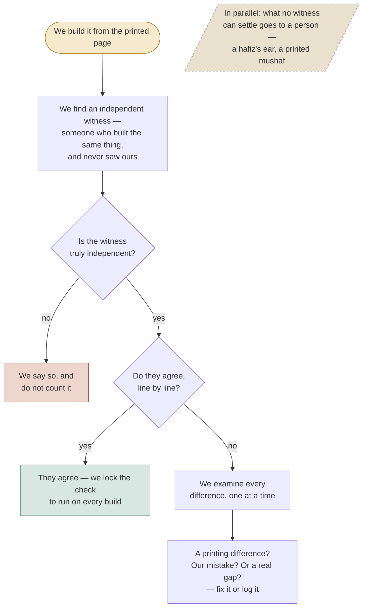

# How we earned your trust — the record behind the page

The reader-facing page is [`how-we-earned-your-trust.html`](./how-we-earned-your-trust.html),
served on the site at
`https://blog.bytesofpurpose.com/hifth/docs/validation/how-we-earned-your-trust.html`.
That page carries no file names, no item numbers, and no internal vocabulary — it is written
for a hafiz who has never opened this repository. This record is the other half: where the
numbers on that page come from, which register owns each one, and the mermaid source for the
diagram the page draws by hand.

Nothing here restates the page. It points.

## Why a companion record at all

The page draws its validation flow as a hand-authored inline SVG, because every page under
`docs/` must render offline from `file://` — no page in this repo loads a CDN, and `stage-docs.mjs`
serves them all as static bytes. The mermaid source below is the same diagram in the form the
code host renders natively; keep the two in step when either changes. If we ever decide the
offline constraint is worth trading for live mermaid on the HTML page, that is a decision to
record, not a silent edit.

## Every figure on the page, and where it is owned

The page is deliberately silent about which register owns each check. Here it is not.

| Page's plain-language check | Figure shown | Register of record | Issue index id / status |
| --- | --- | --- | --- |
| Is every verse on the page it is truly on? | 568/604 pages; 6180/6236 cross-check | `docs/design/where-you-slip.md` §page-table; Tanzil cross-check | ⑨ `page-table-unverified-against-an-independent-witness` · **answered** |
| Does the app catch the verses you would actually confuse? | 921/2232 = 41.26%; 1311 only-ruler / 599 only-hop; 677 tight-omission | `docs/design/what-we-depend-on.md` §⑪; probe `packages/etl/scripts/probe-hop-recall.mjs`; finding `docs/design/hop-recall.data.json` | ⑪ `nothing-measures-what-the-hop-misses` · **answered** |
| Do the recitation colours come from somewhere we can stand behind? | 99.80% agreement; 108 divergences; the non-independent cpfair/quran.com match (idgham_mutajanisayn 58=58, idgham_mutaqaribayn 13=13 same ayahs) | `docs/design/tajweed-*.md` (independent-engine cross-check) | ⑧ tajweed divergences · **open** (blocked on a hafiz) |
| Is the printed page really the one we say it is? | 56/56 pages incl. V1/V2 divergence controls | word-geometry / print-identity record | print-identity · **answered** |
| Are the fixed facts of the book actually right? | 318 constants re-derived every build | `gate:quran-meta` against Tanzil metadata ("the model") | structural-constants · **answered** |
| Does every small mark sit on a word that calls for it? | 86,962/86,965 words; 3 set aside | mark-census record | mark-census · **answered** (3 → hafiz) |
| What can no computer ever check? | 2 done / rest open | `docs/validation/ledger.json` (11 human-only checks) | — |

## The divergence framing is not decoration

The hop-recall row (41.26%) is framed on the page as deliberate divergence, never as a coverage
shortfall or an agreement score. That is a legal and intellectual-honesty requirement, not a
tone choice: the ruler (QUL resource 73) is login-gated with an unstated licence, used only as a
build-time measuring stick, and **a near-identical independent recompute would read as evidence
of copying**. The page says the worrying result would have been a high match — this is why. See
the header comment of `probe-hop-recall.mjs` and the §⑪ paragraphs in `what-we-depend-on.md` for
the full reasoning. We ship zero bytes from the ruler.

## The tajweed "second witness" that wasn't

The page tells the reader plainly that a source which looked like a second independent witness
turned out to be the same underlying data. Internally: quran.com's tajweed annotation matched the
cpfair engine exactly — `idgham_mutajanisayn` 58=58, `idgham_mutaqaribayn` 13=13 on the very same
13 ayahs — so it was not counted as a second witness. The independent witness that *does* count is
the MIT-licensed, pause-aware engine that ships no Qur'an text of its own (99.80% agreement, 108
catalogued divergences). That engine has no published URL in our docs, so the page describes it
and does not link it — do not fabricate a link.

## Sources the page links, and why each

Every source on the page is public and citable. The five links, and what each was used for:

- `https://qul.tarteel.ai/resources/mutashabihat/73` — the larger look-alike catalogue; the ruler for ⑪.
- `https://quran.com` — the independent page-for-every-verse table; the 568/604 witness for ⑨.
- `https://tanzil.net` — the reference reckoning; the 318 structural constants re-derived on every build.
- `https://corpus.quran.com` — the word-by-word morphology behind the shared-word underline.
- `https://github.com/quranpedia/quran-svg` — the printed-page geometry every check is built on.

## Honest gaps the page states

Kept in sync with `docs/issues.json` and `docs/validation/ledger.json`:

- The look-alike list is not finished — 677 tight-echo pairings not yet flagged (⑪, answered as a
  measurement; any new work on the 677 is a *new* item, not this one).
- Which words to underline when two verses share an opening is undecided (open decision).
- The 108 tajweed divergences await a hafiz (⑧, open).
- One licence (the printing authority's own site) is read secondhand because the site refuses to
  load from several networks — recorded in the ledger as reachable only secondhand.
