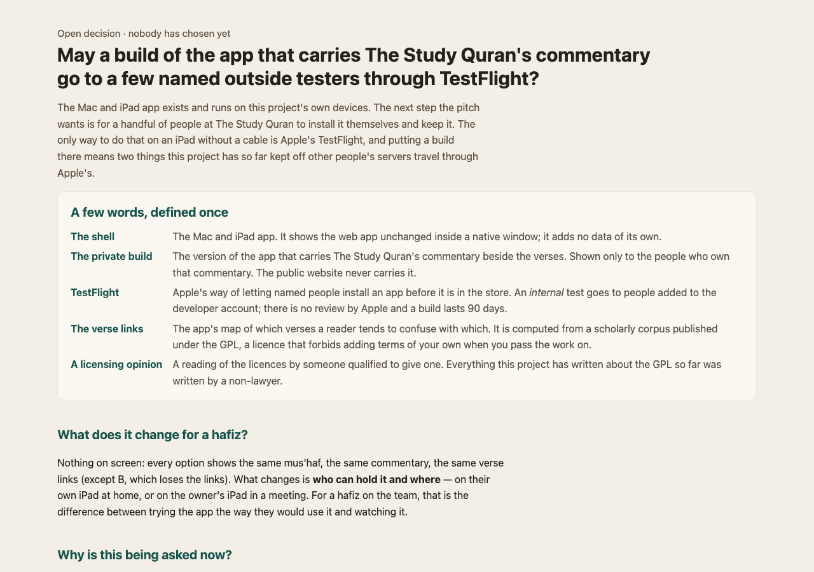
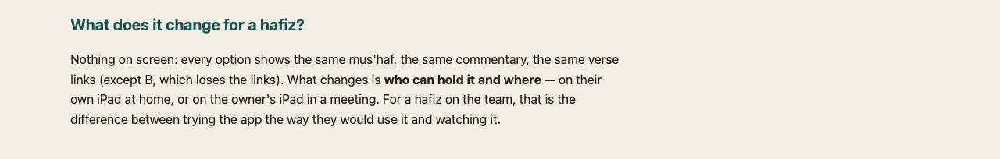
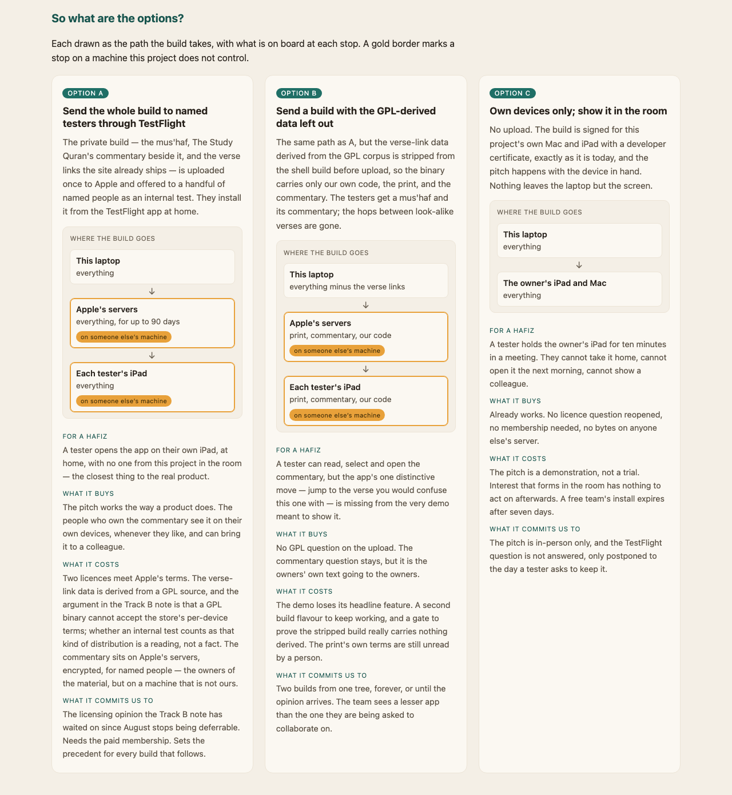
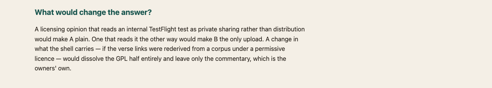
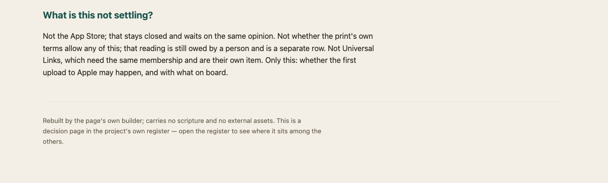

%% generated by scripts/build-waiting-doc.mjs — do not edit; run `make tasks-doc` %%
%% waiting-hash: 45fcce1593b4 %%

# What is waiting on you?

**1 choices** to make, **9 checks** only a person can do, **33 questions** to answer, and **19 items** stuck until something outside the code happens. Choices come first: each one holds up work that is ready to build.

Every item here is written somewhere else and copied in. To change one, edit it where it lives, then run `make tasks-doc`. The full text of everything open, yours or not, is in [the backlog](backlog.md). The pictures come from `make waiting-shots`.

## Which choices are waiting on you? — 1

### May a build of the app that carries The Study Quran's commentary go to a few named outside testers through TestFlight?

- **A** — Send the whole build to named testers through TestFlight
- **B** — Send a build with the GPL-derived data left out
- **C** — Own devices only; show it in the room

> [!tip] Recommended
> C now, and A the day someone qualified has read the three licences and said an internal test to named people is not the distribution the GPL and Apple's terms are about. B is the fallback if that reading goes the other way and the pitch still needs a home install.

To choose: [open the options page](https://blog.bytesofpurpose.com/hifth/docs/design/native-testflight-options.html) · [read the record](decisions/native-testflight-licence.md), then tell Claude which one.



> [!example]- 4 more pictures from the page
> **What does it change for a hafiz?**
>
> 
>
> **So what are the options?**
>
> 
>
> **What would change the answer?**
>
> 
>
> **What is this not settling?**
>
> 

## What can only you check, by hand? — 9

A machine cannot judge whether a hop is true, how a screen reader sounds, or whether a page still
opens after a week offline. Each check says why it matters; open it for what you need and the steps.
`make validate CHECK=<name>` prints the full walk-through, and `make record` saves your answer.

### On-device pan/zoom + highlight-toggle verdict

The emulated baseline (~8.3 ms/frame, flat under CPU throttle) structurally cannot see the two real risks: initial raster of a ~170 KB inline SVG on a low-end phone, and re-raster on zoom past the layer's backing store.

> [!note]- What you need, and the steps
> **It unblocks:** loop-4b, loop-6b, loop-7
>
> **You need:**
>
> - A real phone on the same Wi-Fi as this laptop — a mid/low-tier Android and an older iPhone if you have both; either one alone still answers most of it.
> - No cable, no DevTools, no pairing. The page measures itself.
> - About 3 minutes per device.
>
> **The steps, short:**
>
> 1. Open the link the laptop prints. A dark bar with a start button sits across the top.
> 2. Tap start. Each part gives you a second to get ready.
> 3. Pan the page with one finger for the whole 5 seconds.
> 4. Pinch in and out until the letters visibly sharpen.
> 5. Tap a different verse about once a second.
> 6. Copy the results box: long-press, Select All, Copy.
> 7. If you can, add it to the Home Screen and run it again from there.
>
> Run it with `make validate CHECK=perf-verdict-on-device`.

### VoiceOver / TalkBack gesture walkthrough

axe and the keyboard hop tour cover the machine-checkable floor and are green, but neither can tell you whether a screen-reader user can actually select an ayah and hop.

> [!note]- What you need, and the steps
> **It unblocks:** loop-7
>
> **You need:**
>
> - The same phone, with VoiceOver (iOS: Settings → Accessibility → VoiceOver, or triple-click the side button) or TalkBack (Android: Settings → Accessibility).
> - About 8 quiet minutes. You are listening, not looking — the last step asks you to stop looking entirely.
> - The ordinary build, not the probe build.
> - Nothing to memorise. This used to be eight steps; five of them were checking that a control existed under a given name, and those are now aria snapshots in apps/web/e2e/__aria__/{iphone,android}/ that fail the build when a label changes. Reading those five files first is optional and takes a minute — they are exactly what the app should announce.
>
> **The steps, short:**
>
> 1. Listen to three or four verse names read aloud. Do they sound like something you would say, with the numbers read properly?
> 2. Open a verse's look-alike list and swipe past both ends: you stay inside it. Jump, then swipe once: you land on the new page.
> 3. Do the whole round with your eyes closed: find a verse, jump, come back.
>
> Run it with `make validate CHECK=screen-reader-walkthrough`.

### Read each borrowed ruler's licence, and confirm its export carries no Qur'an text

The app measures its own numbers against the outside library (qul.tarteel.ai) and links back to it, shipping none of its bytes — that boundary is the qul-reliance decision.

> [!note]- What you need, and the steps
> **You need:**
>
> - An ordinary browser, signed in to qul.tarteel.ai (the download links are session-gated).
> - The local cache the probe reads, under packages/etl/data/**/.cache/qul*/ — present only on a machine that has run the leverage-qul pull. If it is absent, `make probe-qul` skips and there is nothing to eyeball; pull first.
> - About ten minutes.
>
> **The steps, short:**
>
> 1. Open each source the probe names and read its licence and the credit it asks for.
> 2. Check our credit line for each one in the sources list says the same.
> 3. Open two or three of the saved files: only numbers, no Arabic text.
>
> Run it with `make validate CHECK=qul-rulers-terms-and-text-free`.

### Edge spot-audit — 20 sampled pairs against a printed mushaf

The data is scripture.

> [!note]- What you need, and the steps
> **It unblocks:** web-v1.0
>
> **You need:**
>
> - A printed mushaf — the KFGQPC Hafs print the pages are photographed from, so page numbers line up. No paper? .claude/skills/mushaf-reference/SKILL.md names the published scans and page tables that stand in, and — more importantly — which ones are a different qira'a or a different print revision and will make a correct pair look wrong.
> - 30–45 minutes for twenty edges. A hafiz if you can get one; this is the check where a second reader is worth the most.
> - Nothing else — the draw runs here.
>
> **The steps, short:**
>
> 1. Find each of the twenty pairs in the print.
> 2. Treat the shared-word counts as hints, not answers.
> 3. For each pair ask: would a hafiz confuse these two while reciting?
> 4. Optional: open the pair in the app to see what a reader sees.
> 5. Paste the verdicts into the checked-pairs file.
> 6. Run the check. It passes.
>
> Run it with `make validate CHECK=edge-spot-audit`.

### 8+ day offline survival, installed vs browser tab

Safari's ITP deletes all script storage for origins untouched for 7 days of browser use, and Home-Screen-installed apps are exempt.

> [!note]- What you need, and the steps
> **It unblocks:** loop-6b
>
> **You need:**
>
> - **Runnable as of Loop 6b.** The button exists: open the page chip in the header, the sheet «ما فتحتَه من المصحف», the «جزء» scope, then «احفظ الجزء ١ هنا» at the top. Pin **juz 1** in both buckets — it is what the e2e pins, so a discrepancy is comparable against something, and it is ~2.9 MB, which is small enough to re-pin over a masjid connection if the day-8 answer is bad. What is already asserted without a phone — visited pages surviving a reload offline, the app recovering from an eviction, and a pinned juz opening a never-visited page with the radio off — is in apps/web/e2e/offline.spec.ts. All that is left here is the waiting.
> - **What the eight days no longer have to find.** Research ④ replaced the *eviction* half of this check with `Storage.clearDataForOrigin` over CDP, which takes the origin's caches out from under a live page exactly as a sweep does. That found two real defects (the precache never rebuilt after eviction, so one sweep ended offline support permanently; and a page that failed to fetch left the chrome claiming a page the stage was not showing). Both are fixed and asserted in the `Hifth · eviction` describe. So this check is now only about the thing no harness can supply: whether iOS actually sweeps an uninstalled origin at ~7 days and spares an installed one.
> - An iPhone (the ITP asymmetry is Safari's), and a deployed build.
> - Eight days of ordinary phone use. The clock counts days of *browser use*, not calendar days — a phone left in a drawer does not run this experiment.
>
> **The steps, short:**
>
> 1. In a Safari tab, save juz 1.
> 2. Add the site to the Home Screen and save juz 1 there too.
> 3. Note the date. Do not open Hifth anywhere for 8 days or more.
> 4. Day 8, airplane mode on, open the Safari tab. The juz may be gone — if so, the app should say so.
> 5. Still offline, open the installed app. The juz is still there.
>
> Run it with `make validate CHECK=offline-survival-8-day`.

### Two days of real revision produce two days in the record

The revision record is tested against fake-indexeddb in Node, where the clock is a parameter, nothing evicts, and every write lands.

> [!note]- What you need, and the steps
> **It unblocks:** loop-7
>
> **You need:**
>
> - A phone — an iPhone if you have one, since the seven-day sweep is Safari's and it is the failure this check is mostly about.
> - A deployed build, and two calendar days. The second session must be on a different local day from the first; that is the whole point of the first three steps.
> - **There is no picture yet.** Task #91 is gated on Loop 4b, so the record is read back through the browser's own IndexedDB inspector rather than through a view in the app. Safari: connect the phone to a Mac and use Web Inspector › Storage › Indexed Databases › `hifth.revision.v1`. Chrome on Android: `chrome://inspect` from a desktop, then Application › IndexedDB. The `days` store is keyed by `YYYY-MM-DD`; the `meta` store holds one row, `since`.
> - **What no harness can supply.** `revision-store.test.ts` proves the retention window, the `since` stamp and per-tap durability against a real IndexedDB implementation, and `App.test.tsx` proves the three exclusions through the real UI. None of that runs under a phone's clock, a phone's storage pressure, or a phone's process killer.
>
> **The steps, short:**
>
> 1. Open the site. Before tapping anything, the record's start date reads today.
> 2. Tap five or six verses and drag across a short passage: one entry per verse, one for the passage.
> 3. Tap a few more, then swipe the app away at once. Reopen: those taps are still there.
> 4. Optional: revise a little around midnight. Each tap lands under the right day.
> 5. Revise again on another day: two days now, and the start date has not moved.
> 6. Leave it 8 days or more, then look: all there, or empty with today as the start date.
>
> Run it with `make validate CHECK=revision-record-lands-on-a-phone`.

### Placement correction by eye — a hundred forced choices between the corrected box and the one we ship

The measurement says nearly every mark rectangle sits about a letter away from its own ink, and that one number per page fixes it.

> [!note]- What you need, and the steps
> **It unblocks:** mark-C
>
> **You need:**
>
> - Both printings on this machine: the pages the app ships, and the gitignored ligature cache the mark boxes are read from. If the placement measurement has ever run here, they are already present; if not, the first setup command says so and stops.
> - About twenty minutes, in as few sittings as you can manage. A hundred trials is roughly thirteen minutes of looking; the rest is settling in.
> - A screen you are not squinting at, and no opinion about what the answer ought to be. Nothing else — no mushaf, no phone, no network.
> - Nobody has to be a hafiz for this one. It is a question about where a rectangle sits, not about what the mark says.
>
> **The steps, short:**
>
> 1. If you are also doing the placing check, do this one first.
> 2. Read the five short answers at the top, then start.
> 3. For each mark press A or B for the box that sits on it, or space if you cannot tell.
> 4. If the mark sticks out of both boxes, press N — then still pick the closer one.
> 5. Stop when you are tired; it picks up where you left off.
> 6. At the end, save the file.
> 7. Score it.
> 8. Record the result.
>
> Run it with `make validate CHECK=placement-correction-by-eye`.

### Placement on pages the correction has never seen — does it still land, is it the right size, and is the leftover the page or the hand?

The last sitting placed sixty rectangles and answered one question decisively and three not at all.

> [!note]- What you need, and the steps
> **It unblocks:** mark-C
>
> **You need:**
>
> - The same two printings every mark check wants: the pages the app ships, and the gitignored ligature cache the mark boxes are read from. If either mark check has been run on this machine, nothing more is needed.
> - About twenty-five minutes for the first sitting and twelve for the second. They do not have to be the same day, and it is better if they are not.
> - A mouse or a trackpad you are comfortable with, or a touchscreen. Not a phone. The whole measurement is in fractions of a letter.
> - Nobody has to be a hafiz. It is a question about where a rectangle sits.
> - Ideally a second person for the third sitting, which is the only thing that can tell a print that is off by this much from one reader who places rectangles this way. It is built and it is optional: about ten minutes of somebody else's time, and this check can be recorded without it as long as the record says so.
>
> **The steps, short:**
>
> 1. First read the four predictions that were written down in advance.
> 2. Use a different day from the pick-A-or-B check, not straight after it.
> 3. Open the first page and read its short answers.
> 4. Drag each box onto the mark named above the picture and press Enter. Press S if its size is plainly wrong.
> 5. Do not agonise over any one box.
> 6. Stop when you like. Save the first sitting before opening the second.
> 7. Do the second sitting the same way and save it.
> 8. Optional: have a second person place about twenty on the third page.
> 9. Score each file.
> 10. If a second person took part, score the two together.
> 11. Write down which predictions failed.
> 12. Record the numbers.
>
> Run it with `make validate CHECK=placement-holds-off-its-own-pages`.

### What kind of wrong — the marks nothing can place, named one at a time instead of counted

Every instrument this project has built for the mark boxes answers in one currency.

> [!note]- What you need, and the steps
> **It unblocks:** mark-D, mark-C
>
> **You need:**
>
> - The same two printings every mark check wants: the pages the app ships, and the gitignored ligature cache the mark boxes are read from. If any mark check has been run on this machine, nothing more is needed.
> - About half an hour for sixty marks, and there are two sittings of sixty. They do not have to be done on the same day, or in either order. It is slower than choosing and faster than placing, because most of the time goes on recognising what you are looking at rather than on aiming.
> - A phone is fine, and is the device this page was drawn for. Nothing here is measured in fractions of a letter.
> - Nobody has to be a hafiz to say a rectangle is on blank paper. It helps for the answer about the print, and that answer may always be left unsaid.
>
> **The steps, short:**
>
> 1. Read the explanation once, then shorten it.
> 2. Read the line above the picture and find the letter the box is on.
> 3. If nothing is wrong, say so — it will be the most common answer.
> 4. Give every answer that is true, not just one.
> 5. Right size but on the wrong mark: tap the right mark.
> 6. Wrong size or shape: press that answer.
> 7. If you can see the ink it should box, draw a new box around it.
> 8. If the printed page itself looks odd, say so in a sentence.
> 9. If nothing fits, use the catch-all answer.
> 10. Take back anything you change your mind about.
> 11. Stop when you like; it picks up where you left off.
> 12. Save each sitting as its own file.
> 13. Score each file.
> 14. Log each oddity in the print as an issue.
> 15. Record the result.
>
> Run it with `make validate CHECK=placement-what-kind-of-wrong`.

## What questions are waiting on your answer? — 33

Judgements about how the app should feel or what it is for. Each line opens the page the
question is written on.

- **[Does a real fore-edge stack vary?](design/page-transition.md#-does-a-real-fore-edge-stack-vary--open)** — We have exactly one sample — page 297 of 604, drawn with two slivers.
- **[Arabic number agreement outside `distance`](design/i18n.md#-arabic-number-agreement-outside-distance--open)** — §② counts 37 forms Arabic silently substitutes today.
- **[A third upstream reaches the adjacency shards](design/track-b-native.md#-a-third-upstream-reaches-the-adjacency-shards--open)** — Found by ⑥'s trace on the first run it did, which is the strongest thing that can be said for building it.
- **[Whether the GPL/App-Store reading in ①–③ is right](design/track-b-native.md#-whether-the-gplapp-store-reading-in--is-right--open)** — Everything above is argued from licence text by a non-lawyer.
- **[Whether Track B should exist at all after ④ and ⑤](design/track-b-native.md#-whether-track-b-should-exist-at-all-after--and---open)** — Its payload has narrowed to one promise (iOS deep links into an installed app) on the one platform whose store is blocked.
- **[Would a person pick our rectangle over the one we ship](design/mark-registration.md#-would-a-person-pick-our-rectangle-over-the-one-we-ship--open)** — Nothing here has been checked by a human, and until something is, the thresholds in §⑦ stay unenforced.
- **[How far is our correction still out](design/mark-registration.md#-how-far-is-our-correction-still-out--open)** — ① can only settle a preference.
- **[Whether what is left over is even ours to fix](design/mark-registration.md#-whether-what-is-left-over-is-even-ours-to-fix--open)** — Every measurement above answers in a distance: how far the rectangle is from the ink it should be sitting on.
- **[Whether the marks a reader called odd are odd in the print or odd in our reading of it](design/mark-registration.md#-whether-the-marks-a-reader-called-odd-are-odd-in-the-print-or-odd-in-our-reading-of-it--open)** — Fifteen marks, on fifteen separate pages, were set aside by a reader as *odd — I cannot say how*: not our rectangle in the wrong place, but something about the printed mark itself they could not read as ordinary.
- **[Whether an answer given by pointing is the same evidence as one given by hand](design/mark-registration.md#-whether-an-answer-given-by-pointing-is-the-same-evidence-as-one-given-by-hand--open)** — The sittings held so far measured what correcting a rectangle by hand costs.
- **[Whether the pagination question covers three outputs rather than one](design/what-we-depend-on.md#-whether-the-pagination-question-covers-three-outputs-rather-than-one--open)** — The open question about the adjacency shards carrying a page-derived table is scoped to one tree.
- **[Whether to move the structural metadata to a public-domain source](design/what-we-depend-on.md#-whether-to-move-the-structural-metadata-to-a-public-domain-source--open)** — A superset of what this app uses exists under a public-domain dedication, with no attribution and no technological-measures clause.
- **[Whether the tajweed spans should move to a pause-aware engine](design/what-we-depend-on.md#-whether-the-tajweed-spans-should-move-to-a-pause-aware-engine--open)** — An MIT engine with a corpus-free core would mean vendoring no annotation data and no Quran text, agrees with the incumbent at 99.80%, and models pause, which the incumbent structurally cannot.
- **[Whether a store build should carry every tree](design/what-we-distribute.md#-whether-a-store-build-should-carry-every-tree--open)** — The store door is the only one with a blocker, and it does not have to carry what the site door carries.
- **[Whether our own code could be put under more permissive terms at all](design/what-we-depend-on.md#-whether-our-own-code-could-be-put-under-more-permissive-terms-at-all--open)** — Worth separating from every other question here, because it is the one somebody may want an answer to for reasons that have nothing to do with app stores — a reader wanting to build a different mus'haf on this engine, for instance.
- **[How durable must a confusion map be, given iOS wipes it?](design/confusion-points.md#-how-durable-must-a-confusion-map-be-given-ios-wipes-it--open)** — Following revision-record's pattern gives IndexedDB plus a `since` stamp — enough to keep an emptied log from lying about itself, not enough to keep it from emptying.
- **[Should a confusion map ever leave the device?](design/confusion-points.md#-should-a-confusion-map-ever-leave-the-device--open)** — Revision-record's settled stance is that anything off the device is a *deliberate* act, guarded by a gate — no export, no sync.
- **[How are slip-candidates ranked, and is the opening-word signal worth building?](design/confusion-points.md#-how-are-slip-candidates-ranked-and-is-the-opening-word-signal-worth-building--open)** — Phase 1 can ship with corpus edges ranked `twin` → shared-run and the jumper as the fallback for un-covered ayahs.
- **[Does a captured slip become navigable like a corpus edge?](design/confusion-points.md#-does-a-captured-slip-become-navigable-like-a-corpus-edge--open)** — Should your own confusion points appear in the hop rail as a fourth kind of link — *your* edges, alongside the corpus's — so the app you navigate is shaped by your own history?
- **[Who sets a seam's state — the reader, or the app's guess from the data?](design/confusion-points.md#-who-sets-a-seams-state--the-reader-or-the-apps-guess-from-the-data--open)** — Each confusion point carries a state — *every pass*, *sometimes*, *used to*, *dismissed* — and the question is who writes it.
- **[Should a student be able to hand their confusion map to a teacher?](design/confusion-points.md#-should-a-student-be-able-to-hand-their-confusion-map-to-a-teacher--open)** — A hafiz revises with a teacher, and the teacher's whole job is to drill the student exactly where they are weak — which is precisely what the confusion map records.
- **[Should the app learn where *most* readers slip, not just where you do?](design/confusion-points.md#-should-the-app-learn-where-most-readers-slip-not-just-where-you-do--open)** — Every reader's map is a record of the places the same few look-alike verses trip people up, and across many readers those places would cluster — there are verses the whole tradition warns about.
- **[Is the rule "nothing leaves the device," or "nothing leaves unless it serves the reader"?](design/revision-record.md#-is-the-rule-nothing-leaves-the-device-or-nothing-leaves-unless-it-serves-the-reader--open)** — The privacy invariant and the *Export or sync* line under **Deliberately out of scope** both state the stance as an absolute: nothing leaves the device.
- **[Does a finished measurement need a row of its own, or does it stay reachable only by opening this file](design/mark-labels.md#-does-a-finished-measurement-need-a-row-of-its-own-or-does-it-stay-reachable-only-by-opening-this-file--open)** — This document settles its own question — nothing above is left hanging, and nothing in the app changes as a result.
- **[Does this document's own name reach a reader who has not already found it](design/sub-word-marks.md#-does-this-documents-own-name-reach-a-reader-who-has-not-already-found-it--open)** — This is a design-of-record with two other open questions above it, and it is cited from [`mark-granularity.html`](design/mark-granularity.html)'s decision row and from [`mark-labels.md`](design/mark-labels.md).
- **[Should the outside library get its own command-line tool?](PLAN.md#open-follow-ups)** — Parked 2026-09-29 when the session task list was cleared before the large refactor.
- **[Whether a trackpad pinch on a real Mac feels right](design/native-shell.md#-whether-a-trackpad-pinch-on-a-real-mac-feels-right--open)** — WebKit forwards the pinch as gesture events and the web app already handles them, so no code was written.
- **[Should a reader also choose the colour of a run of words, or mix a pen of their own?](design/highlight-texture-options.md#-should-a-reader-also-choose-the-colour-of-a-run-of-words-or-mix-a-pen-of-their-own--open)** — The highlighter's pen is picked from four pastels in the tools bar, and a run of words is always blue.
- **[Should the "later surahs" arrow point left, the way the book runs?](design/knowledge-graph-commentary.md#-should-the-later-surahs-arrow-point-left-the-way-the-book-runs--open)** — The look-alike signs use an arrow to say where the other verse is: "≈←" for an earlier surah and "≈→" for a later one.
- **[Where should the marking pens live on an iPad: the bottom row, the side margin, or both?](design/notes-style-toolbar.md#-where-should-the-marking-pens-live-on-an-ipad-the-bottom-row-the-side-margin-or-both--open)** — B (a Mark up button, pens in the bottom row) is recommended, and C (pens down the empty side margin in landscape) is worth trying beside it.
- **[Should Note, Harakat and Word become one pen with three ways to aim it?](design/notes-style-toolbar.md#-should-note-harakat-and-word-become-one-pen-with-three-ways-to-aim-it--open)** — It takes three buttons off the bar, the way Notes keeps its two erasers behind one pen.
- **[Should the native app catch the pencil's double-tap and squeeze, and open Hifth's own tools at the tip?](design/pencil-gestures.md#-should-the-native-app-catch-the-pencils-double-tap-and-squeeze-and-open-hifths-own-tools-at-the-tip--open)** — Option B above is recommended.
- **[The iPad and iPhone app pictures are compared with an out-of-date record, and two of them show The Study Quran's words](design/native-shell.md#-the-ipad-and-iphone-app-pictures-are-compared-with-an-out-of-date-record-and-two-of-them-show-the-study-qurans-words--confirmed)** — Found on 2026-10-08 while checking that ⑱ changed nothing on the iPad.

## What is stuck until something outside the code happens? — 19

A device to hold, a licence to read, a membership to buy. Each page says what the item waits on.

- **[Does the fold read at all?](design/page-transition.md#-does-the-fold-read-at-all--blocked)** — The claim in §3.2 — that a 28–30 px band crossing in 240 ms is legible as a fold and does mask the cross-fade's ambiguous midpoint — is a design judgement with no evidence behind it.
- **[Everything gated on `perf-verdict-on-device`](design/page-transition.md#-everything-gated-on-perf-verdict-on-device--blocked)** — Backlog ① / `PLAN.md` follow-up ①.
- **[Does the second mount actually hold the frame budget?](design/desktop.md#-does-the-second-mount-actually-hold-the-frame-budget--blocked)** — It cannot be measured today — nothing vendors a facing pair, so the second stage never mounts a page.
- **[Warmth thresholds](design/revision-record.md#-warmth-thresholds--blocked)** — The day-bands are a first guess.
- **[On-device perf verdict — `perf-verdict-on-device`](performance.md#-on-device-perf-verdict--perf-verdict-on-device--blocked)** — The keystone.
- **[The same measurement on real mid-tier Android](performance.md#-the-same-measurement-on-real-mid-tier-android--blocked)** — `pan-zoom-trace.mjs`'s baseline is emulated — about 8.3 ms/frame and, suspiciously, flat under CPU throttle, which is the signature of a measurement that is not seeing the thing it was written to see.
- **[The site answers on plain `http`, so the offline app silently isn't one](performance.md#-the-site-answers-on-plain-http-so-the-offline-app-silently-isnt-one--blocked)** — Measured 2026-08-06 against the deployed site: ``` curl -I http://blog.bytesofpurpose.com/hifth/ → 200, text/html, served curl -D - https://blog.bytesofpurpose.com/hifth/ → no Strict-Transport-Security ``` Not a redirect — a **200**.
- **[On-device perf verdict](PLAN.md#open-follow-ups)** — (formerly external-tracker task #24) — decide inline-SVG-everywhere vs content-visibility virtualization vs raster-glyph fallback.
- **[License confirmation](PLAN.md#open-follow-ups)** — ~~**License confirmation**~~ — **substantially closed 2026-07-26**, and it caught a live defect.
- **[On-device VoiceOver/TalkBack pass](PLAN.md#open-follow-ups)** — (Loop 3 exit named it; automated axe + the keyboard hop tour cover the machine-checkable floor, both green in CI).
- **[The tajweed golden row](PLAN.md#open-follow-ups)** — — the `SKINS` axis in `e2e/golden.spec.ts` is a live seam with one entry.
- **[The marks that ran out of room and still shipped as placed were never looked at, until now](design/mark-registration.md#-the-marks-that-ran-out-of-room-and-still-shipped-as-placed-were-never-looked-at-until-now--blocked)** — ㉕ found the code bug: a mark whose search ran out of room could still slip past the check meant to catch that and ship as if its own ink had confidently answered.
- **[The page-bar's two questions are answered, and the app now does what they say — save one phone-only corner](PLAN.md#open-follow-ups)** — Both were settled by the owner on 2026-09-02, and both chose the same option.
- **[Saved pages can be cleared when a browser will not promise to keep them](performance.md#-saved-pages-can-be-cleared-when-a-browser-will-not-promise-to-keep-them--blocked)** — A browser decides by itself whether to promise this site's saved pages will be kept.
- **[The Mac smoke test only runs after a permission a person grants](design/native-shell.md#-the-mac-smoke-test-only-runs-after-a-permission-a-person-grants--blocked)** — Apple's UI test runner needs the terminal to be allowed under Accessibility.
- **[A web link cannot open the app on iPad without a paid membership](design/native-shell.md#-a-web-link-cannot-open-the-app-on-ipad-without-a-paid-membership--blocked)** — A tapped link to the public site opens Safari, not the shell.
- **[The App Store is not a target](design/native-shell.md#-the-app-store-is-not-a-target--blocked)** — The shell carries the same GPL-derived data the website does, and the store's terms are the ones `track-b-native.md` argues a GPL binary cannot accept.
- **[Does the streak filter slow a page turn on a real iPhone?](design/highlight-texture-options.md#-does-the-streak-filter-slow-a-page-turn-on-a-real-iphone--blocked)** — The streaks are drawn by one filter shared by every mark on the page.
- **[Does Safari draw the mark going down, or show it whole?](design/highlight-texture-options.md#-does-safari-draw-the-mark-going-down-or-show-it-whole--blocked)** — The mark is revealed from right to left as it goes down, by clipping the whole group.

